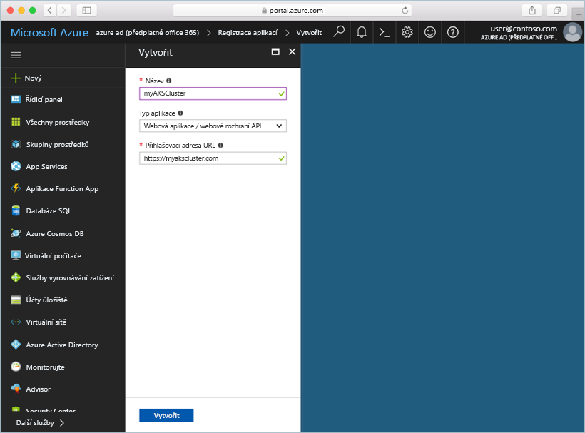
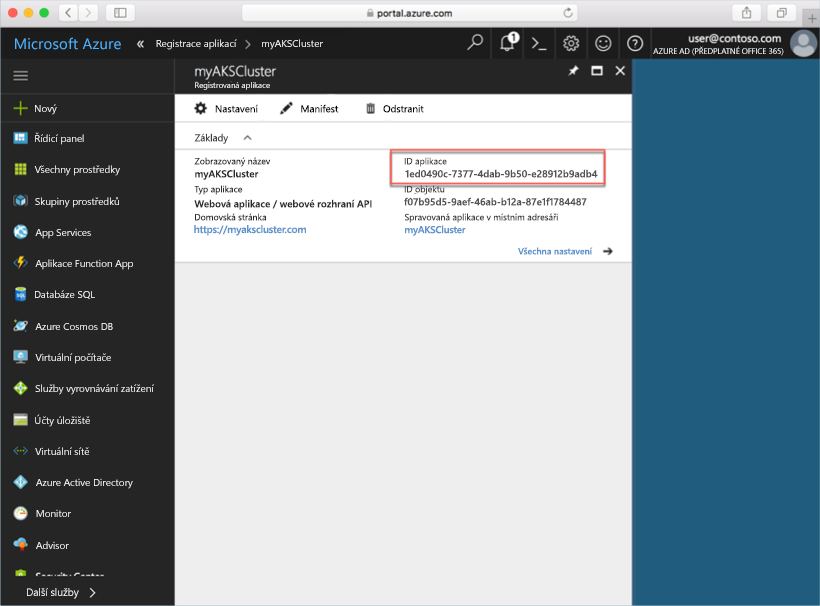
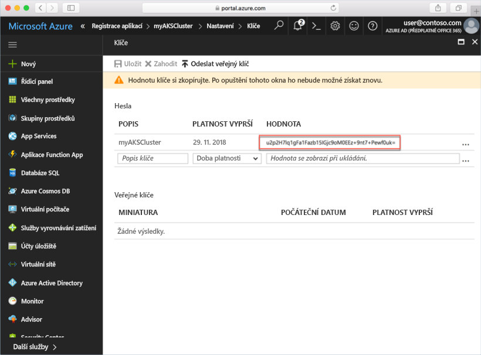
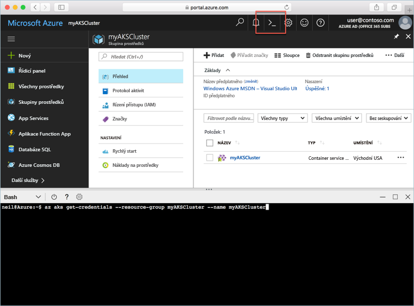

# <a name="deploy-an-azure-container-service-aks-cluster"></a>Nasazení clusteru Azure Container Service (AKS)

V tomto rychlém startu nasadíte cluster AKS pomocí portálu Azure. Následně se na tomto clusteru spustí vícekontejnerová aplikace skládající se z front-endu webu a instance Redis. Po dokončení bude aplikace přístupná přes internet.


Tento rychlý start předpokládá základní znalosti konceptů Kubernetes. Podrobné informace o Kubernetes najdete v článku [Dokumentace systému Kubernetes](https://kubernetes.io/docs/home/).

## <a name="sign-in-to-azure"></a>Přihlášení k Azure

Přihlaste se na portál Azure na adrese http://portal.azure.com.

## <a name="create-service-principal"></a>Vytvoření instančního objektu

Před vytvořením clusteru AKS na portálu Azure je potřeba vytvořit instanční objekt služby. Azure používá tento instanční objekt služby ke správě infrastruktury přidružené ke clusteru AKS.

Vyberte položky **Azure Active Directory** > **Registrace aplikací** > **Registrace nové aplikace**.

Zadejte libovolný název aplikace. Jako typ aplikace vyberte položku **Webová aplikace / webové rozhraní API**. Zadejte hodnotu **Přihlašovací adresa URL**. Může to být libovolná hodnota v platném formátu adresy URL, ale nemusí se jednat o skutečný koncový bod.

Po dokončení vyberte **Vytvořit**.



Vyberte registraci nově vytvořené aplikace a poznamenejte si ID aplikace. Tato hodnota je potřeba při vytváření clusteru AKS.



Dál musíte pro instanční objekt vytvořit heslo. Vyberte **Všechna nastavení** > **Klíče** a zadejte libovolnou hodnotu popisu klíče. Vyberte dobu trvání, která představuje dobu platnosti instančního objektu služby.

Klikněte na **Uložit** a poznamenejte si hodnotu hesla. Toto heslo je potřeba při vytváření clusteru AKS.



## <a name="create-aks-cluster"></a>Vytvoření clusteru AKS

Vyberte položky **Nový** > **Kontejnery** > **Azure Container Registry – AKS (Preview)**.

Zadejte název clusteru, předponu DNS, název skupiny prostředků, umístění a verzi systému Kubernetes pro cluster. Poznamenejte si název clusteru a název skupiny prostředků. Ty budou potřeba při připojování ke clusteru.

Po dokončení vyberte **OK**.


V konfiguračním formuláři zadejte tyto položky:

- Uživatelské jméno – název přiřazený účtům správců v uzlech clusteru.
- Veřejný klíč SSH – přidružený ke klíči, který se použije pro přístup k uzlům clusteru.
- ID klienta instančního objektu služby – ID aplikace instančního objektu služby, který jste vytvořili dříve v tomto dokumentu.
- Tajný klíč klienta instančního objektu služby – heslo instančního objektu služby, které jste vytvořili dříve v tomto dokumentu.
- Počet uzlů – počet uzlů AKS, který se má vytvořit.
- Velikost virtuálního počítače uzlu – velikost virtuálního počítače pro uzly AKS.
- Velikost disku OS – velikost disku operačního systému uzlů AKS.

Po dokončení vyberte **OK** po dokončení ověřování znovu vyberte **OK**.


Po krátkém čekání se cluster AKS nasadí a je připravený k použití.

## <a name="connect-to-the-cluster"></a>Připojení ke clusteru

Ke správě clusteru Kubernetes použijte klienta příkazového řádku Kubernetes [kubectl](https://kubernetes.io/docs/user-guide/kubectl/). Ve službě Azure Cloud Shell je předinstalovaný klient kubectl.

Otevřete službu Cloud Shell pomocí tlačítka v pravém horním rohu portálu Azure.



Spusťte příkaz [az aks get-credentials](/cli/azure/aks?view=azure-cli-latest#az_aks_get_credentials), abyste mohli nakonfigurovat klienta kubectl pro připojení k vašemu clusteru Kubernetes.

Zkopírujte následující příkaz a vložte ho do služby Cloud Shell. V případě potřeby změňte název skupiny prostředků a clusteru.

```azurecli-interactive
az aks get-credentials --resource-group myAKSCluster --name myAKSCluster
```

Pokud chcete ověřit připojení ke clusteru, použijte příkaz [kubectl get](https://kubernetes.io/docs/user-guide/kubectl/v1.6/#get), který vrátí seznam uzlů clusteru.

```azurecli-interactive
kubectl get nodes
```

Výstup:

```
NAME                       STATUS    ROLES     AGE       VERSION
aks-agentpool-14693408-0   Ready     agent     6m        v1.8.1
aks-agentpool-14693408-1   Ready     agent     6m        v1.8.1
aks-agentpool-14693408-2   Ready     agent     7m        v1.8.1
```

## <a name="run-the-application"></a>Spuštění aplikace

Soubor manifestu Kubernetes definuje požadovaný stav clusteru, včetně toho, které image kontejnerů mají být spuštěné. V tomto příkladu manifest slouží k vytvoření všech objektů potřebných ke spuštění aplikace Azure Vote.

Vytvořte soubor `azure-vote.yml` a zkopírujte do něj následující kód YAML. Pokud pracujete ve službě Azure Cloud Shell, můžete tento soubor vytvořit pomocí editoru vi nebo Nano, stejně jako kdybyste pracovali na virtuálním nebo fyzickém systému.

```yaml
apiVersion: apps/v1beta1
kind: Deployment
metadata:
  name: azure-vote-back
spec:
  replicas: 1
  template:
    metadata:
      labels:
        app: azure-vote-back
    spec:
      containers:
      - name: azure-vote-back
        image: redis
        ports:
        - containerPort: 6379
          name: redis
---
apiVersion: v1
kind: Service
metadata:
  name: azure-vote-back
spec:
  ports:
  - port: 6379
  selector:
    app: azure-vote-back
---
apiVersion: apps/v1beta1
kind: Deployment
metadata:
  name: azure-vote-front
spec:
  replicas: 1
  template:
    metadata:
      labels:
        app: azure-vote-front
    spec:
      containers:
      - name: azure-vote-front
        image: microsoft/azure-vote-front:redis-v1
        ports:
        - containerPort: 80
        env:
        - name: REDIS
          value: "azure-vote-back"
---
apiVersion: v1
kind: Service
metadata:
  name: azure-vote-front
spec:
  type: LoadBalancer
  ports:
  - port: 80
  selector:
    app: azure-vote-front
```

Pomocí příkazu [kubectl create](https://kubernetes.io/docs/user-guide/kubectl/v1.6/#create) spusťte aplikaci.

```azurecli-interactive
kubectl create -f azure-vote.yml
```

Výstup:

```
deployment "azure-vote-back" created
service "azure-vote-back" created
deployment "azure-vote-front" created
service "azure-vote-front" created
```

## <a name="test-the-application"></a>Testování aplikace

Při spuštění aplikace se vytvoří [služba Kubernetes](https://kubernetes.io/docs/concepts/services-networking/service/), která zveřejní front-end aplikace na internetu. Dokončení tohoto procesu může trvat několik minut.

Pomocí příkazu [kubectl get service](https://kubernetes.io/docs/user-guide/kubectl/v1.6/#get) s argumentem `--watch` můžete sledovat průběh.

```azurecli-interactive
kubectl get service azure-vote-front --watch
```

Na začátku se bude adresa *EXTERNAL-IP* pro službu *azure-vote-front* zobrazovat ve stavu *Probíhá*.

```
NAME               TYPE           CLUSTER-IP   EXTERNAL-IP   PORT(S)        AGE
azure-vote-front   LoadBalancer   10.0.37.27   <pending>     80:30572/TCP   6s
```

Jakmile se stav adresy *EXTERNAL-IP* změní ze stavu *Probíhá* na hodnotu *IP adresa*, pomocí klávesové zkratky `CTRL-C` zastavte sledovací proces kubectl.

```
azure-vote-front   LoadBalancer   10.0.37.27   52.179.23.131   80:30572/TCP   2m
```

Teď můžete přejít na externí IP adresu a zobrazit aplikaci Azure Vote.


## <a name="delete-cluster"></a>Odstranění clusteru

Když už cluster nepotřebujete, můžete odstranit skupinu prostředků clusteru, čímž odstraníte všechny související prostředky. To můžete provést na portálu Azure výběrem skupiny prostředků a kliknutím na tlačítko Odstranit. Případně můžete použít příkaz [az group delete](/cli/azure/group#delete) ve službě Cloud Shell.

```azurecli-interactive
az group delete --name myAKSCluster --no-wait
```

## <a name="get-the-code"></a>Získání kódu

V tomto rychlém startu se k vytvoření nasazení Kubernetes použily předem vytvořené image kontejnerů. Související kód aplikace, soubor Dockerfile a soubor manifestu Kubernetes jsou k dispozici na GitHubu.

[https://github.com/Azure-Samples/azure-voting-app-redis](https://github.com/Azure-Samples/azure-voting-app-redis.git)

## <a name="next-steps"></a>Další kroky

V tomto rychlém startu jste nasadili cluster Kubernetes a do něj jste nasadili vícekontejnerovou aplikaci.

Další informace o službě AKS a podrobné vysvětlení kompletního příkladu od kódu až po nasazení najdete v kurzu clusteru Kubernetes.

> [!div class="nextstepaction"]
> [Správa clusteru AKS](./tutorial-kubernetes-prepare-app.md)

