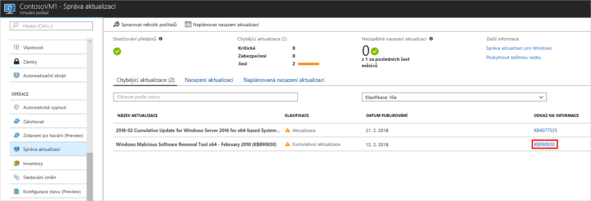
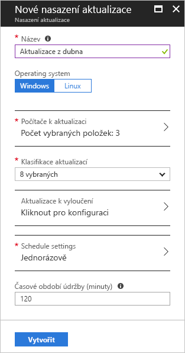
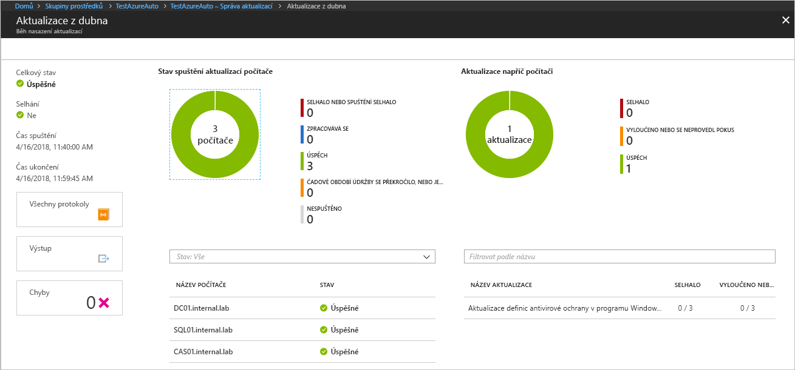

# Správa aktualizací pro Windows pomocí služby Azure Automation

Řešení Update Management umožňuje spravovat aktualizace a opravy pro virtuální počítače.
V tomto kurzu se naučíte rychle vyhodnotit stav dostupných aktualizací, plánovat instalaci požadovaných aktualizací a kontrolovat výsledky nasazení za účelem ověření správného použití aktualizací.

Informace o cenách najdete na stránce s [cenami služby Automation za správu aktualizací](https://azure.microsoft.com/pricing/details/automation/).

V tomto kurzu se naučíte:

> [!div class="checklist"]
> * Připojení virtuálního počítače k řešení Update Management
> * Zobrazení posouzení aktualizací
> * Naplánování nasazení aktualizace
> * Zobrazení výsledků nasazení

## Požadavky

Pro absolvování tohoto kurzu potřebujete:

* Předplatné Azure. Pokud ještě žádné nemáte, můžete si [aktivovat výhody pro předplatitele MSDN](https://azure.microsoft.com/pricing/member-offers/msdn-benefits-details/) nebo si zaregistrovat [bezplatný účet](https://azure.microsoft.com/free/?WT.mc_id=A261C142F).
* [Účet Automation](automation-offering-get-started.md), který bude obsahovat sledovací proces, runbooky akcí a úlohu sledovacího procesu.
* [Virtuální počítač](../virtual-machines/windows/quick-create-portal.md) pro připojení.

## Přihlášení k Azure

Přihlaste se k webu Azure Portal na adrese http://portal.azure.com.

## Povolení řešení Update Management

Pro účely tohoto kurzu je potřeba nejprve váš virtuální počítač povolit řešení Update Management. Pokud jste už dříve pro virtuální počítač povolili jiné řešení automatizace, tento krok není nezbytný.

1. V nabídce vlevo vyberte **Virtuální počítače** a ze seznamu vyberte virtuální počítač.
2. V nabídce vlevo v části **Operace** klikněte na **Update Management**. Otevře se stránka **Povolit řešení Update Management**.

Provede se ověření, pomocí kterého se určí, jestli je pro tento virtuální počítač povolené řešení Update Management.
Toto ověření zahrnuje kontroly pracovního prostoru Log Analytics a propojeného účtu Automation a kontrolu, jestli se řešení nachází v tomto pracovním prostoru.

Pracovní prostor [Log Analytics](../log-analytics/log-analytics-overview.md?toc=%2fazure%2fautomation%2ftoc.json) slouží ke shromažďování dat generovaných funkcemi a službami, jako je řešení Update Management.
Tento pracovní prostor poskytuje možnost kontroly a analýzy dat z několika zdrojů na jednom místě.
Pokud na virtuálních počítačích, které vyžadují aktualizace, chcete provádět další akce, Azure Automation umožňuje spouštět proti virtuálním počítačům runbooky například pro stahování a aplikování aktualizací.

Proces ověřování také zkontroluje, jestli je virtuální počítač zřízený s agentem Microsoft Monitoring Agent (MMA) a hybridním pracovním procesem runbooku Automation.
Agent slouží ke komunikaci s virtuálním počítačem a získávání informací o nainstalovaném softwaru.

Zvolte pracovní prostor Log Analytics a účet Automation a kliknutím na **Povolit** povolte řešení. Povolení řešení trvá přibližně 15 minut.

Pokud během připojování chyběla některá z následujících požadovaných součástí, automaticky se přidá:

* Pracovní prostor [Log Analytics](../log-analytics/log-analytics-overview.md?toc=%2fazure%2fautomation%2ftoc.json)
* [Automation](./automation-offering-get-started.md)
* Povolený [hybridní pracovní proces runbooku](./automation-hybrid-runbook-worker.md) na virtuálním počítači

Otevře se obrazovka řešení **Update Management**. Nakonfigurujte umístění, pracovní prostor Log Analytics a účet Automation, které se mají použít, a klikněte na **Povolit**. Pokud se pole zobrazují šedě, znamená to, že pro daný virtuální počítač je povolené jiné řešení automatizace a musí se použít stejný pracovní prostor a účet Automation.

Povolení řešení může trvat až 15 minut. Během této doby byste neměli zavírat okno prohlížeče.
Po povolení řešení začnou do Log Analytics proudit informace o chybějících aktualizacích na virtuálních počítačích.
Zpřístupnění dat pro analýzu může trvat 30 minut až 6 hodin.

## Zobrazení posouzení aktualizací

Po povolení **správy aktualizací** se zobrazí obrazovka **Správa aktualizací**.
Pokud nějaké aktualizace chybí, na kartě **Chybějící aktualizace** můžete zobrazit seznam chybějících aktualizací.

Vyberte **ODKAZ NA INFORMACE** na nějaké aktualizaci a v novém okně se otevře článek podpory o dané aktualizaci. Tady najdete důležité informace týkající se dané aktualizace.

Po kliknutí kamkoli jinam na aktualizaci se otevře okno **Prohledávání protokolu** pro vybranou aktualizaci. Dotaz pro prohledávání protokolu je předdefinovaný pro tuto konkrétní aktualizaci. Tento dotaz můžete upravit nebo vytvořit vlastní dotaz a zobrazit podrobné informace o nasazených nebo chybějících aktualizacích ve vašem prostředí.

## Naplánování nasazení aktualizace

Teď už víte, že vašemu virtuálnímu počítači chybí aktualizace. Pokud chcete nainstalovat aktualizace, naplánujte nasazení odpovídající vašemu plánu vydávání a časovému intervalu pro správu a údržbu.
Můžete zvolit typy aktualizací, které budou součástí nasazení.
Můžete například zahrnout důležité aktualizace nebo aktualizace zabezpečení a vyloučit kumulativní aktualizace.

> [!WARNING]
> Pokud aktualizace vyžadují restartování, virtuální počítač se restartuje automaticky.

Naplánujte pro virtuální počítač nové nasazení aktualizací tak, že přejdete do části **Správa aktualizací** a vyberete **Naplánovat nasazení aktualizací v horní části obrazovky**.

Na obrazovce **Nové nasazení aktualizací** zadejte následující informace :

* **Název** – Zadejte jedinečný název pro identifikaci nasazení aktualizace.
* **Klasifikace aktualizací** – Vyberte typy softwaru, které se zahrnou do nasazení aktualizací. Pro účely tohoto kurzu nechte vybrané všechny typy.

  Typy klasifikace jsou:

  * Důležité aktualizace
  * Aktualizace zabezpečení
  * Kumulativní aktualizace
  * Balíčky funkcí
  * Aktualizace Service Pack
  * Aktualizace definic
  * Nástroje
  * Aktualizace

* **Nastavení plánu** – Nastavte čas na 5 minut do budoucna. Můžete také přijmout výchozí nastavení, což je 30 minut po aktuálním čase.
Můžete také určit, jestli nasazení proběhne jednou, nebo nastavit plán opakování.
V části **Opakování** vyberte **Opakující se**. Ponechte výchozí hodnotu 1 den a klikněte na **OK**. Tím se nastaví opakovaný plán.

* **Časové období údržby (minuty)** – Tady ponechte výchozí hodnotu. Můžete zadat časové období, ve kterém má dojít k nasazení aktualizací. Toto nastavení pomůže zajistit, že se změny provedou v rámci definovaných časových intervalů pro správu a údržbu.

Jakmile dokončíte konfiguraci plánu, klikněte na tlačítko **Vytvořit**. Vrátíte se na řídicí panel stavu. Vyberte **Naplánovaná nasazení aktualizací** a zobrazte plán nasazení, který jste vytvořili.

## Zobrazení výsledků nasazení aktualizací

Po spuštění naplánovaného nasazení se stav tohoto nasazení zobrazí na kartě **Nasazení aktualizací** na obrazovce **Správa aktualizací**.
Pokud je nasazení aktuálně spuštěno, jeho stav je **Probíhající**.
Po úspěšném dokončení se změní na **Úspěch**.
Pokud u jedné nebo více aktualizací v nasazení dojde k chybě, stav je **Částečné selhání**.
Kliknutím na dokončené nasazení aktualizací zobrazíte řídicí panel pro toto nasazení aktualizací.

Na dlaždici **Výsledky aktualizací** je souhrn celkového počtu aktualizací a výsledků nasazení na virtuálním počítači.
V tabulce vpravo je podrobný rozpis všech aktualizací a výsledků instalace.
Následující seznam ukazuje dostupné hodnoty:

* **Nebyl proveden pokus** – aktualizace se nenainstalovala, protože podle definovaného trvání časového období údržby nebylo k dispozici dostatek času.
* **Úspěch** – Aktualizace byla úspěšná.
* **Neúspěch** – Aktualizace se nezdařila.

Kliknutím na **Všechny protokoly** zobrazíte všechny položky protokolu, které toto nasazení vytvořilo.

Kliknutím na dlaždici **Výstup** zobrazíte datový proud úlohy runbooku zodpovědného za správu nasazení aktualizací na cílovém virtuálním počítači.

Kliknutím na **Chyby** zobrazíte podrobné informace o případných chybách nasazení.

## Další kroky

V tomto kurzu jste se naučili:

> [!div class="checklist"]
> * Připojení virtuálního počítače k řešení Update Management
> * Zobrazení posouzení aktualizací
> * Naplánování nasazení aktualizace
> * Zobrazení výsledků nasazení

Pokračujte k přehledu řešení Update Management.

> [!div class="nextstepaction"]
> [Řešení Update Management](../operations-management-suite/oms-solution-update-management.md?toc=%2fazure%2fautomation%2ftoc.json)
