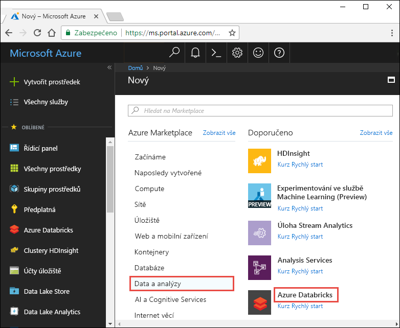
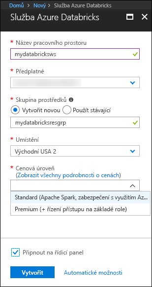

# <a name="quickstart-run-a-spark-job-on-azure-databricks-using-the-azure-portal"></a>Rychlý start: Spuštění úlohy Spark job v Azure Databricks pomocí portálu Azure

Tento rychlý start ukazuje, jak vytvořit pracovní prostor služby Azure Databricks a v něm cluster Apache Spark. Nakonec se v clusteru služby Databricks naučíte spustit úlohu Spark. Další informace o službě Azure Databricks najdete v tématu [Co je Azure Databricks?](what-is-azure-databricks.md)

## <a name="log-in-to-the-azure-portal"></a>Přihlášení k portálu Azure Portal

Přihlaste se k [portálu Azure](https://portal.azure.com).

## <a name="create-a-databricks-workspace"></a>Vytvoření pracovního prostoru služby Databricks

V této části vytvoříte pomocí portálu Azure pracovní prostor služby Azure Databricks. 

1. Na portálu Azure klikněte na symbol **+**, klikněte na **Data + analýzy** a potom na **Azure Databricks (Preview)**. 

    

2. V části **Azure Databricks (Preview)** klikněte na **Vytvořit**.

3. V části **Služba Azure Databricks** zadejte následující hodnoty:

    

    * Do pole **Název pracovního prostoru** zadejte název pracovního prostoru služby Databricks.
    * V poli **Předplatné** vyberte v rozevíracím seznamu vaše předplatné.
    * V části **Skupina prostředků** určete, jestli chcete vytvořit novou skupinu prostředků, nebo použít existující. Skupina prostředků je kontejner, který obsahuje související prostředky pro řešení Azure. Další informace naleznete v tématu [Přehled skupin prostředků v Azure](../azure-resource-manager/resource-group-overview.md).
    * V poli **Umístění** vyberte **Východní USA 2**. Další dostupné oblasti najdete v tématu [Dostupné služby Azure podle oblastí](https://azure.microsoft.com/regions/services/).

4. Klikněte na možnost **Vytvořit**.

## <a name="create-a-spark-cluster-in-databricks"></a>Vytvoření clusteru Spark ve službě Databricks

1. Na portálu Azure přejděte do pracovního prostoru Databricks, který jste vytvořili, a klikněte na **Initialize Workspace** (Inicializovat pracovní prostor).

2. Budete přesměrováni na portál Azure Databricks. Na portálu klikněte na **Cluster**.

    

3. Na stránce **New cluster** (Nový cluster) zadejte hodnoty pro vytvoření clusteru.

    

    * Zadejte název clusteru.
    * Ujistěte se, že zaškrtnete políčko **Terminate after ___ minutes of activity** (Ukončit po ___ minutách aktivity). Zadejte dobu (v minutách), po které se má ukončit činnost clusteru, pokud se cluster nepoužívá.
    * Přijměte všechny ostatní výchozí hodnoty. 
    * Klikněte na **Create cluster** (Vytvořit cluster). Po spuštění clusteru můžete ke clusteru připojit poznámkové bloky a spouštět úlohy Spark.

Další informace o vytváření clusterů najdete v tématu [Vytvoření clusteru Spark v Azure Databricks](https://docs.azuredatabricks.net/user-guide/clusters/create.html).

## <a name="run-a-spark-sql-job"></a>Spuštění úlohy Spark SQL

Než se pustíte do této části, je potřeba provést tyto kroky:

* [Vytvořte si účet Azure Storage](../storage/common/storage-create-storage-account.md#create-a-storage-account). 
* Stáhněte si [z GitHubu](https://github.com/Azure/usql/blob/master/Examples/Samples/Data/json/radiowebsite/small_radio_json.json) ukázkový soubor JSON. 
* Nahrajte ukázkový soubor JSON do účtu Azure Storage, který jste vytvořili. Soubory můžete nahrát pomocí [Průzkumníka služby Microsoft Azure Storage](../vs-azure-tools-storage-manage-with-storage-explorer.md).

Pomocí následujících kroků vytvořte ve službě Databricks poznámkový blok, nakonfigurujte ho na čtení dat z účtu služby Azure Blob Storage a potom na těchto datech spusťte úlohu Spark SQL.

1. V levém podokně klikněte na **Workspace** (Pracovní prostor). V rozevíracím seznamu **Workspace** (Pracovní prostor), klikněte na **Create** (Vytvořit) a potom klikněte na **Notebook** (Poznámkový blok).

    

2. V dialogovém okně **Create Notebook** (Vytvořit poznámkový blok) zadejte název, vyberte jazyk **Scala** a vyberte cluster Spark, který jste předtím vytvořili.

    

    Klikněte na možnost **Vytvořit**.

3. V následujícím fragmentu kódu nahraďte část `{YOUR STORAGE ACCOUNT NAME}` názvem účtu služby Azure Storage, který jste vytvořili, a část `{YOUR STORAGE ACCOUNT ACCESS KEY}` přístupovým klíčem účtu úložiště. Vložte fragment kódu do prázdné buňky v poznámkovém bloku a stisknutím kláves SHIFT + ENTER buňku kódu spusťte. Tento fragment kódu nakonfiguruje poznámkový blok na čtení dat ze služby Azure Blob Storage.

       spark.conf.set("fs.azure.account.key.{YOUR STORAGE ACCOUNT NAME}.blob.core.windows.net", "{YOUR STORAGE ACCOUNT ACCESS KEY}")
    
    Pokyny pro načtení přístupového klíče účtu úložiště najdete v článku [Správa přístupových klíčů úložiště](../storage/common/storage-create-storage-account.md#manage-your-storage-account).

    > [!NOTE]
    > V Azure Databricks můžete také použít službu Azure Data Lake Store s clusterem Spark. Pokyny najdete v článku [Použití služby Data Lake Store ve službě Azure Databricks](https://go.microsoft.com/fwlink/?linkid=864084).

4. Spuštěním příkazu SQL vytvořte dočasnou tabulku pomocí dat z ukázkového datového souboru JSON **small_radio_json.json**. V následujícím fragmentu kódu nahraďte zástupné hodnoty názvem vašeho kontejneru a názvem účtu úložiště. Vložte fragment kódu do buňky kódu v poznámkovém bloku a stiskněte klávesy SHIFT + ENTER. V tomto fragmentu kódu `path` označuje umístění ukázkového souboru JSON, který jste nahráli do účtu služby Azure Storage.

    ```sql
    %sql 
    CREATE TEMPORARY TABLE radio_sample_data
    USING json
    OPTIONS (
     path "wasbs://{YOUR CONTAINER NAME}@{YOUR STORAGE ACCOUNT NAME}.blob.core.windows.net/small_radio_json.json"
    )
    ```

    Po úspěšném dokončení příkazu získáte všechna data ze souboru JSON ve formátu tabulky v clusteru Databricks.

    Magický příkaz jazyka `%sql` umožňuje spustit z poznámkového bloku kód SQL, i když je poznámkový blok jiného typu. Další informace najdete v článku [Kombinování jazyků v poznámkovém bloku](https://docs.azuredatabricks.net/user-guide/notebooks/index.html#mixing-languages-in-a-notebook).

5. Podívejme se na snímek ukázkových dat JSON, abychom lépe pochopili dotaz, který spouštíme. Vložte do buňky kódu následující fragment kódu a stiskněte klávesy **SHIFT + ENTER**.

    ```sql
    %sql 
    SELECT * from radio_sample_data
    ```

6. Zobrazí se tabulkový výstup jako na následujícím snímku obrazovky (zobrazí se jenom některé sloupce):

    

    Vedle dalších podrobných informací ukázková data zachycují pohlaví posluchačů určité rozhlasové stanice (název sloupce **gender**) a to, zda mají bezplatné, nebo placené předplatné (název sloupce **level**).

7. Teď vytvoříte vizuální reprezentaci těchto dat, která bude znázorňovat, kolik uživatelů obou pohlaví má bezplatné účty a kolik je platících předplatitelů. Ve spodní části tabulkového výstupu klikněte na ikonu **Bar chart** (Pruhový graf) ikonu a potom na **Plot Options** (Možnosti grafu).

    

8. V části **Customize Plot** (Přizpůsobit graf) přetáhněte hodnoty, jak ukazuje snímek obrazovky.

    

    * V poli **Keys** (Klíče) nastavte hodnotu **gender** (Pohlaví).
    * V poli **Seskupení sérií** nastavte hodnotu **level** (Úroveň).
    * V poli **Values** (Hodnoty) nastavte hodnotu **level** (Úroveň).
    * V poli **Aggregation** (Agregace) vyberte možnost **COUNT** (Počet).

    Klikněte na tlačítko **Použít**.

9. Výstup bude obsahovat vizuální reprezentaci znázorněnou na následujícím snímku obrazovky:

     

## <a name="clean-up-resources"></a>Vyčištění prostředků

Pokud jste při vytváření clusteru Spark zaškrtli políčko **Terminate after __ minutes of inactivity** (Ukončit po __ minutách nečinnosti), cluster se po zadané době nečinnosti automaticky ukončí.

Pokud jste toto políčko nezaškrtli, je potřeba cluster ukončit ručně. Pokud to chcete udělat, v levém podokně v pracovním prostoru Azure Databricks klikněte na **Clusters** (Clustery). U clusteru, který chcete ukončit, přesuňte kurzor na tři tečky pod sloupcem **Actions** (Akce) a klikněte na ikonu **Terminate** (Ukončit).


## <a name="next-steps"></a>Další kroky

V tomto článku jste v Azure Databricks vytvořili cluster Spark a spustili úlohu Spark pomocí dat ve službě Azure Storage. Můžete si také projít článek [Zdroje dat Spark](https://docs.azuredatabricks.net/spark/latest/data-sources/index.html) a zjistit, jak do Azure Databricks importovat data z jiných zdrojů dat. V dalším článku se dozvíte, jak se službou Azure Databricks používat službu Azure Data Lake Store.

> [!div class="nextstepaction"]
>[Použití služby Data Lake Store ve službě Azure Databricks](https://go.microsoft.com/fwlink/?linkid=864084)
