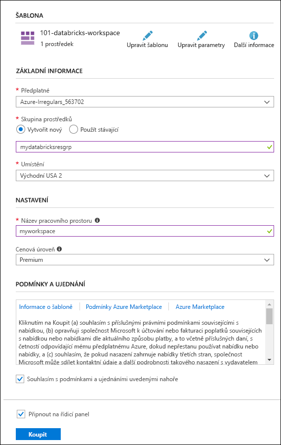
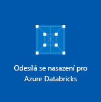
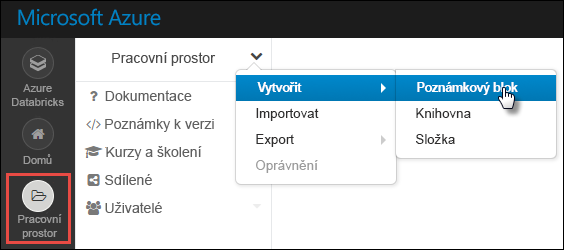
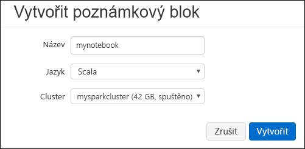
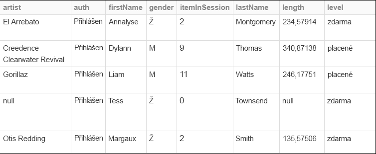
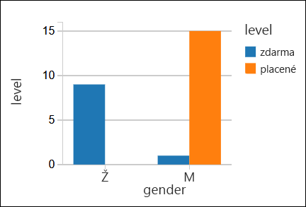

# <a name="quickstart-run-a-spark-job-on-azure-databricks-using-the-azure-resource-manager-template"></a>Rychlý start: Spuštění úlohy Spark v Azure Databricks pomocí šablony Azure Resource Manageru

V tomto rychlém startu se dozvíte, jak vytvořit pracovní prostor Azure Databricks pomocí šablony Azure Resource Manageru. Pracovní prostor použijete k vytvoření clusteru Apache Spark a spuštění úlohy Spark na clusteru Databricks. Další informace o službě Azure Databricks najdete v tématu [Co je Azure Databricks?](what-is-azure-databricks.md)

V tomto rychlém startu budete v rámci úlohy Spark analyzovat data o předplatných rozhlasových stanic, abyste získali přehled o bezplatném a placeném využití na základě demografických údajů.

Pokud ještě nemáte předplatné Azure, [vytvořte si bezplatný účet](https://azure.microsoft.com/free/) před tím, než začnete.

## <a name="create-an-azure-databricks-workspace"></a>Vytvoření pracovního prostoru Azure Databricks

V této části pomocí šablony Azure Resource Manageru vytvoříte pracovní prostor Azure Databricks. 

1. Kliknutím na následující obrázek otevřete šablonu na portálu Azure Portal.         

    <a href="https://portal.azure.com/#create/Microsoft.Template/uri/https%3A%2F%2Fraw.githubusercontent.com%2FAzure%2Fazure-quickstart-templates%2Fmaster%2F101-databricks-workspace%2Fazuredeploy.json" target="_blank"></a>

2. Zadejte požadované hodnoty pro vytvoření pracovního prostoru Azure Databricks. 

    

    Zadejte následující hodnoty: 
     
    |Vlastnost  |Popis  |
    |---------|---------|
    |**Předplatné**     | Z rozevíracího seznamu vyberte své předplatné Azure.        |
    |**Skupina prostředků**     | Určete, jestli chcete vytvořit novou skupinu prostředků, nebo použít existující. Skupina prostředků je kontejner, který obsahuje související prostředky pro řešení Azure. Další informace naleznete v tématu [Přehled skupin prostředků v Azure](../azure-resource-manager/resource-group-overview.md). |
    |**Umístění**     | Vyberte **Východní USA 2**. Další dostupné oblasti najdete v tématu [Dostupné služby Azure podle oblastí](https://azure.microsoft.com/regions/services/).        |
    |**Název pracovního prostoru**     | Zadejte název pracovního prostoru Databricks.        |
    |**Cenová úroveň**     |  Zvolte úroveň **Standard** nebo **Premium**. Další informace o těchto úrovních najdete na [stránce s cenami za Databricks](https://azure.microsoft.com/pricing/details/databricks/).       |

3. Vyberte **Souhlasím s podmínkami a ujednáními uvedenými nahoře**, vyberte **Připnout na řídicí panel** a potom klikněte na **Koupit**.

4. Vytvoření pracovního prostoru trvá několik minut. Během vytváření pracovního prostoru se na pravé straně portálu zobrazí dlaždice **Odesílání nasazení pro Azure Databricks**. Možná se budete muset posunout do pravé části řídicího panelu, aby se dlaždice zobrazila. V horní části obrazovky se také zobrazí indikátor průběhu. Průběh můžete sledovat v obou oblastech.

    

## <a name="create-a-spark-cluster-in-databricks"></a>Vytvoření clusteru Spark ve službě Databricks

1. Na webu Azure Portal přejděte do pracovního prostoru Databricks, který jste vytvořili, a klikněte na **Spustit pracovní prostor**.

2. Budete přesměrováni na portál Azure Databricks. Na portálu klikněte na **Cluster**.

    

3. Na stránce **New cluster** (Nový cluster) zadejte hodnoty pro vytvoření clusteru.

    

    Přijměte všechny výchozí hodnoty kromě následujících:

    * Zadejte název clusteru.
    * Pro účely tohoto článku vytvořte cluster s modulem runtime verze **4.0**. 
    * Nezapomeňte zaškrtnout políčko **Terminate after ____ minutes of inactivity** (Ukončit po ____ minutách neaktivity). Zadejte dobu (v minutách), po které se má ukončit činnost clusteru, pokud se cluster nepoužívá.
    
    Vyberte **Vytvořit cluster**. Po spuštění clusteru můžete ke clusteru připojit poznámkové bloky a spouštět úlohy Spark. 

Další informace o vytváření clusterů najdete v tématu [Vytvoření clusteru Spark v Azure Databricks](https://docs.azuredatabricks.net/user-guide/clusters/create.html).

## <a name="run-a-spark-sql-job"></a>Spuštění úlohy Spark SQL

Než se pustíte do této části, je potřeba nejprve splnit následující požadavky:

* [Vytvořte účet úložiště objektů blob v Azure](../storage/common/storage-create-storage-account.md#create-a-storage-account). 
* Stáhněte si [z GitHubu](https://github.com/Azure/usql/blob/master/Examples/Samples/Data/json/radiowebsite/small_radio_json.json) ukázkový soubor JSON. 
* Nahrajte ukázkový soubor JSON do účtu úložiště objektů blob v Azure, který jste vytvořili. Soubory můžete nahrát pomocí [Průzkumníka služby Microsoft Azure Storage](../vs-azure-tools-storage-manage-with-storage-explorer.md).

Provedením následujících úloh vytvořte ve službě Databricks poznámkový blok, nakonfigurujte ho na čtení dat z účtu služby Azure Blob Storage a potom na těchto datech spusťte úlohu Spark SQL.

1. V levém podokně klikněte na **Workspace** (Pracovní prostor). V rozevíracím seznamu **Workspace** (Pracovní prostor), klikněte na **Create** (Vytvořit) a potom klikněte na **Notebook** (Poznámkový blok).

    

2. V dialogovém okně **Create Notebook** (Vytvořit poznámkový blok) zadejte název, vyberte jazyk **Scala** a vyberte cluster Spark, který jste předtím vytvořili.

    

    Klikněte na možnost **Vytvořit**.

3. V tomto kroku přidružte účet Azure Storage ke clusteru Databricks Spark. Toto přidružení můžete provést dvěma způsoby. Můžete připojit účet Azure Storage k systému souborů Databricks (DBFS) nebo k účtu Azure Storage přistupovat přímo z vytvářené aplikace.  

    > [!IMPORTANT]
    >V tomto článku se používá přístup využívající **připojení úložiště k systému souborů DBFS**. Tento přístup zajistí, že se připojené úložiště přidruží k samotnému systému souborů clusteru. Přidružené úložiště tak budou moci využívat i všechny aplikace přistupující ke clusteru. Přístup využívající přímý přístup je omezený na aplikaci, ze které přístup nakonfigurujete.
    >
    > Pokud chcete použít přístup využívající připojení, musíte vytvořit cluster Spark s modulem runtime Databricks verze **4.0**, který jste zvolili v tomto článku.

    V následujícím fragmentu kódu nahraďte `{YOUR CONTAINER NAME}` (Název vašeho kontejneru), `{YOUR STORAGE ACCOUNT NAME}` (Název vašeho účtu úložiště) a `{YOUR STORAGE ACCOUNT ACCESS KEY}` (Přístupový klíč vašeho účtu úložiště) odpovídajícími hodnotami pro váš účet Azure Storage. Vložte fragment kódu do prázdné buňky v poznámkovém bloku a stisknutím kláves SHIFT + ENTER buňku kódu spusťte.

    * **Připojení účtu úložiště k systému souborů DBFS (doporučeno)**. V tomto fragmentu kódu se cesta k účtu Azure Storage připojí k cestě `/mnt/mypath`. Proto ve všech budoucích výskytech při přistupování k účtu Azure Storage už nemusíte zadávat úplnou cestu. Můžete použít jenom `/mnt/mypath`.

          dbutils.fs.mount(
            source = "wasbs://{YOUR CONTAINER NAME}@{YOUR STORAGE ACCOUNT NAME}.blob.core.windows.net/",
            mountPoint = "/mnt/mypath",
            extraConfigs = Map("fs.azure.account.key.{YOUR STORAGE ACCOUNT NAME}.blob.core.windows.net" -> "{YOUR STORAGE ACCOUNT ACCESS KEY}"))

    * **Přímý přístup k účtu úložišti**

          spark.conf.set("fs.azure.account.key.{YOUR STORAGE ACCOUNT NAME}.blob.core.windows.net", "{YOUR STORAGE ACCOUNT ACCESS KEY}")

    Pokyny pro načtení přístupového klíče účtu úložiště najdete v tématu věnovaném [správě přístupových klíčů úložiště](../storage/common/storage-create-storage-account.md#manage-your-storage-account).

    > [!NOTE]
    > V Azure Databricks můžete také použít službu Azure Data Lake Store s clusterem Spark. Pokyny najdete v článku [Použití služby Data Lake Store ve službě Azure Databricks](https://go.microsoft.com/fwlink/?linkid=864084).

4. Spuštěním příkazu SQL vytvořte dočasnou tabulku pomocí dat z ukázkového datového souboru JSON **small_radio_json.json**. V následujícím fragmentu kódu nahraďte zástupné hodnoty názvem vašeho kontejneru a názvem účtu úložiště. Vložte fragment kódu do buňky kódu v poznámkovém bloku a stiskněte klávesy SHIFT + ENTER. V tomto fragmentu kódu `path` označuje umístění ukázkového souboru JSON, který jste nahráli do účtu služby Azure Storage.

    ```sql
    %sql 
    DROP TABLE IF EXISTS radio_sample_data;
    CREATE TABLE radio_sample_data
    USING json
    OPTIONS (
     path "/mnt/mypath/small_radio_json.json"
    )
    ```

    Po úspěšném dokončení příkazu získáte všechna data ze souboru JSON ve formátu tabulky v clusteru Databricks.

    Magický příkaz jazyka `%sql` umožňuje spustit z poznámkového bloku kód SQL, i když je poznámkový blok jiného typu. Další informace najdete v článku [Kombinování jazyků v poznámkovém bloku](https://docs.azuredatabricks.net/user-guide/notebooks/index.html#mixing-languages-in-a-notebook).

5. Podívejme se na snímek ukázkových dat JSON, abyste lépe pochopili dotaz, který spouštíte. Vložte do buňky kódu následující fragment kódu a stiskněte klávesy **SHIFT + ENTER**.

    ```sql
    %sql 
    SELECT * from radio_sample_data
    ```

6. Zobrazí se tabulkový výstup jako na následujícím snímku obrazovky (zobrazí se jenom některé sloupce):

    

    Vedle dalších podrobných informací ukázková data zachycují pohlaví posluchačů určité rozhlasové stanice (název sloupce **gender**) a to, zda mají bezplatné, nebo placené předplatné (název sloupce **level**).

7. Teď vytvoříte vizuální reprezentaci těchto dat, která bude znázorňovat, kolik uživatelů obou pohlaví má bezplatné účty a kolik je platících předplatitelů. Ve spodní části tabulkového výstupu klikněte na ikonu **Bar chart** (Pruhový graf) ikonu a potom na **Plot Options** (Možnosti grafu).

    

8. V části **Customize Plot** (Přizpůsobit graf) přetáhněte hodnoty, jak ukazuje snímek obrazovky.

    

    * V poli **Keys** (Klíče) nastavte hodnotu **gender** (Pohlaví).
    * V poli **Seskupení sérií** nastavte hodnotu **level** (Úroveň).
    * V poli **Values** (Hodnoty) nastavte hodnotu **level** (Úroveň).
    * V poli **Aggregation** (Agregace) vyberte možnost **COUNT** (Počet).

    Klikněte na tlačítko **Použít**.

9. Výstup bude obsahovat vizuální reprezentaci znázorněnou na následujícím snímku obrazovky:

     

## <a name="clean-up-resources"></a>Vyčištění prostředků

Po dokončení tohoto článku můžete cluster ukončit. Pokud to chcete udělat, v levém podokně v pracovním prostoru Azure Databricks vyberte **Clusters** (Clustery). U clusteru, který chcete ukončit, přesuňte kurzor na tři tečky pod sloupcem **Actions** (Akce) a vyberte ikonu **Terminate** (Ukončit).


Pokud cluster neukončíte ručně, zastaví se automaticky za předpokladu, že jste při vytváření clusteru zaškrtli políčko **Ukončit po __ minutách nečinnosti**. V takovém případě se cluster automaticky zastaví, pokud byl po stanovenou dobu neaktivní.

## <a name="next-steps"></a>Další kroky

V tomto článku jste v Azure Databricks vytvořili cluster Spark a spustili úlohu Spark pomocí dat ve službě Azure Storage. Můžete si také projít článek [Zdroje dat Spark](https://docs.azuredatabricks.net/spark/latest/data-sources/index.html) a zjistit, jak do Azure Databricks importovat data z jiných zdrojů dat. Můžete si také prohlédnout šablonu Resource Manageru pro [Vytvoření pracovního prostoru Azure Databricks s vlastní adresou virtuální sítě](https://github.com/Azure/azure-quickstart-templates/tree/master/101-databricks-workspace-with-custom-vnet-address).

V dalším článku se dozvíte, jak pomocí Azure Databricks provést operaci ETL (extrakce, transformace a načítání dat).

> [!div class="nextstepaction"]
>[Extrakce, transformace a načítání dat pomocí Azure Databricks](databricks-extract-load-sql-data-warehouse.md)
