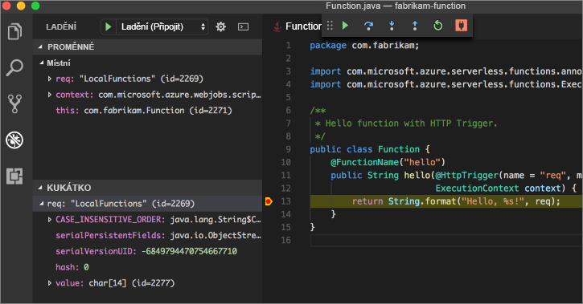

# <a name="create-your-first-function-with-java-and-maven-preview"></a>Vytvoření první funkce pomocí Javy a Mavenu (Preview)

> [!NOTE] 
> Java pro službu Azure Functions je aktuálně ve verzi Preview.

Tento rychlý start vás provede vytvořením funkce [bez serveru](https://azure.microsoft.com/overview/serverless-computing/) pomocí Mavenu, jejím místním otestováním a nasazením do služby Azure Functions. Až budete hotovi, budete mít aplikaci funkcí aktivovanou protokolem HTTP spuštěnou v Azure.


[!INCLUDE [quickstarts-free-trial-note](../../includes/quickstarts-free-trial-note.md)]

## <a name="prerequisites"></a>Požadavky
K vývoji aplikace funkcí pomocí Javy potřebujete následující:

-  Nejnovější verzi [.NET Core](https://www.microsoft.com/net/core).
-  [Java Developer Kit](https://www.azul.com/downloads/zulu/) verze 8.
-  [Azure CLI](https://docs.microsoft.com/cli/azure)
-  [Apache Maven](https://maven.apache.org) verze 3.0 nebo novější.
-  [Node.js](https://nodejs.org/download/) verze 8.6 nebo novější.

> [!IMPORTANT] 
> Pro dokončení tohoto rychlého startu musí být proměnná prostředí JAVA_HOME nastavená na umístění instalace sady JDK.

## <a name="install-the-azure-functions-core-tools"></a>Instalace nástrojů Azure Functions Core

[Nástroje Azure Functions Core 2.0](https://www.npmjs.com/package/azure-functions-core-tools) poskytují místní vývojové prostředí pro psaní, spouštění a ladění funkcí Azure Functions. Nainstalujte nástroje pomocí příkazu [npm](https://www.npmjs.com/), který je součástí [Node.js](https://nodejs.org/).

```
npm install -g azure-functions-core-tools@core
```

> [!NOTE]
> Pokud máte potíže s instalací nástrojů Azure Functions Core verze 2.0, podívejte se na [Modul runtime verze 2.x](/azure/azure-functions/functions-run-local#version-2x-runtime).

## <a name="generate-a-new-functions-project"></a>Vygenerování nového projektu Functions

Spuštěním následujícího příkazu v prázdné složce vygenerujte projekt Functions z [archetypu Maven](https://maven.apache.org/guides/introduction/introduction-to-archetypes.html).

### <a name="linuxmacos"></a>Linux/MacOS

```bash
mvn archetype:generate \
    -DarchetypeGroupId=com.microsoft.azure \
    -DarchetypeArtifactId=azure-functions-archetype 
```

### <a name="windows-cmd"></a>Windows (Příkazový řádek)
```cmd
mvn archetype:generate ^
    -DarchetypeGroupId=com.microsoft.azure ^
    -DarchetypeArtifactId=azure-functions-archetype
```

Maven vás vyzve k zadání hodnot požadovaných pro dokončení generování projektu. Informace o hodnotách _groupId_, _artifactId_ a _version_ najdete v referenčních informacích k [zásadám vytváření názvů pro Maven](https://maven.apache.org/guides/mini/guide-naming-conventions.html). Hodnota _appName_ musí být v rámci Azure jedinečná, takže Maven ve výchozím nastavení vygeneruje název aplikace na základě dříve zadané hodnoty _artifactId_. Hodnota _packageName_ určuje balíček Java pro vygenerovaný kód funkce.

```Output
Define value for property 'groupId': com.fabrikam.functions
Define value for property 'artifactId' : fabrikam-functions
Define value for property 'version' 1.0-SNAPSHOT : 
Define value for property 'package': com.fabrikam.functions
Define value for property 'appName' fabrikam-functions-20170927220323382:
Confirm properties configuration: Y
```

Maven přesune soubory projektu do nové složky s názvem _artifactId_. Vygenerovaný kód v projektu je jednoduchá funkce [aktivovaná protokolem HTTP](/azure/azure-functions/functions-bindings-http-webhook), která vypisuje text žádosti:

```java
public class Function {
    @FunctionName("hello")
    public String hello(@HttpTrigger(name = "req", methods = {"get", "post"}, authLevel = AuthorizationLevel.ANONYMOUS) String req,
                        ExecutionContext context) {
        return String.format("Hello, %s!", req);
    }
}
```

## <a name="run-the-function-locally"></a>Místní spuštění funkce

Změňte adresář na složku nově vytvořeného projektu a sestavte a spusťte funkci pomocí Mavenu:

```
cd fabrikam-function
mvn clean package 
mvn azure-functions:run
```

Po spuštění funkce se zobrazí tento výstup:

```Output
Listening on http://localhost:7071
Hit CTRL-C to exit...

Http Functions:

   hello: http://localhost:7071/api/hello
```

V novém terminálu aktivujte funkci z příkazového řádku pomocí příkazu curl:

```
curl -w '\n' -d LocalFunction http://localhost:7071/api/hello
```

```Output
Hello LocalFunction!
```

Pomocí klávesové zkratky `Ctrl-C` v terminálu zastavte kód aplikace.

## <a name="deploy-the-function-to-azure"></a>Nasazení funkce do Azure

V procesu nasazení do služby Azure Functions se používají přihlašovací údaje účtu z Azure CLI. [Přihlaste se pomocí Azure CLI](/cli/azure/authenticate-azure-cli?view=azure-cli-latest) a pak nasaďte váš kód do nové aplikace funkcí s použitím cíle Maven `azure-functions:deploy`.

```
az login
mvn azure-functions:deploy
```

Po dokončení nasazení se zobrazí adresa URL, pomocí které můžete přistupovat k vaší aplikaci funkcí Azure:

```output
[INFO] Successfully deployed Function App with package.
[INFO] Deleting deployment package from Azure Storage...
[INFO] Successfully deleted deployment package fabrikam-function-20170920120101928.20170920143621915.zip
[INFO] Successfully deployed Function App at https://fabrikam-function-20170920120101928.azurewebsites.net
[INFO] ------------------------------------------------------------------------
```

Otestujte aplikaci funkcí spuštěnou v Azure pomocí příkazu curl:

```
curl -w '\n' https://fabrikam-function-20170920120101928.azurewebsites.net/api/hello -d AzureFunctions
```

```Output
Hello AzureFunctions!
```

## <a name="next-steps"></a>Další kroky

Vytvořili jste aplikaci funkcí v Javě s jednoduchým triggerem HTTP a nasadili jste ji do služby Azure Functions.

- V [příručce pro vývojáře funkcí v Javě](functions-reference-java.md) najdete další informace o vývoji funkcí v Javě.
- Do svého projektu můžete přidat další funkce s jinými triggery s použitím cíle Maven `azure-functions:add`.
- Funkce můžete ladit místně pomocí Visual Studio Code. S nainstalovaným [balíčkem rozšíření Java](https://marketplace.visualstudio.com/items?itemName=vscjava.vscode-java-pack) a projektem Functions otevřeným ve Visual Studio Code [připojte ladicí program](https://code.visualstudio.com/Docs/editor/debugging#_launch-configurations) k portu 5005. Pak v editoru nastavte zarážku a aktivujte vaši funkci, zatímco je místně spuštěná: .


