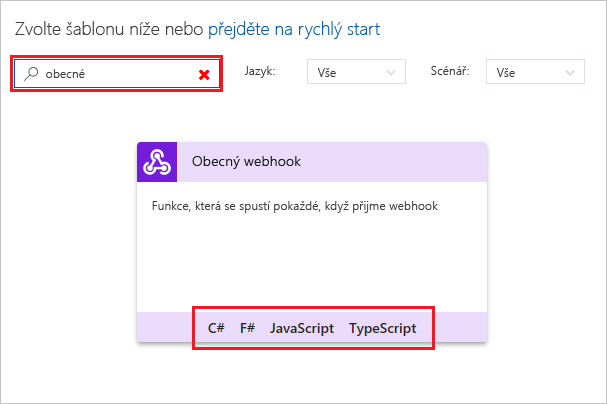

# <a name="create-a-function-triggered-by-a-generic-webhook"></a>Vytvoření funkce aktivovány obecný webhook

Služba Azure Functions umožňuje spuštění kódu v prostředí bez serveru, aniž byste nejdřív museli vytvořit virtuální počítač nebo publikovat webovou aplikaci. Můžete například nakonfigurovat funkce, která se aktivovat výstrahu aktivováno monitorování Azure. Toto téma ukazuje, jak provádět kód C#, pokud skupina prostředků se přidá do vašeho předplatného.   


## <a name="prerequisites"></a>Požadavky 

K provedení kroků v tomto kurzu je potřeba:

+ Pokud ještě nemáte předplatné Azure, vytvořte si [bezplatný účet](https://azure.microsoft.com/free/?WT.mc_id=A261C142F) před tím, než začnete.

[!INCLUDE [functions-portal-favorite-function-apps](../../includes/functions-portal-favorite-function-apps.md)]

## <a name="create-an-azure-function-app"></a>Vytvoření aplikace Azure Function App

[!INCLUDE [Create function app Azure portal](../../includes/functions-create-function-app-portal.md)]

Dál vytvoříte v nové aplikaci Function App funkci.

## <a name="create-function"></a>Vytvoření obecný webhook aktivované funkce

1. Rozbalte aplikaci Function App a klikněte na tlačítko **+** vedle položky **Funkce**. Pokud tuto funkci je první z nich v aplikaci funkce, vyberte **vlastní funkce**. Zobrazí se kompletní sada šablon funkcí.

    

2. Vyberte **obecný WebHook - C#** šablony. Zadejte název pro funkce C# a pak vyberte **vytvořit**.

      

2. V nové funkce, klikněte na **URL funkce <> / Get**, zkopírujte a uložte hodnotu. Tuto hodnotu použijete ke konfiguraci webhooku. 

    
         
Dále vytvoříte koncový bod webhooku ve výstraze protokolu aktivit v Azure monitorování. 

## <a name="create-an-activity-log-alert"></a>Vytvořit výstrahu protokolu aktivit

1. Na portálu Azure přejděte do **monitorování** služby, vyberte **výstrahy**a klikněte na tlačítko **přidat aktivitu protokolu upozornění**.   

    

2. Použijte nastavení uvedená v tabulce:

    

    | Nastavení      |  Navrhovaná hodnota   | Popis                              |
    | ------------ |  ------- | -------------------------------------------------- |
    | **Název výstrahy protokolu aktivit** | prostředek skupiny vytvořit – upozornění | Název protokolu výstraha aktivity. |
    | **Předplatné** | Vaše předplatné | Odběr, který používáte pro účely tohoto kurzu. | 
    |  **Skupina prostředků** | myResourceGroup | Výstrahy prostředky jsou nasazeny do skupiny prostředků. Pomocí stejné skupině prostředků jako aplikace funkce usnadňuje odstraňování až po dokončení kurzu. |
    | **Kategorie události** | Pro správu | Tato kategorie zahrnuje změny prostředků Azure.  |
    | **Typ prostředku** | Skupiny prostředků | Filtrování výstrah pro aktivity skupiny prostředků. |
    | **Skupina prostředků**<br/>a **prostředků** | Všechny | Monitorujte všechny prostředky. |
    | **Název operace** | Vytvoření skupiny prostředků | Filtrování výstrah pro vytvoření operací. |
    | **Úroveň** | Informační | Zahrnout informační úrovně výstrahy. | 
    | **Stav** | Úspěch | Filtrování výstrah na akce, které byly úspěšně dokončeny. |
    | **Akce skupiny** | Nový | Vytvořte novou skupinu akce, který definuje akce trvá, když je vydána výstraha. |
    | **Název skupiny akce** | Funkce webhooku | Název pro identifikaci skupiny akce.  | 
    | **Krátký název** | funcwebhook | Krátký název pro skupinu akce. |  

3. V **akce**, přidat akci pomocí nastavení uvedeného v tabulce: 

    

    | Nastavení      |  Navrhovaná hodnota   | Popis                              |
    | ------------ |  ------- | -------------------------------------------------- |
    | **Název** | CallFunctionWebhook | Název akce. |
    | **Typ akce** | Webhook | Odpověď na výstrahy je, že adresa URL Webhooku se nazývá. |
    | **Podrobnosti** | URL – funkce | Vložte adresu URL webhooku funkce, který jste zkopírovali dříve. |v

4. Klikněte na tlačítko **OK** vytvořit skupinu výstrahy a akce.  

Webhook se nyní nazývá při vytvoření skupiny prostředků v rámci vašeho předplatného. Potom aktualizujte kód ve vaší funkci pro zpracování dat protokolu JSON v textu požadavku.   

## <a name="update-the-function-code"></a>Aktualizace kódu funkce

1. Přejděte zpět do aplikace pro funkce na portálu a rozšířit funkce. 

2. Nahraďte kód skriptu jazyka C# ve funkci portálu s následujícím kódem:

    ```csharp
    #r "Newtonsoft.Json"
    
    using System;
    using System.Net;
    using Newtonsoft.Json;
    using Newtonsoft.Json.Linq;
    
    public static async Task<object> Run(HttpRequestMessage req, TraceWriter log)
    {
        log.Info($"Webhook was triggered!");
    
        // Get the activityLog object from the JSON in the message body.
        string jsonContent = await req.Content.ReadAsStringAsync();
        JToken activityLog = JObject.Parse(jsonContent.ToString())
            .SelectToken("data.context.activityLog");
    
        // Return an error if the resource in the activity log isn't a resource group. 
        if (activityLog == null || !string.Equals((string)activityLog["resourceType"], 
            "Microsoft.Resources/subscriptions/resourcegroups"))
        {
            log.Error("An error occured");
            return req.CreateResponse(HttpStatusCode.BadRequest, new
            {
                error = "Unexpected message payload or wrong alert received."
            });
        }
    
        // Write information about the created resource group to the streaming log.
        log.Info(string.Format("Resource group '{0}' was {1} on {2}.",
            (string)activityLog["resourceGroupName"],
            ((string)activityLog["subStatus"]).ToLower(), 
            (DateTime)activityLog["submissionTimestamp"]));
    
        return req.CreateResponse(HttpStatusCode.OK);    
    }
    ```

Nyní můžete otestovat funkci tak, že vytvoříte novou skupinu prostředků ve vašem předplatném.

## <a name="test-the-function"></a>Testování funkce

1. Klikněte na ikonu skupiny prostředků v levé části portálu Azure, vyberte **+ přidat**, zadejte **název skupiny prostředků**a vyberte **vytvořit** k vytvoření skupiny prostředků prázdný.
    
    

2. Vraťte se zpátky a funkce a rozbalte **protokoly** okno. Po vytvoření skupiny prostředků webhooku se aktivuje výstraha protokolu aktivity a provádí funkce. Zobrazí název nové skupiny prostředků zapisují do protokolů.  

    

3. (Volitelné) Přejděte zpět a odstraňte skupinu prostředků, kterou jste vytvořili. Všimněte si, že tato aktivita nebude aktivovat funkce. Důvodem je, že odstranění operations filtrují výstraha. 

## <a name="clean-up-resources"></a>Vyčištění prostředků

[!INCLUDE [Next steps note](../../includes/functions-quickstart-cleanup.md)]

## <a name="next-steps"></a>Další kroky

Funkce, která se spouští při přijetí požadavku z obecný webhook jste vytvořili. 

[!INCLUDE [Next steps note](../../includes/functions-quickstart-next-steps.md)]

Další informace o aktivačních událostech webhooků najdete v tématu [Vazby protokolu HTTP služby Azure Functions a vazby webhooku](functions-bindings-http-webhook.md). Další informace o vývoji funkce v jazyce C#, najdete v části [Azure funkcí jazyka C# skript referenční informace pro vývojáře](functions-reference-csharp.md).

