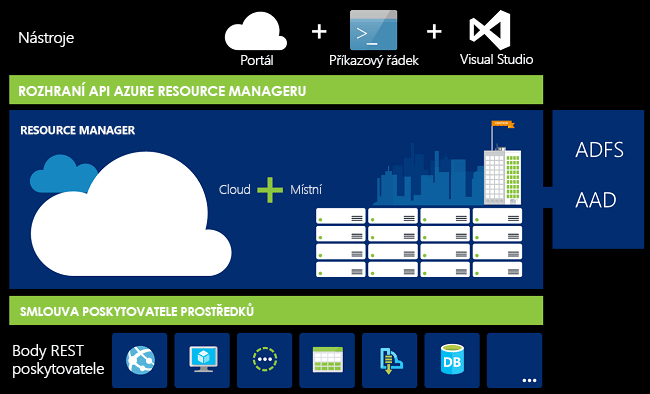
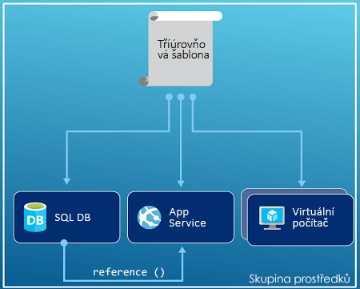
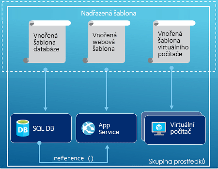
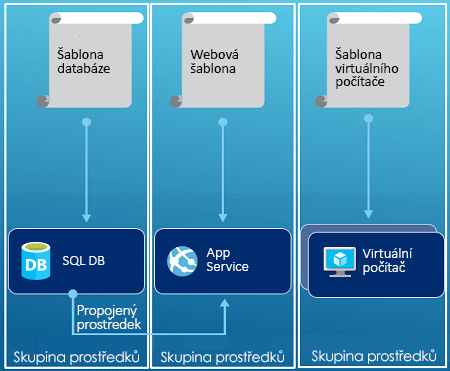

# <a name="azure-resource-manager-overview"></a>Přehled Azure Resource Manageru
Infrastrukturu aplikace obvykle tvoří celá řada komponent, může to být třeba virtuální počítač, účet úložiště a virtuální síť nebo webová aplikace, databáze, databázový server a služby jiných výrobců. Tyto komponenty nevidíte jako samostatné entity, ale jako související a vzájemně provázané části jedné entity. Chcete je nasadit, spravovat a monitorovat jako skupinu. Azure Resource Manager umožňuje pracovat s prostředky ve vašem řešení jako se skupinou. Všechny prostředky pro vaše řešení můžete nasadit, aktualizovat nebo odstranit v rámci jediné koordinované operace. Pro nasazení použijete šablonu a tato šablona může fungovat v různých prostředích, jako například v testovacím, přípravném nebo produkčním prostředí. Resource Manager poskytuje funkce zabezpečení, auditování a označování, které vám po nasazení pomohou prostředky spravovat. 

## <a name="terminology"></a>Terminologie
Pokud je pro vás Azure Resource Manager novinkou, následuje pár termínů, se kterými byste nemuseli být obeznámeni.

* **prostředek** - Spravovatelná položka, která je k dispozici prostřednictvím služby Azure. Mezi běžné prostředky patří virtuální počítač, účet úložiště, webová aplikace, databáze nebo virtuální síť, ale existuje i mnoho dalších.
* **skupina prostředků** – Kontejner, který obsahuje související prostředky pro řešení Azure. Skupina prostředků může zahrnovat všechny prostředky pro řešení nebo pouze ty prostředky, které chcete spravovat jako skupinu. Na základě toho, co je pro vaši organizaci nejvhodnější, rozhodnete, jakým způsobem se mají prostředky přidělovat do skupin prostředků. Viz [Skupiny prostředků](#resource-groups).
* **poskytovatel prostředků** - Služba poskytující prostředky, které můžete nasadit a spravovat prostřednictvím Resource Manageru. Každý poskytovatel prostředků nabízí operace pro práci s nasazenými prostředky. Mezi běžné poskytovatele prostředků patří Microsoft.Compute, který poskytuje prostředek virtuálních počítačů, Microsoft.Storage, který poskytuje prostředek účtu úložiště, a Microsoft.Web, který poskytuje prostředky vztahující se k webovým aplikacím. Viz [Poskytovatelé prostředků](#resource-providers).
* **šablona Resource Manageru** - Soubor formátu JavaScript Object Notation (JSON), který definuje jeden nebo více prostředků k nasazení do skupiny prostředků. Definuje také závislosti mezi nasazenými prostředky. Šablony lze použít k nasazení prostředků konzistentně a opakovaně. Viz [Nasazení šablon](#template-deployment).
* **deklarativní syntaxe** – Syntaxe, která umožňuje prohlásit „Toto mám v úmyslu vytvořit“, aniž by k tomu bylo nutné psát sekvence programových příkazů. Šablona Resource Manageru je příkladem deklarativní syntaxe. V souboru definujete vlastnosti pro infrastrukturu k nasazení do Azure. 

## <a name="the-benefits-of-using-resource-manager"></a>Výhody použití Resource Manageru
Resource Manager poskytuje několik výhod:

* Můžete všechny prostředky pro vaše řešení nasadit, spravovat a monitorovat jako skupinu a nemusíte je zpracovávat jednotlivě.
* Můžete svoje řešení opakovaně nasadit v průběhu životního cyklu a mít přitom jistotu, že se prostředky nasadí konzistentně.
* Infrastrukturu můžete spravovat pomocí deklarativních šablon místo skriptů.
* Můžete definovat závislosti mezi prostředky, takže se nasadí ve správném pořadí.
* Můžete využít řízení přístupu pro všechny služby ve vaší skupině prostředků, protože do platformy pro správu je nativně integrováno řízení přístupu na základě role (RBAC).
* Můžete označit prostředky pomocí značek a logicky tak uspořádat všechny prostředky ve svém předplatném.
* Můžete zpřehlednit fakturaci svojí organizace zobrazením nákladů na skupinu prostředků, které sdílejí stejnou značku.  

Resource Manager poskytuje nový způsob nasazení a správy vašich řešení. Pokud jste využívali dřívější model nasazení a chcete se dozvědět o změnách, přečtěte si článek věnovaný [nasazení Resource Manageru a klasickému nasazení](resource-manager-deployment-model.md).

## <a name="consistent-management-layer"></a>Konzistentní vrstva správy
Resource Manager poskytuje konzistentní vrstvu správy pro úlohy prováděné prostřednictvím Azure PowerShellu, rozhraní příkazového řádku Azure, webu Azure Portal, rozhraní REST API a vývojových nástrojů. Všechny tyto nástroje používají společnou sadu operací. Můžete používat nástroje, které vám nejvíce vyhovují, a používat je zaměnitelně, aniž by to vedlo k nějakým nejasnostem. 

Následující obrázek znázorňuje, jakým způsobem všechny tyto nástroje interagují se stejným rozhraním API Azure Resource Manageru. Rozhraní API předává požadavky do služby Resource Manageru, která je ověřuje a autorizuje. Resource Manager následně směruje požadavky do příslušných poskytovatelů prostředků.



## <a name="guidance"></a>Doprovodné materiály
Následující návrhy vám pomohou při práci s vašimi řešeními plně využít výhod Resource Manageru.

1. K definování a nasazení infrastruktury využijte deklarativní syntaxi v šablonách Resource Manageru, nikoli imperativní příkazy.
2. V šabloně definujte všechny kroky nasazení a konfigurace. K nastavení svého řešení byste neměli využívat žádné ruční kroky.
3. Ke správě vašich prostředků využijte imperativní příkazy, například pro spuštění nebo zastavení aplikace nebo počítače.
4. Prostředky se stejným životním cyklem uspořádejte do skupiny prostředků. K ostatnímu uspořádání prostředků využijte značky.

Další doporučení k šablonám najdete v tématu [Osvědčené postupy pro vytváření šablon Azure Resource Manageru](resource-manager-template-best-practices.md).

Pokyny k tomu, jak můžou podniky používat Resource Manager k efektivní správě předplatných, najdete v části [Základní kostra Azure Enterprise – zásady správného řízení pro předplatná](resource-manager-subscription-governance.md).

## <a name="resource-groups"></a>Skupiny prostředků
Při definování skupin prostředků byste měli vzít v úvahu některé důležité faktory:

1. Všechny prostředky ve skupině by měly sdílet stejný životní cyklus. Nasazujete, aktualizujete a odstraňujete je společně. Pokud některý z prostředků, například databázový server, musí mít jiný cyklus nasazení, měl by být v jiné skupině prostředků.
2. Každý prostředek může být jenom v jedné skupině prostředků.
3. Prostředky je možné do skupiny prostředků kdykoli přidat nebo naopak odebrat.
4. Prostředky je možné přesouvat mezi skupinami. Další informace najdete v tématu, které se zabývá [přesunutím prostředků do nové skupiny prostředků nebo předplatného](resource-group-move-resources.md).
5. Skupina prostředků může obsahovat prostředky, které se nacházejí v různých oblastech.
6. Skupinu prostředků lze využít k určení rozsahu řízení přístupu pro akce správy.
7. Prostředek může interagovat s prostředky v dalších skupinách prostředků. Tato interakce je běžná v případě, že spolu tyto dva prostředky souvisejí, ale nesdílejí stejný životní cyklus (například webové aplikace, které se připojují k databázi).

Při vytváření skupiny prostředků pro ni musíte zadat umístění. Asi vás zajímá, proč skupina prostředků potřebuje umístění. A proč vůbec záleží na umístění skupiny prostředků, pokud prostředky mohou mít jiná umístění než skupina prostředků. Skupina prostředků ukládá metadata o prostředcích. Při zadávání umístění skupiny prostředků tedy určujete, kde se tato metadata ukládají. Z důvodu dodržování předpisů může být nutné zajistit, aby se data ukládala v určité oblasti.

## <a name="resource-providers"></a>Poskytovatelé prostředků
Každý poskytovatel prostředků nabízí sadu prostředků a operací pro práci se službou Azure. Pokud například chcete ukládat klíče a tajné klíče, využijete poskytovatele prostředků **Microsoft.KeyVault**. Tento poskytovatel prostředků nabízí typ prostředků nazvaný **trezory** pro vytvoření trezoru klíčů. 

Název typu prostředku má formát: **{poskytovatel prostředku}/{typ prostředku}**. Například typ trezoru klíčů je **Microsoft.KeyVault/vaults**.

Než začnete nasazovat prostředky, měli byste získat přehled o dostupných poskytovatelích prostředků. Znalost názvů poskytovatelů prostředků a samotných prostředků vám umožní definovat prostředky, které chcete nasadit do Azure. Také je potřeba vědět platná umístění a verze rozhraní API pro každý typ prostředku. Další informace najdete v tématu [Zprostředkovatelé a typy prostředků](resource-manager-supported-services.md).

## <a name="template-deployment"></a>Nasazení šablon
Pomocí Resource Manageru můžete vytvořit šablonu (ve formátu JSON), která definuje infrastrukturu a konfiguraci vašeho řešení Azure. Pomocí šablony můžete řešení opakovaně nasadit v průběhu životního cyklu a mít přitom jistotu, že se prostředky nasadí konzistentně. Když vytvoříte řešení z portálu, bude toto řešení automaticky zahrnovat šablonu nasazení. Šablonu nemusíte vytvářet od začátku, protože můžete začít se šablonou pro svoje řešení a upravit ji tak, aby vyhovovala vašim konkrétním potřebám. Šablonu pro stávající skupinu prostředků můžete načíst tak, že vyexportujete aktuální stav této skupiny prostředků, nebo zobrazením šablony použité pro konkrétní nasazení. Zobrazení [vyexportované šablony](resource-manager-export-template.md) vám pomůže blíže se seznámit se syntaxí šablony.

Další informace o formátu šablony a způsobu jejího vytvoření najdete v tématu [Vytvoření první šablony Azure Resource Manageru](resource-manager-create-first-template.md). Syntaxi JSON pro typy prostředků najdete v tématu [Definování prostředků v šablonách Azure Resource Manageru](/azure/templates/).

Resource Manager zpracovává šablonu stejně jako ostatní požadavky (viz obrázek [Konzistentní vrstva správy](#consistent-management-layer)). Parsuje šablonu a převede její syntaxi na operace rozhraní REST API pro příslušné poskytovatele prostředků. Když například Resource Manager obdrží šablonu s následující definicí prostředku:

```json
"resources": [
  {
    "apiVersion": "2016-01-01",
    "type": "Microsoft.Storage/storageAccounts",
    "name": "mystorageaccount",
    "location": "westus",
    "sku": {
      "name": "Standard_LRS"
    },
    "kind": "Storage",
    "properties": {
    }
  }
]
```

Převede definici na následující operaci rozhraní REST API, která se odešle do poskytovatele prostředků Microsoft.Storage:

```HTTP
PUT
https://management.azure.com/subscriptions/{subscriptionId}/resourceGroups/{resourceGroupName}/providers/Microsoft.Storage/storageAccounts/mystorageaccount?api-version=2016-01-01
REQUEST BODY
{
  "location": "westus",
  "properties": {
  }
  "sku": {
    "name": "Standard_LRS"
  },   
  "kind": "Storage"
}
```

Záleží pouze na vás, jak definujete šablony a skupiny prostředků a jak chcete spravovat své řešení. Například můžete nasadit svou třívrstvou aplikaci prostřednictvím jediné šablony do jedné skupiny prostředků.



Není však nutné definovat celou infrastrukturu v jediné šabloně. Často má smysl rozdělit požadavky nasazení do několika cílených šablon, které jsou zaměřené na konkrétní účel. Tyto šablony můžete snadno opakovaně použít pro různá řešení. Chcete-li nasadit konkrétní řešení, vytvoříte hlavní šablonu, která propojí všechny požadované šablony. Následující obrázek znázorňuje způsob nasazení třívrstvého řešení prostřednictvím nadřazené šablony, která obsahuje tři vnořené šablony.



Pokud si představíte, že vaše vrstvy mají tři samostatné životní cykly, můžete tyto tři vrstvy nasadit do samostatných skupin prostředků. Všimněte si, že prostředky mohou být stále propojené s prostředky v jiných skupinách prostředků.



Další rady k navrhování šablon najdete v tématu [Způsoby navrhování šablon Azure Resource Manageru](best-practices-resource-manager-design-templates.md). Informace o vnořených šablonách najdete v tématu [Použití propojených šablon s Azure Resource Managerem](resource-group-linked-templates.md).

Čtyřdílný seriál o automatickém nasazení najdete v článku [Automatizace nasazení aplikací ve službě Azure Virtual Machines](../virtual-machines/windows/dotnet-core-1-landing.md?toc=%2fazure%2fvirtual-machines%2fwindows%2ftoc.json). Tato série se věnuje architektuře aplikací, přístupu a zabezpečení, dostupnosti a škálování a nasazení aplikací.

Azure Resource Manager analyzuje závislosti a zajistí, že se prostředky vytvoří ve správném pořadí. Pokud jeden prostředek závisí na hodnotě z jiného prostředku (například virtuální počítač potřebuje účet úložiště pro disky), nastavíte závislost. Další informace najdete v tématu [Definování závislostí v šablonách Azure Resource Manageru](resource-group-define-dependencies.md).

Šablony můžete také využít pro aktualizace infrastruktury. Můžete například ke svému řešení přidat prostředek a konfigurační pravidla pro prostředky, které jsou už nasazené. Pokud šablona specifikuje vytvoření nového prostředku, ale tento prostředek již existuje, Azure Resource Manager místo vytvoření nového assetu provede jeho aktualizaci. Azure Resource Manager aktualizuje stávající asset do stejného stavu, jako kdyby byl nový.  

Resource Manager poskytuje rozšíření pro scénáře, kdy potřebujete další operace, jako je třeba instalace konkrétního softwaru, který není zahrnutý v původní instalaci. Pokud již využíváte službu pro správu konfigurace, jako je DSC, Chef nebo Puppet, můžete tuto službu s pomocí rozšíření používat i nadále. Informace o rozšířeních virtuálních počítačů najdete v tématu [Funkce a rozšíření virtuálních počítačů](../virtual-machines/windows/extensions-features.md?toc=%2fazure%2fvirtual-machines%2fwindows%2ftoc.json). 

Šablona se také stane součástí zdrojového kódu vaší aplikace. Můžete ji vrátit se změnami do vašeho úložiště zdrojového kódu a aktualizovat ji podle toho, jak se bude vaše aplikace vyvíjet. K úpravě šablony můžete použít Visual Studio.

Po definování šablony jste připraveni k nasazení prostředků Azure. Příkazy pro nasazení prostředků najdete v těchto tématech:

* [Nasazení prostředků pomocí šablon Resource Manageru a Azure PowerShellu](resource-group-template-deploy.md)
* [Nasazení prostředků pomocí šablon Resource Manageru a rozhraní příkazového řádku Azure](resource-group-template-deploy-cli.md)
* [Nasazení prostředků pomocí šablon Resource Manageru a webu Azure Portal](resource-group-template-deploy-portal.md)
* [Nasazení prostředků pomocí šablon Resource Manageru a jeho rozhraní REST API](resource-group-template-deploy-rest.md)

## <a name="tags"></a>Značky
Resource Manager nabízí funkci označování, která umožňuje kategorizovat prostředky podle požadavků na správu nebo fakturaci. Značky použijte v případě, že máte komplexní kolekci prostředků a skupin prostředků a potřebujete tyto assety vizualizovat co nejsmysluplnějším způsobem. Můžete například označit prostředky, které mají v rámci organizace podobnou roli nebo které patří do stejného oddělení. Uživatelé ve vaší organizaci mohou vytvořit různé prostředky, které se bez použití značek budou později těžko identifikovat a spravovat. Můžete například chtít odstranit všechny prostředky pro konkrétní projekt. Pokud ale tyto prostředky nejsou označené značkami, musíte je vyhledat ručně. Označení může také hrát důležitou roli při omezení zbytečných nákladů ve vašem předplatném. 

Prostředky se stejnou značkou nemusí být umístěné ve stejné skupině prostředků. Můžete vytvořit vlastní taxonomii značek a zajistit tak, že všichni uživatelé ve vaší organizaci budou využívat společné značky a nebudou neúmyslně zavádět vlastní (třeba odd. místo oddělení).

Následující příklad ukazuje značku použitou u virtuálního počítače.

```json
"resources": [    
  {
    "type": "Microsoft.Compute/virtualMachines",
    "apiVersion": "2015-06-15",
    "name": "SimpleWindowsVM",
    "location": "[resourceGroup().location]",
    "tags": {
        "costCenter": "Finance"
    },
    ...
  }
]
```

Pokud chcete načíst všechny prostředky s určitou hodnotou značky, použijte následující rutinu prostředí PowerShell:

```powershell
Find-AzureRmResource -TagName costCenter -TagValue Finance
```

Nebo následující příkaz Azure CLI 2.0:

```azurecli
az resource list --tag costCenter=Finance
```

Označené prostředky můžete také zobrazit přes Azure Portal.

[Sestava využití](../billing/billing-understand-your-bill.md) pro vaše předplatné obsahuje názvy a hodnoty značek, což umožňuje rozdělit náklady podle značek. Další informace o značkách najdete v tématu [Použití značek k uspořádání prostředků Azure](resource-group-using-tags.md).

## <a name="access-control"></a>Řízení přístupu
Resource Manager umožňuje určit, kdo má přístup ke konkrétním akcím pro vaši organizaci. Nativně integruje řízení přístupu na základě rolí (RBAC) do platformy pro správu a toto řízení přístupu využívá pro všechny služby ve vaší skupině prostředků. 

Existují dva hlavní koncepty, které musíte pochopit, když pracujete s řízením přístupu na základě rolí:

* Definice rolí – popisují sadu oprávnění a lze je použít v mnoha přiřazeních.
* Přiřazení rolí – přidružují definici k identitě (uživatel nebo skupina) určitého oboru (předplatné, skupina prostředků nebo prostředek). Toto přiřazení dědí nižší obory.

Můžete přidat uživatele k předdefinovaným rolím pro konkrétní platformy a prostředky. Například můžete využít předdefinovanou roli Čtenář, která uživatelům umožňuje zobrazovat prostředky, ale bez možnosti je měnit. Uživatele ve vaší organizaci, kteří potřebují tento typ přístupu, přidáte k roli Čtenář a tuto roli použijete pro předplatné, skupinu prostředků nebo prostředek.

Azure poskytuje následující čtyři role pro celou platformu:

1. Vlastník: Může spravovat vše, včetně přístupu.
2. Přispěvatel: Může spravovat všechno kromě přístupu.
3. Čtenář: Může vše zobrazit, ale nemůže provádět změny.
4. Správce uživatelských přístupů: Může spravovat uživatelský přístup k prostředkům Azure.

Azure poskytuje také několik rolí specifických pro prostředky. Mezi ty běžné patří:

1. Přispěvatel virtuálních počítačů: Může spravovat virtuální počítače, ale bez možnosti udělovat k nim přístup, a nemůže spravovat virtuální síť nebo účet úložiště, ke kterým jsou připojené.
2. Přispěvatel sítě: Může spravovat všechny síťové prostředky, ale bez možnosti udělovat k nim přístup.
3. Přispěvatel účtů úložiště: Může spravovat účty úložiště, ale bez možnosti udělovat k nim přístup.
4. Přispěvatel SQL Serveru: Může spravovat servery a databáze SQL, ale ne jejich zásady zabezpečení.
5. Přispěvatel webů: Může spravovat weby, ale ne webové plány, ke kterým jsou připojené.

Úplný seznam rolí a povolených akcí najdete v tématu [RBAC: vestavěné role](../active-directory/role-based-access-built-in-roles.md). Další informace o řízení přístupu na základě rolí najdete v tématu [Řízení přístupu na základě role v Azure](../active-directory/role-based-access-control-configure.md). 

V některých případech chcete spustit kód nebo skript, který bude mít přístup k prostředkům, ale ne tak, aby běžel pod přihlašovacími údaji určitého uživatele. Místo toho pro aplikaci vytvoříte identitu, která se označuje jako instanční objekt (nebo také objekt služby), a přiřadíte jí odpovídající roli. V Resource Manageru můžete pro tuto aplikaci vytvořit přihlašovací údaje a ověřit ji pomocí kódu programu. Další informace o vytváření instančních objektů najdete v následujících tématech:

* [Vytvoření instančního objektu pro přístup k prostředkům pomocí Azure PowerShellu](resource-group-authenticate-service-principal.md)
* [Vytvoření instančního objektu pro přístup k prostředkům pomocí rozhraní příkazového řádku Azure](resource-group-authenticate-service-principal-cli.md)
* [Vytvoření aplikace Azure Active Directory a instančního objektu s přístupem k prostředkům pomocí portálu](resource-group-create-service-principal-portal.md)

Je také možné explicitně zamknout důležité prostředky a zabránit tak uživatelům v jejich změně nebo odstranění. Další informace najdete v tématu [Zamknutí prostředků pomocí Azure Resource Manageru](resource-group-lock-resources.md).

## <a name="activity-logs"></a>Protokoly aktivit
Resource Manager protokoluje všechny operace vedoucí k vytvoření, úpravě nebo odstranění prostředku. Protokoly aktivit můžete použít k vyhledání chyby při řešení potíží nebo k monitorování, jak uživatel ve vaší organizaci změnil prostředek. Pokud chcete zobrazit protokoly, vyberte **Protokoly aktivit** v okně **Nastavení** pro skupinu prostředků. Protokoly můžete filtrovat podle mnoha různých hodnot, například podle uživatele, který operaci spustil. Informace o využití protokolů aktivit najdete v tématu [Použití protokolů aktivit při správě prostředků Azure](resource-group-audit.md).

## <a name="customized-policies"></a>Přizpůsobené zásady
Resource Manager umožňuje vytvářet vlastní zásady pro správu prostředků. Typy zásad, které vytvoříte, mohou zahrnovat nejrůznější scénáře. Můžete u prostředků vynutit dodržování zásad vytváření názvů, omezit, které typy a instance prostředků lze nasadit, nebo omezit, které oblasti mohou hostovat konkrétní typ prostředku. Můžete od prostředků vyžadovat značky a díky tomu zajistit fakturaci po odděleních. Zásady pomáhají omezit náklady a zajistit konzistenci v rámci předplatného. 

Zásady definujete ve formátu JSON a pak je použijete v celém předplatném nebo u určité skupiny prostředků. Zásady se liší od řízení přístupu na základě rolí tím, že se uplatňují u typů prostředků.

Následující příklad ukazuje zásadu, která zajišťuje konzistenci značek tím, že specifikuje, že všechny prostředky zahrnují značku costCenter.

```json
{
  "if": {
    "not" : {
      "field" : "tags",
      "containsKey" : "costCenter"
    }
  },
  "then" : {
    "effect" : "deny"
  }
}
```

Existuje mnoho dalších typů zásad, které lze vytvořit. Další informace najdete v tématu [Použití zásad ke správě prostředků a řízení přístupu](resource-manager-policy.md).

## <a name="sdks"></a>Sady SDK
Sady Azure SDK jsou k dispozici pro různé jazyky a platformy. Každá z těchto implementací jazyka je k dispozici prostřednictvím správce balíčků jejího ekosystému a GitHubu.

Zde jsou naše úložiště opensourcových sad SDK. Vítáme zpětnou vazbu, otázky a žádosti o získání dat.

* [Azure SDK pro .NET](https://github.com/Azure/azure-sdk-for-net)
* [Knihovny správy Azure pro Javu](https://github.com/Azure/azure-sdk-for-java)
* [Azure SDK pro Node.js](https://github.com/Azure/azure-sdk-for-node)
* [Azure SDK pro PHP](https://github.com/Azure/azure-sdk-for-php)
* [Azure SDK pro Python](https://github.com/Azure/azure-sdk-for-python)
* [Azure SDK pro Ruby](https://github.com/Azure/azure-sdk-for-ruby)

Informace o používání těchto jazyků s vašimi prostředky najdete na následujících odkazech:

* [Azure pro vývojáře na platformě .NET](/dotnet/azure/?view=azure-dotnet)
* [Azure pro vývojáře v Javě](/java/azure/)
* [Azure pro vývojáře v Node.js](/nodejs/azure/)
* [Azure pro vývojáře v Pythonu](/python/azure/)

> [!NOTE]
> Pokud sada SDK neobsahuje požadovanou funkci, můžete také přímo zavolat [rozhraní Azure REST API](https://docs.microsoft.com/rest/api/resources/).
> 
> 

## <a name="next-steps"></a>Další kroky
* Jednoduchý úvod k práci se šablonami najdete v článku, který popisuje [export šablony Azure Resource Manageru ze stávajících prostředků](resource-manager-export-template.md).
* Podrobnější pokyny k vytvoření šablony najdete v tématu [Vytvoření první šablony Azure Resource Manageru](resource-manager-create-first-template.md).
* Funkce, které můžete v šabloně, využít, jsou popsané v článku [Funkce šablon](resource-group-template-functions.md)
* Informace o použití sady Visual Studio s Resource Managerem najdete v tématu [Vytvoření a nasazení skupin prostředků Azure pomocí sady Visual Studio](vs-azure-tools-resource-groups-deployment-projects-create-deploy.md).

Zde je videoukázka tohoto přehledu:

>[!VIDEO https://channel9.msdn.com/Blogs/Azure-Documentation-Shorts/Azure-Resource-Manager-Overview/player]


[powershellref]: https://docs.microsoft.com/powershell/resourcemanager/azurerm.resources/v3.2.0/azurerm.resources

