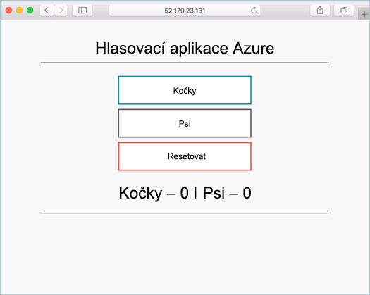

# <a name="run-applications-in-kubernetes"></a>Spuštění aplikace v Kubernetes

[!INCLUDE [aks-preview-redirect.md](../../../includes/aks-preview-redirect.md)]

V tomto kurzu součástí čtyři 7, vzorová aplikace je nasazený do clusteru s podporou Kubernetes. Dokončit krokům patří:

> [!div class="checklist"]
> * Soubory manifestu Kubernetes aktualizace
> * Spuštění aplikace v Kubernetes
> * Testování aplikace

V následujících kurzech této aplikace je škálovat na více systémů, aktualizovat, a Operations Management Suite konfigurované pro monitorování Kubernetes clusteru.

Tento kurz předpokládá základní znalosti o Kubernetes koncepty, podrobné informace o Kubernetes najdete [Kubernetes dokumentaci](https://kubernetes.io/docs/home/).

## <a name="before-you-begin"></a>Než začnete

V předchozí kurzy aplikace byla zabalené do kontejneru image, tuto bitovou kopii byl odeslán do registru kontejner Azure a Kubernetes cluster byla vytvořena. 

K dokončení tohoto kurzu, budete potřebovat předem vytvořené `azure-vote-all-in-one-redis.yml` Kubernetes soubor manifestu. Tento soubor byl stažen se zdrojovým kódem aplikace v předchozí kurzu. Ověřte, že máte klonovat úložiště a že jste změnili adresáře do klonovaný úložišti.

Pokud se ještě provést tyto kroky a chcete sledovat, vrátit [kurzu 1 – Vytvoření kontejneru image](./container-service-tutorial-kubernetes-prepare-app.md). 

## <a name="update-manifest-file"></a>Aktualizace souboru manifestu

V tomto kurzu jsou využívány Azure kontejneru registru (ACR) pro uložení image kontejneru. Než spustíte aplikaci, je třeba aktualizovat v souboru manifestu Kubernetes název ACR přihlášení serveru.

Získat název ACR přihlášení serveru s [az acr seznamu](/cli/azure/acr#list) příkaz.

```azurecli-interactive
az acr list --resource-group myResourceGroup --query "[].{acrLoginServer:loginServer}" --output table
```

Soubor manifestu musí být předem vytvořené s názvem serveru přihlášení `microsoft`. V každém textovém editoru otevřete soubor. V tomto příkladu je soubor otevřít s `vi`.

```bash
vi azure-vote-all-in-one-redis.yml
```

Nahraďte `microsoft` s název ACR přihlášení serveru. Tato hodnota je nalezen na řádku **47** souboru manifestu.

```yaml
containers:
- name: azure-vote-front
  image: microsoft/azure-vote-front:redis-v1
```

Uložte a zavřete soubor.

## <a name="deploy-application"></a>Nasazení aplikace

Pomocí příkazu [kubectl create](https://kubernetes.io/docs/user-guide/kubectl/v1.6/#create) spusťte aplikaci. Tento příkaz analyzuje souboru manifestu a vytvořit objekty definované Kubernetes.

```azurecli-interactive
kubectl create -f azure-vote-all-in-one-redis.yml
```

Výstup:

```bash
deployment "azure-vote-back" created
service "azure-vote-back" created
deployment "azure-vote-front" created
service "azure-vote-front" created
```

## <a name="test-application"></a>Testování aplikace

A [Kubernetes služby](https://kubernetes.io/docs/concepts/services-networking/service/) se vytvoří, který zpřístupňuje aplikace k Internetu. Tento proces může trvat několik minut. 

Pomocí příkazu [kubectl get service](https://review.docs.microsoft.com/en-us/azure/container-service/container-service-kubernetes-walkthrough?branch=pr-en-us-17681) s argumentem `--watch` můžete sledovat průběh.

```azurecli-interactive
kubectl get service azure-vote-front --watch
```

Standardně **externí IP** pro `azure-vote-front` služby se zobrazí jako `pending`. Jakmile externí IP adresu se změnil z hodnoty `pending` k `IP address`, použijte `CTRL-C` kubectl sledovat proces zastavíte.

```bash
NAME               CLUSTER-IP    EXTERNAL-IP   PORT(S)        AGE
azure-vote-front   10.0.42.158   <pending>     80:31873/TCP   1m
azure-vote-front   10.0.42.158   52.179.23.131 80:31873/TCP   2m
```

Informace o aplikaci, přejděte na externí IP adresu.



## <a name="next-steps"></a>Další kroky

V tomto kurzu aplikace Azure hlas nasazená do clusteru Azure Container Service Kubernetes. Dokončené úkoly patří:  

> [!div class="checklist"]
> * Stáhnout soubory manifestu Kubernetes
> * Spusťte aplikaci v Kubernetes
> * Testování aplikace

Přechodu na v dalším kurzu se dozvíte o škálování Kubernetes aplikace a podpůrné infrastruktuře Kubernetes. 

> [!div class="nextstepaction"]
> [Škálování Kubernetes aplikace a infrastrukturu](./container-service-tutorial-kubernetes-scale.md)