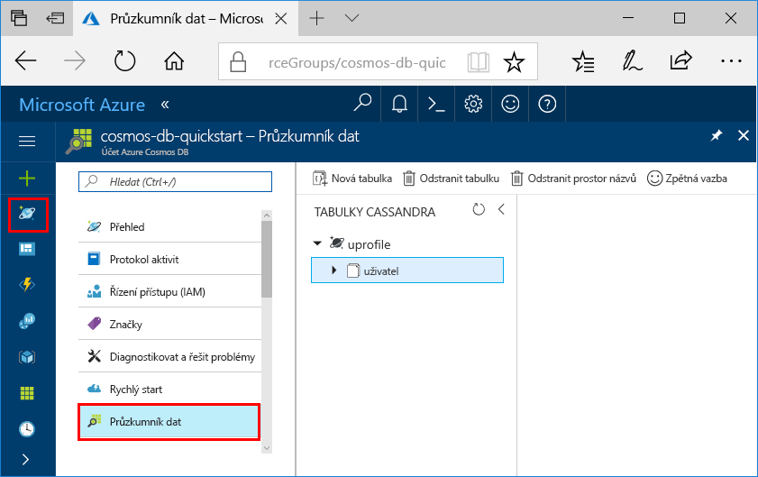

# <a name="quickstart-build-a-cassandra-app-with-nodejs-and-azure-cosmos-db"></a>Rychlý start: Sestavení aplikace Cassandra pomocí Node.js a Azure Cosmos DB

Tento rychlý start ukazuje, jak pomocí Node.js a rozhraní Azure Cosmos DB [Cassandra API](cassandra-introduction.md) sestavit aplikaci profilu naklonováním příkladu z GitHubu. Tento rychlý start vás také provede vytvořením účtu služby Azure Cosmos DB pomocí webu Azure Portal.

Azure Cosmos DB je globálně distribuovaná databázová služba Microsoftu pro více modelů. Můžete rychle vytvořit a dotazovat databáze dokumentů, párů klíč-hodnota a grafů, které tak můžou využívat výhody možnosti globální distribuce a horizontálního škálování v jádru služby Azure Cosmos DB. 

## <a name="prerequisites"></a>Požadavky

[!INCLUDE [quickstarts-free-trial-note](../../includes/quickstarts-free-trial-note.md)] Alternativně můžete [vyzkoušet službu Azure Cosmos DB zdarma](https://azure.microsoft.com/try/cosmosdb/) bez předplatného Azure, poplatků a závazků.

Přejděte k programu Azure Cosmos DB Cassandra API Preview. Pokud jste ještě nepožádali o přístup, [zaregistrujte se](cassandra-introduction.md#sign-up-now).

Navíc platí:
* [Node.js](https://nodejs.org/en/) verze 0.10.29 nebo vyšší
* [Git](http://git-scm.com/)

## <a name="create-a-database-account"></a>Vytvoření účtu databáze

Než budete moct vytvořit databázi dokumentů, je potřeba pomocí služby Azure Cosmos DB vytvořit účet Cassandra.

[!INCLUDE [cosmos-db-create-dbaccount-cassandra](../../includes/cosmos-db-create-dbaccount-cassandra.md)]

## <a name="clone-the-sample-application"></a>Klonování ukázkové aplikace

Teď naklonujeme aplikaci rozhraní Cassandra API z GitHubu, nastavíme připojovací řetězec a spustíme ji. Uvidíte, jak snadno se pracuje s daty prostřednictvím kódu programu. 

1. Otevřete okno terminálu Git, třeba Git Bash, a pomocí příkazu `cd` přejděte do složky, do které chcete nainstalovat ukázkovou aplikaci. 

    ```bash
    cd "C:\git-samples"
    ```

2. Ukázkové úložiště naklonujete spuštěním následujícího příkazu. Tento příkaz vytvoří na vašem počítači kopii ukázkové aplikace.

    ```bash
    git clone https://github.com/Azure-Samples/azure-cosmos-db-cassandra-nodejs-getting-started.git
    ```

## <a name="review-the-code"></a>Kontrola kódu

Tento krok je volitelný. Pokud chcete zjistit, jak se v kódu vytvářejí prostředky databáze, můžete si prohlédnout následující fragmenty kódu. Všechny fragmenty kódu pocházejí ze souboru `uprofile.js` ve složce C:\git-samples\azure-cosmos-db-cassandra-nodejs-getting-started. Jinak můžete přeskočit přímo k části [Aktualizace informací o připojení](#update-your-connection-string). 

* Uživatelské jméno a heslo se nastaví pomocí stránky připojovacího řetězce na webu Azure Portal. Cesta path\to\cert představuje cestu k certifikátu X509. 

   ```nodejs
   var ssl_option = {
        cert : fs.readFileSync("path\to\cert"),
        rejectUnauthorized : true,
        secureProtocol: 'TLSv1_2_method'
        };
   const authProviderLocalCassandra = new cassandra.auth.PlainTextAuthProvider(config.username, config.password);
   ```

* Inicializuje se proměnná `client` s informacemi contactPoint. Hodnota contactPoint se načte z webu Azure Portal.

    ```nodejs
    const client = new cassandra.Client({contactPoints: [config.contactPoint], authProvider: authProviderLocalCassandra, sslOptions:ssl_option});
    ```

* `client` se připojí k rozhraní Azure Cosmos DB Cassandra API.

    ```nodejs
    client.connect(next);
    ```

* Vytvoří se nový prostor klíčů.

    ```nodejs
    function createKeyspace(next) {
        var query = "CREATE KEYSPACE IF NOT EXISTS uprofile WITH replication = {\'class\': \'NetworkTopologyStrategy\', \'datacenter1\' : \'1\' }";
        client.execute(query, next);
        console.log("created keyspace");    
  }
    ```

* Vytvoří se nová tabulka.

   ```nodejs
   function createTable(next) {
    var query = "CREATE TABLE IF NOT EXISTS uprofile.user (user_id int PRIMARY KEY, user_name text, user_bcity text)";
        client.execute(query, next);
        console.log("created table");
   },
   ```

* Vloží se entity klíč-hodnota.

    ```nodejs
    ...
       {
          query: 'INSERT INTO  uprofile.user  (user_id, user_name , user_bcity) VALUES (?,?,?)',
          params: [5, 'IvanaV', 'Belgaum', '2017-10-3136']
        }
    ];
    client.batch(queries, { prepare: true}, next);
    ```

* Spustí se dotaz pro získání všech hodnot klíčů.

    ```nodejs
   var query = 'SELECT * FROM uprofile.user';
    client.execute(query, { prepare: true}, function (err, result) {
      if (err) return next(err);
      result.rows.forEach(function(row) {
        console.log('Obtained row: %d | %s | %s ',row.user_id, row.user_name, row.user_bcity);
      }, this);
      next();
    });
    ```  
    
* Spustí se dotaz pro získání páru klíč-hodnota.

    ```nodejs
    function selectById(next) {
        console.log("\Getting by id");
        var query = 'SELECT * FROM uprofile.user where user_id=1';
        client.execute(query, { prepare: true}, function (err, result) {
        if (err) return next(err);
            result.rows.forEach(function(row) {
            console.log('Obtained row: %d | %s | %s ',row.user_id, row.user_name, row.user_bcity);
        }, this);
        next();
        });
    }
    ```  

## <a name="update-your-connection-string"></a>Aktualizace připojovacího řetězce

Teď se vraťte zpátky na portál Azure Portal, kde najdete informace o připojovacím řetězci, a zkopírujte je do aplikace. Tím aplikaci umožníte komunikovat s hostovanou databází.

1. Na webu [Azure Portal](http://portal.azure.com/) klikněte na **Připojovací řetězec**. 

    Pomocí tlačítka  na pravé straně obrazovky zkopírujte horní hodnotu KONTAKTNÍ BOD.

    

2. Otevřete soubor `config.js`. 

3. Vložte hodnotu KONTAKTNÍ BOD z portálu místo `<FillMEIN>` na řádku 4.

    Řádek 4 by teď měl vypadat nějak takto: 

    `config.contactPoint = "cosmos-db-quickstarts.documents.azure.com:10350"`

4. Zkopírujte z portálu hodnotu UŽIVATELSKÉ JMÉNO a vložte ji místo `<FillMEIN>` na řádku 2.

    Řádek 2 by teď měl vypadat nějak takto: 

    `config.username = 'cosmos-db-quickstart';`
    
5. Zkopírujte z portálu hodnotu HESLO a vložte ji místo `<FillMEIN>` na řádku 3.

    Řádek 3 by teď měl vypadat nějak takto:

    `config.password = '2Ggkr662ifxz2Mg==';`

6. Uložte soubor config.js.
    
## <a name="use-the-x509-certificate"></a>Použití certifikátu X509 

1. Pokud potřebujete přidat certifikát Baltimore CyberTrust Root, jeho sériové číslo je 02:00:00:b9 a otisk SHA1 je d4🇩🇪20:d0:5e:66:fc:53:fe:1a:50:88:2c:78:db:28:52:ca:e4:74. Můžete ho stáhnout z adresy https://cacert.omniroot.com/bc2025.crt a uložit do místního souboru s příponou .cer. 

2. Otevřete soubor uprofile.js a změňte cestu path\to\cert tak, aby odkazovala na váš nový certifikát. 

3. Uložte soubor uprofile.js. 

## <a name="run-the-app"></a>Spuštění aplikace

1. V okně terminálu Git spusťte příkaz `npm install`, aby se nainstalovaly požadované moduly npm.

2. Spuštěním příkazu `node uprofile.js` spusťte aplikaci uzlu.

3. Na příkazovém řádku zkontrolujte očekávané výsledky.

    

    Stisknutím CTRL + C zastavte provádění programu a zavřete okno konzoly. 

    Teď můžete otevřít Průzkumníka dat na webu Azure Portal a zobrazit dotaz nebo provést úpravy a pracovat s těmito novými daty. 

     

## <a name="review-slas-in-the-azure-portal"></a>Ověření podmínek SLA na portálu Azure Portal

[!INCLUDE [cosmosdb-tutorial-review-slas](../../includes/cosmos-db-tutorial-review-slas.md)]

## <a name="clean-up-resources"></a>Vyčištění prostředků

[!INCLUDE [cosmosdb-delete-resource-group](../../includes/cosmos-db-delete-resource-group.md)]

## <a name="next-steps"></a>Další kroky

V tomto rychlém startu jsme se seznámili s postupem vytvoření účtu databáze Azure Cosmos, vytvoření kolekce pomocí Průzkumníka dat a spuštění aplikace. Teď můžete do účtu Cosmos DB importovat další data. 

> [!div class="nextstepaction"]
> [Import dat Cassandra do služby Azure Cosmos DB](cassandra-import-data.md)


