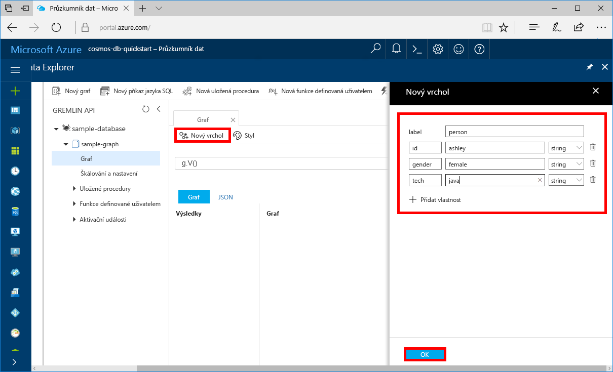
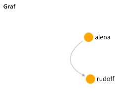

# <a name="azure-cosmos-db-create-a-graph-database-using-java-and-the-azure-portal"></a>Azure Cosmos DB: Vytvoření databáze grafu pomocí Javy a webu Azure Portal

Databáze Azure Cosmos je databázová služba Microsoftu s více modely použitelná v celosvětovém měřítku. Pomocí Azure Cosmos DB, můžete rychle vytvořit a dotaz spravovaného dokumentu, tabulku a graf databáze. 

Tento rychlý start vytvoří databázi jednoduché grafu pomocí nástroje Azure portálu pro Azure Cosmos DB. V tomto rychlém startu se také dozvíte, jak rychle vytvořit konzolovou aplikaci Java, která používá databázi grafu, pomocí ovladače OSS [Gremlin Java](https://mvnrepository.com/artifact/org.apache.tinkerpop/gremlin-driver). Pokyny v tomto rychlém startu platí pro všechny operační systémy, které podporují Javu. Tento rychlý start vás seznámí s vytvoření a úprava grafy v uživatelského rozhraní nebo prostřednictvím kódu programu, podle toho, co je vaši volbu. 

## <a name="prerequisites"></a>Požadavky
[!INCLUDE [quickstarts-free-trial-note](../../includes/quickstarts-free-trial-note.md)]

Navíc platí:

* [Java Development Kit (JDK) 1.7+](http://www.oracle.com/technetwork/java/javase/downloads/jdk8-downloads-2133151.html)
    * Na Ubuntu nainstalujte sadu JDK spuštěním příkazu `apt-get install default-jdk`.
    * Nezapomeňte nastavit proměnnou prostředí JAVA_HOME tak, aby odkazovala na složku, ve které je sada JDK nainstalovaná.
* [Stáhněte](http://maven.apache.org/download.cgi) a [nainstalujte](http://maven.apache.org/install.html) binární archiv [Maven](http://maven.apache.org/).
    * Na Ubuntu můžete Maven nainstalovat spuštěním příkazu `apt-get install maven`.
* [Git](https://www.git-scm.com/)
    * Na Ubuntu můžete Git nainstalovat spuštěním příkazu `sudo apt-get install git`.

## <a name="create-a-database-account"></a>Vytvoření účtu databáze

Než budete moct vytvořit databázi grafu, je potřeba pomocí služby Azure Cosmos DB vytvořit účet databáze Gremlin (Graph).

[!INCLUDE [cosmos-db-create-dbaccount-graph](../../includes/cosmos-db-create-dbaccount-graph.md)]

## <a name="add-a-graph"></a>Přidání grafu

Teď můžete pomocí nástroje Průzkumník dat na webu Azure Portal vytvořit databázi grafu. 

1. Klikněte na tlačítko **Průzkumníku dat** > **nový graf**.

    **Přidat graf** oblasti se zobrazí v pravém, budete muset přejděte přímo k jeho zobrazení.

    

2. V **přidat graf** zadejte nastavení pro nový graf.

    Nastavení|Navrhovaná hodnota|Popis
    ---|---|---
    ID databáze|sample-database|Zadejte *ukázkové databáze* jako název nové databáze. Názvy databází musí mít délku 1 až 255 znaků a nesmí obsahovat znaky `/ \ # ?` ani koncové mezery.
    ID grafu|sample-graph|Zadejte *Ukázka grafu* jako název nové kolekce. Názvy grafu mají stejné požadavky znak jako ID databáze.
    Kapacita úložiště|Pevná (10 GB)|Změňte hodnotu na **Fixed (10 GB)**. Tato hodnota je kapacita úložiště databáze.
    Propustnost|400 RU/s|Změňte propustnosti na 400 jednotek žádosti za sekundu (RU/s). Pokud budete chtít snížit latenci, můžete propustnost později navýšit.
    Klíč oddílu|Ponechte prázdné|Pro účely tohoto rychlého startu ponechte klíč oddílu prázdný.

3. Po vyplnění formuláře klikněte na **OK**.

## <a name="clone-the-sample-application"></a>Klonování ukázkové aplikace

Teď přejděme k práci s kódem. Pojďme klonovat rozhraní Graph API aplikace z Githubu, nastavení připojovacího řetězce a potom ho spusťte. Přesvědčíte se, jak snadno se pracuje s daty prostřednictvím kódu programu.  

1. Otevřete okno terminálu git, jako je například git bash a použít `cd` příkaz Přejít do složky pro instalaci ukázkové aplikace.  

    ```bash
    cd "C:\git-samples"
    ```

2. Ukázkové úložiště naklonujete spuštěním následujícího příkazu. Tento příkaz vytvoří kopii ukázková aplikace ve vašem počítači. 

    ```bash
    git clone https://github.com/Azure-Samples/azure-cosmos-db-graph-java-getting-started.git
    ```

## <a name="review-the-code"></a>Kontrola kódu

Tento krok je volitelný. Pokud vás zajímá učení vytváření databázových prostředků v kódu, můžete zkontrolovat následující fragmenty kódu. Fragmenty kódu jsou převzaty z `Program.java` soubor ve složce C:\git-samples\azure-cosmos-db-graph-java-getting-started\src\GetStarted. Jinak, můžete přeskočit na [aktualizovat připojovací řetězec](#update-your-connection-string). 

* Inicializuje se konzola Gremlin `Client` z konfigurace v nástroji `src/remote.yaml`.

    ```java
    cluster = Cluster.build(new File("src/remote.yaml")).create();
    ...
    client = cluster.connect();
    ```

* Pomocí metody `client.submit` se provede série kroků konzoly Gremlin.

    ```java
    ResultSet results = client.submit(gremlin);

    CompletableFuture<List<Result>> completableFutureResults = results.all();
    List<Result> resultList = completableFutureResults.get();

    for (Result result : resultList) {
        System.out.println(result.toString());
    }
    ```

## <a name="update-your-connection-information"></a>Aktualizovat informace o připojení

Nyní přejděte zpět na portálu Azure, pokud chcete získat informace o připojení a zkopírujte jej do aplikace. Tato nastavení Povolit aplikaci ke komunikaci s vaší hostované databází.

1. V [portál Azure](http://portal.azure.com/), klikněte na tlačítko **klíče**. 

    Zkopírujte jeho první část hodnota identifikátoru URI.

    
2. Otevřete soubor src/remote.yaml a vložit hodnotu přes `$name$` v `hosts: [$name$.graphs.azure.com]`.

    Řádek 1 remote.yaml by teď měl vypadat podobně jako 

    `hosts: [test-graph.graphs.azure.com]`

3. Na portálu Azure použijte tlačítko Kopírovat zkopírujte primární klíč a vložte ji přes `$masterKey$` v `password: $masterKey$`.

    Řádek 4 remote.yaml by teď měl vypadat podobně jako 

    `password: 2Ggkr662ifxz2Mg==`

4. Změňte řádek 3 remote.yaml z

    `username: /dbs/$database$/colls/$collection$`

    na 

    `username: /dbs/sample-database/colls/sample-graph`

5. Uložte soubor remote.yaml.

## <a name="run-the-console-app"></a>Spuštění aplikace konzoly

1. V okně terminálu Git přejděte příkazem `cd` do složky azure-cosmos-db-graph-java-getting-started folder.

    ```git
    cd "C:\git-samples\azure-cosmos-db-graph-java-getting-started"
    ```

2. V okně terminálu Git zadejte `mvn package`, aby se nainstalovaly požadované balíčky Java.

3. V okně terminálu git spustit `mvn exec:java -D exec.mainClass=GetStarted.Program` spuštění aplikace v jazyce Java.

    V okně terminálu se zobrazí vrcholy, které se přidávají do grafu. Jakmile program zastaví, přepněte zpět na portálu Azure v internetovém prohlížeči. 

<a id="add-sample-data"></a>
## <a name="review-and-add-sample-data"></a>Kontrola a přidání ukázkových dat

Teď můžete přejít zpět do Průzkumníku dat a zobrazit vrcholy přidané do grafu a přidat další datové body.

1. Klikněte na tlačítko **Průzkumníku dat**, rozbalte položku **Ukázka grafu**, klikněte na tlačítko **grafu**a potom klikněte na **použít filtr**. 

   

2. V seznamu **Výsledky** si všimněte nových uživatelů přidaných do grafu. Vyberte uživatele **ben** a všimněte si, že je propojený s uživatelem robin. Můžete přesunout vrcholy kolem přetahováním myší, přiblížení a oddálení posouváním kolečka myši a zvětšení velikosti grafu s dvojitou šipkou. 

   

3. Umožňuje přidat několik nových uživatelů. Klikněte na tlačítko **Nový vrchol** a přidejte do grafu data.

   

4. Zadejte popisek z *osoba*.

5. Klikněte na tlačítko **přidat vlastnost** přidat každý z následujících vlastností. Všimněte si, že pro každou osobu v grafu můžete vytvořit jedinečné vlastnosti. Vyžaduje se pouze klíč id.

    key|hodnota|Poznámky
    ----|----|----
    id|ashley|Jedinečný identifikátor pro vrchol. Pokud identifikátor nezadáte, vygeneruje se pro vás.
    gender (pohlaví)|female (žena)| 
    tech (technologie) | java | 

    > [!NOTE]
    > V tomto rychlém startu vytváříme kolekci bez oddílů. Pokud však vytvoříte dělenou kolekci zadáním klíče oddílu při vytváření kolekce, pak každý nový vrchol bude muset zahrnovat klíč oddílu jako klíč. 

6. Klikněte na **OK**. Možná bude nutné zvětšit obrazovku, aby se tlačítko **OK** zobrazilo v dolní části obrazovky.

7. Znovu klikněte na **Nový vrchol** a přidejte dalšího nového uživatele. 

8. Zadejte popisek z *osoba*.

9. Klikněte na tlačítko **přidat vlastnost** přidat každý z následujících vlastností:

    key|hodnota|Poznámky
    ----|----|----
    id|rakesh|Jedinečný identifikátor pro vrchol. Pokud identifikátor nezadáte, vygeneruje se pro vás.
    gender (pohlaví)|male (muž)| 
    school (škola)|MIT| 

10. Klikněte na **OK**. 

11. Klikněte na tlačítko **použít filtr** s výchozím `g.V()` filtr pro zobrazení všech hodnot v grafu. Teď se v seznamu **Výsledky** zobrazí všichni uživatelé. 

    S přidáváním dalších dat můžete pomocí filtrů omezit výsledky. Ve výchozím Průzkumníku dat používá `g.V()` načíst všechny vrcholy grafu. Můžete ji změnit na jiný [grafu dotazu](tutorial-query-graph.md), jako například `g.V().count()`, která vrátí počet všechny vrcholy v grafu ve formátu JSON. Pokud jste změnili filtr, změna filtru zpět do `g.V()` a klikněte na tlačítko **použít filtr** znovu zobrazit všechny výsledky.

12. Teď můžeme propojit uživatele rakesh a ashley. Ujistěte se, že v seznamu **Výsledky** je vybraný uživatel **ashley**, a potom klikněte na tlačítko Upravit vedle položky **Cíle** vpravo dole. Možná budete muset rozšířit okno, aby se zobrazila oblast **Vlastnosti**.

   

13. V **cíl** zadejte *rakesh*a v **Edge popisek** zadejte *zná*a potom klikněte na kontrolu.

   

14. Teď vyberte ze seznamu výsledků uživatele **rakesh** a zobrazí se propojení mezi uživateli ashley a rakesh. 

   

   Která se dokončí vytváření prostředků součást v tomto kurzu. Můžete přidat bodů uchycení do grafu, upravte existující bodů uchycení nebo změnit dotazy. Nyní Pojďme zkontrolujte metriky Azure Cosmos DB poskytuje a pak prostředky vyčistit. 

## <a name="review-slas-in-the-azure-portal"></a>Ověření smluv SLA na webu Azure Portal

[!INCLUDE [cosmosdb-tutorial-review-slas](../../includes/cosmos-db-tutorial-review-slas.md)]

## <a name="clean-up-resources"></a>Vyčištění prostředků

[!INCLUDE [cosmosdb-delete-resource-group](../../includes/cosmos-db-delete-resource-group.md)]

## <a name="next-steps"></a>Další kroky

V tomto rychlém startu jste se seznámili s postupem vytvoření účtu databáze Azure Cosmos, vytvoření grafu pomocí Průzkumníku dat a spuštění aplikace. Teď můžete pomocí konzoly Gremlin vytvářet složitější dotazy a implementovat účinnou logiku procházení grafů. 

> [!div class="nextstepaction"]
> [Dotazování pomocí konzoly Gremlin](tutorial-query-graph.md)

