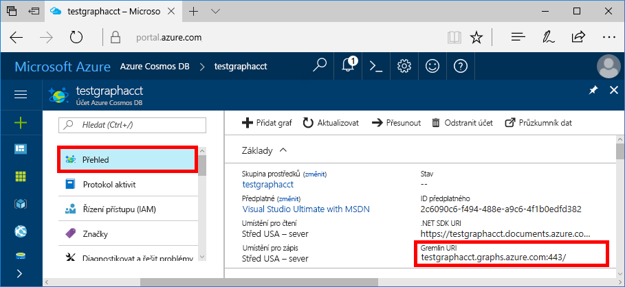

# <a name="azure-cosmos-db-build-a-nodejs-application-by-using-graph-api"></a>Databáze Azure Cosmos: Vytvoření aplikace Node.js využitím rozhraní Graph API

Azure Cosmos DB je globálně distribuovaná databázová služba pro více modelů od Microsoftu. Můžete snadno vytvořit a dotazovat databáze dotazů, klíčů/hodnot a grafů, které tak můžou využívat výhody použitelnosti v celosvětovém měřítku a možností horizontálního škálování v jádru databáze Azure Cosmos. 

Tento rychlý start popisuje způsob vytvoření účtu rozhraní [Graph API](graph-introduction.md) služby Azure Cosmos DB, databáze a grafu pomocí webu Azure Portal. Potom sestavíte a spustíte aplikaci konzoly pomocí opensourcového ovladače [Gremlin Node.js](https://www.npmjs.com/package/gremlin).

## <a name="prerequisites"></a>Požadavky

Než budete moct tuto ukázku spustit, je potřeba splnit následující požadavky:
* [Node.js](https://nodejs.org/en/) verze 0.10.29 nebo novější
* [Git](http://git-scm.com/)

[!INCLUDE [quickstarts-free-trial-note](../../includes/quickstarts-free-trial-note.md)]

## <a name="create-a-database-account"></a>Vytvoření účtu databáze

[!INCLUDE [cosmos-db-create-dbaccount-graph](../../includes/cosmos-db-create-dbaccount-graph.md)]

## <a name="add-a-graph"></a>Přidání grafu

[!INCLUDE [cosmos-db-create-graph](../../includes/cosmos-db-create-graph.md)]

## <a name="clone-the-sample-application"></a>Klonování ukázkové aplikace

Teď naklonujeme aplikaci rozhraní Graph API z GitHubu, nastavíme připojovací řetězec a spustíme ji. Přesvědčíte se, jak snadno se pracuje s daty prostřednictvím kódu programu. 

1. Otevřete okno terminálu Git, jako je třeba Git Bash, a pomocí příkazu `cd` změňte pracovní adresář.

2. Spusťte následující příkaz a naklonujte ukázkové úložiště: 

    ```bash
    git clone https://github.com/Azure-Samples/azure-cosmos-db-graph-nodejs-getting-started.git
    ```

3. Otevřete soubor řešení v sadě Visual Studio. 

## <a name="review-the-code"></a>Kontrola kódu

Ještě jednou se stručně podívejme na to, co se v aplikaci děje. Otevřete soubor `app.js` a uvidíte následující řádky kódu. 

* Vytvoří se klient Gremlin.

    ```nodejs
    const client = Gremlin.createClient(
        443, 
        config.endpoint, 
        { 
            "session": false, 
            "ssl": true, 
            "user": `/dbs/${config.database}/colls/${config.collection}`,
            "password": config.primaryKey
        });
    ```

  Všechny konfigurace jsou v souboru `config.js`, kterou budeme upravovat v [následující části](#update-your-connection-string).

* Definuje se série funkcí pro provádění různých operací Gremlin. Toto je jedna z nich:

    ```nodejs
    function addVertex1(callback)
    {
        console.log('Running Add Vertex1'); 
        client.execute("g.addV('person').property('id', 'thomas').property('firstName', 'Thomas').property('age', 44).property('userid', 1)", { }, (err, results) => {
          if (err) callback(console.error(err));
          console.log("Result: %s\n", JSON.stringify(results));
          callback(null)
        });
    }
    ```

* Každá funkce provádí metodu `client.execute` s parametrem řetězce dotazu Gremlin. Tady je příklad provedení metody `g.V().count()`:

    ```nodejs
    console.log('Running Count'); 
    client.execute("g.V().count()", { }, (err, results) => {
        if (err) return console.error(err);
        console.log(JSON.stringify(results));
        console.log();
    });
    ```

* Na konci souboru se pak pomocí metody `async.waterfall()` vyvolají všechny metody. Ta je provede jednu po druhé:

    ```nodejs
    try{
        async.waterfall([
            dropGraph,
            addVertex1,
            addVertex2,
            addEdge,
            countVertices
            ], finish);
    } catch(err) {
        console.log(err)
    }
    ```


## <a name="update-your-connection-string"></a>Aktualizace připojovacího řetězce

1. Otevřete soubor config.js. 

2. V souboru config.js vyplňte jako klíč `config.endpoint` hodnotu **Gremlin URI** ze stránky **Přehled** na webu Azure Portal. 

    `config.endpoint = "GRAPHENDPOINT";`

    

   Pokud je hodnota **Gremlin URI** prázdná, můžete hodnotu vygenerovat na stránce **Klíče** na portálu. Použijte hodnotu **URI**, odeberte https:// a změňte documents na gremlin.cosmosdb. Pokud se účet databáze grafů vytvořil před 20. prosincem 2017, změňte documents na graphs. 

   Koncový bod Gremlin musí být pouze název hostitele bez protokolu / čísla portu, jako je `mygraphdb.gremlin.cosmosdb.azure.com` (ne `https://mygraphdb.gremlin.cosmosdb.azure.com` nebo `mygraphdb.gremlin.cosmosdb.azure.com:433`).

3. V souboru config.js vyplňte jako hodnotu config.primaryKey hodnotu **Primární klíč** ze stránky **Klíče** na webu Azure Portal. 

    `config.primaryKey = "PRIMARYKEY";`

   

4. Zadejte název databáze a název grafu (kontejneru) pro hodnoty config.database a config.collection. 

Tady je příklad, jak by dokončený soubor config.js měl vypadat:

```nodejs
var config = {}

// Note that this must not have HTTPS or the port number
config.endpoint = "testgraphacct.gremlin.cosmosdb.azure.com";
config.primaryKey = "Pams6e7LEUS7LJ2Qk0fjZf3eGo65JdMWHmyn65i52w8ozPX2oxY3iP0yu05t9v1WymAHNcMwPIqNAEv3XDFsEg==";
config.database = "graphdb"
config.collection = "Persons"

module.exports = config;
```

## <a name="run-the-console-app"></a>Spuštění aplikace konzoly

1. Otevřete okno terminálu a přejděte (pomocí příkazu `cd`) do instalačního adresáře pro soubor package.json, který je zahrnutý v projektu.

2. Abyste nainstalovali požadované moduly npm, včetně `gremlin`, spusťte příkaz `npm install`.

3. Spuštění v terminálu `node app.js`, aby se spustila aplikace uzlu.

## <a name="browse-with-data-explorer"></a>Procházení pomocí Průzkumníku dat

Teď se můžete vrátit do Průzkumníku dat na webu Azure Portal, kde můžete zobrazit, upravit a pracovat s novými daty grafu a zadávat na ně dotazy.

V Průzkumníku dat se nová databáze zobrazí v podokně **Graphs** (Grafy). Rozbalte databázi, potom kolekci a vyberte **Graph**.

Data generovaná ukázkovou aplikací se zobrazí v dalším podokně na kartě **Graph**, když vyberete **Použít filtr**.

Zkuste filtr otestovat provedením metody `g.V()` s hodnotami `.has('firstName', 'Thomas')`. Nezapomeňte, že se v hodnotě rozlišují malá a velká písmena.

## <a name="review-slas-in-the-azure-portal"></a>Ověření podmínek SLA na portálu Azure Portal

[!INCLUDE [cosmosdb-tutorial-review-slas](../../includes/cosmos-db-tutorial-review-slas.md)]

## <a name="clean-up-your-resources"></a>Vyčištění prostředků

Pokud neplánujete tuto aplikaci dál používat, odstraňte následujícím způsobem všechny prostředky, které jste pomocí tohoto článku vytvořili: 

1. Na webu Azure Portal v navigační nabídce vlevo vyberte **Skupiny prostředků**. Pak vyberte název prostředku, který jste vytvořili. 

2. Na stránce vaší skupiny prostředků vyberte **Odstranit**. Zadejte název prostředku k odstranění a vyberte **Odstranit**.

## <a name="next-steps"></a>Další kroky

V tomto článku jste se seznámili s postupem vytvoření účtu služby Azure Cosmos DB, vytvoření grafu pomocí Průzkumníku dat a spuštění aplikace. Teď můžete pomocí konzoly Gremlin vytvářet složitější dotazy a implementovat účinnou logiku procházení grafů. 

> [!div class="nextstepaction"]
> [Dotazování pomocí konzoly Gremlin](tutorial-query-graph.md)
