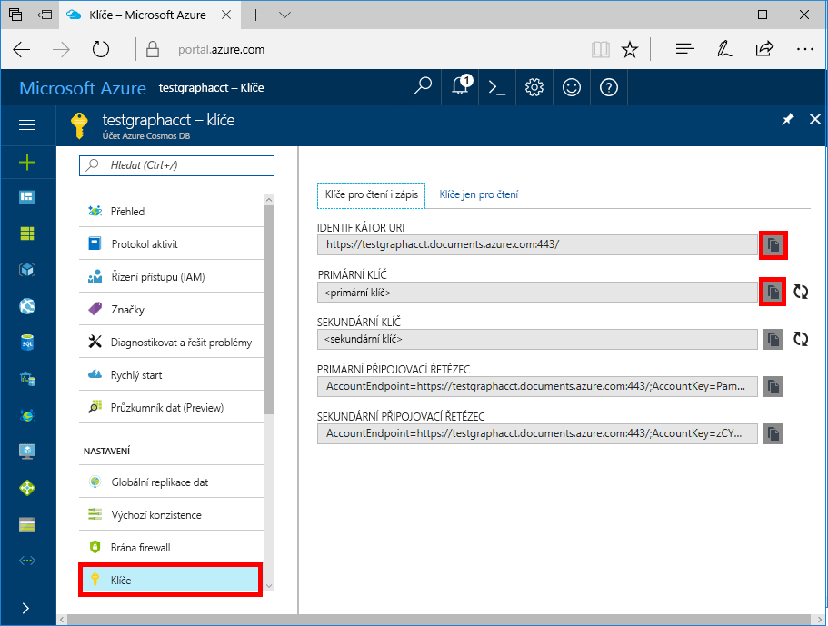

# Databáze Azure Cosmos: Vytvoření aplikace Node.js využitím rozhraní Graph API
<a id="azure-cosmos-db-build-a-nodejs-application-by-using-graph-api" class="xliff"></a>

Azure Cosmos DB je globálně distribuovaná databázová služba pro více modelů od Microsoftu. Můžete snadno vytvořit a dotazovat databáze dotazů, klíčů/hodnot a grafů, které tak můžou využívat výhody použitelnosti v celosvětovém měřítku a možností horizontálního škálování v jádru Azure Cosmos DB. 

Tento článek rychlého zprovoznění popisuje způsob vytvoření účtu služby Azure Cosmos DB pro rozhraní Graph API (verze Preview), databáze a grafu pomocí webu Azure Portal. Potom sestavíte a spustíte aplikaci konzoly pomocí opensourcového ovladače [Gremlin Node.js](https://www.npmjs.com/package/gremlin-secure).  

> [!NOTE]
> Modul npm `gremlin-secure` je upravenou verzí modulu `gremlin` s podporou rozhraní SSL a SASL potřebného pro připojení k databázi Azure Cosmos. Zdrojový kód je k dispozici na [GitHubu](https://github.com/CosmosDB/gremlin-javascript).
>

## Požadavky
<a id="prerequisites" class="xliff"></a>

Než budete moct tuto ukázku spustit, je potřeba splnit následující požadavky:
* [Node.js](https://nodejs.org/en/) verze 0.10.29 nebo novější
* [Git](http://git-scm.com/)

[!INCLUDE [quickstarts-free-trial-note](../../includes/quickstarts-free-trial-note.md)]

## Vytvoření účtu databáze
<a id="create-a-database-account" class="xliff"></a>

[!INCLUDE [cosmos-db-create-dbaccount-graph](../../includes/cosmos-db-create-dbaccount-graph.md)]

## Přidání grafu
<a id="add-a-graph" class="xliff"></a>

[!INCLUDE [cosmos-db-create-graph](../../includes/cosmos-db-create-graph.md)]

## Klonování ukázkové aplikace
<a id="clone-the-sample-application" class="xliff"></a>

Teď naklonujeme aplikaci rozhraní Graph API z GitHubu, nastavíme připojovací řetězec a spustíme ji. Přesvědčíte se, jak snadno se pracuje s daty prostřednictvím kódu programu. 

1. Otevřete okno terminálu Git, jako je třeba Git Bash, a pomocí příkazu `cd` změňte pracovní adresář.  

2. Ukázkové úložiště naklonujete spuštěním následujícího příkazu. 

    ```bash
    git clone https://github.com/Azure-Samples/azure-cosmos-db-graph-nodejs-getting-started.git
    ```

3. Otevřete soubor řešení v sadě Visual Studio. 

## Kontrola kódu
<a id="review-the-code" class="xliff"></a>

Ještě jednou se stručně podívejme na to, co se v aplikaci děje. Po otevření souboru `app.js` uvidíte následující řádky kódu. 

* Vytvoří se klient Gremlin.

    ```nodejs
    const client = Gremlin.createClient(
        443, 
        config.endpoint, 
        { 
            "session": false, 
            "ssl": true, 
            "user": `/dbs/${config.database}/colls/${config.collection}`,
            "password": config.primaryKey
        });
    ```

  Všechny konfigurace jsou v aplikaci `config.js`, kterou budeme upravovat v následující části.

* Pomocí metody `client.execute` se provede série kroků konzoly Gremlin.

    ```nodejs
    console.log('Running Count'); 
    client.execute("g.V().count()", { }, (err, results) => {
        if (err) return console.error(err);
        console.log(JSON.stringify(results));
        console.log();
    });
    ```

## Aktualizace připojovacího řetězce
<a id="update-your-connection-string" class="xliff"></a>

Teď se vraťte zpátky na portál Azure Portal, kde najdete informace o připojovacím řetězci, a zkopírujte je do aplikace.

1. Na portálu [Azure Portal](http://portal.azure.com/) klikněte v účtu Azure Cosmos DB v levé navigační nabídce na **Klíče** a potom klikněte na **Klíče pro čtení i zápis**. V dalším kroku zkopírujete pomocí tlačítek kopírování vpravo identifikátor URI a primární klíč do souboru `app.js`.

    

2. Z portálu zkopírujte hodnotu identifikátoru Gremlin URI (pomocí tlačítka kopírování) a nastavte ji jako hodnotu klíče `config.endpoint` v souboru config.js. Koncový bod Gremlin musí být pouze název hostitele bez protokolu / čísla portu, jako je `mygraphdb.graphs.azure.com` (ne `https://mygraphdb.graphs.azure.com` nebo `mygraphdb.graphs.azure.com:433`).

    `config.endpoint = "GRAPHENDPOINT";`

3. Zkopírujte z portálu hodnotu primárního klíče a nastavte ji jako hodnotu config.primaryKey v souboru config.js. Teď jste aktualizovali aplikaci a zadali do ní všechny informace potřebné ke komunikaci s databází Azure Cosmos. 

    `config.primaryKey = "PRIMARYKEY";`

4. Zadejte název databáze a název grafu (kontejneru) pro hodnoty config.database a config.collection. 

Tady je příklad, jak by dokončený soubor config.js měl vypadat:

```nodejs
var config = {}

// Note that this must not have HTTPS or the port number
config.endpoint = "mygraphdb.graphs.azure.com";
config.primaryKey = "OjlhK6tjxfSXyKtrmCiM9O6gQQgu5DmgAoauzD1PdPIq1LZJmILTarHvrolyUYOB0whGQ4j21rdAFwoYep7Kkw==";
config.database = "graphdb"
config.collection = "Persons"

module.exports = config;
```

## Spuštění aplikace konzoly
<a id="run-the-console-app" class="xliff"></a>

1. Otevřete okno terminálu a přejděte (pomocí příkazu `cd`) do instalačního adresáře pro soubor package.json, který je zahrnutý v projektu.  

2. Abyste nainstalovali požadované moduly npm, včetně `gremlin-secure`, spusťte příkaz `npm install`.

3. Spuštění v terminálu `node app.js`, aby se spustila aplikace uzlu.

## Procházení pomocí Průzkumníku dat
<a id="browse-with-data-explorer" class="xliff"></a>

Teď se můžete vrátit do Průzkumníku dat na webu Azure Portal, kde můžete zobrazit, upravit a pracovat s novými daty grafu a zadávat na ně dotazy.

V Průzkumníku dat se nová databáze zobrazí v podokně **Kolekce**. Rozbalte položky **graphdb** a **graphcoll** a potom klikněte na **Graph** (Graf).

V podokně **Grafy** se zobrazí data vygenerovaná ukázkovou aplikací.

## Ověření smluv SLA na webu Azure Portal
<a id="review-slas-in-the-azure-portal" class="xliff"></a>

[!INCLUDE [cosmosdb-tutorial-review-slas](../../includes/cosmos-db-tutorial-review-slas.md)]

## Vyčištění prostředků
<a id="clean-up-your-resources" class="xliff"></a>

Pokud neplánujete tuto aplikaci dál používat, odstraňte následujícím způsobem všechny prostředky, které jste pomocí tohoto článku vytvořili: 

1. V navigační nabídce vlevo na portálu Azure Portal klikněte na **Skupiny prostředků** a pak klikněte na název vytvořeného prostředku. 
2. Na stránce skupiny prostředků klikněte na **Odstranit**, zadejte název prostředku, který chcete odstranit, a pak klikněte na **Odstranit**.

## Další kroky
<a id="next-steps" class="xliff"></a>

V tomto článku jste se seznámili s postupem vytvoření účtu databáze Azure Cosmos, vytvoření grafu pomocí Průzkumníku dat a spuštění aplikace. Teď můžete pomocí konzoly Gremlin vytvářet složitější dotazy a implementovat účinnou logiku procházení grafů. 

> [!div class="nextstepaction"]
> [Dotazování pomocí konzoly Gremlin](tutorial-query-graph.md)

