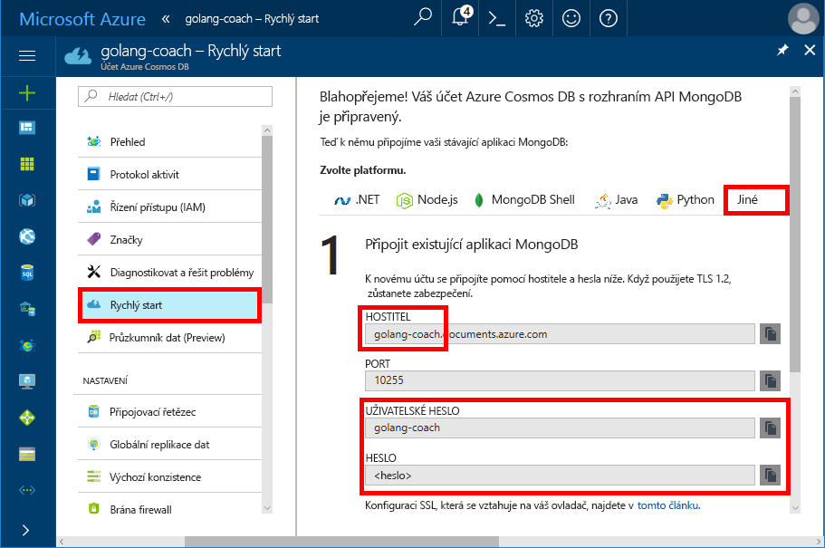
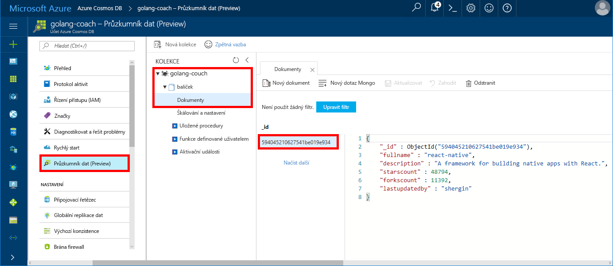

<a id="azure-cosmos-db-build-a-mongodb-api-console-app-with-golang-and-the-azure-portal" class="xliff"></a>

# Azure Cosmos DB: Sestavení aplikace konzoly v jazyce Go s rozhraním API MongoDB na webu Azure Portal

Databáze Azure Cosmos je databázová služba Microsoftu s více modely použitelná v celosvětovém měřítku. Můžete snadno vytvořit a dotazovat databáze dotazů, klíčů/hodnot a grafů, které tak můžou využívat výhody použitelnosti v celosvětovém měřítku a možností horizontálního škálování v jádru Azure Cosmos DB.

Tento rychlý start popisuje způsob použití stávající aplikace [MongoDB](https://docs.microsoft.com/en-us/azure/cosmos-db/mongodb-introduction) napsané v jazyce [Go](https://golang.org/) a připojení k databázi Azure Cosmos DB, která podporuje připojení klienta MongoDB.

Jinými slovy: aplikace v jazyce Go ví pouze to, že se připojuje k databázi pomocí rozhraní API MongoDB. V aplikaci se transparentně zobrazuje, že data jsou uložena ve službě Azure Cosmos DB.

<a id="prerequisites" class="xliff"></a>

## Požadavky

- Předplatné Azure. Pokud ještě nemáte předplatné Azure, vytvořte si [bezplatný účet](https://azure.microsoft.com/free) před tím, než začnete.
- [Go](https://golang.org/dl/) a základní znalost jazyka [Go](https://golang.org/).
- Integrované vývojové prostředí – [Gogland](https://www.jetbrains.com/go/) od JetBrains, [Visual Studio Code](https://code.visualstudio.com/) od Microsoftu nebo [Atom](https://atom.io/). V tomto kurzu používáme Gogland.

<a id="create-account"></a>
<a id="create-a-database-account" class="xliff"></a>

## Vytvoření účtu databáze

[!INCLUDE [cosmos-db-create-dbaccount](../../includes/cosmos-db-create-dbaccount-mongodb.md)]

<a id="clone-the-sample-application" class="xliff"></a>

## Klonování ukázkové aplikace

Naklonujte ukázkovou aplikaci a nainstalujte požadované balíčky.

1. Vytvořte složku s názvem CosmosDBSample ve složce GOROOT\src, což je ve výchozím nastavení C:\Go\.
2. V okně terminálu Git, jako je třeba Git Bash, spusťte následující příkaz, který naklonuje ukázkové úložiště do složky CosmosDBSample. 

    ```bash
    git clone https://github.com/Azure-Samples/azure-cosmos-db-mongodb-golang-getting-started.git
    ```
3.  Spuštěním následujícího příkazu získejte balíček mgo. 

    ```
    go get gopkg.in/mgo.v2
    ```

Ovladač [mgo](http://labix.org/mgo) (vyslovuje se jako *mango*) je ovladač [MongoDB](http://www.mongodb.org/) pro [jazyk Go](http://golang.org/), který implementuje bohatý a dobře otestovaný výběr funkcí v rámci velmi jednoduchého rozhraní API s využitím standardních frází jazyka Go.

<a id="connection-string"></a>

<a id="update-your-connection-string" class="xliff"></a>

## Aktualizace připojovacího řetězce

Teď se vraťte zpátky na web Azure Portal, kde najdete informace o připojovacím řetězci, a zkopírujte je do aplikace.

1. Informace o připojovacím řetězci požadované aplikací v jazyce Go zobrazíte tak, že v navigační nabídce vlevo kliknete na **Rychlý start** a pak na **Jiné**.

2. V prostředí Gogland otevřete soubor main.go v adresáři GOROOT\CosmosDBSample a aktualizujte následující řádky kódu s použitím informací o připojovacím řetězci z webu Azure Portal, jak je znázorněno na následujícím snímku obrazovky. 

    Název databáze je předpona hodnoty **Hostitel** v podokně připojovacího řetězce na webu Azure Portal. Pro účet znázorněný v obrázku níže je název databáze golang-coach.

    ```go
    Database: "The prefix of the Host value in the Azure portal",
    Username: "The Username in the Azure portal",
    Password: "The Password in the Azure portal",
    ```

    

3. Uložte soubor main.go.

<a id="review-the-code" class="xliff"></a>

## Kontrola kódu

Ještě jednou se stručně podívejme na to, co se v souboru main.go děje. 

<a id="connecting-the-go-app-to-azure-cosmos-db" class="xliff"></a>

### Připojení aplikace v jazyce Go ke službě Azure Cosmos DB

Azure Cosmos DB podporuje MongoDB s povoleným protokolem SSH. Pokud se chcete připojit k MongoDB s povoleným protokolem SSH, je potřeba ve třídě [mgo.DialInfo](http://gopkg.in/mgo.v2#DialInfo) definovat funkci **DialServer** a pomocí funkce [tls.*Dial*](http://golang.org/pkg/crypto/tls#Dial) provést připojení.

Následující fragment kódu jazyka Go připojí aplikaci v jazyce Go pomocí rozhraní API MongoDB pro Azure Cosmos DB. Třída *DialInfo* obsahuje možnosti pro vytvoření relace s clusterem MongoDB.

```go
// DialInfo holds options for establishing a session with a MongoDB cluster.
dialInfo := &mgo.DialInfo{
    Addrs:    []string{"golang-couch.documents.azure.com:10255"}, // Get HOST + PORT
    Timeout:  60 * time.Second,
    Database: "golang-coach", // It can be anything
    Username: "golang-coach", // Username
    Password: "Azure database connect password from Azure Portal", // PASSWORD
    DialServer: func(addr *mgo.ServerAddr) (net.Conn, error) {
        return tls.Dial("tcp", addr.String(), &tls.Config{})
    },
}

// Create a session which maintains a pool of socket connections
// to our Azure Cosmos DB MongoDB database.
session, err := mgo.DialWithInfo(dialInfo)

if err != nil {
    fmt.Printf("Can't connect to mongo, go error %v\n", err)
    os.Exit(1)
}

defer session.Close()

// SetSafe changes the session safety mode.
// If the safe parameter is nil, the session is put in unsafe mode, 
// and writes become fire-and-forget,
// without error checking. The unsafe mode is faster since operations won't hold on waiting for a confirmation.
// 
session.SetSafe(&mgo.Safe{})
```

Metoda **mgo.Dial()** se používá v případě, že není k dispozici připojení SSL. Pro připojení SSL se vyžaduje metoda **mgo.DialWithInfo()**.

Instance objektu **DialWIthInfo{}** slouží k vytvoření objektu relace. Po vytvoření relace můžete je kolekci přistupovat pomocí následujícího fragmentu kódu:

```go
collection := session.DB(“golang-couch”).C(“package”)
```

<a id="create-document"></a>

<a id="create-a-document" class="xliff"></a>

### Vytvoření dokumentu

```go
// Model
type Package struct {
    Id bson.ObjectId  `bson:"_id,omitempty"`
    FullName      string
    Description   string
    StarsCount    int
    ForksCount    int
    LastUpdatedBy string
}

// insert Document in collection
err = collection.Insert(&Package{
    FullName:"react",
    Description:"A framework for building native apps with React.",
    ForksCount: 11392,
    StarsCount:48794,
    LastUpdatedBy:"shergin",

})

if err != nil {
    log.Fatal("Problem inserting data: ", err)
    return
}
```

<a id="query-or-read-a-document" class="xliff"></a>

### Dotazování nebo čtení dokumentu

Azure Cosmos DB podporuje bohaté dotazy na dokumenty JSON uložené v každé z kolekcí. Následující ukázka kódu obsahuje dotaz, který je možné spustit proti dokumentům v kolekci.

```go
// Get a Document from the collection
result := Package{}
err = collection.Find(bson.M{"fullname": "react"}).One(&result)
if err != nil {
    log.Fatal("Error finding record: ", err)
    return
}

fmt.Println("Description:", result.Description)
```


<a id="update-a-document" class="xliff"></a>

### Aktualizace dokumentu

```go
// Update a document
updateQuery := bson.M{"_id": result.Id}
change := bson.M{"$set": bson.M{"fullname": "react-native"}}
err = collection.Update(updateQuery, change)
if err != nil {
    log.Fatal("Error updating record: ", err)
    return
}
```

<a id="delete-a-document" class="xliff"></a>

### Odstranění dokumentu

Azure Cosmos DB podporuje odstraňování dokumentů JSON.

```go
// Delete a document
query := bson.M{"_id": result.Id}
err = collection.Remove(query)
if err != nil {
   log.Fatal("Error deleting record: ", err)
   return
}
```
    
<a id="run-the-app" class="xliff"></a>

## Spuštění aplikace

1. V prostředí Gogland ověřte, že cesta GOPATH (najdete ji v části **File** (Soubor), **Settings** (Nastavení), **Go**, **GOPATH**) zahrnuje umístění, ve kterém byl nainstalován balíček gopkg, což je ve výchozím nastavení PROFIL_UŽIVATELE\go. 
2. Okomentujte řádky pro odstranění dokumentu (řádky 91–96), abyste dokument po spuštění aplikace mohli zobrazit.
3. V prostředí Gogland klikněte na **Run** (Spustit) a pak na **Run 'Build main.go and run'** (Spustit akci „Sestavit a spustit main.go“).

    Aplikace dokončí dokument vytvořený v části [Vytvoření dokumentu](#create-document) a zobrazí jeho popis.
    
    ```
    Description: A framework for building native apps with React.
    
    Process finished with exit code 0
    ```

    
    
<a id="review-your-document-in-data-explorer" class="xliff"></a>

## Kontrola dokumentu v Průzkumníku dat

Vraťte se na web Azure Portal a zobrazte dokument v Průzkumníku dat.

1. V navigační nabídce vlevo klikněte na **Průzkumník dat (Preview)**, rozbalte **golang-coach**, **balíček** a pak klikněte na **Dokumenty**. Na kartě **Dokumenty** klikněte na \_id a zobrazte dokument v pravém podokně. 

    
    
2. S dokumentem pak můžete přímo pracovat a kliknutím na **Aktualizovat** ho uložit. Můžete také odstranit dokument nebo vytvořit nové dokumenty nebo dotazy.

<a id="review-slas-in-the-azure-portal" class="xliff"></a>

## Ověření smluv SLA na webu Azure Portal

[!INCLUDE [cosmosdb-tutorial-review-slas](../../includes/cosmos-db-tutorial-review-slas.md)]

<a id="clean-up-resources" class="xliff"></a>

## Vyčištění prostředků

Pokud nebudete tuto aplikace nadále používat, odstraňte na základě následujícího postupu z portálu Azure Portal všechny prostředky vytvořené podle tohoto rychlého startu:

1. V nabídce vlevo na portálu Azure Portal klikněte na **Skupiny prostředků** a pak klikněte na název vytvořeného prostředku. 
2. Na stránce skupiny prostředků klikněte na **Odstranit**, do textového pole zadejte prostředek, který chcete odstranit, a pak klikněte na **Odstranit**.

<a id="next-steps" class="xliff"></a>

## Další kroky

V tomto rychlém startu jste se seznámili s postupem vytvoření účtu Azure Cosmos DB a spuštění aplikace v jazyce Go pomocí rozhraní API pro MongoDB. Teď můžete do účtu databáze Cosmos importovat další data. 

> [!div class="nextstepaction"]
> [Import dat do databáze Azure Cosmos pro rozhraní API MongoDB](mongodb-migrate.md)

