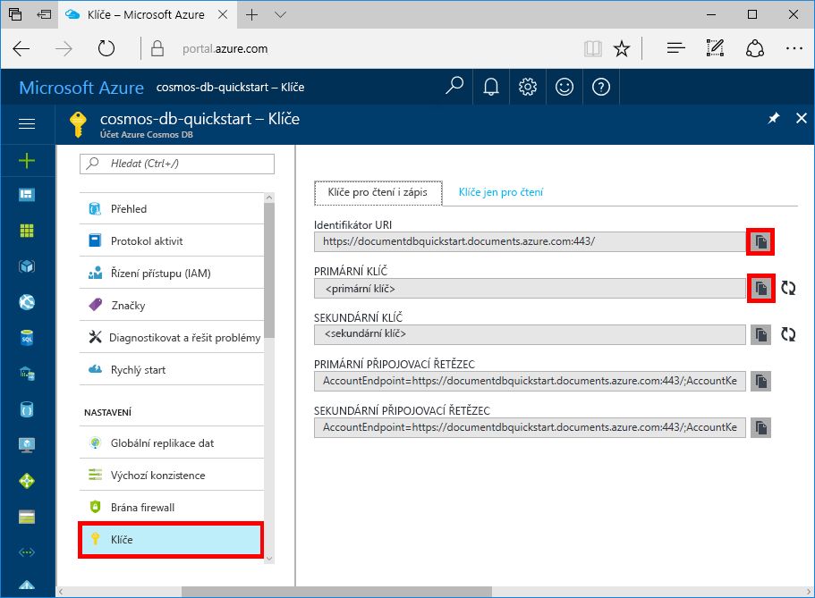

# <a name="azure-cosmos-db-build-a-sql-api-app-with-python-and-the-azure-portal"></a>Azure Cosmos DB: Vytvoření aplikace SQL API s využitím Pythonu a webu Azure Portal

Azure Cosmos DB je globálně distribuovaná databázová služba Microsoftu pro více modelů. Můžete snadno vytvořit a dotazovat databáze dotazů, klíčů/hodnot a grafů, které tak můžou využívat výhody použitelnosti v celosvětovém měřítku a možností horizontálního škálování v jádru databáze Azure Cosmos. 

Tento rychlý start popisuje způsob vytvoření účtu rozhraní [SQL API](sql-api-introduction.md) služby Azure Cosmos DB, databáze dokumentů a kolekce pomocí webu Azure Portal. Pak vytvoříte a spustíte aplikaci konzoly využívající rozhraní [SQL Python API](sql-api-sdk-python.md).

## <a name="prerequisites"></a>Požadavky

[!INCLUDE [quickstarts-free-trial-note](../../includes/quickstarts-free-trial-note.md)] 
[!INCLUDE [cosmos-db-emulator-docdb-api](../../includes/cosmos-db-emulator-docdb-api.md)]

* Navíc platí:
    * Pokud ještě nemáte nainstalovanou sadu Visual Studio 2017, můžete stáhnout a použít **bezplatnou verzi** [Visual Studio 2017 Community Edition](https://www.visualstudio.com/downloads/). Nezapomeňte při instalaci sady Visual Studio povolit možnost **Azure Development**.
    * Python Tools for Visual Studio z [GitHubu](http://microsoft.github.io/PTVS/). V tomto kurzu se používá Python Tools for VS 2015.
    * Python 2.7 z webu [python.org](https://www.python.org/downloads/release/python-2712/)

## <a name="create-a-database-account"></a>Vytvoření účtu databáze

[!INCLUDE [cosmos-db-create-dbaccount](../../includes/cosmos-db-create-dbaccount.md)]

## <a name="add-a-collection"></a>Přidání kolekce

[!INCLUDE [cosmos-db-create-collection](../../includes/cosmos-db-create-collection.md)]

## <a name="clone-the-sample-application"></a>Klonování ukázkové aplikace

Teď naklonujeme aplikaci SQL API z GitHubu, nastavíme připojovací řetězec a spustíme ji. Uvidíte, jak snadno se pracuje s daty prostřednictvím kódu programu. 

1. Otevřete okno terminálu Git, jako je třeba Git Bash, a pomocí `cd` přejděte do pracovního adresáře.  

2. Ukázkové úložiště naklonujete spuštěním následujícího příkazu. 

    ```bash
    git clone https://github.com/Azure-Samples/azure-cosmos-db-documentdb-python-getting-started.git
    ```  
## <a name="review-the-code"></a>Kontrola kódu

Ještě jednou se stručně podívejme na to, co se v aplikaci děje. Otevřete soubor DocumentDBGetStarted.py a zjistíte, že tyto řádky kódu vytvářejí prostředky Azure Cosmos DB. 


* Inicializuje se DocumentClient.

    ```python
    # Initialize the Python client
    client = document_client.DocumentClient(config['ENDPOINT'], {'masterKey': config['MASTERKEY']})
    ```

* Vytvoří se nová databáze.

    ```python
    # Create a database
    db = client.CreateDatabase({ 'id': config['SQL_DATABASE'] })
    ```

* Vytvoří se nová kolekce.

    ```python
    # Create collection options
    options = {
        'offerEnableRUPerMinuteThroughput': True,
        'offerVersion': "V2",
        'offerThroughput': 400
    }

    # Create a collection
    collection = client.CreateCollection(db['_self'], { 'id': config['SQL_COLLECTION'] }, options)
    ```

* Vytvoří se některé dokumenty.

    ```python
    # Create some documents
    document1 = client.CreateDocument(collection['_self'],
        { 
            'id': 'server1',
            'Web Site': 0,
            'Cloud Service': 0,
            'Virtual Machine': 0,
            'name': 'some' 
        })
    ```

* Provede se dotaz v jazyce SQL.

    ```python
    # Query them in SQL
    query = { 'query': 'SELECT * FROM server s' }    
            
    options = {} 
    options['enableCrossPartitionQuery'] = True
    options['maxItemCount'] = 2

    result_iterable = client.QueryDocuments(collection['_self'], query, options)
    results = list(result_iterable);

    print(results)
    ```

## <a name="update-your-connection-string"></a>Aktualizace připojovacího řetězce

Teď se vraťte zpátky na portál Azure Portal, kde najdete informace o připojovacím řetězci, a zkopírujte je do aplikace.

1. Na webu [Azure Portal](http://portal.azure.com/) klikněte v účtu databáze Azure Cosmos v levém navigačním panelu na možnost **Klíče** a potom klikněte na **Klíče pro čtení i zápis**. V dalším kroku zkopírujete pomocí tlačítek kopírování na pravé straně obrazovky identifikátor URI a primární klíč do souboru `DocumentDBGetStarted.py`.

    

2. Otevřete soubor `DocumentDBGetStarted.py`. 

3. Z portálu zkopírujte hodnotu identifikátoru URI (pomocí tlačítka kopírování) a nastavte ji jako hodnotu klíče koncového bodu v souboru `DocumentDBGetStarted.py`. 

    `'ENDPOINT': 'https://FILLME.documents.azure.com',`

4. Potom z portálu zkopírujte hodnotu PRIMÁRNÍHO KLÍČE a nastavte ji jako hodnotu `config.MASTERKEY` v souboru `DocumentDBGetStarted.py`. Teď jste aktualizovali aplikaci a zadali do ní všechny informace potřebné ke komunikaci s Azure Cosmos DB. 

    `'MASTERKEY': 'FILLME',`
    
## <a name="run-the-app"></a>Spuštění aplikace
1. V sadě Visual Studio klikněte pravým tlačítkem na projekt v **Průzkumníku řešení**,vyberte aktuální prostředí Python a potom klikněte pravým tlačítkem myši.

2. Vyberte Možnost Instalovat balíček Pythonu a potom zadejte **pydocumentdb**.

3. Stisknutím klávesy F5 spusťte aplikaci. Aplikace se zobrazí v prohlížeči. 

Teď se můžete vrátit do Průzkumníku dat a zobrazit dotaz nebo provést úpravy a pracovat s těmito novými daty. 

## <a name="review-slas-in-the-azure-portal"></a>Ověření podmínek SLA na portálu Azure Portal

[!INCLUDE [cosmosdb-tutorial-review-slas](../../includes/cosmos-db-tutorial-review-slas.md)]

## <a name="clean-up-resources"></a>Vyčištění prostředků

Pokud nebudete tuto aplikace nadále používat, odstraňte na základě následujícího postupu z portálu Azure Portal všechny prostředky vytvořené podle tohoto rychlého startu:

1. V nabídce vlevo na portálu Azure Portal klikněte na **Skupiny prostředků** a pak klikněte na název vytvořeného prostředku. 
2. Na stránce skupiny prostředků klikněte na **Odstranit**, do textového pole zadejte prostředek, který chcete odstranit, a pak klikněte na **Odstranit**.

## <a name="next-steps"></a>Další kroky

V tomto rychlém startu jsme se seznámili s postupem vytvoření účtu databáze Azure Cosmos, vytvoření kolekce pomocí Průzkumníka dat a spuštění aplikace. Teď můžete do účtu Cosmos DB importovat další data. 

> [!div class="nextstepaction"]
> [Import dat do databáze Azure Cosmos DB pro rozhraní SQL API](import-data.md)


