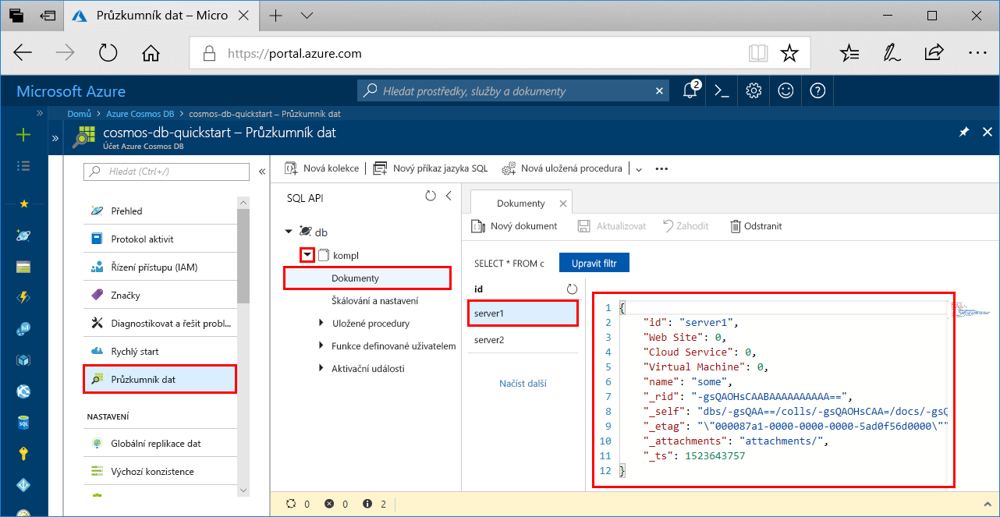

# <a name="azure-cosmos-db-build-a-sql-api-app-with-python-and-the-azure-portal"></a>Azure Cosmos DB: Vytvoření aplikace SQL API s využitím Pythonu a webu Azure Portal

Azure Cosmos DB je globálně distribuovaná databázová služba Microsoftu pro více modelů. Můžete snadno vytvořit a dotazovat databáze dotazů, klíčů/hodnot a grafů, které tak můžou využívat výhody použitelnosti v celosvětovém měřítku a možností horizontálního škálování v jádru databáze Azure Cosmos. 

Tento rychlý start popisuje způsob vytvoření účtu rozhraní [SQL API](sql-api-introduction.md) služby Azure Cosmos DB, databáze dokumentů a kolekce pomocí webu Azure Portal. Pak vytvoříte a spustíte aplikaci konzoly využívající rozhraní [SQL Python API](sql-api-sdk-python.md).

[!INCLUDE [quickstarts-free-trial-note](../../includes/quickstarts-free-trial-note.md)] [!INCLUDE [cosmos-db-emulator-docdb-api](../../includes/cosmos-db-emulator-docdb-api.md)]

## <a name="prerequisites"></a>Požadavky

* [Python 3.6](https://www.python.org/downloads/) se složkami \<umístění instalace\>\Python36 a \<umístění instalace>\Python36\Scripts přidanými do vaší cesty. 
* [Visual Studio Code](https://code.visualstudio.com/)
* [Rozšíření Python pro Visual Studio Code](https://marketplace.visualstudio.com/items?itemName=ms-python.python#overview)

## <a name="create-a-database-account"></a>Vytvoření účtu databáze

[!INCLUDE [cosmos-db-create-dbaccount](../../includes/cosmos-db-create-dbaccount.md)]

## <a name="add-a-collection"></a>Přidání kolekce

[!INCLUDE [cosmos-db-create-collection](../../includes/cosmos-db-create-collection.md)]

## <a name="add-sample-data"></a>Přidání ukázkových dat

[!INCLUDE [cosmos-db-create-sql-api-add-sample-data](../../includes/cosmos-db-create-sql-api-add-sample-data.md)]

## <a name="query-your-data"></a>Dotazování dat

[!INCLUDE [cosmos-db-create-sql-api-query-data](../../includes/cosmos-db-create-sql-api-query-data.md)]

## <a name="clone-the-sample-application"></a>Klonování ukázkové aplikace

Teď naklonujeme aplikaci SQL API z GitHubu, nastavíme připojovací řetězec a spustíme ji. Uvidíte, jak snadno se pracuje s daty prostřednictvím kódu programu. 

1. Otevřete příkazový řádek, vytvořte novou složku git-samples a potom příkazový řádek zavřete.

    ```bash
    md "C:\git-samples"
    ```

2. Otevřete okno terminálu Git, například Git Bash, a pomocí příkazu `cd` přejděte do nové složky, do které chcete nainstalovat ukázkovou aplikaci.

    ```bash
    cd "C:\git-samples"
    ```

3. Ukázkové úložiště naklonujete spuštěním následujícího příkazu. Tento příkaz vytvoří na vašem počítači kopii ukázkové aplikace. 

    ```bash
    git clone https://github.com/Azure-Samples/azure-cosmos-db-documentdb-python-getting-started.git
    ```  
    
## <a name="review-the-code"></a>Kontrola kódu

Tento krok je volitelný. Pokud chcete zjistit, jak se v kódu vytvářejí prostředky databáze, můžete si prohlédnout následující fragmenty kódu. Jinak můžete přeskočit přímo k části [Aktualizace informací o připojení](#update-your-connection-string). 

Všechny následující fragmenty kódu pocházejí ze souboru DocumentDBGetStarted.py.

* Inicializuje se DocumentClient.

    ```python
    # Initialize the Python client
    client = document_client.DocumentClient(config['ENDPOINT'], {'masterKey': config['MASTERKEY']})
    ```

* Vytvoří se nová databáze.

    ```python
    # Create a database
    db = client.CreateDatabase({ 'id': config['SQL_DATABASE'] })
    ```

* Vytvoří se nová kolekce.

    ```python
    # Create collection options
    options = {
        'offerEnableRUPerMinuteThroughput': True,
        'offerVersion': "V2",
        'offerThroughput': 400
    }

    # Create a collection
    collection = client.CreateCollection(db['_self'], { 'id': config['SQL_COLLECTION'] }, options)
    ```

* Vytvoří se některé dokumenty.

    ```python
    # Create some documents
    document1 = client.CreateDocument(collection['_self'],
        { 
            'id': 'server1',
            'Web Site': 0,
            'Cloud Service': 0,
            'Virtual Machine': 0,
            'name': 'some' 
        })
    ```

* Provede se dotaz v jazyce SQL.

    ```python
    # Query them in SQL
    query = { 'query': 'SELECT * FROM server s' }    
            
    options = {} 
    options['enableCrossPartitionQuery'] = True
    options['maxItemCount'] = 2

    result_iterable = client.QueryDocuments(collection['_self'], query, options)
    results = list(result_iterable);

    print(results)
    ```

## <a name="update-your-connection-string"></a>Aktualizace připojovacího řetězce

Teď se vraťte zpátky na portál Azure Portal, kde najdete informace o připojovacím řetězci, a zkopírujte je do aplikace.

1. Na webu [Azure Portal](http://portal.azure.com/) ve svém účtu služby Azure Cosmos DB klikněte v levém navigačním panelu na **Klíče**. V dalším kroku zkopírujete pomocí tlačítek kopírování na pravé straně obrazovky identifikátor **URI** a **Primary Key** do souboru DocumentDBGetStarted.py.

    

2. Otevřete soubor C:\git-samples\azure-cosmos-db-documentdb-python-getting-startedDocumentDBGetStarted.py v aplikaci Visual Studio Code. 

3. Z portálu zkopírujte hodnotu identifikátoru **URI** (pomocí tlačítka kopírování) a nastavte ji jako hodnotu klíče **endpoint** v souboru DocumentDBGetStarted.py. 

    `'ENDPOINT': 'https://FILLME.documents.azure.com',`

4. Pak z portálu zkopírujte hodnotu **PRIMARY KEY** a nastavte ji jako hodnotu **config.MASTERKEY** v souboru DocumentDBGetStarted.py. Teď jste aktualizovali aplikaci a zadali do ní všechny informace potřebné ke komunikaci s Azure Cosmos DB. 

    `'MASTERKEY': 'FILLME',`

5. Uložte soubor DocumentDBGetStarted.py.
    
## <a name="run-the-app"></a>Spuštění aplikace

1. V aplikaci Visual Studio Code vyberte **Zobrazení**>**Paleta příkazů**. 

2. Do příkazového řádku zadejte **Python: Select Interpreter** a pak vyberte verzi jazyka Python, kterou chcete používat.

    Zápatí v aplikaci Visual Studio Code se aktualizuje a bude označovat, že je vybraný interpret. 

3. Vyberte **Zobrazit** > **Integrovaný terminál**, aby se otevřel integrovaný terminál aplikace Visual Studio Code.

4. V okně integrovaného terminálu zkontrolujte, že jste ve složce azure-cosmos-db-documentdb-python-getting-started. Pokud ne, spusťte následující příkaz, abyste do složky ukázky přešli. 

    ```
    cd "C:\git-samples\azure-cosmos-db-documentdb-python-getting-started"`
    ```

5. Spuštěním následujícího příkazu nainstalujte balíček pydocumentdb. 

    ```
    pip3 install pydocumentdb
    ```

    Pokud při pokusu o instalaci pydocumentdb dojde k chybě v podobě odepření přístupu, budete muset [spustit VS Code jako správce](https://stackoverflow.com/questions/37700536/visual-studio-code-terminal-how-to-run-a-command-with-administrator-rights).

6. Spusťte následující příkaz, kterým spustíte ukázku a vytvoříte a uložíte nové dokumenty v Azure Cosmos dB.

    ```
    python DocumentDBGetStarted.py
    ```

7. Pokud si chcete potvrdit, že nové dokumenty byly vytvořeny a uloženy, vyberte na webu Azure Portal **Průzkumník dat**, rozbalte položku **coll**, rozbalte položku **Documents** a pak vyberte dokument **server1**. Obsah dokumentu server1 odpovídá obsahu vrácenému v okně integrovaného terminálu. 

    

## <a name="review-slas-in-the-azure-portal"></a>Ověření podmínek SLA na portálu Azure Portal

[!INCLUDE [cosmosdb-tutorial-review-slas](../../includes/cosmos-db-tutorial-review-slas.md)]

## <a name="clean-up-resources"></a>Vyčištění prostředků

[!INCLUDE [cosmosdb-delete-resource-group](../../includes/cosmos-db-delete-resource-group.md)]

## <a name="next-steps"></a>Další kroky

V tomto rychlém startu jsme se seznámili s postupem vytvoření účtu databáze Azure Cosmos, vytvoření kolekce pomocí Průzkumníka dat a spuštění aplikace. Teď můžete do účtu Cosmos DB importovat další data. 

> [!div class="nextstepaction"]
> [Import dat do databáze Azure Cosmos DB pro rozhraní SQL API](import-data.md)


