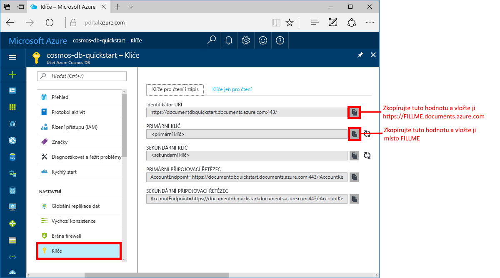

# <a name="azure-cosmos-db-build-a-web-app-with-net-xamarin-and-facebook-authentication"></a>Služba Azure Cosmos DB: Sestavení webové aplikace s rozhraním .NET a ověřením přes Xamarin a Facebook

Azure Cosmos DB je globálně distribuovaná databázová služba Microsoftu pro více modelů. Můžete snadno vytvořit a dotazovat databáze dotazů, klíčů/hodnot a grafů, které tak můžou využívat výhody použitelnosti v celosvětovém měřítku a možností horizontálního škálování v jádru databáze Azure Cosmos.

> [!NOTE]
> Vzorový kód celé ukázkové kanonické aplikace Xamarin ukazující několik nabídek Azure, včetně služby Cosmos DB, najdete [tady](https://github.com/xamarinhq/app-geocontacts) na GitHubu. Tato aplikace ukazuje, jak zobrazit kontakty rozptýlené v různých geografických umístěních a jak těmto kontaktům umožnit aktualizaci svého umístění.

Tento rychlý start popisuje způsob vytvoření účtu služby Azure Cosmos DB, databáze dokumentů a kolekce pomocí webu Azure Portal. Pak budete moci sestavit a nasadit webovou aplikaci seznamu úkolů založenou na rozhraní [SQL .NET API](sql-api-sdk-dotnet.md), [Xamarin](https://www.xamarin.com/) a modulu přihlášení ke službě Azure Cosmos DB. Webová aplikace seznamu úkolů implementuje vzorek dat podle uživatele, který umožňuje uživatelům přihlášení pomocí Facebooku a správu vlastních položek úkolů.

## <a name="prerequisites"></a>Požadavky

Pokud ještě nemáte nainstalovanou sadu Visual Studio 2017, můžete stáhnout a použít **bezplatnou verzi** [Visual Studio 2017 Community Edition](https://www.visualstudio.com/downloads/). Nezapomeňte při instalaci sady Visual Studio povolit možnost **Azure Development**.

[!INCLUDE [quickstarts-free-trial-note](../../includes/quickstarts-free-trial-note.md)]
[!INCLUDE [cosmos-db-emulator-docdb-api](../../includes/cosmos-db-emulator-docdb-api.md)]

## <a name="create-a-database-account"></a>Vytvoření účtu databáze

[!INCLUDE [cosmos-db-create-dbaccount](../../includes/cosmos-db-create-dbaccount.md)]

## <a name="add-a-collection"></a>Přidání kolekce

[!INCLUDE [cosmos-db-create-collection](../../includes/cosmos-db-create-collection.md)]

## <a name="clone-the-sample-application"></a>Klonování ukázkové aplikace

Teď naklonujeme aplikaci SQL API z GitHubu, nastavíme připojovací řetězec a spustíme ji. Přesvědčíte se, jak snadno se pracuje s daty prostřednictvím kódu programu. 

1. Otevřete okno terminálu Git, jako je třeba Git Bash, a pomocí `cd` přejděte do pracovního adresáře.

2. Ukázkové úložiště naklonujete spuštěním následujícího příkazu. 

    ```bash
    git clone https://github.com/Azure/azure-documentdb-dotnet.git
    ```

3. Pak otevřete soubor DocumentDBTodo.sln ze složky samples/xamarin/UserItems/xamarin.forms v sadě Visual Studio.

## <a name="review-the-code"></a>Kontrola kódu

Kód ve složce Xamarin obsahuje:

* Aplikaci Xamarin. Aplikace ukládá položky seznamu úkolů uživatele v dělené kolekci s názvem UserItems.
* Rozhraní API zprostředkovatele tokenu prostředku. Jednoduché webové rozhraní ASP.NET pro zprostředkování tokenů prostředku služby Azure Cosmos DB přihlášeným uživatelům aplikace. Tokeny prostředků jsou krátkodobé přístupové tokeny, které zajišťují aplikaci přístup k datům přihlášených uživatelů.

Tok ověřování a dat je znázorněný v následujícím diagramu.

* Kolekce UserItems se vytváří s klíčem oddílu '/userid'. Zadání klíče oddílu kolekce umožňuje službě Azure Cosmos DB neomezené škálování s rostoucím počtem uživatelů a položek.
* Aplikace Xamarin umožňuje uživatelům přihlášení pomocí přihlašovacích údajů k Facebooku.
* Aplikace Xamarin používá přístupový token sítě Facebook pro ověřování s rozhraním ResourceTokenBroker API
* Rozhraní API zprostředkovatele tokenu prostředku ověřuje požadavek pomocí funkce App Service Auth a vyžaduje od služby Azure Cosmos DB token prostředku s přístupem ke čtení a zápisu všech dokumentů, které sdílejí klíč oddílu ověřeného uživatele.
* Zprostředkovatel tokenu prostředku vrátí token prostředku klientské aplikaci.
* Aplikace přistoupí k položkám seznamu úkolů uživatele pomocí tokenu prostředků.


## <a name="update-your-connection-string"></a>Aktualizace připojovacího řetězce

Teď se vraťte zpátky na portál Azure Portal, kde najdete informace o připojovacím řetězci, a zkopírujte je do aplikace.

1. Na webu [Azure Portal](http://portal.azure.com/) klikněte v účtu databáze Azure Cosmos v levém navigačním panelu na možnost **Klíče** a potom klikněte na **Klíče pro čtení i zápis**. V dalším kroku zkopírujte pomocí tlačítek kopírování na pravé straně obrazovky identifikátor URI a primární klíč do souboru Web.config.

    

2. V sadě Visual Studio 2017 otevřete soubor Web.config ve složce azure-documentdb-dotnet/samples/xamarin/UserItems/ResourceTokenBroker/ResourceTokenBroker. 

3. Z portálu zkopírujte (pomocí tlačítka kopírování) hodnotu identifikátoru URI a nastavte ji jako hodnotu klíče accountUrl v souboru Web.config. 

    `<add key="accountUrl" value="{Azure Cosmos DB account URL}"/>`

4. Pak z portálu zkopírujte hodnotu PRIMÁRNÍHO KLÍČE a nastavte ji jako hodnotu accountKey v souboru Web.config.

    `<add key="accountKey" value="{Azure Cosmos DB secret}"/>`

Teď jste aktualizovali aplikaci a zadali do ní všechny informace potřebné ke komunikaci s Azure Cosmos DB. 

## <a name="build-and-deploy-the-web-app"></a>Sestavení a nasazení webové aplikace

1. Na portálu Azure Portal vytvořte webovou stránku App Service pro hostování rozhraní API zprostředkovatele tokenu prostředku.
2. Na portálu Azure Portal otevřete okno Nastavení aplikace webové stránky rozhraní API zprostředkovatele tokenu prostředku. Vyplňte následující nastavení aplikace:

    * accountUrl – adresa URL účtu služby Azure Cosmos DB z karty Klíče účtu databáze Azure Cosmos.
    * accountKey – hlavní klíč účtu služby Azure Cosmos DB z karty Klíče účtu Azure Cosmos DB.
    * Parametr DatabaseId a collectionId vytvořené databáze a kolekce

3. Publikujte řešení ResourceTokenBroker na vytvořené webové stránce.

4. Otevřete projekt Xamarin a přejděte do souboru TodoItemManager.cs. Zadejte hodnoty parametrů accountURL, collectionId, databaseId a také resourceTokenBrokerURL jako základní adresu https url pro webovou stránku zprostředkovatele tokenu prostředku.

5. Absolvujte kurz [Konfigurace aplikace App Service pro použití přihlášení k Facebooku](../app-service/app-service-mobile-how-to-configure-facebook-authentication.md) pro nastavení ověřování přes síť Facebook a konfiguraci webové stránky ResourceTokenBroker.

    Spusťte aplikaci Xamarin.

## <a name="review-slas-in-the-azure-portal"></a>Ověření podmínek SLA na portálu Azure Portal

[!INCLUDE [cosmosdb-tutorial-review-slas](../../includes/cosmos-db-tutorial-review-slas.md)]

## <a name="clean-up-resources"></a>Vyčištění prostředků

Pokud nebudete tuto aplikace nadále používat, odstraňte na základě následujícího postupu z portálu Azure Portal všechny prostředky vytvořené podle tohoto rychlého startu:

1. V nabídce vlevo na portálu Azure Portal klikněte na **Skupiny prostředků** a pak klikněte na název vytvořeného prostředku.
2. Na stránce skupiny prostředků klikněte na **Odstranit**, do textového pole zadejte prostředek, který chcete odstranit, a pak klikněte na **Odstranit**.

## <a name="next-steps"></a>Další kroky

V tomto rychlém startu jste se seznámili s postupem vytvoření účtu služby Azure Cosmos DB, vytvoření kolekce pomocí Průzkumníku dat a sestavení a nasazení aplikace Xamarin. Teď můžete do účtu Cosmos DB importovat další data.

> [!div class="nextstepaction"]
> [Importování dat do služby Azure Cosmos DB](import-data.md)
