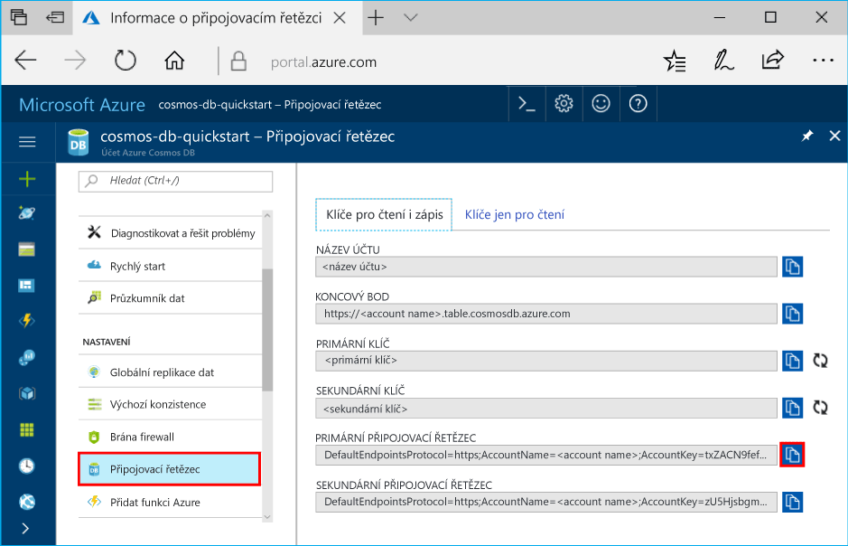

# <a name="quickstart-build-a-table-api-app-with-nodejs-and-azure-cosmos-db"></a>Rychlý start: Sestavení aplikace Table API pomocí Node.js a Azure Cosmos DB

Tento rychlý start ukazuje, jak pomocí Node.js a rozhraní Azure Cosmos DB [Table API](table-introduction.md) sestavit aplikaci naklonováním příkladu z GitHubu. Tento rychlý start také ukazuje, jak vytvořit účet služby Azure Cosmos DB a jak pomocí Průzkumníku dat vytvářet tabulky a entity na webu Azure Portal.

Azure Cosmos DB je globálně distribuovaná databázová služba Microsoftu pro více modelů. Můžete rychle vytvořit a dotazovat databáze dokumentů, párů klíč-hodnota, širokých sloupců a grafů, které tak můžou využívat výhody možnosti globální distribuce a horizontálního škálování v jádru služby Azure Cosmos DB. 

## <a name="prerequisites"></a>Požadavky

[!INCLUDE [quickstarts-free-trial-note](../../includes/quickstarts-free-trial-note.md)]
[!INCLUDE [cosmos-db-emulator-docdb-api](../../includes/cosmos-db-emulator-docdb-api.md)]

Navíc platí:

* [Node.js](https://nodejs.org/en/) verze 0.10.29 nebo vyšší
* [Git](http://git-scm.com/)

## <a name="create-a-database-account"></a>Vytvoření účtu databáze

> [!IMPORTANT] 
> Abyste mohli pracovat s obecně dostupnými sadami Table API SDK, musíte si vytvořit nový účet Table API. Obecně dostupné sady SDK nepodporují účty Table API vytvořené během období Preview.
>

[!INCLUDE [cosmos-db-create-dbaccount-table](../../includes/cosmos-db-create-dbaccount-table.md)]

## <a name="add-a-table"></a>Přidání tabulky

[!INCLUDE [cosmos-db-create-table](../../includes/cosmos-db-create-table.md)]

## <a name="add-sample-data"></a>Přidání ukázkových dat

[!INCLUDE [cosmos-db-create-table-add-sample-data](../../includes/cosmos-db-create-table-add-sample-data.md)]

## <a name="clone-the-sample-application"></a>Klonování ukázkové aplikace

Teď naklonujeme aplikaci Table z GitHubu, nastavíme připojovací řetězec a spustíme ji. Přesvědčíte se, jak snadno se pracuje s daty prostřednictvím kódu programu. 

1. Otevřete příkazový řádek, vytvořte novou složku git-samples a potom příkazový řádek zavřete.

    ```bash
    md "C:\git-samples"
    ```

2. Otevřete okno terminálu Git, například Git Bash, a pomocí příkazu `cd` přejděte do nové složky, do které chcete nainstalovat ukázkovou aplikaci.

    ```bash
    cd "C:\git-samples"
    ```

3. Ukázkové úložiště naklonujete spuštěním následujícího příkazu. Tento příkaz vytvoří na vašem počítači kopii ukázkové aplikace.

    ```bash
    git clone https://github.com/Azure-Samples/storage-table-node-getting-started.git
    ```

## <a name="update-your-connection-string"></a>Aktualizace připojovacího řetězce

Teď se vraťte zpátky na portál Azure Portal, kde najdete informace o připojovacím řetězci, a zkopírujte je do aplikace. Tím aplikaci umožníte komunikovat s hostovanou databází. 

1. Na webu [Azure Portal](http://portal.azure.com/) klikněte na **Připojovací řetězec**. 

    

2. Pomocí tlačítka pro kopírování na pravé straně zkopírujte PRIMÁRNÍ PŘIPOJOVACÍ ŘETĚZEC.

3. Otevřete soubor app.config a vložte tuto hodnotu do proměnné connectionString na třetím řádku. 

    > [!IMPORTANT]
    > Pokud váš koncový bod používá adresu documents.azure.com, znamená to, že máte účet Preview, a pokud chcete pracovat s obecně dostupnou sadou Table API SDK, musíte si vytvořit [nový účet Table API](#create-a-database-account).
    >

3. Uložte soubor app.config.

Teď jste aktualizovali aplikaci a zadali do ní všechny informace potřebné ke komunikaci s Azure Cosmos DB. 

## <a name="run-the-app"></a>Spuštění aplikace

1. V okně terminálu Git přejděte příkazem `cd` do složky storage-table-java-getting-started.

    ```
    cd "C:\git-samples\storage-table-node-getting-started"
    ```

2. Spusťte následující příkaz, který místně nainstaluje moduly [azure], [node-uuid], [nconf] a [async] a uloží pro ně záznam do souboru package.json.

   ```
   npm install azure-storage node-uuid async nconf --save
   ```

2. Spuštěním následujících příkazů v okně terminálu Git spusťte aplikaci Node.

    ```
    node ./tableSample.js 
    ```

    V okně konzoly se zobrazí přidávání tabulkových dat do nové databáze tabulek ve službě Azure Cosmos DB.

    Teď se můžete vrátit do Průzkumníku dat a zobrazit dotaz nebo provést úpravy a pracovat s těmito novými daty. 

## <a name="review-slas-in-the-azure-portal"></a>Ověření podmínek SLA na portálu Azure Portal

[!INCLUDE [cosmosdb-tutorial-review-slas](../../includes/cosmos-db-tutorial-review-slas.md)]

## <a name="clean-up-resources"></a>Vyčištění prostředků

[!INCLUDE [cosmosdb-delete-resource-group](../../includes/cosmos-db-delete-resource-group.md)]

## <a name="next-steps"></a>Další kroky

V tomto rychlém startu jste se seznámili s postupem vytvoření databázového účtu Azure Cosmos DB, vytvoření tabulky pomocí Průzkumníka dat a spuštění aplikace.  Teď můžete zadávat dotazy na svá data pomocí rozhraní API tabulky.  

> [!div class="nextstepaction"]
> [Import tabulkových dat do rozhraní Table API](table-import.md)
