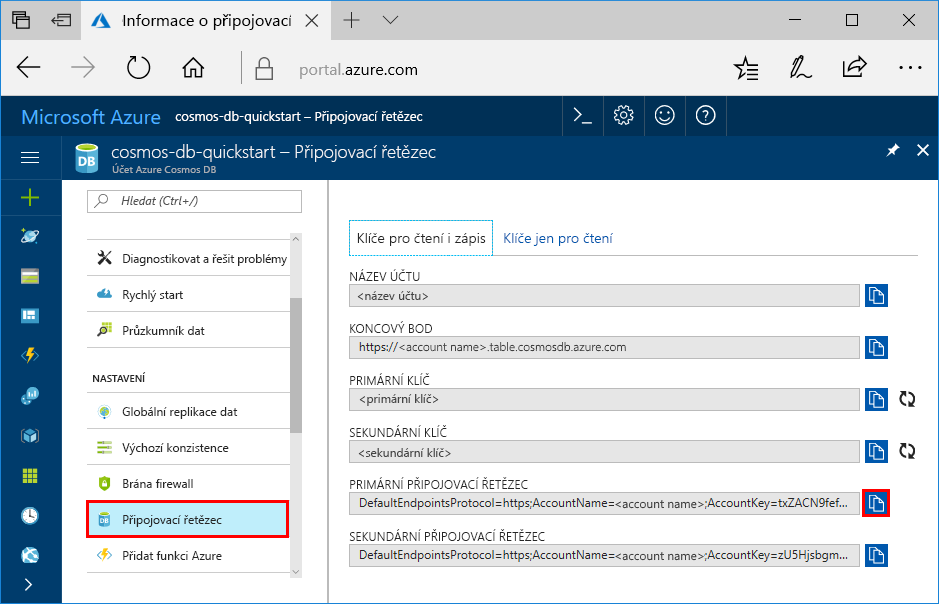

# <a name="quickstart-build-a-table-api-app-with-python-and-azure-cosmos-db"></a>Rychlý start: Sestavení aplikace Table API pomocí Pythonu a Azure Cosmos DB

Tento rychlý start ukazuje, jak pomocí Pythonu a rozhraní Azure Cosmos DB [Table API](table-introduction.md) sestavit aplikaci naklonováním příkladu z GitHubu. Tento rychlý start také ukazuje, jak vytvořit účet služby Azure Cosmos DB a jak pomocí Průzkumníku dat vytvářet tabulky a entity na webu Azure Portal.

Azure Cosmos DB je globálně distribuovaná databázová služba Microsoftu pro více modelů. Můžete rychle vytvořit a dotazovat databáze dokumentů, párů klíč-hodnota, širokých sloupců a grafů, které tak můžou využívat výhody možnosti globální distribuce a horizontálního škálování v jádru služby Azure Cosmos DB. 

## <a name="prerequisites"></a>Požadavky

[!INCLUDE [quickstarts-free-trial-note](../../includes/quickstarts-free-trial-note.md)]
[!INCLUDE [cosmos-db-emulator-docdb-api](../../includes/cosmos-db-emulator-docdb-api.md)]

Navíc platí:

* Pokud ještě nemáte nainstalovanou sadu Visual Studio 2017, můžete stáhnout a použít **bezplatnou verzi** [Visual Studio 2017 Community Edition](https://www.visualstudio.com/downloads/). Nezapomeňte při instalaci sady Visual Studio povolit možnost **Azure Development**.
* Python Tools for Visual Studio z [GitHubu](http://microsoft.github.io/PTVS/). V tomto kurzu se používá Python Tools for VS 2015.
* Python 2.7 z webu [python.org](https://www.python.org/downloads/release/python-2712/)

## <a name="create-a-database-account"></a>Vytvoření účtu databáze

> [!IMPORTANT] 
> Abyste mohli pracovat s obecně dostupnými sadami Table API SDK, musíte si vytvořit nový účet Table API. Obecně dostupné sady SDK nepodporují účty Table API vytvořené během období Preview.
>

[!INCLUDE [cosmos-db-create-dbaccount-table](../../includes/cosmos-db-create-dbaccount-table.md)]

## <a name="add-a-table"></a>Přidání tabulky

[!INCLUDE [cosmos-db-create-table](../../includes/cosmos-db-create-table.md)]

## <a name="add-sample-data"></a>Přidání ukázkových dat

[!INCLUDE [cosmos-db-create-table-add-sample-data](../../includes/cosmos-db-create-table-add-sample-data.md)]

## <a name="clone-the-sample-application"></a>Klonování ukázkové aplikace

Teď naklonujeme aplikaci Table z GitHubu, nastavíme připojovací řetězec a spustíme ji. Přesvědčíte se, jak snadno se pracuje s daty prostřednictvím kódu programu. 

1. Otevřete příkazový řádek, vytvořte novou složku git-samples a potom příkazový řádek zavřete.

    ```bash
    md "C:\git-samples"
    ```

2. Otevřete okno terminálu Git, například Git Bash, a pomocí příkazu `cd` přejděte do nové složky, do které chcete nainstalovat ukázkovou aplikaci.

    ```bash
    cd "C:\git-samples"
    ```

3. Ukázkové úložiště naklonujete spuštěním následujícího příkazu. Tento příkaz vytvoří na vašem počítači kopii ukázkové aplikace. 

    ```bash
    git clone https://github.com/Azure-Samples/storage-python-getting-started.git
    ```

3. Potom otevřete soubor řešení v sadě Visual Studio. 

## <a name="update-your-connection-string"></a>Aktualizace připojovacího řetězce

Teď se vraťte zpátky na portál Azure Portal, kde najdete informace o připojovacím řetězci, a zkopírujte je do aplikace. Tím aplikaci umožníte komunikovat s hostovanou databází. 

1. Na webu [Azure Portal](http://portal.azure.com/) klikněte na **Připojovací řetězec**. 

    

2. Pomocí tlačítka na pravé straně zkopírujte hodnotu NÁZEV ÚČTU.

3. Otevřete soubor config.py a vložte NÁZEV ÚČTU z portálu do hodnoty STORAGE_ACCOUNT_NAME na řádku 19.

4. Vraťte se na portál a zkopírujte PRIMÁRNÍ KLÍČ.

5. Vložte PRIMÁRNÍ KLÍČ z portálu do hodnoty STORAGE_ACCOUNT_KEY na řádku 20.

3. Uložte soubor config.py.

## <a name="run-the-app"></a>Spuštění aplikace

1. V sadě Visual Studio klikněte pravým tlačítkem na projekt v **Průzkumníku řešení**,vyberte aktuální prostředí Python a potom klikněte pravým tlačítkem myši.

2. Vyberte možnost Instalovat balíček Pythonu a pak zadejte **azure-storage-table**.

3. Stisknutím klávesy F5 spusťte aplikaci. Aplikace se zobrazí v prohlížeči. 

Teď se můžete vrátit do Průzkumníku dat a zobrazit dotaz nebo provést úpravy a pracovat s těmito novými daty. 

## <a name="review-slas-in-the-azure-portal"></a>Ověření podmínek SLA na portálu Azure Portal

[!INCLUDE [cosmosdb-tutorial-review-slas](../../includes/cosmos-db-tutorial-review-slas.md)]

## <a name="clean-up-resources"></a>Vyčištění prostředků

[!INCLUDE [cosmosdb-delete-resource-group](../../includes/cosmos-db-delete-resource-group.md)]

## <a name="next-steps"></a>Další kroky

V tomto rychlém startu jste se seznámili s postupem vytvoření databázového účtu Azure Cosmos DB, vytvoření tabulky pomocí Průzkumníka dat a spuštění aplikace.  Teď můžete zadávat dotazy na svá data pomocí rozhraní API tabulky.  

> [!div class="nextstepaction"]
> [Import tabulkových dat do rozhraní Table API](table-import.md)
