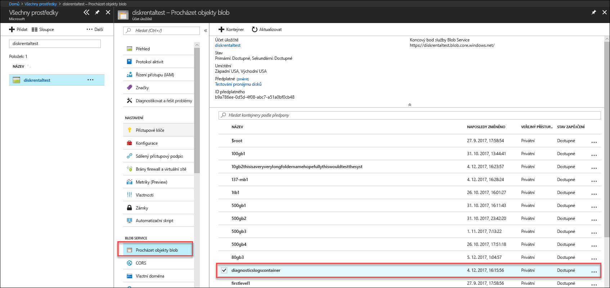
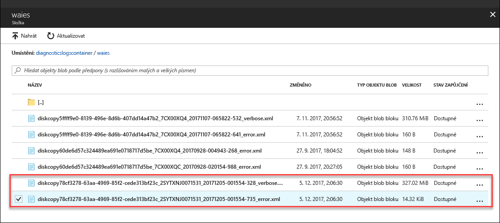

# Řešení potíží s Azure Data Box Diskem (Preview)

Tento článek se týká služby Microsoft Azure Data Box ve verzi Preview. Popisuje některé komplexní pracovní postupy a úlohy správy, které lze provádět v rámci služby Data Box a se zařízením Data Box Disk. 

Data Box Disk je možné spravovat prostřednictvím webu Azure Portal. Tento článek se zaměřuje na úlohy, které můžete provést pomocí webu Azure Portal. Azure Portal můžete použít ke správě objednávek a zařízení a ke sledování stavu objednávek až do jejich dokončení.

Tento článek obsahuje následující návody:

- Stažení protokolů diagnostiky
- Dotazy na protokoly aktivit

> [!IMPORTANT]
> Data Box je ve verzi Preview. Než toto řešení nasadíte, přečtěte si [podmínky užívání pro předběžné verze systému Azure](https://azure.microsoft.com/support/legal/preview-supplemental-terms/).

## Stažení diagnostických protokolů

Pokud při procesu kopírování dat nedojde k žádným chybám, na portálu se objeví cesta ke složce, ve které najdete diagnostické protokoly. 

Diagnostické protokoly mohou zahrnovat:
- Protokoly chyb
- Podrobné protokoly  

Chcete-li se dostat do příslušného umístění a zkopírovat si protokoly, přejděte na účet úložiště spojený s vaší objednávkou Data Box. 

1.  Přejděte na **Obecné > Podrobnosti objednávky** a poznamenejte si účet úložiště přidružený k vaší objednávce.
 

2.  Přejděte na stránku **Všechny prostředky** a vyhledejte účet úložiště získaný v předchozím kroku. Vyberte a klikněte na účet úložiště.

    

3.  Přejděte na **Blob service > Procházet objekty blob** a vyhledejte blob odpovídající účtu úložiště. Přejděte na **diagnosticslogcontainer > waies**. 

    

    Měli byste vidět protokoly chyb i podrobné protokoly. Vyberte a klikněte na každý soubor a stáhněte si místní kopii.

## Dotazy na protokoly aktivit

Protokoly aktivit můžete použít k vyhledání chyby při řešení potíží nebo k monitorování toho, jak uživatel ve vaší organizaci upravil prostředek. Na základě protokolů aktivit můžete zjistit:

- Jaké operace byly provedeny s prostředky ve vašem předplatném.
- Kdo operaci zahájil. 
- Kdy k operaci došlo.
- Stav operace.
- Hodnoty dalších vlastností, které vám mohou pomoci při zkoumání operace.

Protokoly aktivit obsahují všechny operace zápisu (jako PUT, POST nebo DELETE) prováděné s vašimi prostředky, ale neobsahuje operace čtení (např. GET). 

Protokoly aktivit se uchovávají 90 dnů. Můžete se dotazovat na libovolný rozsah kalendářních dat, pokud počáteční datum neleží více než 90 dnů v minulosti. Můžete také filtrovat protokol s použitím některého z předdefinovaných dotazů ve službě Insights. Například můžete kliknout na chybu a pak na konkrétní selhání, abyste zjistili hlavní příčinu.

## Chyby odemykacího nástroje Data Box Disku

| Chybová zpráva / chování nástroje      | Doporučení                                                                                               |
|-------------------------------------------------------------------------------------------------------------------------------------|------------------------------------------------------------------------------------------------------|
| Žádný  Odemykací nástroj Data Box Disku skončí s chybou.                                                                            | BitLocker není nainstalovaný. Ujistěte se, že na hostitelském počítači, na kterém běží odemykací nástroj Data Box Disku, je nainstalovaný nástroj BitLocker.                                                                            |
| Aktuální rozhraní .NET Framework není podporováno. Podporovány jsou verze 4.5 a vyšší.  Nástroj skončí s chybovou zprávou.  | Rozhraní .NET 4.5 není nainstalováno. Na hostitelský počítač, na kterém běží odemykací nástroj Data Box Disku, nainstalujte rozhraní .NET 4.5 nebo novější.                                                                            |
| Nepodařilo se odemknout nebo ověřit žádné svazky. Obraťte se na podporu Microsoftu.    Nástroji se nepodařilo odemknout nebo ověřit žádnou uzamčenou jednotku. | Nástroji se s použitím zadaného klíče nepodařilo odemknout žádnou ze zamčených jednotek. O dalších krocích se poraďte s podporou Microsoftu.                                                |
| Následující svazky jsou odemčené a ověřené.  Písmena jednotek: E: Nepodařilo se odemknout žádné svazky s použitím následujících klíčů: werwerqomnf, qwerwerqwdfda   Nástroj odemkl některé jednotky a zobrazil písmena úspěšných a neúspěšných jednotek.| Částečný úspěch. Nástroji se s použitím zadaného klíče nepodařilo odemknout některé ze zamčených jednotek. O dalších krocích se poraďte s podporou Microsoftu. |
| Nepovedlo se najít zamčené svazky. Zkontrolujte, že je disk od Microsoftu správně připojený a zamčený.          | Nástroji se nepodařilo najít žádné zamčené jednotky. Buď jsou jednotky už odemčené, nebo nebyly nalezeny. Zkontrolujte, že jsou jednotky připojené a zamčené.                                                           |
| Závažná chyba: Neplatný parametr Název parametru: invalid_arg POUŽITÍ: DataBoxDiskUnlock /PassKeys:<seznam_klíčů_oddělený_středníky>  Příklad: DataBoxDiskUnlock /PassKeys:klíč1;klíč2;klíč3 Příklad: DataBoxDiskUnlock /SystemCheck Příklad: DataBoxDiskUnlock /Help  /PassKeys:       Tento klíč najdete v objednávce služby Azure Data Box Disk. Klíč vaše disky odemkne. /Help:           Tato možnost poskytuje nápovědu k použití rutiny a příklady. /SystemCheck:    Tato možnost zkontroluje, jestli váš systém splňuje požadavky na spuštění nástroje.  Nástroj ukončíte stisknutím libovolné klávesy. | Byl zadán neplatný parametr. Jediné povolené parametry jsou /SystemCheck /PassKey a /Help.                                                                            |
## Další kroky

- Přečtěte si, jak [spravovat Data Box Disk pomocí webu Azure Portal](data-box-portal-ui-admin.md).
