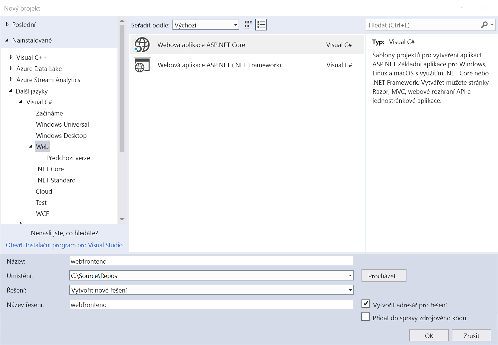
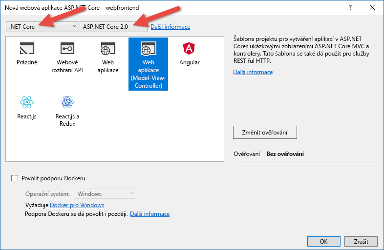
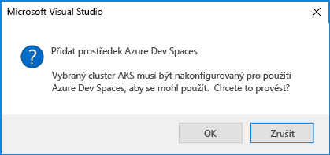
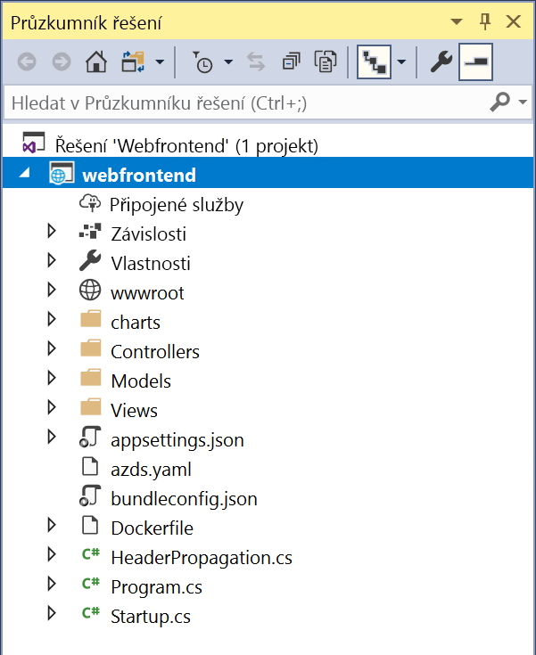

# Rychlý start: Vytvoření vývojového prostředí Kubernetes pomocí služby Azure Dev Spaces (.NET Core a Visual Studio)

V tomto průvodci se naučíte:

- Vytvořit v Azure prostředí založené na systému Kubernetes, které je optimalizované pro vývoj.
- Iterativně vyvíjet kód v kontejnerech pomocí sady Visual Studio.

[!INCLUDE]

[!INCLUDE]

## Získání nástrojů sady Visual Studio 
1. Nainstalujte nejnovější verzi sady [Visual Studio 2017](https://www.visualstudio.com/vs/).
1. V instalačním programu sady Visual Studio se ujistěte, že je vybraná následující úloha:
    * Vývoj pro ASP.NET a web
1. Nainstalujte [rozšíření sady Visual Studio pro Azure Dev Spaces](https://aka.ms/get-azds-visualstudio).

Teď můžete pomocí sady Visual Studio vytvořit webovou aplikaci ASP.NET.

## Vytvoření webové aplikace ASP.NET

V sadě Visual Studio 2017 vytvořte nový projekt. V současné době se musí jednat o projekt **Webová aplikace ASP.NET Core**. Dejte projektu název **webfrontend**.

Vyberte šablonu **Webová aplikace (model-zobrazení-kontroler)** a ujistěte se, že jsou ve dvou rozevíracích seznamech v horní části dialogového okna vybrané položky **.NET Core** a **ASP.NET Core 2.0**. Projekt vytvoříte kliknutím na **OK**.

## Vytvoření vývojového prostředí v Azure

Služba Azure Dev Spaces umožňuje vytvářet vývojová prostředí založená na systému Kubernetes, která jsou plně spravovaná Azure a optimalizovaná pro vývoj. V projektu, který jste právě vytvořili, vyberte v rozevíracím okně nastavení spouštění **Azure Dev Spaces**, jak vidíte na následujícím snímku obrazovky.

V zobrazeném dialogovém okně zkontrolujte, jestli jste přihlášení pomocí správného účtu, a potom vyberte existující cluster.

V rozevíracím seznamu **Space** (Prostor) zatím nechte vybranou položku `default`. O této možnosti se později dozvíte víc. Zaškrtněte políčko **Publicly Accessible** (Veřejně přístupná), aby byla webová aplikace přístupná prostřednictvím veřejného koncového bodu. Toto nastavení není povinné, ale v rámci tohoto názorného postupu nám pomůže předvést některé koncepty. Nemusíte si ale dělat starosti, v každém případě totiž budete moct ladit svůj web pomocí sady Visual Studio.

Klikněte na **OK** a vyberte nebo vytvořte cluster.

Pokud zvolíte cluster, který není nakonfigurovaný pro práci s Azure Dev Spaces, zobrazí se zpráva s dotazem, jestli ho chcete nakonfigurovat.

Vyberte **OK**. 

K provedení této akce se spustí úloha na pozadí. Dokončí se za několik minut. Pokud chcete zjistit, jestli se úloha pořád vytváří, podržte ukazatel myši nad ikonou **úloh na pozadí** v levém dolním rohu stavového řádku, jak znázorňuje následující obrázek.

> [!Note]
Dokud se vývojové prostředí úspěšně nevytvoří, nemůžete ladit aplikaci.

## Prohlédnutí souborů přidaných do projektu
Během čekání na vytvoření vývojového prostředí se podívejte na soubory, které se přidaly do vašeho projektu, když jste si zvolili použití vývojového prostředí.

Nejdřív uvidíte, že se přidala složka s názvem `charts` a v ní se vytvořil [Helm chart](https://docs.helm.sh) pro vaši aplikaci. Tyto soubory slouží k nasazení vaší aplikace do vývojového prostředí.

Uvidíte, že se přidal soubor s názvem `Dockerfile`. Tento soubor obsahuje informace potřebné k zabalení vaší aplikace ve standardním formátu Dockeru. Vytvořil se taky soubor `HeaderPropagation.cs`, o kterém se v tomto názorném návodu zmíníme později. 

Nakonec uvidíte soubor s názvem `azds.yaml`, který obsahuje informace o konfiguraci vyžadované vývojovým prostředím, třeba to, jestli má být aplikace přístupná prostřednictvím veřejného koncového bodu.

## Ladění kontejneru v prostředí Kubernetes
Po úspěšném vytvoření vývojového prostředí můžete začít ladit aplikaci. Nastavte v kódu zarážku, třeba na řádku 20 v souboru `HomeController.cs`, kde je nastavená proměnná `Message`. Ladění spustíte kliknutím na **F5**. 

Visual Studio bude komunikovat s vývojovým prostředím, aby se mohla aplikace sestavit a nasadit, a potom se spuštěnou webovou aplikací otevře prohlížeč. I když to vypadá, že je kontejner spuštěný v místním prostředí, ve skutečnosti běží ve vývojovém prostředí v Azure. Adresa místního hostitele se zobrazuje proto, že služba Azure Dev Spaces vytvoří dočasný tunel SSH do kontejneru běžícího v Azure.

Zarážku aktivujete kliknutím na odkaz **O aplikaci** v horní části stránky. Máte plný přístup k informacím o ladění, jako je zásobník volání, místní proměnné, informace o výjimkách apod., úplně stejně jako při lokálním spuštění kódu.

## Další kroky

> [!div class="nextstepaction"]
> [Práce s více kontejnery a týmový vývoj](get-started-netcore-visualstudio.md#call-another-container)