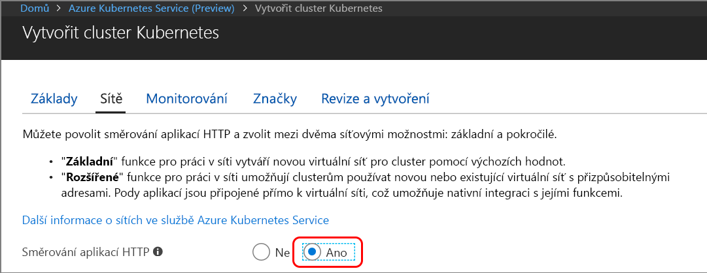
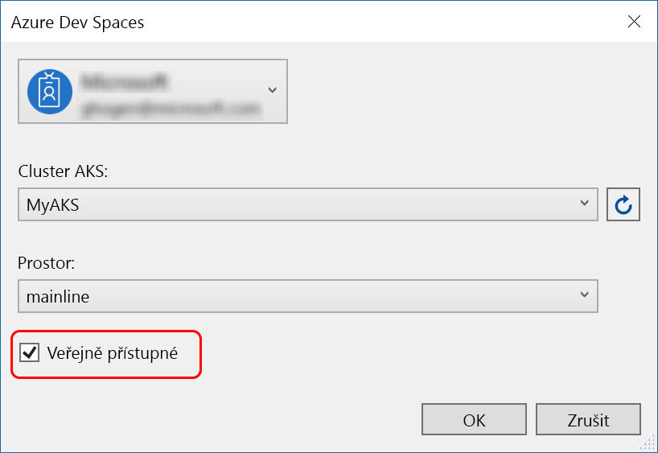

# Rychlý start: Vytvoření vývojového prostoru Kubernetes pomocí služby Azure Dev Spaces (.NET Core a Visual Studio)

V tomto průvodci se naučíte:

- Nastavit Azure Dev Spaces se spravovaným clusterem Kubernetes v Azure
- Iterativně vyvíjet kód v kontejnerech pomocí sady Visual Studio
- Ladit kód běžící v clusteru

> [!Note]
> **Pokud se někde zaseknete**, podívejte se na článek o [odstraňování potíží](troubleshooting.md) nebo na tuto stránku přidejte komentář. Můžete také zkusit postupovat podle podrobnějšího [kurzu](get-started-netcore-visualstudio.md).

## Požadavky

- Cluster Kubernetes na platformě Kubernetes 1.9.6 nebo novější v oblasti USA – východ, USA – střed, USA – západ 2, Západní Evropa, Kanada – střed nebo Kanada – východ s povolenou možností Směrování aplikace HTTP.

  

- Sada Visual Studio 2017 se sadou funkcí Výboj pro web. Pokud ji nemáte nainstalovanou, stáhněte si ji [odtud](https://aka.ms/vsdownload?utm_source=mscom&utm_campaign=msdocs).

## Nastavení služby Azure Dev Spaces

Nainstalujte [Visual Studio Tools for Kubernetes](https://aka.ms/get-azds-visualstudio).

## Připojení ke clusteru

V dalším kroku vytvoříte a nakonfigurujete projekt pro Azure Dev Spaces.

### Vytvoření webové aplikace ASP.NET

V sadě Visual Studio 2017 vytvořte nový projekt. V současné době se musí jednat o projekt **Webová aplikace ASP.NET Core**. Dejte projektu název **webfrontend**.

Vyberte šablonu **Webová aplikace (model-zobrazení-kontroler)** a nastavte cílení na **.NET Core** a **ASP.NET Core 2.0**.

### Povolení služby Dev Spaces pro cluster AKS

V projektu, který jste právě vytvořili, vyberte v rozevíracím okně nastavení spouštění **Azure Dev Spaces**, jak je znázorněno na následujícím obrázku.

V zobrazeném dialogovém okně zkontrolujte, jestli jste přihlášení pomocí správného účtu, a potom vyberte existující cluster.

V rozevíracím seznamu **Space** (Prostor) zatím nechte nastavenou položku `default`. Zaškrtněte políčko **Publicly Accessible** (Veřejně přístupný), aby byla webová aplikace přístupná prostřednictvím veřejného koncového bodu.

Klikněte na **OK** a vyberte nebo vytvořte cluster.

Pokud zvolíte cluster, který není nakonfigurovaný pro práci s Azure Dev Spaces, zobrazí se zpráva s dotazem, jestli ho chcete nakonfigurovat.

Vyberte **OK**. 

### Prohlédnutí souborů přidaných do projektu
Během čekání na vytvoření vývojového prostoru se podívejte na soubory, které se přidaly do vašeho projektu, když jste si zvolili použití služby Azure Dev Spaces.

- Přidala se složka s názvem `charts` a v ní se vygeneroval [Helm chart](https://docs.helm.sh) pro vaši aplikaci. Tyto soubory slouží k nasazení vaší aplikace do vývojového prostoru.
- Soubor `Dockerfile` obsahuje informace potřebné k zabalení vaší aplikace do standardního formátu Dockeru.
- Soubor `azds.yaml` obsahuje konfiguraci v době vývoje, kterou vývojový prostor potřebuje.

## Ladění kontejneru v Kubernetes
Po úspěšném vytvoření vývojového prostoru můžete začít ladit aplikaci. Nastavte v kódu zarážku, třeba na řádku 20 v souboru `HomeController.cs`, kde je nastavená proměnná `Message`. Ladění spustíte kliknutím na **F5**. 

Visual Studio bude komunikovat s vývojovým prostorem, aby se mohla aplikace sestavit a nasadit, a potom otevře prohlížeč se spuštěnou webovou aplikací. I když to může vypadat, že kontejner je spuštěný lokálně, ve skutečnosti je spuštěný ve vývojovém prostoru v Azure. Adresa místního hostitele se zobrazuje proto, že služba Azure Dev Spaces vytvoří dočasný tunel SSH do kontejneru spuštěného v AKS.

Zarážku aktivujete kliknutím na odkaz **O aplikaci** v horní části stránky. Máte plný přístup k informacím o ladění, jako jsou zásobník volání, místní proměnné, informace o výjimkách apod., úplně stejně jako při místním spuštění kódu.

## Iterativní vývoj kódu

Azure Dev Spaces neslouží jenom ke spuštění kódu v prostředí Kubernetes. Umožňuje také rychle opakovaně prohlížet změny kódu, ke kterým dochází v prostředí Kubernetes v cloudu.

### Aktualizace souboru obsahu
1. Najděte soubor `./Views/Home/Index.cshtml` a upravte kód HTML. Můžete změnit řádek 70, na kterém je `<h2>Application uses</h2>`, třeba takto: `<h2>Hello k8s in Azure!</h2>`
1. Uložte soubor.
1. Přejděte do prohlížeče a aktualizujte stránku. Na webové stránce by se měl zobrazit aktualizovaný kód HTML.

Co se stalo? Úpravy souborů obsahu jako HTML a CSS nevyžadují rekompilaci ve webové aplikaci .NET Core. Aktivní relace F5 totiž automaticky synchronizuje všechny upravené soubory obsahu do kontejneru spuštěného v AKS, abyste změny obsahu viděli okamžitě.

### Aktualizace souboru s kódem
Aktualizace souborů s kódem je o něco pracnější, protože aplikace .NET Core musí znovu sestavit a vytvořit aktualizované binární soubory aplikace.

1. Zastavte ladicí program v sadě Visual Studio.
1. Otevřete soubor s kódem, který se jmenuje `Controllers/HomeController.cs`, a upravte zprávu, která se zobrazí na stránce O aplikaci: `ViewData["Message"] = "Your application description page.";`
1. Uložte soubor.
1. Stisknutím klávesy **F5** znovu spusťte ladění. 

Místo opětovného sestavení a nasazení nové image kontejneru po každé provedené změně, což často dlouho trvá, rekompiluje služba Azure Dev Spaces kód po přírůstcích ve stávajícím kontejneru, aby se zrychlil cyklus úprav/ladění.

Aktualizujte webovou aplikaci v prohlížeči a přejděte na stránku O aplikaci. V uživatelském rozhraní by se měla zobrazit vaše upravená zpráva.

## Další kroky

> [!div class="nextstepaction"]
> [Práce s více kontejnery a týmový vývoj](team-development-netcore-visualstudio.md)
