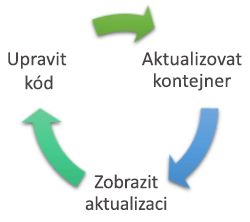
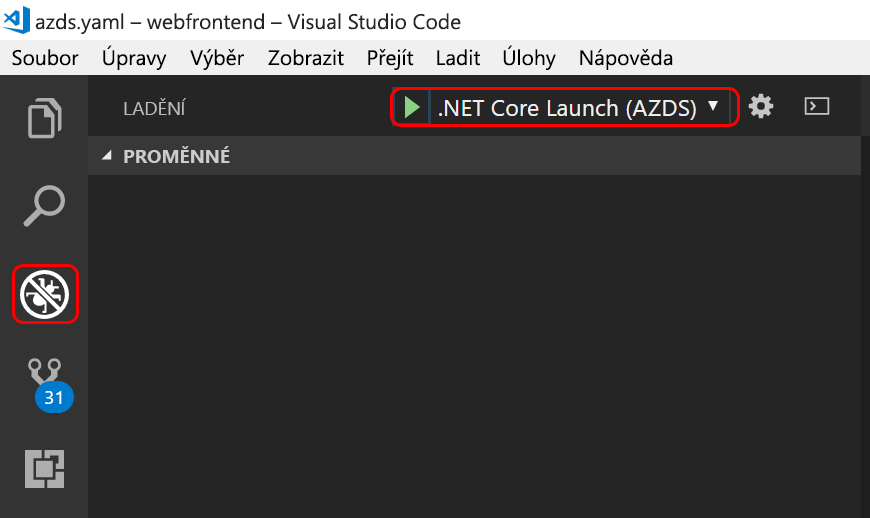

# <a name="quickstart-create-a-kubernetes-dev-space-with-azure-dev-spaces-net-core-and-vs-code"></a>Rychlý start: Vytvoření vývojového prostoru Kubernetes pomocí služby Azure Dev Spaces (.NET Core a VS Code)

V tomto průvodci se naučíte:

- Nastavit Azure Dev Spaces se spravovaným clusterem Kubernetes v Azure
- Iterativně vyvíjet kód v kontejnerech pomocí editoru VS Code a příkazového řádku
- Ladit kód ve vývojovém prostoru z editoru VS Code

> [!Note]
> **Pokud se někde zaseknete**, podívejte se na článek o [odstraňování potíží](troubleshooting.md) nebo na tuto stránku přidejte komentář. Můžete také zkusit postupovat podle podrobnějšího [kurzu](get-started-netcore.md).

## <a name="prerequisites"></a>Požadavky

- Předplatné Azure. Pokud žádné nemáte, můžete si vytvořit [bezplatný účet](https://azure.microsoft.com/free).
- [Cluster Kubernetes](https://ms.portal.azure.com/#create/microsoft.aks) na platformě Kubernetes 1.10.3 v oblasti USA – východ, USA – střed, USA – západ 2, Západní Evropa, Kanada – střed nebo Kanada – východ s povolenou možností **Směrování aplikace HTTP**.

  

- [Visual Studio Code](https://code.visualstudio.com/download).

## <a name="set-up-azure-dev-spaces"></a>Nastavení služby Azure Dev Spaces

1. Nainstalujte si [Azure CLI](/cli/azure/install-azure-cli?view=azure-cli-latest) (verze 2.0.38 nebo novější).
1. Nastavte službu Dev Spaces v clusteru AKS: `az aks use-dev-spaces -g MyResourceGroup -n MyAKS`.
1. Stáhněte si [rozšíření Azure Dev Spaces](https://marketplace.visualstudio.com/items?itemName=azuredevspaces.azds) pro VS Code. Klikněte na Nainstalovat jednou na stránce rozšíření na webu Marketplace a pak znovu ve VS Code.

## <a name="build-and-run-code-in-kubernetes"></a>Sestavení a spuštění kódu v Kubernetes

1. Stáhněte si ukázkový kód z GitHubu: [https://github.com/Azure/dev-spaces](https://github.com/Azure/dev-spaces). 
1. Změňte adresář na složku webfrontend: `cd dev-spaces/samples/dotnetcore/getting-started/webfrontend`.
1. Vygenerujte prostředky pro Docker a Helm chart: `azds prep --public`.
1. Sestavte a spusťte kód v AKS. V okně terminálu ve **složce webfrontend** spusťte tento příkaz: `azds up`
1. Ve výstupu konzoly vyhledejte informace o adrese URL, kterou vytvořil příkaz `up`. Bude v tomto tvaru: 

   `Service 'webfrontend' port 'http' is available at <url>` 

   Tuto adresu URL otevřete v okně prohlížeče. Mělo by se zobrazit načítání webové aplikace. 
   
   > [!Note]
   > Při prvním spuštění může příprava veřejného záznamu DNS trvat několik minut. Pokud se veřejná adresa URL nepřeloží, můžete použít alternativní adresu URL http://localhost:<portnumber>, která se zobrazí ve výstupu konzoly. Pokud použijete adresu URL místního hostitele, může se zdát, že je kontejner spuštěný v místním prostředí, ale ve skutečnosti je spuštěný v AKS. Pro usnadnění práce a jednodušší interakci se službou z místního počítače vytvoří Azure Dev Spaces dočasný tunel SSH do kontejneru spuštěného v Azure. Můžete se vrátit a vyzkoušet veřejnou adresu URL později, jakmile bude záznam DNS připravený.

### <a name="update-a-content-file"></a>Aktualizace souboru obsahu

1. Najděte požadovaný soubor, například `./Views/Home/Index.cshtml`, a upravte v něm kód HTML. Můžete změnit řádek 70, na kterém je `<h2>Application uses</h2>`, třeba takto: `<h2>Hello k8s in Azure!</h2>`
1. Uložte soubor. Za chvilku se v okně terminálu zobrazí zpráva o aktualizaci souboru ve spuštěném kontejneru.
1. Přejděte do prohlížeče a aktualizujte stránku. Na webové stránce by se měl zobrazit aktualizovaný kód HTML.

Co se stalo? Úpravy obsahových souborů jako HTML a CSS nevyžadují rekompilaci ve webové aplikaci .NET Core. Aktivní příkaz `azds up` totiž automaticky synchronizuje všechny upravené soubory obsahu do kontejneru spuštěného v Azure, abyste změny obsahu viděli okamžitě.

### <a name="update-a-code-file"></a>Aktualizace souboru s kódem
Aktualizace souborů s kódem je o něco pracnější, protože aplikace .NET Core musí znovu sestavit a vytvořit aktualizované binární soubory aplikace.

1. V okně terminálu stiskněte `Ctrl+C`, abyste zastavili `azds up`.
1. Otevřete soubor s kódem, který se jmenuje `Controllers/HomeController.cs`, a upravte zprávu, která se zobrazí na stránce O aplikaci: `ViewData["Message"] = "Your application description page.";`
1. Uložte soubor.
1. V okně terminálu spusťte `azds up`. 

Tento příkaz znovu sestaví image kontejneru a znovu nasadí Helm chart. Pokud chcete vidět, jak se změny kódu projevily v běžící aplikaci, přejděte do nabídky O aplikaci webové aplikace.

Existuje ještě *rychlejší způsob* vývoje kódu, který si ukážeme v další části. 

## <a name="debug-a-container-in-kubernetes"></a>Ladění kontejneru v Kubernetes

V této části použijete editor VS Code k přímému ladění kontejneru spuštěného v Azure. Naučíte se také, jak zrychlit cyklus úpravy-spuštění-testování.



### <a name="initialize-debug-assets-with-the-vs-code-extension"></a>Inicializace prostředků ladění s využitím rozšíření VS Code
Nejdřív musíte nakonfigurovat projekt kódu tak, aby editor VS Code komunikoval s vývojovým prostorem v Azure. Rozšíření VS Code pro Azure Dev Spaces poskytuje pomocný příkaz pro nastavení konfigurace ladění. 

Otevřete **paletu příkazů** (pomocí nabídky **Zobrazit | Paleta příkazů**) a pomocí automatického dokončování zadejte a vyberte tento příkaz: `Azure Dev Spaces: Prepare configuration files for Azure Dev Spaces`. 

Tím přidáte konfiguraci ladění pro Azure Dev Spaces do složky `.vscode`.


### <a name="select-the-azds-debug-configuration"></a>Výběr konfiguraci AZDS pro ladění
1. Pokud chcete zobrazit ladění, klikněte na boku editoru VS Code na **panelu aktivit** na ikonu Ladění.
1. Jako aktivní konfiguraci ladění vyberte **.NET Core Launch (AZDS)** (Spustit .NET Core (AZDS)).



> [!Note]
> Pokud na paletě příkazů nevidíte příkazy Azure Dev Spaces, ověřte, že máte nainstalované rozšíření VS Code pro Azure Dev Spaces. Ujistěte se, že pracovní prostor, který jste otevřeli ve VS Code, je složka obsahující soubor azds.yaml.


### <a name="debug-the-container-in-kubernetes"></a>Ladění kontejneru v Kubernetes
Když chcete v Kubernetes ladit kód, stiskněte **F5**.

Stejně jako u příkazu `up` se kód synchronizuje s vývojovým prostorem a sestaví se kontejner, který se nasadí v Kubernetes. Ladicí program se tentokrát samozřejmě připojí ke vzdálenému kontejneru.

> [!Tip]
> Na stavovém řádku editoru VS Code se zobrazí adresa URL, na kterou můžete kliknout.

V serverovém souboru s kódem nastavte zarážku, třeba ve funkci `Index()` ve zdrojovém souboru `Controllers/HomeController.cs`. Aktualizace stránky v prohlížeči způsobí aktivaci zarážky.

Máte plný přístup k informacím o ladění, jako je zásobník volání, místní proměnné, informace o výjimkách apod., stejně jako při lokálním spuštění kódu.

### <a name="edit-code-and-refresh"></a>Úprava a aktualizace kódu
V aktivním ladicím programu upravte kód. Můžete třeba změnit zprávu na stránce O aplikaci v `Controllers/HomeController.cs`. 

```csharp
public IActionResult About()
{
    ViewData["Message"] = "My custom message in the About page.";
    return View();
}
```

Uložte soubor a v **podokně akcí ladicího programu** klikněte na tlačítko **Aktualizovat**. 


Místo opětovného sestavení a nasazení nové image kontejneru po každé provedené změně, což často dlouho trvá, rekompiluje služba Azure Dev Spaces kód po přírůstcích ve stávajícím kontejneru, aby se zrychlil cyklus úprav/ladění.

Aktualizujte webovou aplikaci v prohlížeči a přejděte na stránku O aplikaci. V uživatelském rozhraní by se měla zobrazit vaše upravená zpráva.

**Teď máte metodu, jak rychle provádět iteraci kódu a jeho ladění v Kubernetes.**

## <a name="next-steps"></a>Další kroky

Zjistěte, jak vám může služba Azure Dev Spaces pomoct s vývojem složitějších aplikací používajících více kontejnerů a jak si můžete zjednodušit spolupráci na vývoji díky práci s různými verzemi nebo větvemi kódu v různých prostorech. 

> [!div class="nextstepaction"]
> [Práce s více kontejnery a týmový vývoj](team-development-netcore.md)