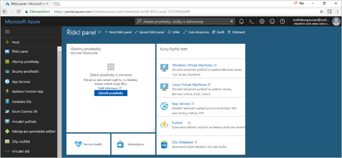
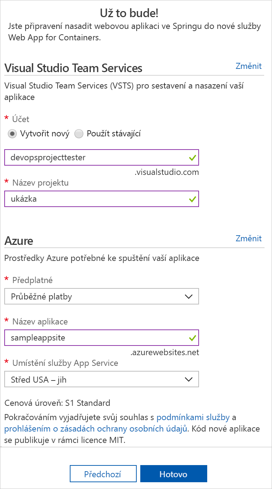
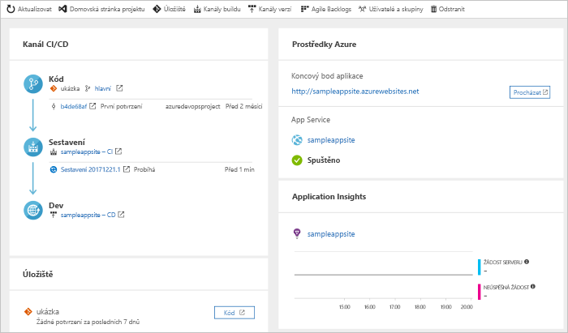

# Vytvoření kanálu CI/CD pro Javu pomocí služby Azure DevOps Project

Azure DevOps Project představuje zjednodušené prostředí, které pro vaši aplikaci v Javě vytvoří prostředky Azure a nastaví kanál průběžné integrace (CI) a průběžného doručování (CD) ve Visual Studio Team Services (VSTS), což je řešení DevOps Microsoftu pro Azure.  

Pokud nemáte předplatné Azure, můžete ho získat zdarma prostřednictvím programu [Visual Studio Dev Essentials](https://visualstudio.microsoft.com/dev-essentials/).

## Přihlášení k webu Azure Portal

Azure DevOps Project vytvoří kanál CI/CD ve VSTS.  Můžete zdarma vytvořit **nový účet VSTS** nebo použít **existující účet**.  DevOps Project také vytvoří **prostředky Azure** v **předplatném Azure** podle vašeho výběru.

1. Přihlaste se k webu [Azure Portal](https://portal.azure.com).

1. V levém navigačním panelu zvolte ikonu **Vytvořit prostředek** a pak vyhledejte **Projekt DevOps**.  Zvolte **Vytvořit**.

    

## Výběr ukázkové aplikace a služby Azure

1. Vyberte ukázkovou aplikaci v **Javě**.  Ukázka v Javě zahrnuje výběr několika architektur aplikace.

1. Výchozí architektura ukázky je **Spring**. Ponechte výchozí nastavení a zvolte **Další**.  

1. Výchozí cíl nasazení je **Web App for Containers**.  Architektura aplikace, kterou jste zvolili v předchozích krocích, určuje typ cíle nasazení služby Azure, který je zde k dispozici.  Ponechte nastavenou výchozí službu a zvolte **Další**.
 
## Konfigurace VSTS a předplatného Azure 

1. Vytvořte **nový** účet VSTS nebo zvolte **existující** účet.  Zvolte **název** pro váš projekt VSTS.  Vyberte vaše **předplatné Azure**, **umístění** a zvolte **název** pro vaši aplikaci.  Jakmile budete hotovi, zvolte **Hotovo**.

    

1. Během několika minut se na webu Azure Portal načte **řídicí panel projektu**.  Ukázková aplikace se nastaví v úložišti ve vašem účtu VSTS, spustí se sestavení a vaše aplikace se nasadí do Azure.  Tento řídicí panel poskytuje přehled o vašem **úložišti kódu**, **kanálu CI/CD VSTS** a vaší **aplikaci v Azure**.  Na pravé straně řídicího panelu vyberte **Procházet** a zobrazte vaši spuštěnou aplikaci.

     
    
Projekt Azure DevOps automaticky nakonfiguruje trigger CI pro sestavení a vydání.  Teď jste připraveni při práci na aplikaci v Javě spolupracovat s týmem s využitím procesu CI/CD, který automaticky nasazuje nejnovější práci na web.

## Potvrzení změn kódu a spuštění CI/CD

Projekt Azure DevOps ve vašem účtu VSTS nebo GitHub vytvořil úložiště Git.  Podle následujícího postupu zobrazte úložiště a proveďte změny kódu vaší aplikace.

1. Na levé straně řídicího panelu projektu DevOps vyberte odkaz na vaši **hlavní** větev.  Tento odkaz otevře zobrazení nově vytvořeného úložiště Git.

1. Pokud chcete zobrazit adresu URL klonu úložiště, v pravé horní části prohlížeče vyberte **Clone** (Klonovat). Úložiště Git můžete naklonovat do svého oblíbeného integrovaného vývojového prostředí (IDE).  V dalších několika krocích můžete k provedení změn kódu a jejich potvrzení přímo do hlavní větve použít webový prohlížeč.

1. Na levé straně prohlížeče přejděte k souboru **src/main/webapp/index.html**.

1. Vyberte **Upravit** a proveďte změnu nějakého textu.  Změňte například text v některé ze značek div.

1. Zvolte **Potvrdit** a pak uložte provedené změny.

1. V prohlížeči přejděte na **řídicí panel projektu Azure DevOps**.  Teď by se mělo zobrazit probíhající sestavení.  Změny, které jste právě provedli, se automaticky sestaví a nasadí přes kanál CI/CD VSTS.

## Prozkoumání kanálu CI/CD VSTS

Projekt Azure DevOps ve vašem účtu VSTS automaticky nakonfiguroval úplný kanál CI/CD VSTS.  Prozkoumejte kanál a podle potřeby ho upravte.  Postupujte podle následujících kroků a seznamte se s definicemi sestavení a verze VSTS.

1. V **horní** části řídicího panelu projektu Azure DevOps vyberte **Kanály sestavení**.  Tento odkaz na nové kartě prohlížeče otevře definici sestavení VSTS pro váš nový projekt.

1. Přesuňte kurzor myši napravo od definice sestavení vedle pole **Stav**. Vyberte **tři tečky**, které se zobrazí.  Tato akce otevře nabídku, ze které můžete spustit několik aktivit, jako je zařazení nového sestavení do fronty, pozastavení sestavení a úprava definice sestavení.

1. Vyberte **Upravit**.

1. V tomto zobrazení můžete **prozkoumat různé úlohy** pro vaši definici sestavení.  Sestavení provádí různé úlohy, jako je načtení zdrojů z úložiště Git, obnovení závislostí a publikování výstupů používaných pro nasazení.

1. V horní části definice sestavení vyberte **název definice sestavení**.

1. Změňte **název** vaší definice sestavení na něco výstižnějšího.  Vyberte **Uložit a zařadit do fronty** a pak vyberte **Uložit**.

1. Pod názvem vaší definice sestavení vyberte **Historie**.  Zobrazí se protokol auditu nedávno provedených změn sestavení.  VSTS uchovává informace o všech změnách definice sestavení a umožňuje porovnání verzí.

1. Vyberte **Triggery**.  Projekt Azure DevOps automaticky vytvořil trigger CI a každé potvrzení v úložišti spustí nové sestavení.  Volitelně můžete zvolit, které větve se do procesu CI zahrnou nebo se z něj vyloučí.

1. Vyberte **Uchování**.  V závislosti na vašem scénáři můžete určit zásady pro zachování nebo odebrání určitého počtu sestavení.

1. Vyberte **Sestavení a vydání** a zvolte **Verze**.  Projekt Azure DevOps vytvořil definici verze VSTS pro správu nasazení do Azure.

1. Na levé straně prohlížeče vyberte **tři tečky** vedle vaší definice verze a pak zvolte **Upravit**.

1. Definice verze obsahuje **kanál**, který definuje proces vydání.  V části **Artefakty** vyberte **Zahodit**.  Definice sestavení, kterou jste zkoumali v předchozích krocích, vygeneruje výstup, který se použije pro artefakt. 

1. Napravo od ikony **Zahodit** vyberte **Trigger průběžného nasazování**.  Tato definice verze má povolený trigger CD, který spustí nasazení pokaždé, když bude k dispozici nový artefakt sestavení.  Volitelně můžete trigger zakázat, aby vaše nasazení vyžadovala ruční spuštění. 

1. Na levé straně prohlížeče vyberte **Úlohy**.  Úlohy jsou aktivity, které se provádí ve vašem procesu nasazení.  V tomto příkladu se vytvořila úloha pro nasazení do služby **Azure App Service**.

1. Na pravé straně prohlížeče vyberte **Zobrazit verze**.  Toto zobrazení ukazuje historii vydaných verzí.

1. Vyberte **tři tečky** vedle některé z vydaných verzí a zvolte **Otevřít**.  Toto zobrazení obsahuje několik nabídek, které můžete prozkoumat, například souhrn verze, související pracovní položky a testy.

1. Vyberte **Potvrzení**.  Toto zobrazení ukazuje potvrzení kódu související s konkrétním nasazením. 

1. Vyberte **Protokoly**.  Protokoly obsahují užitečné informace o procesu nasazení.  Můžete je zobrazit během nasazení i po nich.

## Vyčištění prostředků

Pokud už je nepotřebujete, můžete službu Azure App Service a související prostředky vytvořené v tomto rychlém startu odstranit pomocí funkce **Odstranit** na řídicím panelu projektu Azure DevOps.

## Další kroky

Když jste v tomto rychlém startu nakonfigurovali proces CI/CD, ve vašem projektu VSTS se automaticky vytvořily definice sestavení a verze. Tyto definice sestavení a verze můžete upravit tak, aby splňovaly požadavky vašeho týmu. Další informace najdete v tomto kurzu:

> [!div class="nextstepaction"]
> [Přizpůsobení procesu CD](https://docs.microsoft.com/vsts/pipelines/release/define-multistage-release-process?view=vsts)
