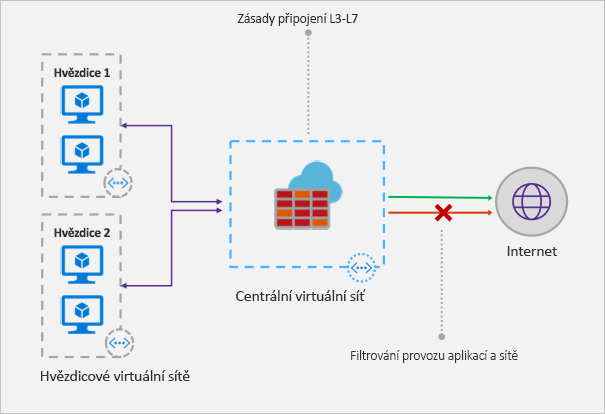

# Co je brána Azure Firewall?

Azure Firewall je spravovaná cloudová služba síťového zabezpečení, která chrání vaše prostředky ve virtuálních sítích Azure. Jde o plně stavovou bránu firewall poskytovanou jako služba s integrovanou vysokou dostupností a neomezenou cloudovou škálovatelností. 

[!INCLUDE [firewall-preview-notice](../../includes/firewall-preview-notice.md)]

Můžete centrálně vytvářet, vynucovat a protokolovat zásady připojení k aplikacím a sítím napříč různými předplatnými a virtuálními sítěmi. Brána Azure Firewall používá statickou veřejnou IP adresu pro prostředky virtuální sítě a díky tomu umožňuje venkovním bránám firewall identifikovat provoz pocházející z vaší virtuální sítě.  Služba je plně integrovaná se službou Azure Monitor zajišťující protokolování a analýzy.

## Funkce

Veřejná verze Preview brány Azure Firewall nabízí následující funkce:

### Integrovaná vysoká dostupnost
Vysoká dostupnost je přímo součástí návrhu, takže není nutné žádné dodatečné vyrovnávání zatížení ani konfigurace.

### Neomezená cloudová škálovatelnost 
Bránu Azure Firewall můžete vertikálně škálovat tak, jak to vyžadují změny v síťovém provozu, takže nemusíte platit za dimenzování podle špiček v datovém toku.

### Filtrování FQDN 
Odchozí přenosy HTTP/S můžete omezit na zadaný seznam plně kvalifikovaných názvů domén (FQDN) včetně zástupných znaků. Tato funkce nevyžaduje ukončení protokolu SSL.

### Pravidla filtrování síťového provozu

Můžete centrálně vytvořit pravidla pro *povolení* nebo *blokování* podle zdrojové a cílové IP adresy, portu a protokolu. Brána Azure Firewall je plně stavová, takže dokáže odlišit legitimní pakety pro různé typy spojení. Pravidla jsou vynucována a protokolována napříč různými předplatnými a virtuálními sítěmi.

### Podpora pro odchozí SNAT

Veškeré IP adresy pro odchozí provoz z virtuálních sítí se překládají na veřejnou IP adresu brány Azure Firewall na základě zdroje (SNAT). Můžete identifikovat a povolit provoz pocházející z vaší virtuální sítě do vzdálených internetových cílů.

### Protokolování Azure Monitor

Všechny události jsou zaznamenávány službou Azure Monitor a díky tomu je možné archivovat protokoly do účtu úložiště, streamovat události do centra událostí nebo je odesílat do služby Log Analytics.

## Známé problémy

Veřejná verze Preview brány Azure Firewall má následující známé problémy:

|Problém  |Popis  |Omezení rizik  |
|---------|---------|---------|
|Spolupráce se skupinami NSG     |Pokud je v podsíti brány firewall použitá skupina zabezpečení sítě (NSG), může být odchozí připojení k Internetu zablokováno i v případě, že je skupina zabezpečení sítě nakonfigurována, aby odchozí provoz umožňovala. Odchozí internetová spojení jsou označena jako pocházející z virtuální sítě a s cílem v internetu. Skupina zabezpečení sítě má ve výchozím nastavení *povolenou* komunikaci z jedné sítě VirtualNetwork do druhé, ale ne v případě, že cílem je internet.|Tento problém můžete odstranit přidáním příchozího pravidla do skupiny zabezpečení sítě, které se použije v podsíti brány firewall:  Zdroj: VirtualNetwork Zdrojové porty: Libovolné   Cíl: Libovolný Cílové porty: Libovolné   Protokolovat: Vše Přístup: Povolit|
|Konflikt s funkcí Just-in-Time (JIT) služby Azure Security Center (ASC)|Pokud se k virtuálnímu počítači přistupuje metodou JIT a je v podsíti s uživatelem definovanou trasou, která odkazuje na Azure Firewall jako na výchozí bránu, nebude ASC JIT fungovat. To je důsledkem asymetrického směrování – paket přichází přes veřejnou IP adresu virtuálního počítače (JIT otevřel přístup), ale návratový paket odchází přes bránu firewall, která ho zahodí, protože v bráně firewall nebyla otevřena žádná relace.|Tento problém odstraníte tak, že umístíte virtuální počítače s JIT do samostatné podsítě, která nemá uživatelem definovanou trasu do firewallu.|
|Hvězdicová architektura s globálním peeringem nefunguje|Hvězdicová architektura, kdy jsou rozbočovač a brána firewall nasazené v jedné oblasti Azure a koncové body připojené k rozbočovači prostřednictvím globálního peeringu VNet jsou v jiné oblasti, není podporovaná.|Další informace najdete v tématu [Vytvoření, změna nebo odstranění peeringu virtuální sítě](https://docs.microsoft.com/en-us/azure/virtual-network/virtual-network-manage-peering#requirements-and-constraints).|
Pravidla síťového filtrování pro jiné protokoly než TCP/UDP (třeba ICMP) nebudou fungovat pro provoz do internetu.|Pravidla síťového filtrování pro jiné protokoly než TCP/UDP nefungují s překladem SNAT na veřejnou IP adresu. Jiné protokoly než TCP/UDP jsou ale podporované mezi koncovými podsítěmi a virtuálními sítěmi.|Azure Firewall používá vyvažování zatížení úrovně Standard, [které v současnosti nepodporuje SNAT pro protokol IP](https://docs.microsoft.com/en-us/azure/load-balancer/load-balancer-standard-overview#limitations). Zkoumáme možnosti, jak podporu tohoto scénáře zahrnout do budoucích verzí.

## Další kroky

- [Kurz: Nasazení a konfigurace brány Azure Firewall pomocí webu Azure Portal](tutorial-firewall-deploy-portal.md)
- [Nasazení brány Azure Firewall pomocí šablony](deploy-template.md)
- [Vytvoření testovacího prostředí brány Azure Firewall](scripts/sample-create-firewall-test.md)

