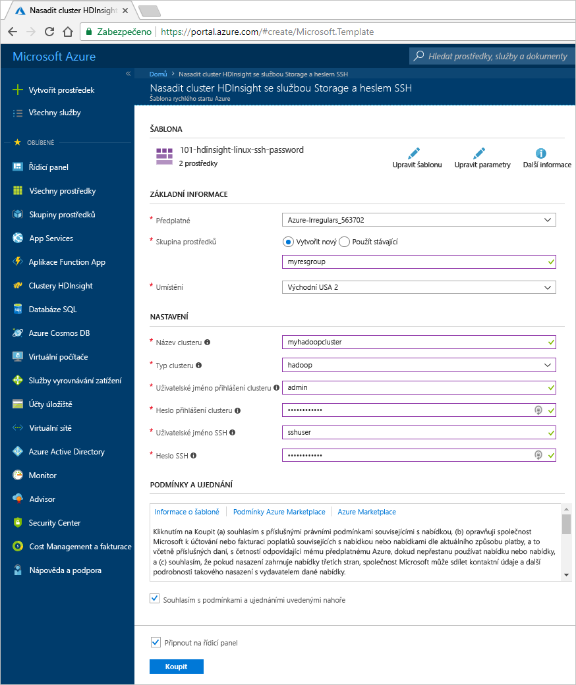
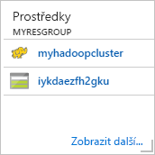
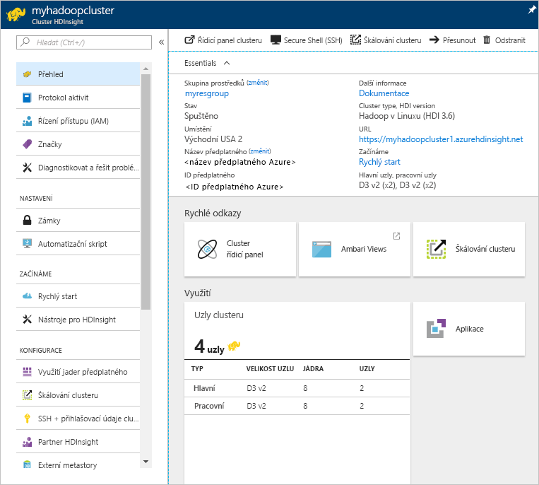

# Kurz Hadoopu: Začínáme používat Hadoop v HDInsight

Naučte se vytvářet clustery [Hadoop](http://hadoop.apache.org/) v HDInsight a spouštět úlohy Hive v HDInsight. [Hive Apache](https://hive.apache.org/) je nejoblíbenější součástí ekosystému Hadoop. Aktuálně se HDInsight dodává se [sedmi různými typy clusteru](apache-hadoop-introduction.md#overview). Každý typ clusteru podporuje odlišnou sadu komponent. Všechny typy clusteru podporují Hive. Seznam podporovaných součásti v HDInsight naleznete v tématu [Co je nového ve verzích clusterů Hadoop poskytovaných v HDInsight?](../hdinsight-component-versioning.md)  

[!INCLUDE [delete-cluster-warning](../../../includes/hdinsight-delete-cluster-warning.md)]

## Požadavky
Než začnete tento kurz, musíte mít:

* **Předplatné Azure**: pro vytvoření bezplatného zkušebního účet na jeden měsíc otevřete web [azure.microsoft.com/free](https://azure.microsoft.com/free).

## Vytvoření clusteru

Většina úloh Hadoop jsou dávkové úlohy. Vytvoříte cluster, spustíte některé úlohy a pak cluster odstraníte. V této části vytvoříte cluster Hadoop ve službě HDInsight pomocí [šablony Azure Resource Manageru](../../azure-resource-manager/resource-group-template-deploy.md). Zkušenosti s šablonou Resource Manageru nejsou pro postup dle tohoto kurzu vyžadovány. Další metody vytváření clusterů a principy vlastnosti používaných v tomto kurzu, naleznete v části [Vytváření clusterů HDInsight](../hdinsight-hadoop-provision-linux-clusters.md).

Šablona Resource Manageru použitá v tomto kurzu je umístěná v [GitHubu](https://azure.microsoft.com/resources/templates/101-hdinsight-linux-ssh-password/). 

1. Klikněte na následující obrázek pro přihlášení do Azure a otevřete šablonu Resource Manageru na webu Azure Portal. 
   
    

2. Zadejte nebo vyberte tyto hodnoty:
   
    .
   
    * **Předplatné**: Vyberte své předplatné Azure.
    * **Skupina prostředků**: Vytvořte skupinu prostředků, nebo vyberte existující.  Skupina prostředků je kontejner komponent Azure.  V tomto případě skupina prostředků obsahuje cluster HDInsight a závislý účet služby Azure Storage. 
    * **Umístění**: Vyberte umístění Azure, ve kterém chcete cluster vytvořit.  Pro dosažení lepšího výkonu zvolte co nejbližší umístění. 
    * **Typ clusteru**: Pro účely tohoto kurzu vyberte **hadoop**.
    * **Název clusteru:** Zadejte název clusteru Hadoop.
    * **Přihlašovací jméno a heslo clusteru**: výchozí přihlašovací jméno je **admin**.
    * **Uživatelské jméno a heslo SSH**: výchozí uživatelské jméno **sshuser**.  Můžete ho změnit. 
     
    Některé vlastnosti jsou v šabloně pevně kódované.  Takové hodnoty můžete konfigurovat v šabloně.
    
    Každý cluster obsahuje závislost [účtu Azure Storage](../hdinsight-hadoop-use-blob-storage.md) nebo [účtu Azure Data Lake](../hdinsight-hadoop-use-data-lake-store.md). Označuje se jako výchozí účet úložiště. Cluster HDInsight a jeho výchozí účet úložiště musí být umístěny společně a nacházet se ve stejné oblasti Azure. Odstraněním clusterů nedojde k odstranění účtu úložiště. 
        
    Podrobnější vysvětlení těchto vlastností naleznete v tématu [Vytváření clusterů Hadoop ve službě HDInsight](../hdinsight-hadoop-provision-linux-clusters.md).

3. Vyberte **Souhlasím s podmínkami a ujednáními uvedenými nahoře** a **Připnout na řídicí panel** a pak klikněte na **Koupit**. Na řídicím panelu portálu by se měla zobrazit nová dlaždice s názvem **Nasazení šablony**. Vytvoření clusteru trvá přibližně 20 minut. 

4. Jakmile je cluster vytvořen, popis dlaždice se změní na zadaný název skupiny prostředků. Kliknutím na dlaždici zobrazíte cluster i výchozí úložiště pro uvedený cluster.
   
    

4. Cluster otevřete tak, že kliknete na jeho název.

   

## Spuštění dotazů Hive

[Apache Hive](hdinsight-use-hive.md) je nejoblíbenější součástí používanou v HDInsight. Existuje mnoho způsobů spouštění úloh Hive v HDInsight. V tomto kurzu použijete zobrazení Ambari Hive z portálu. Další metody pro odesílání úloh Hive naleznete v části [Použití Hive v HDInsight](hdinsight-use-hive.md).

1. Pokud chcete otevřít Ambari, klikněte na **Řídicí panel clusteru** uvedený na předchozím snímku obrazovky a pak klikněte na **Řídicí panel clusteru HDInsight**.  Můžete také přejít na adresu **https://&lt;název_clusteru>.azurehdinsight.net**, kde &lt;název_clusteru> je název clusteru vytvořeného v předchozí části.

2. Zadejte uživatelské jméno a heslo Hadoop, které jste zadali při vytváření clusteru. Výchozí uživatelské jméno **admin**.

3. Otevřete **Zobrazení Hive**, jak je znázorněno na následujícím snímku obrazovky:
   
    

4. Na kartě **DOTAZ** vložte následující příkazy HiveQL do pracovního listu:
   
        SHOW TABLES;

    
   
   > [!NOTE]
   > Hive vyžaduje středník.       
   > 
   > 

5. Klikněte na tlačítko **Spustit**. Karta **VÝSLEDKY** se zobrazí pod kartou **DOTAZ** a zobrazí informace o úloze. 
   
    Po dokončení dotazu se na kartě **DOTAZ** zobrazí výsledky operace. Zobrazí jedna tabulka s názvem **hivesampletable**. Tato vzorová tabulka Hive obsahuje všechny clustery HDInsight.
   
    

6. Opakujte kroky 4 a 5 a spusťte následující dotaz:
   
        SELECT * FROM hivesampletable;
   
7. Výsledky dotazu můžete také uložit. Klikněte na tlačítko nabídky na pravé straně a určete, zda chcete stáhnout výsledky jako soubor CSV, nebo je uložit do účtu úložiště přidruženého clusteru.

    

Po dokončení úlohy Hive můžete [Exportovat výsledky do databáze Azure SQL nebo databáze systému SQL Server](apache-hadoop-use-sqoop-mac-linux.md), můžete také [zobrazit výsledky pomocí aplikace Excel](apache-hadoop-connect-excel-power-query.md). Další informace o používání Hive v HDInsight naleznete v části [Použití Hive a HiveQL s Hadoop v HDInsight k analýze ukázkového souboru Apache log4j](hdinsight-use-hive.md).

## Vyčistěte kurz
Po dokončení kurzu můžete cluster odstranit. Pomocí HDInsight jsou vaše data uložena v Azure Storage, takže můžete clusteru bezpečně odstranit, pokud není používán. Za cluster služby HDInsight se účtují poplatky, i když se nepoužívá. Vzhledem k tomu, že poplatky za cluster představují několikanásobek poplatků za úložiště, dává ekonomický smysl odstraňovat clustery, které nejsou používány. 

> [!NOTE]
> Pomocí [Azure Data Factory](../hdinsight-hadoop-create-linux-clusters-adf.md) můžete s HDInsight vytvářet clustery na vyžádání a nakonfigurovat nastavení TimeToLive na automatické mazání clusterů. 
> 
> 

**Postup odstranění clusteru a/nebo výchozího účtu úložiště**

1. Přihlaste se k webu [Azure Portal](https://portal.azure.com).
2. V ovládacím panelu portálu klikněte na dlaždici s názvem skupiny prostředků, které jste použili při vytvoření clusteru.
3. Pokud chcete odstranit skupinu prostředků, která obsahuje cluster a výchozí účet úložiště, klikněte na **Odstranit skupinu prostředků**. Můžete také kliknout na název clusteru na dlaždici **Prostředky** a pak kliknout na **Odstranit**. Upozorňujeme, že odstraněním skupiny prostředků odstraníte účet úložiště. Pokud chcete zachovat účet úložiště, zvolte odstranění samotného clusteru.

## Řešení potíží

Pokud narazíte na problémy s vytvářením clusterů HDInsight, podívejte se na [požadavky na řízení přístupu](../hdinsight-administer-use-portal-linux.md#create-clusters).

## Další kroky
V tomto kurzu jste se naučili, jak vytvořit cluster HDInsight se systémem Linux pomocí šablony Resource Manageru, a jak provádět základní dotazy Hive.

Další informace o analýze dat pomocí HDInsight naleznete v následujících článcích:

* Další informace o používání Hivu se službou HDInsight, včetně postupu provádění dotazů Hivu ze sady Visual Studio, najdete v tématu [Použití Hivu se službou HDInsight](hdinsight-use-hive.md).
* Další informace o jazyce Pig používaném k transformaci dat najdete v tématu [Použití Pigu se službou HDInsight](hdinsight-use-pig.md).
* Další informace o MapReduce, způsobu psaní programů, které zpracovávají data v Hadoopu, najdete v tématu [Použití MapReduce se službou HDInsight](hdinsight-use-mapreduce.md).
* Další informace o použití nástrojů HDInsight pro Visual Studio k analýze dat na HDInsight naleznete v části [Začněte používat nástroje Visual Studio Hadoop pro HDInsight](apache-hadoop-visual-studio-tools-get-started.md).

Pokud chcete začít pracovat s vlastními daty a potřebujete další informace o ukládání dat službou HDInsight nebo o tom, jak data do této služby nahrát, přečtěte si následující články:

* Informace o tom, jak HDInsight používá Azure Storage, najdete v tématu [Používání Azure Storage s HDInsight](../hdinsight-hadoop-use-blob-storage.md).
* Informace o tom, jak nahrát data do služby HDInsight, najdete v tématu [Nahrání dat do služby HDInsight](../hdinsight-upload-data.md).

Pokud potřebujete další informace o vytváření a správě clusteru HDInsight, přečtěte si následující články:

* Další informace o správě clusteru HDInsight se systémem Linux naleznete v části [Správa clusterů HDInsight pomocí Ambari](../hdinsight-hadoop-manage-ambari.md).
* Další informace o možnostech, které můžete vybrat při vytváření clusteru služby HDInsight, naleznete v tématu [Vytváření HDInsight na Linuxu pomocí vlastních možností](../hdinsight-hadoop-provision-linux-clusters.md).
* Je-li obeznámeni s Linux a Hadoop, ale chcete znát podrobnosti o Hadoop na HDInsight, prostudujte si část [Práce s HDInsight v systému Linux](../hdinsight-hadoop-linux-information.md). Tento článek obsahuje informace o:
  
  * Adresách URL služeb hostovaných v clusteru, například Ambari a WebHCat
  * Umístění souborů Hadoop a příkladech v místním systému souborů
  * Používání Azure Storage (WASB) namísto HDFS jako výchozího datového úložiště

[1]: ../HDInsight/apache-hadoop-visual-studio-tools-get-started.md

[hdinsight-provision]: hdinsight-provision-linux-clusters.md
[hdinsight-upload-data]: hdinsight-upload-data.md
[hdinsight-use-hive]: hdinsight-use-hive.md
[hdinsight-use-pig]: hdinsight-use-pig.md

