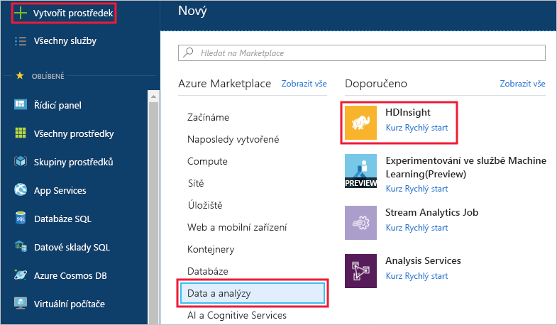
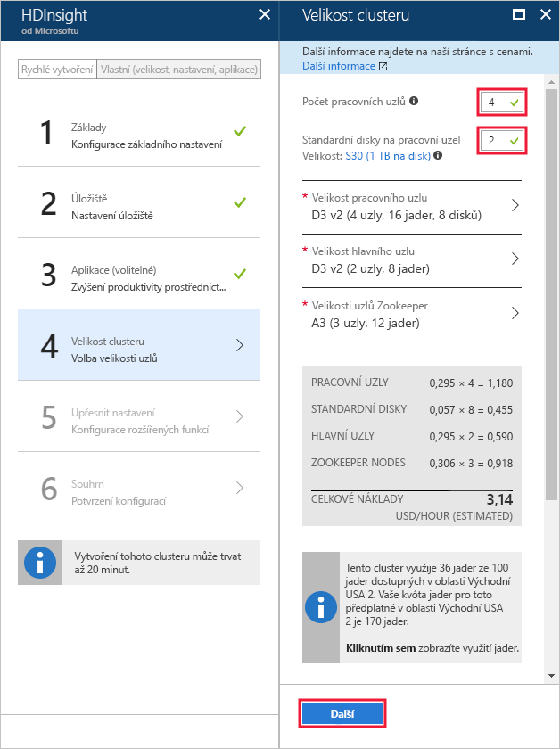

# <a name="start-with-apache-kafka-on-hdinsight"></a>Začínáme s Apache Kafka ve službě HDInsight

Zjistěte, jak vytvořit a používat cluster [Apache Kafka](https://kafka.apache.org) v Azure HDInsight. Kafka je opensourcová distribuovaná streamovací platforma, která je dostupná pro HDInsight. Často se používá jako zprostředkovatel zpráv, protože nabízí funkce podobné frontě pro publikování a odběr zpráv. Kafka se běžně používá s Apache Spark a Apache Storm.

> [!NOTE]
> Aktuálně jsou pro HDInsight dostupné dvě verze Kafka: 0.9.0 (HDInsight 3.4) a 0.10.0 (HDInsight 3.5 a 3.6). Postupy v tomto dokumentu předpokládají, že používáte Kafka ve službě HDInsight 3.6.

[!INCLUDE [delete-cluster-warning](../../../includes/hdinsight-delete-cluster-warning.md)]

## <a name="create-a-kafka-cluster"></a>Vytvoření clusteru Kafka

Pomocí následujících kroků můžete vytvořit systém Kafka na clusteru HDInsight:

1. Na webu [Azure Portal](https://portal.azure.com), vyberte **+ Vytvořit prostředek**, **Data a analýzy** a poté vyberte **HDInsight**.
   
    

2. V části **Základy** zadejte následující informace:

    * **Název clusteru:** Název clusteru HDInsight.
    * **Předplatné:** Vyberte předplatné, které chcete použít.
    * **Uživatelské jméno přihlášení clusteru** a **Heslo přihlášení clusteru**: Přihlašovací údaje pro přístup ke clusteru pomocí protokolu HTTPS. Tyto přihlašovací údaje se používají i pro přístup ke službám, jako jsou webové uživatelské rozhraní Ambari nebo REST API.
    * **Uživatelské jméno Secure Shell (SSH:)** Přihlašovací údaje používané pro přístup ke clusteru přes SSH. Ve výchozím nastavení je heslo stejné jako pro přihlášení ke clusteru.
    * **Skupina prostředků:** Skupina prostředků, ve které se cluster vytváří.
    * **Umístění:** Oblast Azure, ve které se cluster vytváří.

        > [!IMPORTANT]
        > K zajištění vysoké dostupnosti dat doporučujeme vybrat umístění (oblast), které obsahuje __tři domény selhání__. Další informace najdete v části [Vysoká dostupnost dat](#data-high-availability).
   
 

3. Vyberte **Typ clusteru** a pak v části **Konfigurace clusteru** nastavte následující hodnoty:
   
    * **Typ clusteru:** Kafka
    * **Verze:** Kafka 0.10.0 (HDI 3.6)

    Nakonec uložte nastavení tlačítkem **Vybrat**.
     
 

4. Po výběru typu clusteru použijte tlačítko __Vybrat__ k výběru typu clusteru. Dále stisknutím tlačítka __Další__ dokončete základní konfiguraci.

5. V části **Úložiště** vyberte nebo vytvořte účet úložiště. Pro ukázkový postup v tomto dokumentu ponechte ve všech ostatních polích výchozí hodnoty. Stisknutím tlačítka __Další__ uložte konfiguraci úložiště.

    

6. Pokud chcete pokračovat, v části __Aplikace (volitelné)__ vyberte __Další__. Pro tento příklad se nepožadují žádné aplikace.

7. Pokud chcete pokračovat, v části __Velikost clusteru__ vyberte __Další__.

    > [!WARNING]
    > Pokud chcete zajistit dostupnost Kafka v HDInsightu, musí cluster obsahovat aspoň tři pracovní uzly. Další informace najdete v části [Vysoká dostupnost dat](#data-high-availability).

    

    > [!IMPORTANT]
    > Položka **počet disků na pracovní uzel** řídí škálovatelnost Kafka ve službě HDInsight. Platforma Kafka ve službě HDInsight používá místní disky virtuálních počítačů v clusteru. Platforma Kafka je náročná na V/V prostředky, proto k zajištění vysoké propustnosti a vyšší kapacity úložiště na každý uzel se využívá služba [Azure Managed Disks](../../virtual-machines/windows/managed-disks-overview.md). Typ spravovaného disku může být buď __Standardní__ (HDD), nebo __Prémiový__ (SSD). Prémiové disky se používají u virtuálních počítačů řady DS a GS. Všechny ostatní typy virtuálních počítačů používají standardní disky.

8. Pokud chcete pokračovat, v části __Upřesňující nastavení__ vyberte __Další__.

9. V části **Souhrn** zkontrolujte konfiguraci clusteru. Pomocí odkazů __Upravit__ opravte případná chybná nastavení. Nakonec stisknutím tlačítka Vytvořit cluster vytvořte.
   
    
   
    > [!NOTE]
    > Vytvoření clusteru trvá přibližně 20 minut.

## <a name="connect-to-the-cluster"></a>Připojení ke clusteru

> [!IMPORTANT]
> Při provádění následujících kroků je potřeba použít klienta SSH. Další informace najdete v dokumentu [Použití SSH se službou HDInsight](../hdinsight-hadoop-linux-use-ssh-unix.md).

Z klienta se připojte ke clusteru pomocí SSH:

```ssh SSHUSER@CLUSTERNAME-ssh.azurehdinsight.net```

Místo **SSHUSER** použijte uživatelské jméno SSH zadané při vytváření clusteru. Místo **CLUSTERNAME** zadejte název vašeho clusteru.

Po zobrazení výzvy zadejte heslo, které jste pro účet SSH nastavili.

Další informace najdete v tématu [Použití SSH se službou HDInsight](../hdinsight-hadoop-linux-use-ssh-unix.md).

## <a id="getkafkainfo"></a>Získání informací o hostiteli Zookeeper a Broker

Při práci s platformou Kafka musíte znát dvě hodnoty hostitelů; hostitele *Zookeeper* a hostitele *Broker*. Tito hostitelé se používají s rozhraním Kafka API s mnohými z nástrojů, které se s tímto systémem dodávají.

Podle následujícího postupu vytvoříte proměnné prostředí s informacemi o hostitelích. Tyto proměnné prostředí se používají v dalším postupu v tomto dokumentu.

1. Připojte se ke clusteru přes SSH a následujícím příkazem nainstalujte nástroj `jq`. Tento nástroj slouží k analýze dokumentů JSON a je užitečný při načítání informací hostitele zprostředkovatele:
   
    ```bash
    sudo apt -y install jq
    ```

2. K nastavení proměnných prostředí s informace načtenými z Ambari použijte následující příkazy:

    ```bash
    CLUSTERNAME='your cluster name'
    export KAFKAZKHOSTS=`curl -sS -u admin -G https://$CLUSTERNAME.azurehdinsight.net/api/v1/clusters/$CLUSTERNAME/services/ZOOKEEPER/components/ZOOKEEPER_SERVER | jq -r '["\(.host_components[].HostRoles.host_name):2181"] | join(",")' | cut -d',' -f1,2`

    export KAFKABROKERS=`curl -sS -u admin -G https://$CLUSTERNAME.azurehdinsight.net/api/v1/clusters/$CLUSTERNAME/services/KAFKA/components/KAFKA_BROKER | jq -r '["\(.host_components[].HostRoles.host_name):9092"] | join(",")' | cut -d',' -f1,2`

    echo '$KAFKAZKHOSTS='$KAFKAZKHOSTS
    echo '$KAFKABROKERS='$KAFKABROKERS
    ```

    > [!IMPORTANT]
    > Nastavte `CLUSTERNAME=` na název clusteru Kafka. Po zobrazení výzvy zadejte heslo pro účet přihlášení clusteru (admin).

    Následující text uvádí příklad obsahu proměnné `$KAFKAZKHOSTS`:
   
    `zk0-kafka.eahjefxxp1netdbyklgqj5y1ud.ex.internal.cloudapp.net:2181,zk2-kafka.eahjefxxp1netdbyklgqj5y1ud.ex.internal.cloudapp.net:2181`
   
    Následující text uvádí příklad obsahu proměnné `$KAFKABROKERS`:
   
    `wn1-kafka.eahjefxxp1netdbyklgqj5y1ud.cx.internal.cloudapp.net:9092,wn0-kafka.eahjefxxp1netdbyklgqj5y1ud.cx.internal.cloudapp.net:9092`

    > [!NOTE]
    > Příkaz `cut` slouží k oříznutí seznamu hostitelů do dvou záznamů hostitele. Při vytváření producenta nebo konzumenta Kafka není nutné zadávat úplný seznam hostitelů.
   
    > [!WARNING]
    > Nespoléhejte na to, že informace vrácené v této relaci budou vždy přesné. Při škálování clusteru můžou být zprostředkovatelé přidáni nebo odebráni. Pokud dojde k chybě a dojde k nahrazení uzlu, může se změnit název hostitele pro uzel.
    >
    > Pokud chcete mít jistotu, že jsou informace platné, načtěte informace o hostitelích Zookeeper a Broker až krátce před jejich použitím.

## <a name="create-a-topic"></a>Vytvoření tématu

Kafka ukládá datové proudy do kategorií označovaných jako *témata*. V okně SSH připojenému k hlavnímu uzlu clusteru připojení použijte skript pro vytvoření tématu, dodaný se systémem Kafka:

```bash
/usr/hdp/current/kafka-broker/bin/kafka-topics.sh --create --replication-factor 3 --partitions 8 --topic test --zookeeper $KAFKAZKHOSTS
```

Tento příkaz se připojí k hostiteli Zookeeper s použitím informací uložených v proměnné `$KAFKAZKHOSTS` a vytvoří téma Kafka s názvem **test**. Vytvoření tématu můžete ověřit použitím následujícího skriptu pro vypsání témat:

```bash
/usr/hdp/current/kafka-broker/bin/kafka-topics.sh --list --zookeeper $KAFKAZKHOSTS
```

Výstup tohoto příkazu vypíše seznam témat Kafka, který obsahuje i téma **test**.

## <a name="produce-and-consume-records"></a>Produkce a konzumace záznamů

Kafka ukládá *záznamy* v tématech. Záznamy jsou vytvářeny *producenty* a spotřebovávány *konzumenty*. Producenti vytvářejí záznamy pro *zprostředkovatele* systému Kafka. Každý pracovní uzel v clusteru HDInsight je zprostředkovatelem Kafka.

Následujícím postupem uložíte záznamy do dříve vytvořeného tématu test a pak je načtete pomocí konzumenta:

1. V relaci SSH použijte skript pro zápis záznamu do tématu, dodaný se systémem Kafka:
   
    ```bash
    /usr/hdp/current/kafka-broker/bin/kafka-console-producer.sh --broker-list $KAFKABROKERS --topic test
    ```
   
    Po spuštění tohoto příkazu se nevrátíte do příkazového řádku. Místo toho zadejte několik textových zpráv a pak ukončete odesílání zpráv do tématu stisknutím **Ctrl+C**. Každý řádek se odešle jako samostatný záznam.

2. Ke čtení záznamů z tématu použijte skript dodaný se systémem Kafka:
   
    ```bash
    /usr/hdp/current/kafka-broker/bin/kafka-console-consumer.sh --bootstrap-server $KAFKABROKERS --topic test --from-beginning
    ```
   
    Tento příkaz načte záznamy z tématu a zobrazí je. Parametr `--from-beginning` způsobí, že konzument začne načítat od začátku datového proudu a zpracuje tak všechny záznamy.

    > [!NOTE]
    > Pokud používáte starší verzi Kafka, možná budete muset nahradit `--bootstrap-server $KAFKABROKERS` s `--zookeeper $KAFKAZKHOSTS`.

3. Konzumenta zastavíte stisknutím __Ctrl+C__.

Můžete také programově vytvořit producenty a spotřebitele. Příklad používání tohoto rozhraní API najdete v dokumentu [Rozhraní API pro producenta a konzumenta Kafka pomocí HDInsight](apache-kafka-producer-consumer-api.md).

## <a name="data-high-availability"></a>Vysoká dostupnost dat

Každá oblast Azure (umístění) poskytuje _domény selhání_. Doména selhání je logické seskupení základního hardwaru v datovém centru Azure. Všechny domény selhání sdílí společný zdroje napájení a síťový přepínač. Virtuální počítače a spravované disky, které implementují uzly v clusteru služby HDInsight, jsou distribuované napříč těmito doménami selhání. Tato architektura omezuje potenciální dopad selhání fyzického hardwaru.

Informace o počtu domén selhání v oblasti najdete v dokumentu popisujícím [dostupnost Linuxových virtuálních počítačů](../../virtual-machines/windows/manage-availability.md#use-managed-disks-for-vms-in-an-availability-set).

> [!IMPORTANT]
> Doporučujeme použít oblast Azure, která obsahuje tři domény selhání, a použít faktor replikace 3.

Pokud musíte použít oblast, která obsahuje jenom dvě domény selhání, použijte faktor replikace 4, abyste zajistili rovnoměrné rozložení replik napříč těmito dvěma doménami selhání.

### <a name="kafka-and-fault-domains"></a>Kafka a domény selhání

Kafka nemá o doménách selhání žádné informace. Při vytváření replik oddílu pro témata se nemusí repliky distribuovat správně z hlediska vysoké dostupnosti. K zajištění vysoké dostupnosti použijte [nástroj pro obnovení rovnováhy oddílů Kafka](https://github.com/hdinsight/hdinsight-kafka-tools). Tento nástroj se musí spustit z relace SSH na hlavní uzel clusteru Kafka.

K zajištění nejvyšší dostupnost dat Kafka byste měli obnovit rovnováhu replik oddílů pro vaše téma v těchto situacích:

* Při vytvoření nového tématu nebo oddílu

* Při vertikálním navýšení kapacity clusteru

## <a name="delete-the-cluster"></a>Odstranění clusteru

[!INCLUDE [delete-cluster-warning](../../../includes/hdinsight-delete-cluster-warning.md)]

## <a name="troubleshoot"></a>Řešení potíží

Pokud narazíte na problémy s vytvářením clusterů HDInsight, podívejte se na [požadavky na řízení přístupu](../hdinsight-administer-use-portal-linux.md#create-clusters).

## <a name="next-steps"></a>Další kroky

V tomto dokumentu jste se naučili základy práce s platformou Apache Kafka v HDInsight. Další informace o práci s platformou Kafka najdete v těchto zdrojích:

* [Analýza protokolů Kafka](apache-kafka-log-analytics-operations-management.md)
* [Replikace dat mezi clustery Kafka](apache-kafka-mirroring.md)
* [Rozhraní API pro producenta a konzumenta Kafka pomocí HDInsight](apache-kafka-producer-consumer-api.md)
* [Rozhraní API pro datové proudy Kafka pomocí HDInsight](apache-kafka-streams-api.md)
* [Použití streamování Apache Sparku (DStream) se systémem Kafka ve službě HDInsight](../hdinsight-apache-spark-with-kafka.md)
* [Použití strukturovaného streamování Apache Sparku se systémem Kafka ve službě HDInsight](../hdinsight-apache-kafka-spark-structured-streaming.md)
* [Požití strukturovaného streamu Apache Spark k přesunu dat z Kafka na HDInsight do Cosmos DB](../apache-kafka-spark-structured-streaming-cosmosdb.md)
* [Použití Apache Stormu se systémem Kafka ve službě HDInsight](../hdinsight-apache-storm-with-kafka.md)
* [Připojení k systému Kafka přes virtuální síť Azure](apache-kafka-connect-vpn-gateway.md)
