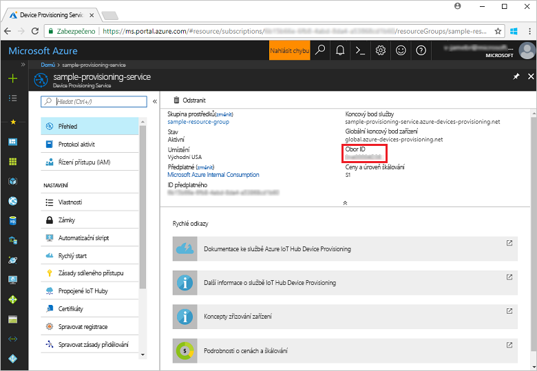
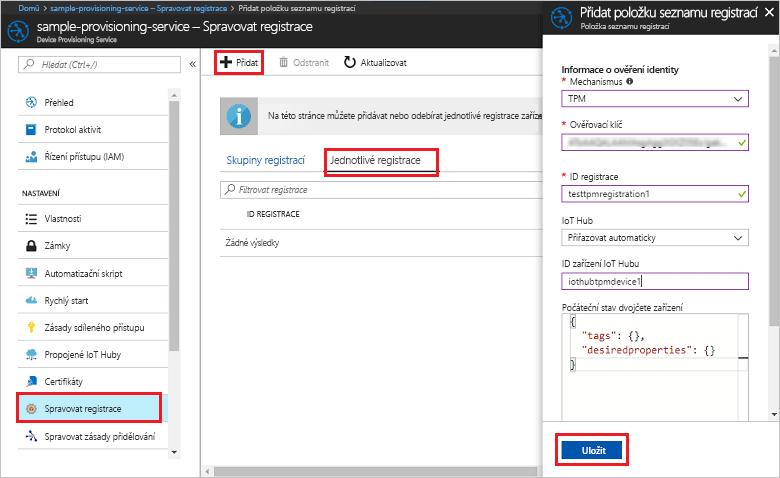
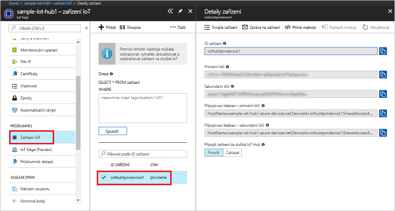

# <a name="create-and-provision-a-simulated-tpm-device-using-c-device-sdk-for-iot-hub-device-provisioning-service"></a>Vytvoření a zřízení simulovaného zařízení TPM pomocí sady SDK pro zařízení jazyka C# pro službu IoT Hub Device Provisioning

[!INCLUDE [iot-dps-selector-quick-create-simulated-device-tpm](../../includes/iot-dps-selector-quick-create-simulated-device-tpm.md)]

Tyto kroky ukazují, jak na vývojovém počítači s operačním systémem Windows pomocí sady Azure IoT Hub SDK pro jazyk C# sestavit ukázku simulovaného zařízení TPM a jak toto simulované zařízení propojit se službou Device Provisioning a centrem IoT. Vzorový kód používá simulátor Windows TPM jako [modul hardwarového zabezpečení (HSM)](https://azure.microsoft.com/blog/azure-iot-supports-new-security-hardware-to-strengthen-iot-security/) zařízení. 

Než budete pokračovat, nezapomeňte dokončit kroky v tématu [Nastavení služby IoT Hub Device Provisioning pomocí webu Azure Portal](./quick-setup-auto-provision.md).

<a id="setupdevbox"></a>
## <a name="prepare-the-development-environment"></a>Příprava vývojového prostředí 

1. Ujistěte se, že na svém počítači máte nainstalovanou sadu [.NET Core SDK](https://www.microsoft.com/net/download/windows). 

1. Ujistěte se, že je na vašem počítači nainstalovaný `git` a že je přidaný do proměnných prostředí, ke kterým má příkazové okno přístup. Na stránce [klientských nástrojů Git organizace Software Freedom Conservancy](https://git-scm.com/download/) najdete nejnovější verzi nástrojů `git` k instalaci. Jejich součástí je i **Git Bash**, aplikace příkazového řádku, pomocí které můžete pracovat se svým místním úložištěm Git. 

4. Otevřete příkazový řádek nebo Git Bash. Naklonujte úložiště GitHub se sadou Azure IoT SDK pro jazyk C#:
    
    ```cmd
    git clone --recursive https://github.com/Azure/azure-iot-sdk-csharp.git
    ```

## <a name="provision-the-simulated-device"></a>Zřízení simulovaného zařízení


1. Přihlaste se k webu Azure Portal. V nabídce vlevo klikněte na tlačítko **Všechny prostředky** a otevřete svou službu Device Provisioning. Z okna **Přehled** si poznamenejte hodnotu **_Rozsah ID_**.

     


2. V příkazovém řádku přejděte do adresáře projektu s ukázkou zřizování zařízení TPM.

    ```cmd
    cd .\azure-iot-sdk-csharp\provisioning\device\samples\ProvisioningDeviceClientTpm
    ```

2. Zadejte následující příkaz, který sestaví a spustí ukázku zřizování zařízení TPM. Hodnotu `<IDScope>` nahraďte hodnotou Rozsah ID pro vaši službu zřizování. 

    ```cmd
    dotnet run <IDScope>
    ```

1. V příkazovém okně se zobrazí **_Ověřovací klíč_**, **_ID registrace_** a navrhované **_ID zařízení_** potřebné pro registraci zařízení. Poznamenejte si tyto hodnoty. 
   > [!NOTE]
   > Nespleťte si okno obsahující výstup příkazu s oknem obsahujícím výstup ze simulátoru TPM. Možná budete na příkazové okno muset kliknout a přenést ho do popředí.

     


4. Na webu Azure Portal v okně s přehledem služby Device Provisioning vyberte **Správa registrací**. Vyberte kartu **Jednotlivé registrace** a klikněte na tlačítko **Přidat** v horní části. 

5. V části **Přidat položku seznamu registrací** zadejte následující informace:
    - Jako *Mechanismus* ověření identity vyberte **TPM**.
    - Zadejte *ID registrace* a *Ověřovací klíč* pro zařízení TPM. 
    - Volitelně vyberte centrum IoT propojené s vaší službou zřizování.
    - Zadejte jedinečné ID zařízení. Můžete zadat ID zařízení navrhované v ukázkovém výstupu nebo vlastní ID zařízení. Pokud použijete vlastní, při pojmenování zařízení se ujistěte, že nepoužíváte citlivá data. 
    - Aktualizujte **Počáteční stav dvojčete zařízení** s použitím požadované počáteční konfigurace zařízení.
    - Jakmile budete hotovi, klikněte na tlačítko **Uložit**. 

      

   Po úspěšné registraci se *ID registrace* vašeho zařízení zobrazí v seznamu na kartě *Jednotlivé registrace*. 

6. Stisknutím klávesy Enter v příkazovém okně (ve kterém se zobrazil **_Ověřovací klíč_**, **_ID registrace_** a navrhované **_ID zařízení_**) zaregistrujte simulované zařízení. Všimněte si zpráv, které simulují spouštění zařízení a jeho připojování ke službě Device Provisioning pro získání informací o vašem centru IoT. 

1. Ověřte zřízení zařízení. Po úspěšném zřízení simulovaného zařízení pro centrum IoT propojené se službou zřizování se ID zařízení zobrazí v okně **Zařízení IoT** centra. 

     

    Pokud jste v položce registrace pro vaše zařízení změnili *počáteční stav dvojčete zařízení* z výchozí hodnoty, může si zařízení požadovaný stav dvojčete vyžádat z centra a příslušně na něj reagovat. Další informace najdete v tématu [Principy a použití dvojčat zařízení ve službě IoT Hub](../iot-hub/iot-hub-devguide-device-twins.md).


## <a name="clean-up-resources"></a>Vyčištění prostředků

Pokud chcete pokračovat v práci s touto ukázkou klienta zařízení a jejím prozkoumáváním, nevyčišťujte prostředky vytvořené v rámci tohoto rychlého startu. Pokud pokračovat nechcete, pomocí následujícího postupu odstraňte všechny prostředky vytvořené tímto rychlým startem.

1. Zavřete na svém počítači okno výstupu ukázky klienta zařízení.
1. Zavřete na svém počítači okno simulátoru TPM.
1. V nabídce vlevo na webu Azure Portal klikněte na **Všechny prostředky** a vyberte svou službu Device Provisioning. V horní části okna **Všechny prostředky** klikněte na **Odstranit**.  
1. V nabídce vlevo na webu Azure Portal klikněte na **Všechny prostředky** a vyberte své centrum IoT. V horní části okna **Všechny prostředky** klikněte na **Odstranit**.  

## <a name="next-steps"></a>Další kroky

V rámci tohoto rychlého startu jste na svém počítači vytvořili simulované zařízení TPM a pomocí služby IoT Hub Device Provisioning jste ho zřídili pro své centrum IoT. Pokud chcete zjistit, jak zaregistrovat zařízení TPM prostřednictvím kódu programu, pokračujte k rychlému startu pro registraci zařízení TPM prostřednictvím kódu programu. 

> [!div class="nextstepaction"]
> [Rychlý start Azure – Registrace zařízení TPM do služby Azure IoT Hub Device Provisioning](quick-enroll-device-tpm-csharp.md)
