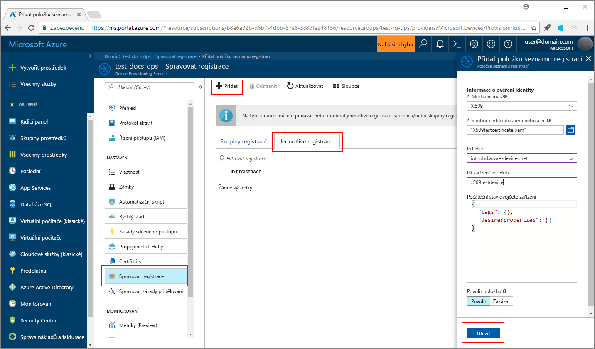

# <a name="create-and-provision-an-x509-simulated-device-using-iot-hub-device-provisioning-service-preview"></a>Vytvoření a zřízení simulovaného zařízení X.509 pomocí služby Azure IoT Hub Device Provisioning (Preview)
> [!div class="op_single_selector"]
> * [TPM](quick-create-simulated-device.md)
> * [X.509](quick-create-simulated-device-x509.md)

Tyto kroky ukazují, jak na vývojovém počítači s operačním systémem Windows simulovat zařízení X.509 a pomocí vzorového kódu propojit toto simulované zařízení se službou Device Provisioning a centrem IoT. 

Než budete pokračovat, nezapomeňte dokončit kroky v tématu [Nastavení služby IoT Hub Device Provisioning pomocí webu Azure Portal](./quick-setup-auto-provision.md).

<a id="setupdevbox"></a>
## <a name="prepare-the-development-environment"></a>Příprava vývojového prostředí 

1. Ujistěte se, že na svém počítači máte nainstalovanou sadu Visual Studio 2015 nebo [Visual Studio 2017](https://www.visualstudio.com/vs/). Pro vaši instalaci sady Visual Studio musíte mít povolenou sadu funkcí 	Vývoj desktopových aplikací pomocí C++.

2. Stáhněte a nainstalujte [sestavovací systém CMake](https://cmake.org/download/).

3. Ujistěte se, že je na vašem počítači nainstalovaný `git` a že je přidaný do proměnných prostředí, ke kterým má příkazové okno přístup. Na stránce [klientských nástrojů Git organizace Software Freedom Conservancy](https://git-scm.com/download/) najdete nejnovější verzi nástrojů `git` k instalaci. Jejich součástí je i **Git Bash**, aplikace příkazového řádku, pomocí které můžete pracovat se svým místním úložištěm Git. 

4. Otevřete příkazový řádek nebo Git Bash. Naklonujte úložiště GitHub se vzorovým kódem pro simulaci zařízení:
    
    ```cmd/sh
    git clone https://github.com/Azure/azure-iot-sdk-c.git --recursive
    ```

5. V lokální kopii tohoto úložiště GitHub vytvořte složku pro proces sestavení CMake. 

    ```cmd/sh
    cd azure-iot-sdk-c
    mkdir cmake
    cd cmake
    ```

6. Spuštěním následujícího příkazu vytvořte v sadě Visual Studio řešení pro klienta zřizování.

    ```cmd/sh
    cmake -Duse_prov_client:BOOL=ON ..
    ```


## <a name="create-a-device-enrollment-entry-in-the-device-provisioning-service"></a>Vytvoření položky registrace zařízení ve službě Device Provisioning

1. Otevřete řešení `azure_iot_sdks.sln` vygenerované ve složce *cmake* a sestavte ho v sadě Visual Studio.

2. Klikněte pravým tlačítkem na projekt **dice\_device\_enrollment** ve složce **Provision\_Samples** a vyberte **Nastavit jako spouštěný projekt**. Spusťte řešení. Po zobrazení výzvy zadejte v okně Výstup `i` pro jednotlivou registraci. V okně Výstup se zobrazí místně vygenerovaný certifikát X.509 pro vaše simulované zařízení. Zkopírujte do schránky výstup začínající na *-----BEGIN CERTIFICATE-----* a končící na *-----END PUBLIC KEY-----* a ujistěte se, že kopírujete i oba tyto řádky. 
 
3. Na svém počítači s Windows vytvořte soubor **_X509testcertificate.pem_**, otevřete ho v libovolném editoru a zkopírujte do něj obsah schránky. Uložte soubor. 

4. Přihlaste se k webu Azure Portal, v nabídce vlevo klikněte na tlačítko **Všechny prostředky** a otevřete svou službu zřizování.

4. V okně s přehledem služby Device Provisioning vyberte **Správa registrací**. Vyberte kartu **Jednotlivé registrace** a klikněte na tlačítko **Přidat** v horní části. 

5. V části **Přidat položku seznamu registrací** zadejte následující informace:
    - Jako *Mechanismus* ověření identity vyberte **X.509**.
    - V části *Soubor .pem nebo .cer certifikátu* vyberte soubor certifikátu **_X509testcertificate.pem_** vytvořený v předchozím kroku pomocí widgetu *Průzkumník souborů*.
    - Volitelně můžete zadat následující informace:
        - Vyberte centrum IoT propojené s vaší zřizovací službou.
        - Zadejte jedinečné ID zařízení. Při pojmenování zařízení se ujistěte, že nepoužíváte citlivá data. 
        - Aktualizujte **Počáteční stav dvojčete zařízení** s použitím požadované počáteční konfigurace zařízení.
    - Jakmile budete hotovi, klikněte na tlačítko **Uložit**. 

      

   Po úspěšné registraci se vaše zařízení X.509 zobrazí jako **riot-device-cert** ve sloupci *ID registrace* na kartě *Jednotlivé registrace*. 


<a id="firstbootsequence"></a>
## <a name="simulate-first-boot-sequence-for-the-device"></a>Simulace první spouštěcí sekvence pro zařízení

1. Na webu Azure Portal vyberte okno **Přehled** vaší služby Device Provisioning a poznamenejte si hodnotu **_Rozsah ID_**.

     

2. V sadě Visual Studio na svém počítači přejděte k ukázkovému projektu **prov\_dev\_client\_sample** ve složce **Provision\_Samples** a otevřete soubor **prov\_dev\_client\_sample.c**.

3. Proměnné `scope_id` přiřaďte hodnotu _Rozsah ID_. 

    ```c
    static const char* scope_id = "[ID Scope]";
    ```

4. Klikněte pravým tlačítkem na projekt **prov\_dev\_client\_sample** a vyberte **Nastavit jako spouštěný projekt**. Spusťte ukázku. Všimněte si zpráv, které simulují spouštění zařízení a jeho připojování ke službě Device Provisioning pro získání informací o vašem centru IoT. Vyhledejte zprávu s oznámením o úspěšné registraci ve vašem centru: *Byly přijaty informace o registraci ze služby: adresa_URL_vašeho_centra!*. Po zobrazení výzvy okno zavřete.

5. Na portálu přejděte k centru IoT propojenému s vaší službou zřizování a otevřete okno **Device Explorer**. Po úspěšném zřízení simulovaného zařízení X.509 pro toto centrum se ID tohoto zařízení zobrazí v okně **Device Explorer** a jeho *STAV* bude **povoleno**. Poznámka: Pokud jste okno otevřeli už před spuštěním ukázkové aplikace zařízení, možná bude potřeba kliknout na tlačítko **Aktualizovat** v horní části. 

     

> [!NOTE]
> Pokud jste v položce registrace pro vaše zařízení změnili *počáteční stav dvojčete zařízení* z výchozí hodnoty, může si zařízení požadovaný stav dvojčete vyžádat z centra a příslušně na něj reagovat. Další informace najdete v tématu [Principy a použití dvojčat zařízení ve službě IoT Hub](../iot-hub/iot-hub-devguide-device-twins.md).
>


## <a name="clean-up-resources"></a>Vyčištění prostředků

Pokud chcete pokračovat v práci s touto ukázkou klienta zařízení a jejím prozkoumáváním, nevyčišťujte prostředky vytvořené v rámci tohoto rychlého startu. Pokud pokračovat nechcete, pomocí následujícího postupu odstraňte všechny prostředky vytvořené tímto rychlým startem.

1. Zavřete na svém počítači okno výstupu ukázky klienta zařízení.
1. V nabídce vlevo na webu Azure Portal klikněte na **Všechny prostředky** a vyberte svou službu Device Provisioning. V horní části okna **Všechny prostředky** klikněte na **Odstranit**.  
1. V nabídce vlevo na webu Azure Portal klikněte na **Všechny prostředky** a vyberte své centrum IoT. V horní části okna **Všechny prostředky** klikněte na **Odstranit**.  

## <a name="next-steps"></a>Další kroky

V rámci tohoto rychlého startu jste na svém počítači s Windows vytvořili simulované zařízení X.509 a pomocí služby Azure IoT Hub Device Provisioning jste ho zřídili pro své centrum IoT. Pokud se chcete se zřizováním zařízení seznámit podrobněji, pokračujte ke kurzu nastavení služby Device Provisioning na webu Azure Portal. 

> [!div class="nextstepaction"]
> [Kurzy pro službu Azure IoT Hub Device Provisioning](./tutorial-set-up-cloud.md)
