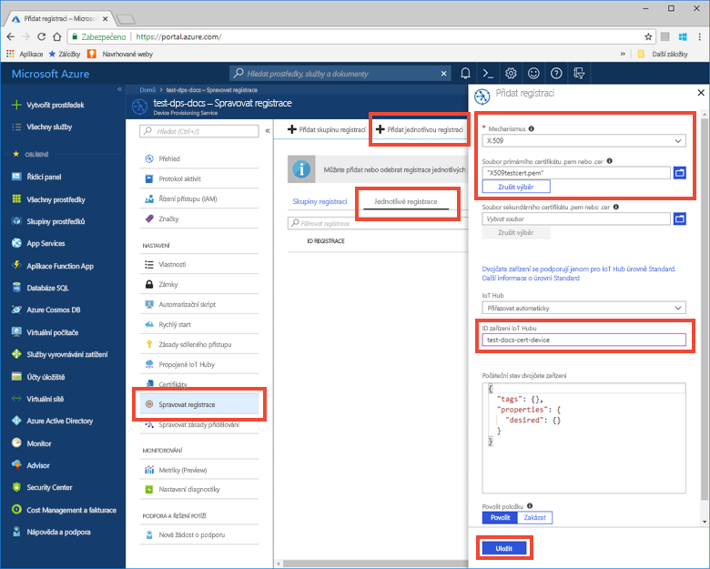
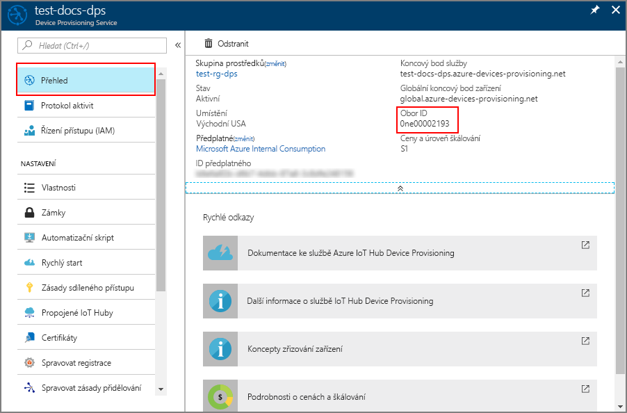
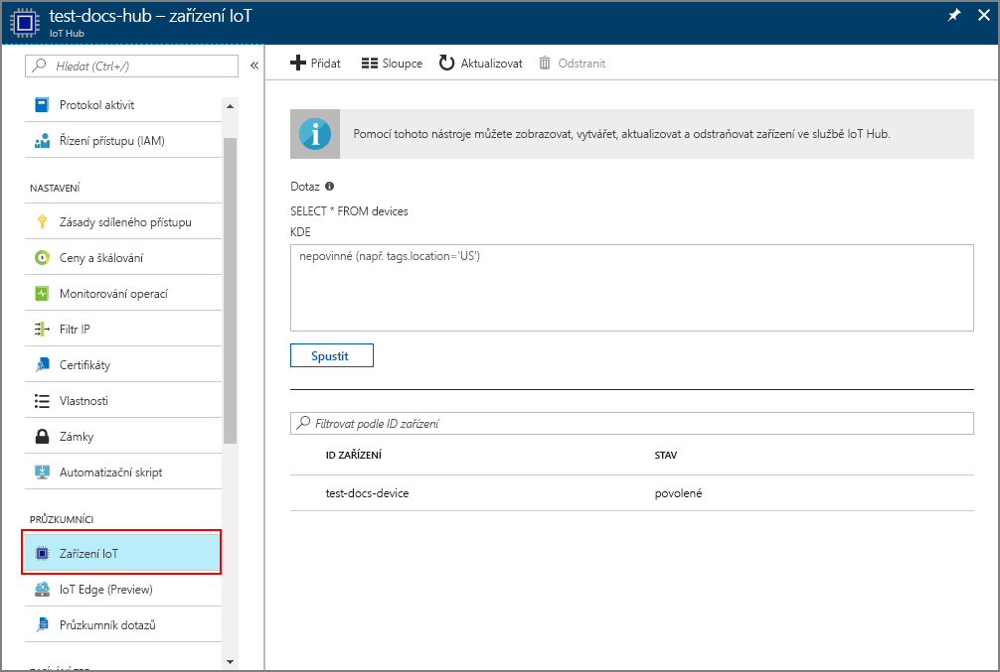

# <a name="create-and-provision-an-x509-simulated-device-using-c-device-sdk-for-iot-hub-device-provisioning-service"></a>Vytvoření a zřízení simulovaného zařízení X.509 pomocí sady SDK pro zařízení jazyka C pro službu IoT Hub Device Provisioning
[!INCLUDE [iot-dps-selector-quick-create-simulated-device-x509](../../includes/iot-dps-selector-quick-create-simulated-device-x509.md)]

Tyto kroky ukazují, jak na vývojovém počítači s operačním systémem Windows simulovat zařízení X.509 a pomocí vzorového kódu propojit toto simulované zařízení se službou Device Provisioning a centrem IoT. 

Pokud neznáte proces automatického zřizování, měli byste se seznámit také s [koncepty automatického zřizování](concepts-auto-provisioning.md). Než budete pokračovat, ujistěte se také, že jste provedli kroky uvedené v tématu [Nastavení služby IoT Hub Device Provisioning Service pomocí webu Azure Portal](./quick-setup-auto-provision.md). 

[!INCLUDE [IoT DPS basic](../../includes/iot-dps-basic.md)]

<a id="setupdevbox"></a>

## <a name="prepare-the-development-environment"></a>Příprava vývojového prostředí 

1. Ujistěte se, že na svém počítači máte nainstalovanou sadu Visual Studio 2015 nebo [Visual Studio 2017](https://www.visualstudio.com/vs/). Pro vaši instalaci sady Visual Studio musíte mít povolenou sadu funkcí [Vývoj desktopových aplikací pomocí C++](https://www.visualstudio.com/vs/support/selecting-workloads-visual-studio-2017/).

2. Stáhněte a nainstalujte [sestavovací systém CMake](https://cmake.org/download/). Je důležité, aby sada Visual Studio se sadou funkcí Vývoj desktopových aplikací pomocí C++ byla na vašem počítači nainstalovaná ještě **před** zahájením instalace `cmake`. 

3. Ujistěte se, že je na vašem počítači nainstalovaný `git` a že je přidaný do proměnných prostředí, ke kterým má příkazové okno přístup. Na stránce [klientských nástrojů Git organizace Software Freedom Conservancy](https://git-scm.com/download/) najdete nejnovější verzi nástrojů `git` k instalaci. Jejich součástí je i **Git Bash**, aplikace příkazového řádku, pomocí které můžete pracovat se svým místním úložištěm Git. 

4. Otevřete příkazový řádek nebo Git Bash. Naklonujte úložiště GitHub se vzorovým kódem pro simulaci zařízení:
    
    ```cmd
    git clone https://github.com/Azure/azure-iot-sdk-c.git --recursive
    ```

5. V lokální kopii tohoto úložiště GitHub vytvořte složku pro proces sestavení CMake. 

    ```cmd
    cd azure-iot-sdk-c
    mkdir cmake
    cd cmake
    ```

6. Vzorový kód k zajištění ověření prostřednictvím ověřování X.509 používá certifikát X.509. Spuštěním následujícího příkazu sestavte specifickou verzi sady SDK pro platformu vašeho vývojového klienta a váš [mechanismus ověřování](concepts-security.md#attestation-mechanism) (certifikát X.509). Zároveň se vygeneruje řešení v sadě Visual Studio pro simulované zařízení. 

    ```cmd
    cmake -Duse_prov_client:BOOL=ON ..
    ```
    
    Pokud `cmake` nenajde váš kompilátor C++, můžou se při spuštění výše uvedeného příkazu zobrazit chyby sestavení. Pokud k tomu dojde, zkuste tento příkaz spustit v [příkazovém řádku sady Visual Studio](https://docs.microsoft.com/dotnet/framework/tools/developer-command-prompt-for-vs). 


<a id="portalenroll"></a>

## <a name="create-a-self-signed-x509-device-certificate-and-individual-enrollment-entry"></a>Vytvoření certifikátu zařízení X.509 podepsaného svým držitelem a položky jednotlivé registrace

1. Otevřete řešení `azure_iot_sdks.sln` vygenerované ve složce *cmake* a sestavte ho v sadě Visual Studio.

2. Klikněte pravým tlačítkem na projekt **dice\_device\_enrollment** ve složce **Provision\_Tools** a vyberte **Nastavit jako spouštěný projekt**. Spusťte řešení. Po zobrazení výzvy zadejte v okně Výstup **i** pro jednotlivou registraci. V okně Výstup se zobrazí místně vygenerovaný certifikát X.509 pro vaše simulované zařízení. Zkopírujte do schránky výstup začínající na *-----BEGIN CERTIFICATE-----* a končící na první řádek *-----END CERTIFICATE-----* a ujistěte se, že kopírujete i oba tyto řádky. Pamatujte, že z okna Výstup potřebujete pouze první certifikát.
 
3. Na svém počítači s Windows vytvořte soubor **_X509testcert.pem_**, otevřete ho v libovolném editoru a zkopírujte do něj obsah schránky. Uložte soubor. 

4. Přihlaste se k webu Azure Portal, v nabídce vlevo klikněte na tlačítko **Všechny prostředky** a otevřete svou službu zřizování.

5. V okně s přehledem služby Device Provisioning vyberte **Správa registrací**. Vyberte kartu **Jednotlivé registrace** a klikněte na tlačítko **Přidat** v horní části. 

6. Na panelu **Přidat registraci** zadejte následující informace:
    - Jako *Mechanismus* ověření identity vyberte **X.509**.
    - V části *Soubor .pem nebo .cer primárního certifikátu* klikněte na *Vyberte soubor* a vyberte soubor certifikátu **X509testcert.pem** vytvořený v předchozích krocích.
    - Volitelně můžete zadat následující informace:
      - Vyberte centrum IoT propojené s vaší zřizovací službou.
      - Zadejte jedinečné ID zařízení. Při pojmenování zařízení se ujistěte, že nepoužíváte citlivá data. 
      - Aktualizujte **Počáteční stav dvojčete zařízení** s použitím požadované počáteční konfigurace zařízení.
    - Jakmile budete hotovi, klikněte na tlačítko **Uložit**. 

    [](./media/quick-create-simulated-device-x509/individual-enrollment.png#lightbox)

   Po úspěšné registraci se vaše zařízení X.509 zobrazí jako **riot-device-cert** ve sloupci *ID registrace* na kartě *Jednotlivé registrace*. 


<a id="firstbootsequence"></a>

## <a name="simulate-first-boot-sequence-for-the-device"></a>Simulace první spouštěcí sekvence pro zařízení

1. Na webu Azure Portal vyberte okno **Přehled** vaší služby Device Provisioning a poznamenejte si hodnotu **_Rozsah ID_**.

     

2. V sadě Visual Studio na svém počítači přejděte k ukázkovému projektu **prov\_dev\_client\_sample** ve složce **Provision\_Samples** a otevřete soubor **prov\_dev\_client\_sample.c**.

3. Proměnné `id_scope` přiřaďte hodnotu _Rozsah ID_. 

    ```c
    static const char* id_scope = "[ID Scope]";
    ```

4. Ujistěte se, že ve funkci **main()** ve stejném souboru je hodnota **SECURE_DEVICE_TYPE** nastavená na X.509.

    ```c
    SECURE_DEVICE_TYPE hsm_type;
    hsm_type = SECURE_DEVICE_TYPE_X509;
    ```

   Okomentujte nebo odstraňte příkaz `hsm_type = SECURE_DEVICE_TYPE_TPM;`, který může být přítomný. 

5. Klikněte pravým tlačítkem na projekt **prov\_dev\_client\_sample** a vyberte **Nastavit jako spouštěný projekt**. Spusťte ukázku. Všimněte si zpráv, které simulují spouštění zařízení a jeho připojování ke službě Device Provisioning pro získání informací o vašem centru IoT. Vyhledejte zprávu s oznámením o úspěšné registraci ve vašem centru: *Byly přijaty informace o registraci ze služby: adresa_URL_vašeho_centra!*. Po zobrazení výzvy okno zavřete.

6. Na portálu přejděte k centru IoT propojenému s vaší službou zřizování a otevřete okno **Zařízení IoT**. Po úspěšném zřízení simulovaného zařízení X.509 pro toto centrum se ID tohoto zařízení zobrazí v okně **Zařízení IoT** a jeho *STAV* bude **povoleno**. Poznámka: Pokud jste okno otevřeli už před spuštěním ukázkové aplikace zařízení, možná bude potřeba kliknout na tlačítko **Aktualizovat** v horní části. 

     

    Pokud jste v položce registrace pro vaše zařízení změnili *počáteční stav dvojčete zařízení* z výchozí hodnoty, může si zařízení požadovaný stav dvojčete vyžádat z centra a příslušně na něj reagovat. Další informace najdete v tématu [Principy a použití dvojčat zařízení ve službě IoT Hub](../iot-hub/iot-hub-devguide-device-twins.md).


> [!IMPORTANT]
> Můžete také provést *skupinovou registraci* zařízení X.509, stačí následujícím způsobem upravit kroky v tomto rychlém startu:
>    1. Pomocí postupu v části o **WebSockets** v příručce [Nastavení vývojového prostředí ve Windows](https://github.com/Azure/azure-iot-sdk-c/blob/master/doc/devbox_setup.md#windows) nakonfigurujte svůj počítač s Windows tak, aby místo výchozí knihovny **SChannel** používal knihovnu **OpenSSL**. Poznámka: Počítače s Linuxem používají OpenSSL ve výchozím nastavení. 
>    2. V korku 2 výše uvedené části [Vytvoření položky registrace zařízení ve službě Device Provisioning](#portalenroll) zadejte **g** pro skupinovou registraci.
>    3. V krocích 4 a 5 [stejné části](#portalenroll) vyberte **Skupiny registrací** a zadejte požadované informace pro záznam skupiny.  
>

## <a name="clean-up-resources"></a>Vyčištění prostředků

Pokud chcete pokračovat v práci s touto ukázkou klienta zařízení a jejím prozkoumáváním, nevyčišťujte prostředky vytvořené v rámci tohoto rychlého startu. Pokud pokračovat nechcete, pomocí následujícího postupu odstraňte všechny prostředky vytvořené tímto rychlým startem.

1. Zavřete na svém počítači okno výstupu ukázky klienta zařízení.
1. V nabídce vlevo na webu Azure Portal klikněte na **Všechny prostředky** a vyberte svou službu Device Provisioning. Otevřete okno **Správa registrací** pro vaši službu a pak klikněte na kartu **Jednotlivé registrace**. Vyberte *ID REGISTRACE* zařízení, které jste zaregistrovali v rámci tohoto rychlého startu, a klikněte na tlačítko **Odstranit** v horní části. 
1. V nabídce vlevo na webu Azure Portal klikněte na **Všechny prostředky** a vyberte své centrum IoT. Otevřete okno **Zařízení IoT** pro vaše centrum, vyberte *ID ZAŘÍZENÍ*, které jste zaregistrovali v rámci tohoto rychlého startu, a pak klikněte na tlačítko **Odstranit** v horní části.

## <a name="next-steps"></a>Další kroky

V rámci tohoto rychlého startu jste na svém počítači s Windows vytvořili simulované zařízení X.509 a pomocí služby Azure IoT Hub Device Provisioning na portálu jste ho zřídili pro své centrum IoT. Pokud chcete zjistit, jak zaregistrovat zařízení X.509 prostřednictvím kódu programu, pokračujte k rychlému startu pro registraci zařízení X.509 prostřednictvím kódu programu. 

> [!div class="nextstepaction"]
> [Rychlý start Azure – Registrace zařízení X.509 do služby Azure IoT Hub Device Provisioning](quick-enroll-device-x509-java.md)
