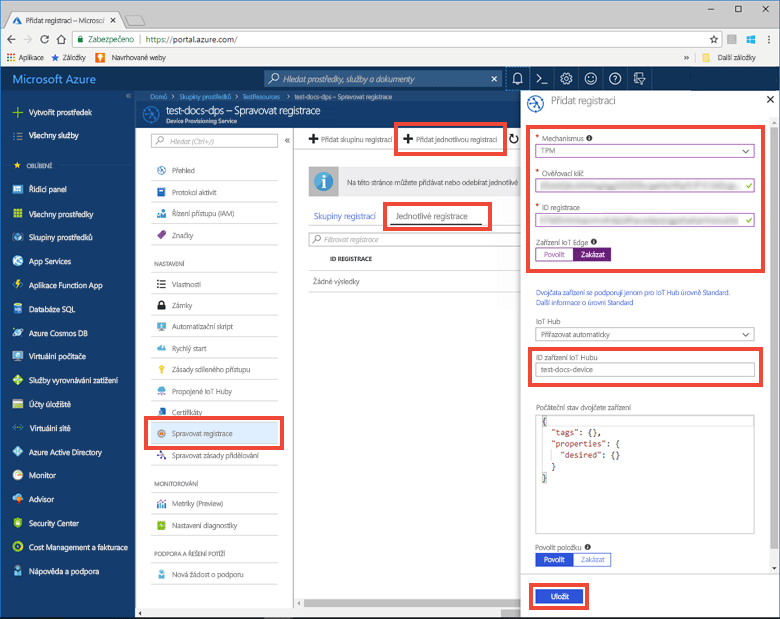
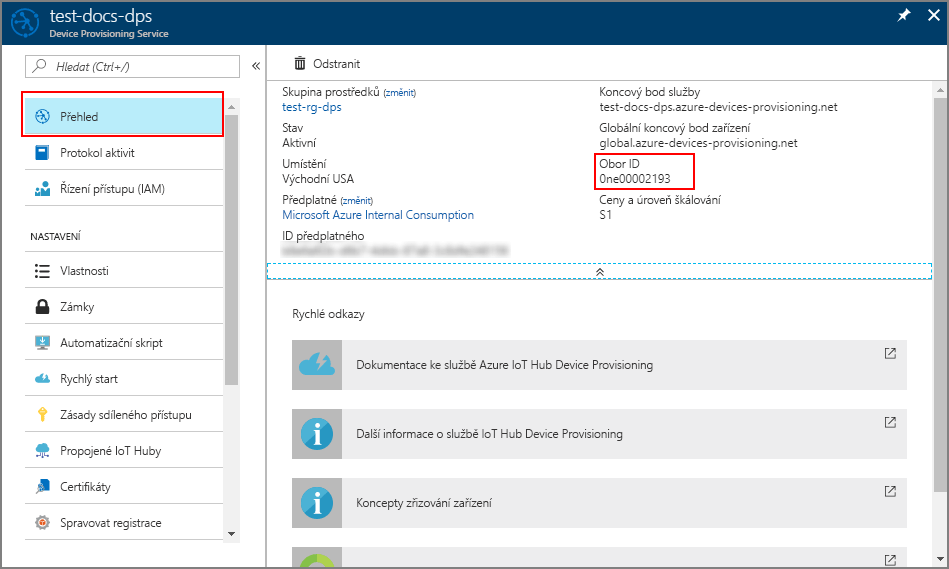

# <a name="create-and-provision-a-simulated-device-using-iot-hub-device-provisioning-service-preview"></a>Vytvoření a zřízení simulovaného zařízení pomocí služby Azure IoT Hub Device Provisioning (Preview)

Tyto kroky ukazují, jak na vývojovém počítači s operačním systémem Windows vytvořit simulované zařízení, spustit simulátor Windows TPM jako [modul hardwarového zabezpečení (HSM)](https://azure.microsoft.com/blog/azure-iot-supports-new-security-hardware-to-strengthen-iot-security/) zařízení a jak pomocí vzorového kódu propojit toto simulované zařízení se službou Device Provisioning a centrem IoT. 

Než budete pokračovat, nezapomeňte dokončit kroky v tématu [Nastavení služby IoT Hub Device Provisioning pomocí webu Azure Portal](./quick-setup-auto-provision.md).

<a id="setupdevbox"></a>
## <a name="prepare-the-development-environment"></a>Příprava vývojového prostředí 

1. Ujistěte se, že na svém počítači máte nainstalovanou sadu Visual Studio 2015 nebo [Visual Studio 2017](https://www.visualstudio.com/vs/). 

2. Stáhněte a nainstalujte [sestavovací systém CMake](https://cmake.org/download/).

3. Ujistěte se, že je na vašem počítači nainstalovaný `git` a že je přidaný do proměnných prostředí, ke kterým má příkazové okno přístup. Na stránce [klientských nástrojů Git organizace Software Freedom Conservancy](https://git-scm.com/download/) najdete nejnovější verzi nástrojů `git` k instalaci. Jejich součástí je i **Git Bash**, aplikace příkazového řádku, pomocí které můžete pracovat se svým místním úložištěm Git. 

4. Otevřete příkazový řádek nebo Git Bash. Naklonujte úložiště GitHub se vzorovým kódem pro simulaci zařízení:
    
    ```cmd/sh
    git clone https://github.com/Azure/azure-iot-sdk-c.git --recursive
    ```

5. V lokální kopii tohoto úložiště GitHub vytvořte složku pro proces sestavení CMake. 

    ```cmd/sh
    cd azure-iot-sdk-c
    mkdir cmake
    cd cmake
    ```

6. Vzorový kód používá simulátor Windows TPM. Spusťte následující příkaz, kterým povolíte ověřování pomocí tokenu SAS. Zároveň se vygeneruje řešení v sadě Visual Studio pro simulované zařízení.

    ```cmd/sh
    cmake -Ddps_auth_type=tpm_simulator ..
    ```

7. V samostatném příkazovém řádku přejděte do kořenové složky GitHub a spusťte simulátor [TPM](https://docs.microsoft.com/windows/device-security/tpm/trusted-platform-module-overview). Ten naslouchá přes soket na portech 2321 a 2322. Toto příkazové okno nezavírejte, simulátor je potřeba nechat spuštěný až do konce této úvodní příručky. 

    ```cmd/sh
    .\azure-iot-sdk-c\dps_client\deps\utpm\tools\tpm_simulator\Simulator.exe
    ```

## <a name="create-a-device-enrollment-entry-in-the-device-provisioning-service"></a>Vytvoření položky registrace zařízení ve službě Device Provisioning

1. Otevřete řešení `azure_iot_sdks.sln` vygenerované ve složce *cmake* a sestavte ho v sadě Visual Studio.

2. Klikněte pravým tlačítkem na projekt **tpm_device_provision** a vyberte **Nastavit jako spouštěný projekt**. Spusťte řešení. V okně výstupu se zobrazí **_Ověřovací klíč_** a **_ID registrace_** potřebné pro registraci zařízení. Poznamenejte si tyto hodnoty. 

3. Přihlaste se k webu Azure Portal, v nabídce vlevo klikněte na tlačítko **Všechny prostředky** a otevřete svou službu Device Provisioning.

4. V okně s přehledem služby Device Provisioning vyberte **Správa registrací**. Vyberte kartu **Jednotlivé registrace** a klikněte na tlačítko **Přidat** v horní části. 

5. V části **Přidat položku seznamu registrací** zadejte následující informace:
    - Jako *Mechanismus* ověření identity vyberte **TPM**.
    - Zadejte *ID registrace* a *Ověřovací klíč* pro zařízení TPM. 
    - Vyberte centrum IoT propojené s vaší zřizovací službou.
    - Zadejte jedinečné ID zařízení. Při pojmenování zařízení se ujistěte, že nepoužíváte citlivá data.
    - Aktualizujte **Počáteční stav dvojčete zařízení** s použitím požadované počáteční konfigurace zařízení.
    - Jakmile budete hotovi, klikněte na tlačítko **Uložit**. 

      

   Po úspěšné registraci se *ID registrace* vašeho zařízení zobrazí v seznamu na kartě *Jednotlivé registrace*. 


<a id="firstbootsequence"></a>
## <a name="simulate-first-boot-sequence-for-the-device"></a>Simulace první spouštěcí sekvence pro zařízení

1. Na webu Azure Portal vyberte okno **Přehled** vaší služby Device Provisioning a poznamenejte si hodnoty **_Globální koncový bod zařízení_** a **_Rozsah ID_**.

     

2. V sadě Visual Studio na svém počítači vyberte ukázkový projekt **dps_client_sample** a otevřete soubor **dps_client_sample.c**.

3. Proměnné `dps_scope_id` přiřaďte hodnotu _Rozsah ID_. Všimněte si, že proměnná `dps_uri` má stejnou hodnotu jako _Globální koncový bod služby_. 

    ```c
    static const char* dps_uri = "global.azure-devices-provisioning.net";
    static const char* dps_scope_id = "[DPS Id Scope]";
    ```

4. Klikněte pravým tlačítkem na projekt **dps_client_sample** a vyberte **Nastavit jako spouštěný projekt**. Spusťte ukázku. Všimněte si zpráv, které simulují spouštění zařízení a jeho připojování ke službě Device Provisioning pro získání informací o vašem centru IoT. Po úspěšném zřízení simulovaného zařízení pro centrum IoT propojené se zřizovací službou se ID zařízení zobrazí v okně **Device Explorer** centra. 

     

    Pokud jste v položce registrace pro vaše zařízení změnili *počáteční stav dvojčete zařízení* z výchozí hodnoty, může si zařízení požadovaný stav dvojčete vyžádat z centra a příslušně na něj reagovat. Další informace najdete v tématu [Principy a použití dvojčat zařízení ve službě IoT Hub](../iot-hub/iot-hub-devguide-device-twins.md).


## <a name="clean-up-resources"></a>Vyčištění prostředků

Pokud chcete pokračovat v práci s touto ukázkou klienta zařízení a jejím prozkoumáváním, nevyčišťujte prostředky vytvořené v rámci tohoto rychlého startu. Pokud pokračovat nechcete, pomocí následujícího postupu odstraňte všechny prostředky vytvořené tímto rychlým startem.

1. Zavřete na svém počítači okno výstupu ukázky klienta zařízení.
1. Zavřete na svém počítači okno simulátoru TPM.
1. V nabídce vlevo na webu Azure Portal klikněte na **Všechny prostředky** a vyberte svou službu Device Provisioning. V horní části okna **Všechny prostředky** klikněte na **Odstranit**.  
1. V nabídce vlevo na webu Azure Portal klikněte na **Všechny prostředky** a vyberte své centrum IoT. V horní části okna **Všechny prostředky** klikněte na **Odstranit**.  

## <a name="next-steps"></a>Další kroky

V rámci tohoto rychlého startu jste na svém počítači vytvořili simulované zařízení TPM a pomocí služby Azure IoT Hub Device Provisioning jste ho zřídili pro své centrum IoT. Pokud se chcete se zřizováním zařízení seznámit podrobněji, pokračujte ke kurzu nastavení služby Device Provisioning na webu Azure Portal. 

> [!div class="nextstepaction"]
> [Kurzy pro službu Azure IoT Hub Device Provisioning](./tutorial-set-up-cloud.md)

