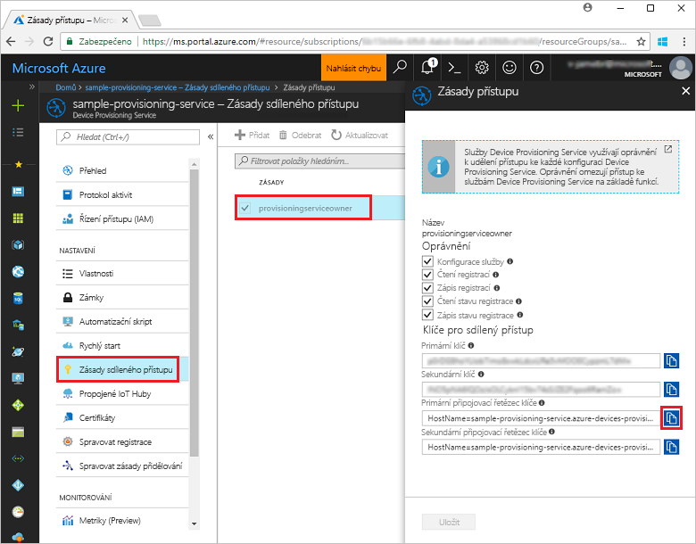
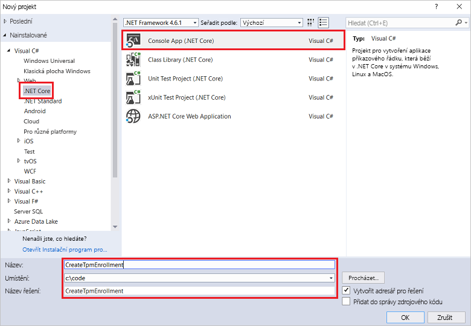
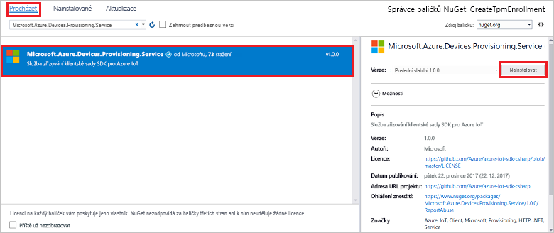
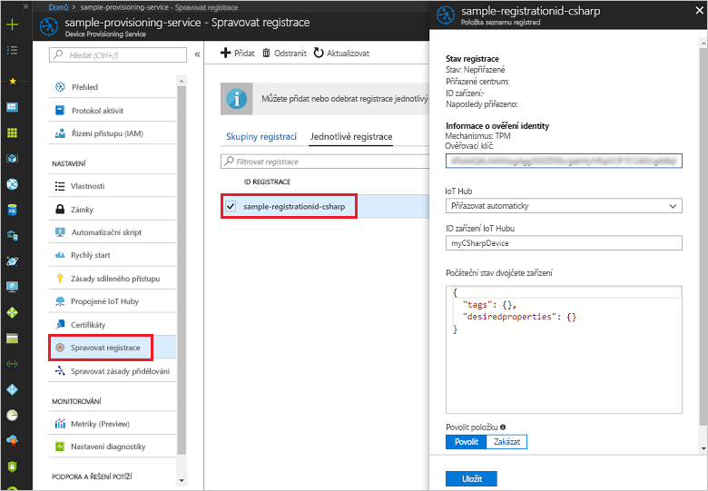

# <a name="enroll-tpm-device-to-iot-hub-device-provisioning-service-using-c-service-sdk"></a>Registrace zařízení TPM do služby IoT Hub Device Provisioning pomocí sady SDK služby pro jazyk C#

[!INCLUDE [iot-dps-selector-quick-enroll-device-tpm](../../includes/iot-dps-selector-quick-enroll-device-tpm.md)]


Tyto kroky ukazují, jak prostřednictvím kódu programu vytvořit jednotlivou registraci pro zařízení TPM ve službě Azure IoT Hub Device Provisioning pomocí sady [SDK služby pro jazyk C#](https://github.com/Azure/azure-iot-sdk-csharp) a ukázkové aplikace C# .NET Core. Volitelně můžete simulované zařízení TPM zaregistrovat do služby zřizování pomocí této položky jednotlivé registrace. Přestože tento postup funguje na počítačích s Windows i Linuxem, v tomto článku se používá vývojový počítač s Windows.

## <a name="prepare-the-development-environment"></a>Příprava vývojového prostředí

1. Ujistěte se, že na svém počítači máte nainstalovanou sadu [Visual Studio 2017](https://www.visualstudio.com/vs/). 
2. Ujistěte se, že na svém počítači máte nainstalovanou sadu [.NET Core SDK](https://www.microsoft.com/net/download/windows). 
3. Než budete pokračovat, nezapomeňte dokončit kroky v tématu [Nastavení služby IoT Hub Device Provisioning pomocí webu Azure Portal](./quick-setup-auto-provision.md).
4. (Volitelné) Pokud chcete na konci tohoto rychlého startu zaregistrovat simulované zařízení, postupujte podle kroků v tématu [Vytvoření a zřízení simulovaného zařízení TPM pomocí sady SDK služby pro jazyk C#](quick-create-simulated-device-tpm-csharp.md) až do kroku, kdy získáte ověřovací klíč pro zařízení. Poznamenejte si ověřovací klíč, ID registrace a volitelně i ID zařízení, protože je budete potřebovat v pozdější části tohoto rychlého startu. **Neprovádějte kroky k vytvoření jednotlivé registrace pomocí webu Azure Portal.**

## <a name="get-the-connection-string-for-your-provisioning-service"></a>Získání připojovacího řetězce pro službu zřizování

Pro ukázku v tomto rychlém startu potřebujete připojovací řetězec pro vaši službu zřizování.
1. Přihlaste se k webu Azure Portal, v nabídce vlevo klikněte na tlačítko **Všechny prostředky** a otevřete svou službu Device Provisioning. 
2. Klikněte na **Zásady sdíleného přístupu** a pak kliknutím na zásadu přístupu, kterou chcete použít, otevřete její vlastnosti. V okně **Zásady přístupu** si zkopírujte a poznamenejte primární připojovací řetězec klíče. 

    

## <a name="create-the-individual-enrollment-sample"></a>Vytvoření ukázky jednotlivé registrace 

Kroky v této části ukazují, jak vytvořit konzolovou aplikaci .NET Core, která do vaší služby zřizování přidá jednotlivou registraci pro zařízení TPM. S určitými úpravami můžete pomocí tohoto postupu vytvořit pro přidání jednotlivé registrace také konzolovou aplikaci [Windows IoT Core](https://developer.microsoft.com/en-us/windows/iot). Další informace o vývoji s využitím IoT Core najdete v [dokumentaci pro vývojáře pro Windows IoT Core](https://docs.microsoft.com/windows/iot-core/).
1. V sadě Visual Studio přidejte k novému řešení projekt konzolové aplikace Visual C# .NET Core pomocí šablony projektu **Konzolová aplikace (.NET Core)**. Zkontrolujte, zda máte verzi rozhraní .NET Framework 4.5.1 nebo novější. Pojmenujte projekt **CreateTpmEnrollment**.

    

2. V Průzkumníku řešení klikněte pravým tlačítkem na projekt **CreateTpmEnrollment** a pak klikněte na **Správa balíčků NuGet**.
3. V okně **Správce balíčků NuGet** vyberte **Procházet**, vyhledejte **Microsoft.Azure.Devices.Provisioning.Service**, vyberte **Nainstalovat**, čímž nainstalujete balíček **Microsoft.Azure.Devices.Provisioning.Service**, a přijměte podmínky použití. Tímto postupem se stáhne a nainstaluje balíček NuGet [klientské sady SDK pro službu Azure IoT Device Provisioning](https://www.nuget.org/packages/Microsoft.Azure.Devices.Provisioning.Service/) a jeho závislosti a přidá se na něj odkaz.

    

4. Na začátek souboru **Program.cs** přidejte následující příkazy `using` za ostatní příkazy `using`:
   
   ```csharp
   using System.Threading.Tasks;
   using Microsoft.Azure.Devices.Provisioning.Service;
   ```
    
5. Do třídy **Program** přidejte následující pole.  
   - Zástupnou hodnotu **ProvisioningConnectionString** nahraďte připojovacím řetězcem služby zřizování, pro kterou chcete registraci vytvořit.
   - Volitelně můžete změnit ID registrace, ověřovací klíč, ID zařízení i stav zřizování. 
   - Pokud ke zřízení simulovaného zařízení používáte tento rychlý start společně s rychlým startem [Vytvoření a zřízení simulovaného zařízení TPM pomocí sady SDK služby pro jazyk C#](quick-create-simulated-device-tpm-csharp.md), nahraďte ověřovací klíč a ID registrace hodnotami, které jste si poznamenali v tomto druhém rychlém startu. Jako ID zařízení můžete použít hodnotu navrhovanou v tomto druhém rychlém startu, vlastní hodnotu nebo výchozí hodnotu v této ukázce.
        
   ```csharp
   private static string ProvisioningConnectionString = "{Your provisioning service connection string}";
   private const string RegistrationId = "sample-registrationid-csharp";
   private const string TpmEndorsementKey =
       "AToAAQALAAMAsgAgg3GXZ0SEs/gakMyNRqXXJP1S124GUgtk8qHaGzMUaaoABgCAAEMAEAgAAAAAAAEAxsj2gUS" +
       "cTk1UjuioeTlfGYZrrimExB+bScH75adUMRIi2UOMxG1kw4y+9RW/IVoMl4e620VxZad0ARX2gUqVjYO7KPVt3d" +
       "yKhZS3dkcvfBisBhP1XH9B33VqHG9SHnbnQXdBUaCgKAfxome8UmBKfe+naTsE5fkvjb/do3/dD6l4sGBwFCnKR" +
       "dln4XpM03zLpoHFao8zOwt8l/uP3qUIxmCYv9A7m69Ms+5/pCkTu/rK4mRDsfhZ0QLfbzVI6zQFOKF/rwsfBtFe" +
       "WlWtcuJMKlXdD8TXWElTzgh7JS4qhFzreL0c1mI0GCj+Aws0usZh7dLIVPnlgZcBhgy1SSDQMQ==";
       
   // Optional parameters
   private const string OptionalDeviceId = "myCSharpDevice";
   private const ProvisioningStatus OptionalProvisioningStatus = ProvisioningStatus.Enabled;
   ```
    
6. Do třídy **Program** přidejte následující metodu.  Tento kód vytvoří položku jednotlivé registrace a pak zavolá metodu **CreateOrUpdateIndividualEnrollmentAsync** pro **ProvisioningServiceClient**, která přidá jednotlivou registraci do služby zřizování.
   
   ```csharp
   public static async Task RunSample()
   {
       Console.WriteLine("Starting sample...");

       using (ProvisioningServiceClient provisioningServiceClient =
               ProvisioningServiceClient.CreateFromConnectionString(ProvisioningConnectionString))
       {
           #region Create a new individualEnrollment config
           Console.WriteLine("\nCreating a new individualEnrollment...");
           Attestation attestation = new TpmAttestation(TpmEndorsementKey);
           IndividualEnrollment individualEnrollment =
                   new IndividualEnrollment(
                           RegistrationId,
                           attestation);

           // The following parameters are optional. Remove them if you don't need them.
           individualEnrollment.DeviceId = OptionalDeviceId;
           individualEnrollment.ProvisioningStatus = OptionalProvisioningStatus;
           #endregion

           #region Create the individualEnrollment
           Console.WriteLine("\nAdding new individualEnrollment...");
           IndividualEnrollment individualEnrollmentResult =
               await provisioningServiceClient.CreateOrUpdateIndividualEnrollmentAsync(individualEnrollment).ConfigureAwait(false);
           Console.WriteLine("\nIndividualEnrollment created with success.");
           Console.WriteLine(individualEnrollmentResult);
           #endregion
        
       }
   }
   ```
       
7. Nakonec nahraďte obsah metody **Main** následujícími řádky:
   
   ```csharp
   RunSample().GetAwaiter().GetResult();
   Console.WriteLine("\nHit <Enter> to exit ...");
   Console.ReadLine();
   ```
        
8. Sestavte řešení.

## <a name="run-the-individual-enrollment-sample"></a>Spuštění ukázky jednotlivé registrace
  
1. Spusťte ukázku v sadě Visual Studio, aby se vytvořila jednotlivá registrace pro vaše zařízení TPM.
 
2. Po úspěšném vytvoření se v příkazovém okně zobrazí vlastnosti nové jednotlivé registrace.

    

3. Pokud chcete ověřit vytvoření jednotlivé registrace, v okně s přehledem služby Device Provisioning na webu Azure Portal vyberte **Správa registrací** a pak vyberte kartu **Jednotlivé registrace**. Měla by se zobrazit nová položka registrace odpovídající ID registrace, které jste použili v ukázce. Klikněte na položku a ověřte její ověřovací klíč a další vlastnosti.

    
 
4. (Volitelné) Pokud jste postupovali podle kroků v rychlém startu [Vytvoření a zřízení simulovaného zařízení TPM pomocí sady SDK služby pro jazyk C#](quick-create-simulated-device-tpm-csharp.md), můžete pokračovat zbývajícími kroky v tomto rychlém startu a zaregistrovat své simulované zařízení. Nezapomeňte přeskočit kroky k vytvoření jednotlivé registrace pomocí webu Azure Portal.

## <a name="clean-up-resources"></a>Vyčištění prostředků
Pokud chcete prozkoumat ukázku služby v jazyce C#, neprovádějte čištění prostředků vytvořených v rámci tohoto rychlého startu. Pokud pokračovat nechcete, pomocí následujícího postupu odstraňte všechny prostředky vytvořené tímto rychlým startem.

1. Zavřete na svém počítači okno výstupu ukázky v jazyce C#.
2. Přejděte k vaší službě Device Provisioning na webu Azure Portal, klikněte na **Správa registrací** a pak vyberte kartu **Jednotlivé registrace**. Vyberte *ID registrace* pro položku registrace, kterou jste vytvořili v rámci tohoto rychlého startu, a klikněte na tlačítko **Odstranit** v horní části okna. 
3. Pokud jste vytvořili simulované zařízení TPM pomocí postupu v rychlém startu [Vytvoření a zřízení simulovaného zařízení TPM pomocí sady SDK služby pro jazyk C#](quick-create-simulated-device-tpm-csharp.md): 

    1. Zavřete okno simulátoru TPM a okno výstupu ukázky pro simulované zařízení.
    2. Na webu Azure Portal přejděte do služby IoT Hub, ve které se zřídilo vaše zařízení. V levé nabídce v části **Průzkumníci** klikněte na **Zařízení IoT**, zaškrtněte políčko vedle vašeho zařízení a pak klikněte na **Odstranit** v horní části okna.
 
## <a name="next-steps"></a>Další kroky
V rámci tohoto rychlého startu jste na svém počítači prostřednictvím kódu programu vytvořili položku jednotlivé registrace pro zařízení TPN a volitelně vytvořili simulované zařízení TPM a pomocí služby Azure IoT Hub Device Provisioning jste ho zřídili pro své centrum IoT. Pokud se chcete se zřizováním zařízení seznámit podrobněji, pokračujte ke kurzu nastavení služby Device Provisioning na webu Azure Portal. 
 
> [!div class="nextstepaction"]
> [Kurzy pro službu Azure IoT Hub Device Provisioning](./tutorial-set-up-cloud.md)

