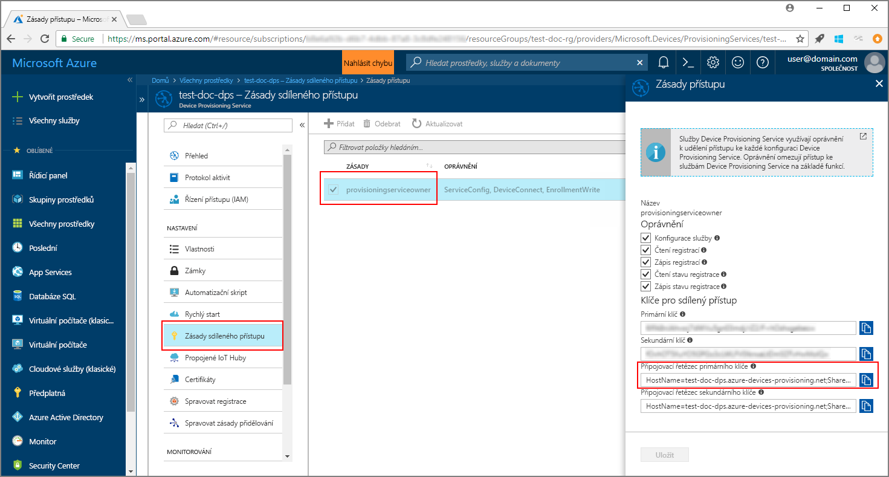
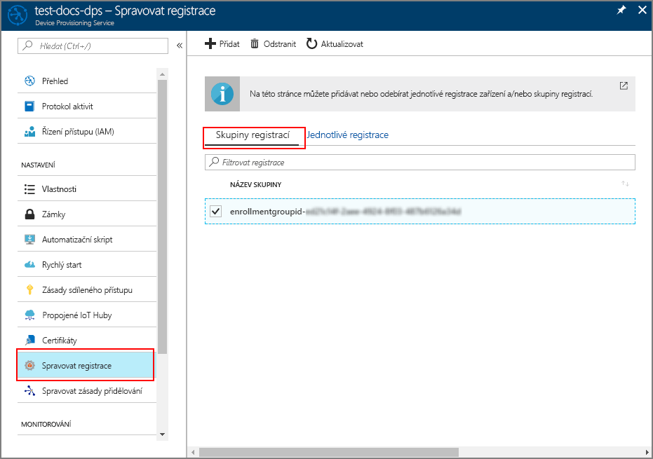

# <a name="enroll-x509-devices-to-iot-hub-device-provisioning-service-using-java-service-sdk"></a>Registrace zařízení X.509 do služby IoT Hub Device Provisioning pomocí sady SDK služby pro Javu
> [!div class="op_single_selector"]
> * [Java](quick-enroll-device-x509-java.md)
> * [C#](quick-enroll-device-x509-csharp.md)
> * [Node.js](quick-enroll-device-x509-node.md)

Tyto kroky ukazují, jak prostřednictvím kódu programu zaregistrovat skupinu simulovaných zařízení X.509 do služby Azure IoT Hub Device Provisioning pomocí sady [SDK služby pro Javu](https://azure.github.io/azure-iot-sdk-java/service/) a ukázkové aplikace v Javě. Přestože sada SDK služby pro Javu funguje na počítačích s Windows i Linuxem, tento článek provádí procesem registrace s použitím vývojového počítače s Windows.

Než budete pokračovat, nezapomeňte [nastavit službu IoT Hub Device Provisioning pomocí webu Azure Portal](./quick-setup-auto-provision.md).

<a id="setupdevbox"></a>

## <a name="prepare-the-development-environment"></a>Příprava vývojového prostředí 

1. Ujistěte se, že na svém počítači máte nainstalované prostředí [Java SE Development Kit 8](http://www.oracle.com/technetwork/java/javase/downloads/jdk8-downloads-2133151.html). 

2. Nastavte proměnné prostředí pro vaši instalaci Javy. Proměnná `PATH` by měla obsahovat úplnou cestu k adresáři *jdk1.8.x\bin*. Pokud se jedná o první instalaci Javy na vašem počítači, vytvořte novou proměnnou prostředí `JAVA_HOME` a přidejte do ní odkaz na úplnou cestu k adresáři *jdk1.8.x*. Na počítači s Windows se tento adresář obvykle nachází ve složce *C:\\Program Files\\Java\\* a proměnné prostředí můžete vytvořit nebo upravit tak, že v **Ovládacích panelech** na počítači s Windows vyhledáte možnost **Upravit proměnné prostředí systému**. 

  Úspěšné nastavení Javy na vašem počítači můžete zkontrolovat spuštěním následujícího příkazu v příkazovém okně:

    ```cmd\sh
    java -version
    ```

3. Stáhněte a rozbalte na svém počítači [Maven 3](https://maven.apache.org/download.cgi). 

4. Upravte proměnnou prostředí `PATH` tak, aby odkazovala na složku *apache-maven-3.x.x\\bin* ve složce, kam se extrahoval Maven. Úspěšnou instalaci Mavenu můžete ověřit spuštěním tohoto příkazu v příkazovém okně:

    ```cmd\sh
    mvn --version
    ```

5. Ujistěte se, že je na vašem počítači nainstalovaný [git](https://git-scm.com/download/) a že je přidaný do proměnné prostředí `PATH`. 


<a id="javasample"></a>

## <a name="download-and-modify-the-java-sample-code"></a>Stažení a úprava vzorového kódu v Javě

Tato část ukazuje, jak do vzorového kódu přidat podrobnosti o zřizování vašeho zařízení X.509. 

1. Otevřete příkazový řádek. Naklonujte úložiště GitHub se vzorovým kódem pro registraci zařízení pomocí sady SDK služby pro Javu:
    
    ```cmd\sh
    git clone https://github.com/Azure/azure-iot-sdk-java.git --recursive
    ```

2. Ve staženém zdrojovém kódu přejděte do složky s ukázkou **_azure-iot-sdk-java/provisioning/provisioning-samples/service-enrollment-group-sample_**. Otevřete soubor **_/src/main/java/samples/com/microsoft/azure/sdk/iot/ServiceEnrollmentGroupSample.java_** v libovolném editoru a přidejte následující podrobnosti:

    1. Následujícím způsobem přidejte `[Provisioning Connection String]` pro vaši službu zřizování z portálu:
        1. Přejděte k vaší službě zřizování na webu [Azure Portal](https://portal.azure.com). 
        2. Otevřete **Zásady sdíleného přístupu** a vyberte zásadu s oprávněním *EnrollmentWrite*.
        3. Zkopírujte **Primární připojovací řetězec klíče**. 

              

        4. V souboru se vzorovým kódem **_ServiceEnrollmentGroupSample.java_** nahraďte `[Provisioning Connection String]` za **Primární připojovací řetězec klíče**.

            ```Java
            private static final String PROVISIONING_CONNECTION_STRING = "[Provisioning Connection String]";
            ```

    2. Přidejte kořenový certifikát pro skupinu zařízení. Pokud potřebujete ukázkový kořenový certifikát, použijte nástroj _Generátor certifikátů X.509_ následujícím způsobem:
        1. V příkazovém okně přejděte do složky **_azure-iot-sdk-java/provisioning/provisioning-tools/provisioning-x509-cert-generator_**.
        2. Sestavte nástroj spuštěním následujícího příkazu:

                ```cmd\sh
                mvn clean install
                ```

        4. Spusťte nástroj pomocí následujících příkazů:

                ```cmd\sh
                cd target
                java -jar ./provisioning-x509-cert-generator-{version}-with-deps.jar
                ```

        5. Po zobrazení výzvy můžete volitelně zadat _běžný název_ pro vaše certifikáty.
        6. Tento nástroj místně vygeneruje **Klientský certifikát** (Client Cert), **Privátní klíč klientského certifikátu** (Client Cert Private Key) a **Kořenový certifikát** (Root Cert).
        7. Zkopírujte **kořenový certifikát** včetně řádků **_-----BEGIN CERTIFICATE-----_** a **_-----END CERTIFICATE-----_**. 
        8. Přiřaďte hodnotu **kořenového certifikátu** k parametru **PUBLIC_KEY_CERTIFICATE_STRING**, jak je znázorněno níže:

                ```Java
                private static final String PUBLIC_KEY_CERTIFICATE_STRING =
                        "-----BEGIN CERTIFICATE-----\n" +
                        "XXXXXXXXXXXXXXXXXXXXXXXXXXXXXXXXXXXXXXXXXXXXXXXXXXXXXXXXXXXXXXXX\n" +
                        "XXXXXXXXXXXXXXXXXXXXXXXXXXXXXXXXXXXXXXXXXXXXXXXXXXXXXXXXXXXXXXXX\n" +
                        "XXXXXXXXXXXXXXXXXXXXXXXXXXXXXXXXXXXXXXXXXXXXXXXXXXXXXXXXXXXXXXXX\n" +
                        "XXXXXXXXXXXXXXXXXXXXXXXXXXXXXXXXXXXXXXXXXXXXXXXXXXXXXXXXXXXXXXXX\n" +
                        "XXXXXXXXXXXXXXXXXXXXXXXXXXXXXXXXXXXXXXXXXXXXXXXXXXXXXXXXXXXXXXXX\n" +
                        "XXXXXXXXXXXXXXXXXXXXXXXXXXXXXXXXXXXXXXXXXXXXXXXXXXXXXXXXXXXXXXXX\n" +
                        "XXXXXXXXXXXXXXXXXXXXXXXXXXXXXXXXXXXXXXXXXXXXXXXXXXXXXXXXXXXXXXXX\n" +
                        "XXXXXXXXXXXXXXXXXXXXXXXXXXXXXXXXXXXXXXXXXXXXXXXXXXXXXXXXXXXXXXXX\n" +
                        "XXXXXXXXXXXXXXXXXXXXXXXXXXXXXXXXXXXXXXXXXXXXXXXXXXXXXXXXXXXXXXXX\n" +
                        "XXXXXXXXXXXXXXXXXXXXXXXXXXXXXXXXXXXXXXXXXXXXXXXXXXXXXXXXXXXXXXXX\n" +
                        "-----END CERTIFICATE-----\n";
                ```

        9. Zavřete příkazové okno nebo po zobrazení výzvy k zadání *ověřovacího kódu* zadejte **n**. 
 
    3. Volitelně můžete svou službu zřizování nakonfigurovat pomocí vzorového kódu:
        - Pokud chcete do ukázky přidat tuto konfiguraci, postupujte následovně:
            1. Na webu [Azure Portal](https://portal.azure.com) přejděte k centru IoT propojenému s vaší službou zřizování. Otevřete kartu **Přehled** tohoto centra a zkopírujte **Název hostitele**. Přiřaďte tento **Název hostitele** k parametru *IOTHUB_HOST_NAME* (NÁZEV_HOSTITELE_CENTRA_IOT).

                ```Java
                private static final String IOTHUB_HOST_NAME = "[Host name].azure-devices.net";
                ```
            2. Parametru *DEVICE_ID* (ID_ZAŘÍZENÍ) přiřaďte popisný název a u parametru *PROVISIONING_STATUS* (STAV_ZŘIZOVÁNÍ) ponechte výchozí hodnotu *ENABLED* (POVOLENO). 

        - NEBO, pokud se rozhodnete svoji službu zřizování nekonfigurovat, nezapomeňte okomentovat nebo odstranit následující příkazy v souboru _ServiceEnrollmentGroupSample.java_:

            ```Java
            enrollmentGroup.setIotHubHostName(IOTHUB_HOST_NAME);                // Optional parameter.
            enrollmentGroup.setProvisioningStatus(ProvisioningStatus.ENABLED);  // Optional parameter.
            ```

    4. Prostudujte si vzorový kód. Tento kód vytvoří, aktualizuje, dotazuje a odstraní skupinovou registraci pro zařízení X.509. Pokud chcete ověřit úspěšnou registraci na portálu, dočasně okomentujte následující řádky kódu na konci souboru _ServiceEnrollmentGroupSample.java_:

        ```Java
        // ************************************** Delete info of enrollmentGroup ***************************************
        System.out.println("\nDelete the enrollmentGroup...");
        provisioningServiceClient.deleteEnrollmentGroup(enrollmentGroupId);
        ```

    5. Uložte soubor _ServiceEnrollmentGroupSample.java_. 
 

<a id="runjavasample"></a>

## <a name="build-and-run-sample-group-enrollment"></a>Sestavení a spuštění ukázkové skupinové registrace

1. Otevřete příkazové okno a přejděte do složky **_azure-iot-sdk-java/provisioning/provisioning-samples/service-enrollment-group-sample_**.

2. Sestavte vzorový kód pomocí tohoto příkazu:

    ```cmd\sh
    mvn install -DskipTests
    ```

   Tento příkaz na váš počítač stáhne balíček Maven [`com.microsoft.azure.sdk.iot.provisioning.service`](https://www.mvnrepository.com/artifact/com.microsoft.azure.sdk.iot.provisioning/provisioning-service-client). Tento balíček obsahuje binární soubory sady SDK služby pro Javu, které vzorový kód vyžaduje k sestavení. Pokud jste v předchozí části spustili nástroj _Generátor certifikátů X.509_, bude tento balíček na vašem počítači už stažený. 

3. Spusťte ukázku pomocí těchto příkazů v příkazovém okně:

    ```cmd\sh
    cd target
    java -jar ./service-enrollment-group-sample-{version}-with-deps.jar
    ```

4. Sledujte v okně výstupu úspěšnou registraci.

5. Přejděte k vaší službě zřizování na webu Azure Portal. Klikněte na **Správa registrací**. Všimněte si, že se na kartě **Skupiny registrací** zobrazí vaše skupina zařízení X.509 s automaticky vygenerovaným *NÁZVEM SKUPINY*. 

      

## <a name="modifications-to-enroll-a-single-x509-device"></a>Úpravy pro registraci jednotlivého zařízení X.509

Pokud chcete zaregistrovat jediné zařízení X.509, upravte následujícím způsobem vzorový kód pro *jednotlivou registraci* použitý v tématu [Registrace zařízení TPM do služby IoT Hub Device Provisioning pomocí sady SDK služby pro Javu](quick-enroll-device-tpm-java.md#javasample):

1. Zkopírujte do schránky *Běžný název* vašeho klientského certifikátu X.509. Pokud chcete použít nástroj _Generátor certifikátů X.509_, jak je znázorněno v [předchozí části věnované vzorovému kódu](#javasample), zadejte _Běžný název_ vašeho certifikátu nebo použijte výchozí **microsoftriotcore**. Tento **Běžný název** použijte jako hodnotu pro proměnnou *REGISTRATION_ID* (ID_REGISTRACE). 

    ```Java
    // Use common name of your X.509 client certificate
    private static final String REGISTRATION_ID = "[RegistrationId]";
    ```

2. Přejmenujte proměnnou *TPM_ENDORSEMENT_KEY* na *PUBLIC_KEY_CERTIFICATE_STRING*. Zkopírujte váš klientský certifikát nebo **klientský certifikát** z výstupu nástroje _Generátor certifikátů X.509_ jako hodnotu proměnné *PUBLIC_KEY_CERTIFICATE_STRING*. 

    ```Java
    // Rename the variable *TPM_ENDORSEMENT_KEY* as *PUBLIC_KEY_CERTIFICATE_STRING*
    private static final String PUBLIC_KEY_CERTIFICATE_STRING =
            "-----BEGIN CERTIFICATE-----\n" +
            "XXXXXXXXXXXXXXXXXXXXXXXXXXXXXXXXXXXXXXXXXXXXXXXXXXXXXXXXXXXXXXXX\n" +
            "XXXXXXXXXXXXXXXXXXXXXXXXXXXXXXXXXXXXXXXXXXXXXXXXXXXXXXXXXXXXXXXX\n" +
            "XXXXXXXXXXXXXXXXXXXXXXXXXXXXXXXXXXXXXXXXXXXXXXXXXXXXXXXXXXXXXXXX\n" +
            "XXXXXXXXXXXXXXXXXXXXXXXXXXXXXXXXXXXXXXXXXXXXXXXXXXXXXXXXXXXXXXXX\n" +
            "XXXXXXXXXXXXXXXXXXXXXXXXXXXXXXXXXXXXXXXXXXXXXXXXXXXXXXXXXXXXXXXX\n" +
            "XXXXXXXXXXXXXXXXXXXXXXXXXXXXXXXXXXXXXXXXXXXXXXXXXXXXXXXXXXXXXXXX\n" +
            "XXXXXXXXXXXXXXXXXXXXXXXXXXXXXXXXXXXXXXXXXXXXXXXXXXXXXXXXXXXXXXXX\n" +
            "XXXXXXXXXXXXXXXXXXXXXXXXXXXXXXXXXXXXXXXXXXXXXXXXXXXXXXXXXXXXXXXX\n" +
            "XXXXXXXXXXXXXXXXXXXXXXXXXXXXXXXXXXXXXXXXXXXXXXXXXXXXXXXXXXXXXXXX\n" +
            "XXXXXXXXXXXXXXXXXXXXXXXXXXXXXXXXXXXXXXXXXXXXXXXXXXXXXXXXXXXXXXXX\n" +
            "-----END CERTIFICATE-----\n";
    ```
3. Ve funkci **main** nahraďte řádek `Attestation attestation = new TpmAttestation(TPM_ENDORSEMENT_KEY);` následujícím řádkem, který zajistí používání klientského certifikátu X.509:
    ```Java
    Attestation attestation = X509Attestation.createFromClientCertificates(PUBLIC_KEY_CERTIFICATE_STRING);
    ```

4. Pomocí postupu v části [Sestavení a spuštění vzorového kódu pro jednotlivou registraci](quick-enroll-device-tpm-java.md#runjavasample) uložte, sestavte a spusťte soubor s ukázkou *jednotlivé registrace*.


## <a name="clean-up-resources"></a>Vyčištění prostředků
Pokud chcete prozkoumat ukázku služby v Javě, neprovádějte čištění prostředků vytvořených v rámci tohoto rychlého startu. Pokud pokračovat nechcete, pomocí následujícího postupu odstraňte všechny prostředky vytvořené tímto rychlým startem.

1. Zavřete na svém počítači okno výstupu ukázky v Javě.
1. Zavřete na svém počítači okno _Generátoru certifikátů X.509_.
1. Přejděte k vaší službě Device Provisioning na webu Azure Portal, klikněte na **Správa registrací** a pak vyberte kartu **Skupiny registrací**. Vyberte *NÁZEV SKUPINY* pro zařízení X.509, která jste zaregistrovali v rámci tohoto rychlého startu, a klikněte na tlačítko **Odstranit** v horní části okna.  

## <a name="next-steps"></a>Další kroky
V tomto rychlém startu jste do své služby Device Provisioning zaregistrovali skupinu simulovaných zařízení X.509. Pokud se chcete se zřizováním zařízení seznámit podrobněji, pokračujte ke kurzu nastavení služby Device Provisioning na webu Azure Portal. 

> [!div class="nextstepaction"]
> [Kurzy pro službu Azure IoT Hub Device Provisioning](./tutorial-set-up-cloud.md)
