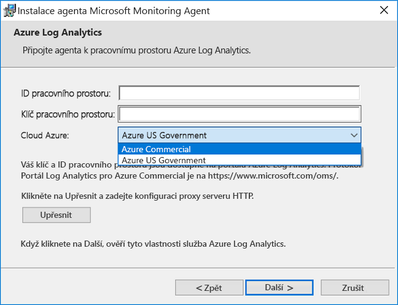
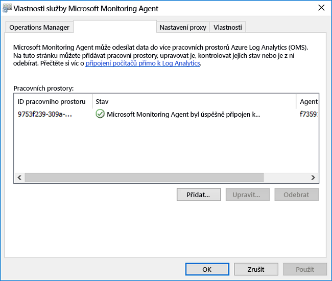

# <a name="connect-windows-computers-to-the-log-analytics-service-in-azure"></a>Připojení počítače se systémem Windows do služby analýzy protokolů Azure

Aby bylo možné sledovat a spravovat virtuální počítače nebo fyzického počítače ve vašem místním datovém centru nebo v jiném prostředí cloudu s analýzy protokolů, musíte nasadit Microsoft Monitoring Agent (MMA) a nakonfigurujte ji tak, aby odesílaly analýzy protokolů pro jeden nebo více pracovních prostorů.  Agenta podporuje i hybridní pracovní proces Runbooku role pro Azure Automation.  

Na monitorované počítače se systémem Windows je agent uveden jako služba Microsoft Monitoring Agent. Služba Microsoft Monitoring Agent shromažďuje události ze souborů protokolu a protokolu událostí systému Windows, údaje o výkonu a další telemetrií. I v případě, že agent není schopen komunikovat se službou analýzy protokolů, kterému předává sestavy, agent nadále spuštěna a shromážděná data na disk monitorovaného počítače fronty. Po obnovení připojení služby Microsoft Monitoring Agent odešle shromážděná data do služby.

Agent může být nainstalovaná pomocí jedné z následujících metod. Většina instalací použít kombinaci těchto metod k instalaci různé skupiny počítačů, podle potřeby.  Podrobnosti o použití každé metody jsou uvedeny dále v tomto článku.

* Ruční instalace. Instalační program je v počítači pomocí Průvodce instalací, z příkazového řádku spustit ručně nebo nasadit pomocí stávající nástroj pro distribuci softwaru.
* Služby Azure Automation konfigurace požadovaného stavu (DSC). Pomocí DSC ve službě Azure Automation pomocí skriptu pro počítače s Windows už nasazená ve vašem prostředí.  
* Skript prostředí PowerShell.
* Šablony Resource Manageru pro virtuální počítače s Windows v místě v zásobníku Azure.  

Abyste lépe porozuměli podporované konfiguraci, přečtěte si o [podporovaných operačních systémech Windows](log-analytics-concept-hybrid.md#supported-windows-operating-systems) a [konfiguraci síťové brány firewall](log-analytics-concept-hybrid.md#network-firewall-requirements).

## <a name="obtain-workspace-id-and-key"></a>Získání ID a klíče pracovního prostoru
Před instalací agenta Microsoft Monitoring Agent pro Windows potřebujete ID a klíč vašeho pracovního prostoru Log Analytics.  Tyto informace jsou nezbytné při instalaci z každé metody instalace správně nakonfigurovat agenta a zajistěte, aby že mohla úspěšně komunikovat s analýzy protokolů v komerčních Azure a cloudu US Government.  

1. Na webu Azure Portal klikněte na **Všechny služby**. V seznamu prostředků zadejte **Log Analytics**. Seznam se průběžně filtruje podle zadávaného textu. Vyberte **Log Analytics**.
2. V seznamu analýzy protokolů pracovních prostorů vyberte pracovní prostor, který máte v úmyslu týkající se konfigurace agenta nahlásit.
3. Vyberte **Upřesňující nastavení**.<br><br> <br><br>  
4. Vyberte **Připojené zdroje** a pak **Servery Windows**.   
5. Zkopírujte a vložte do svém oblíbeném editoru **ID pracovního prostoru** a **primární klíč**.    
   
## <a name="install-the-agent-using-setup-wizard"></a>Instalace agenta pomocí Průvodce instalací
Následující kroky instalace a konfigurace agenta pro analýzy protokolů v cloudu Azure a Azure Government pomocí Průvodce instalací pro agenta Microsoft Monitoring Agent v počítači.  

1. V pracovním prostoru Analyics protokolu z **servery Windows** stránky jste přešli dříve, vyberte odpovídající **stáhnout agenta Windows** verzi ke stažení v závislosti na architektuře procesoru operační systém Windows.   
2. Spusťte instalační program a nainstalujte agenta na svém počítači.
2. Na **úvodní** stránce klikněte na **Další**.
3. Na stránce **Licenční podmínky** si přečtěte licenční podmínky a pak klikněte na **Souhlasím**.
4. Na stránce **Cílová složka** změňte nebo ponechte výchozí instalační složku a pak klikněte na **Další**.
5. Na stránce **Možnosti instalace agenta** zvolte připojení agenta k Azure Log Analytics (OMS) a pak klikněte na **Další**.   
6. Na stránce **Azure Log Analytics** postupujte následovně:
   1. Vložte **ID pracovního prostoru** a **Klíč pracovního prostoru (primární klíč)**, které jste si zkopírovali dříve.  Pokud se má počítač hlásit do pracovního prostoru Log Analytics v cloudu Azure Government, vyberte z rozevíracího seznamu **Cloud Azure** možnost **Azure US Government**.  
   2. Pokud počítač potřebuje komunikovat se službou Log Analytics přes proxy server, klikněte na **Upřesnit** a zadejte adresu URL a číslo portu proxy serveru.  Pokud váš proxy server vyžaduje ověření, zadejte uživatelské jméno a heslo pro ověření proxy serveru a pak klikněte na **Další**.  
7. Jakmile dokončíte zadávání nezbytných nastavení konfigurace, klikněte na **Další**.<br><br> <br><br>
8. Na stránce **Připraveno k instalaci** zkontrolujte zvolené volby a pak klikněte na **Nainstalovat**.
9. Na stránce **Konfigurace byla úspěšně dokončena** klikněte na **Dokončit**.

Po dokončení se **Microsoft Monitoring Agent** zobrazí v **Ovládacích panelech**. Pokud chcete potvrdit, je generování sestav k analýze protokolů, zkontrolujte [ověřte připojení agenta k analýze protokolů](#verify-agent-connectivity-to-log-analytics). 

## <a name="install-the-agent-using-the-command-line"></a>Instalace agenta pomocí příkazového řádku
Stažený soubor pro agenta je samostatný instalační balíček.  Instalační program pro agenta a podpůrné soubory jsou obsažené v balíčku a potřeba extrahovat aby bylo možné správně nainstalovat pomocí příkazového řádku uvedené v následujících příkladech.    

>[!NOTE]
>Pokud chcete provést upgrade agenta, budete muset použít analýzy protokolů skriptování rozhraní API. Podívejte se na téma [správu a údržbu agenta analýzy protokolů pro systém Windows a Linux](log-analytics-agent-manage.md) Další informace.

Následující tabulka obsahuje konkrétní parametry analýzy protokolů nepodporuje instalaci agenta, včetně při nasazení pomocí Automation DSC.

|MMA specifické možnosti                   |Poznámky         |
|---------------------------------------|--------------|
| NASTAVENÍ NOAPM = 1                               | Volitelný parametr. Nainstaluje agenta bez monitorování výkonu aplikací .NET.|   
|ADD_OPINSIGHTS_WORKSPACE               | 1 = konfigurace agenta tak, aby odesílaly pracovního prostoru                |
|OPINSIGHTS_WORKSPACE_ID                | Id pracovního prostoru (guid) pro pracovní prostor pro přidání                    |
|OPINSIGHTS_WORKSPACE_KEY               | Klíč pracovního prostoru se používá k ověření původně s pracovním prostoru |
|OPINSIGHTS_WORKSPACE_AZURE_CLOUD_TYPE  | Zadejte cloudovém prostředí, kde se nachází v pracovním prostoru <br> 0 = komerční cloudu azure (výchozí) <br> 1 = azure Government |
|OPINSIGHTS_PROXY_URL               | Identifikátor URI pro proxy server používat |
|OPINSIGHTS_PROXY_USERNAME               | Uživatelské jméno pro přístup k ověřený server proxy |
|OPINSIGHTS_PROXY_PASSWORD               | Heslo pro přístup ověřený server proxy |

1. K extrakci instalačních souborů agenta z příkazového řádku se zvýšenými spustit `MMASetup-<platform>.exe /c` a zobrazí výzvu pro cestu k extrakci souborů.  Alternativně můžete zadat cestu předání argumentů `MMASetup-<platform>.exe /c /t:<Path>`.  
2. Bezobslužná instalace agenta a nakonfigurovat ji tak, aby odesílaly pracovního prostoru v cloudu Azure komerční ze složky jste extrahovali instalační soubory na typ: 
   
     ```dos
    setup.exe /qn NOAPM=1 ADD_OPINSIGHTS_WORKSPACE=1 OPINSIGHTS_WORKSPACE_AZURE_CLOUD_TYPE=0 OPINSIGHTS_WORKSPACE_ID=<your workspace id> OPINSIGHTS_WORKSPACE_KEY=<your workspace key> AcceptEndUserLicenseAgreement=1
    ```

   nebo pokud chcete nastavit agenta pro sestavy do cloudu Azure US Government, zadejte: 

     ```dos
    setup.exe /qn NOAPM=1 ADD_OPINSIGHTS_WORKSPACE=1 OPINSIGHTS_WORKSPACE_AZURE_CLOUD_TYPE=1 OPINSIGHTS_WORKSPACE_ID=<your workspace id> OPINSIGHTS_WORKSPACE_KEY=<your workspace key> AcceptEndUserLicenseAgreement=1
    ```

## <a name="install-the-agent-using-dsc-in-azure-automation"></a>Instalace agenta pomocí DSC v Azure Automation.

Následující ukázkový skript můžete použít k instalaci agenta pomocí Azure Automation DSC.   Pokud nemáte účet služby Automation, přečtěte si téma [Začínáme s Azure Automation](../automation/automation-offering-get-started.md) pochopit požadavky a kroky pro vytvoření účtu Automation vyžaduje před použitím Automation DSC.  Pokud nejste obeznámeni s Automation DSC, přečtěte si [Začínáme s Automation DSC](../automation/automation-dsc-getting-started.md).

Následující příklad nainstaluje agenta nástroje 64-bit, identifikovaný `URI` hodnotu. Můžete taky 32bitová verze nahrazením hodnota identifikátoru URI. Identifikátory URI pro obě verze jsou:

- 64bitový agent Windows- https://go.microsoft.com/fwlink/?LinkId=828603
- 32bitový agent Windows- https://go.microsoft.com/fwlink/?LinkId=828604


>[!NOTE]
>Tento postup a skriptu příklad nepodporuje upgrade agenta, už nasazená na počítači se systémem Windows.

32bitové a 64bitové verze balíčku agenta mají jiným produktem kódy a vydání nové verze také mít jedinečnou hodnotu.  Kód produktu je identifikátor GUID, který slouží jako základní identifikátor aplikace nebo produktu a je reprezentována Instalační služby systému Windows **ProductCode** vlastnost.  `ProductId value` v **MMAgent.ps1** skriptu musí odpovídat kód produktu z instalačního balíčku 32bitové nebo 64bitové verze agenta.

Chcete-li načíst kód produktu z balíčku instalace agenta přímo, můžete použít Orca.exe z [Windows vývojáři sady SDK součásti pro Windows Installer](https://msdn.microsoft.com/library/windows/desktop/aa370834%28v=vs.85%29.aspx) který je součástí systému Windows Software Development Kit nebo pomocí Prostředí PowerShell následující [ukázkový skript](http://www.scconfigmgr.com/2014/08/22/how-to-get-msi-file-information-with-powershell/) napsané pomocí Microsoft cenné Professional (MVP).  Buď způsob, musíte nejdřív pro extrahování **MOMagent.msi** souboru z MMASetup instalačního balíčku.  To je zobrazen výše v prvním kroku v části [instalace agenta pomocí příkazového řádku](#install-the-agent-using-the-command-line).  

1. Import xPSDesiredStateConfiguration DSC modulu z [ http://www.powershellgallery.com/packages/xPSDesiredStateConfiguration ](http://www.powershellgallery.com/packages/xPSDesiredStateConfiguration) do Azure Automation.  
2.  Vytvoření proměnných assetů Azure Automation pro *OPSINSIGHTS_WS_ID* a *OPSINSIGHTS_WS_KEY*. Nastavit *OPSINSIGHTS_WS_ID* ID pracovního prostoru analýzy protokolů a sadu *OPSINSIGHTS_WS_KEY* na primární klíč pracovního prostoru.
3.  Zkopírujte skript a uložte ho jako MMAgent.ps1

    ```PowerShell
    Configuration MMAgent
    {
        $OIPackageLocalPath = "C:\Deploy\MMASetup-AMD64.exe"
        $OPSINSIGHTS_WS_ID = Get-AutomationVariable -Name "OPSINSIGHTS_WS_ID"
        $OPSINSIGHTS_WS_KEY = Get-AutomationVariable -Name "OPSINSIGHTS_WS_KEY"

        Import-DscResource -ModuleName xPSDesiredStateConfiguration
        Import-DscResource –ModuleName PSDesiredStateConfiguration

        Node OMSnode {
            Service OIService
            {
                Name = "HealthService"
                State = "Running"
                DependsOn = "[Package]OI"
            }

            xRemoteFile OIPackage {
                Uri = "https://go.microsoft.com/fwlink/?LinkId=828603"
                DestinationPath = $OIPackageLocalPath
            }

            Package OI {
                Ensure = "Present"
                Path  = $OIPackageLocalPath
                Name = "Microsoft Monitoring Agent"
                ProductId = "8A7F2C51-4C7D-4BFD-9014-91D11F24AAE2"
                Arguments = '/C:"setup.exe /qn NOAPM=1 ADD_OPINSIGHTS_WORKSPACE=1 OPINSIGHTS_WORKSPACE_ID=' + $OPSINSIGHTS_WS_ID + ' OPINSIGHTS_WORKSPACE_KEY=' + $OPSINSIGHTS_WS_KEY + ' AcceptEndUserLicenseAgreement=1"'
                DependsOn = "[xRemoteFile]OIPackage"
            }
        }
    }

    ```

4. [Importovat konfigurační skript MMAgent.ps1](../automation/automation-dsc-getting-started.md#importing-a-configuration-into-azure-automation) do vašeho účtu Automation. 
5. [Počítač se systémem Windows nebo uzel přidělit](../automation/automation-dsc-getting-started.md#onboarding-an-azure-vm-for-management-with-azure-automation-dsc) ke konfiguraci. Během 15 minut uzlu zkontroluje konfiguraci a agenta vložena do uzlu.

## <a name="verify-agent-connectivity-to-log-analytics"></a>Ověřte připojení agenta k analýze protokolů

Po dokončení instalace agenta ověřování se úspěšně připojil a vytváření sestav můžete provést dvěma způsoby.  

Z počítače v **ovládací panely**, vyhledá položku **agenta Microsoft Monitoring Agent**.  Vyberte ho a na **Azure Log Analytics (OMS)** kartě agenta by se měl zobrazit zpráva s oznámením: **Microsoft Monitoring Agent úspěšně připojil ke službě Microsoft Operations Management Suite.**<br><br> 

Hledání jednoduchého protokolů můžete také provést na portálu Azure.  

1. Na webu Azure Portal klikněte na **Všechny služby**. V seznamu prostředků zadejte **Log Analytics**. Seznam se průběžně filtruje podle zadávaného textu. Vyberte **Log Analytics**.  
2. Na stránce pracovní prostor analýzy protokolů vyberte cílový pracovní prostor a pak vyberte **hledání protokolů** dlaždici. 
2. V podokně hledání protokolů v poli typu dotazu:  

    ```
    search * 
    | where Type == "Heartbeat" 
    | where Category == "Direct Agent" 
    | where TimeGenerated > ago(30m)  
    ```

Ve výsledcích vyhledávání vrátí měli byste vidět záznamy prezenčního signálu pro počítač, což značí, že je připojený a vytváření sestav ke službě.   

## <a name="next-steps"></a>Další postup

Zkontrolujte [správu a údržbu agenta analýzy protokolů pro systém Windows a Linux](log-analytics-agent-manage.md) Další informace o tom, jak Správa agenta během životního cyklu nasazení na vašich počítačích.  