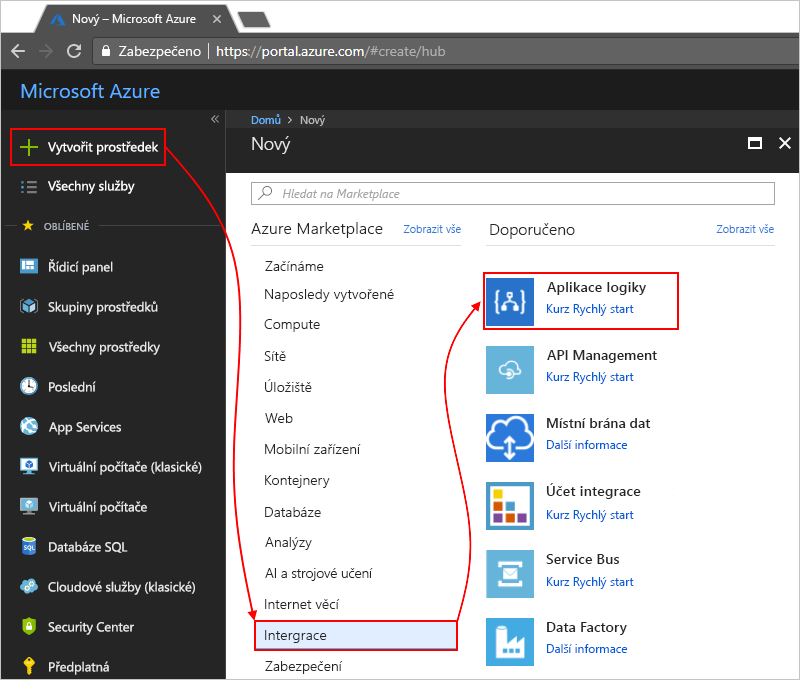
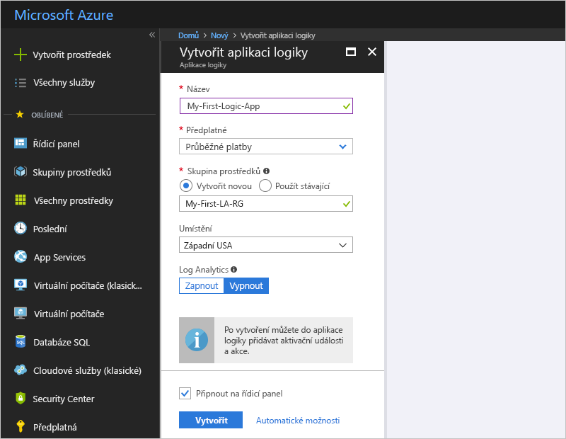
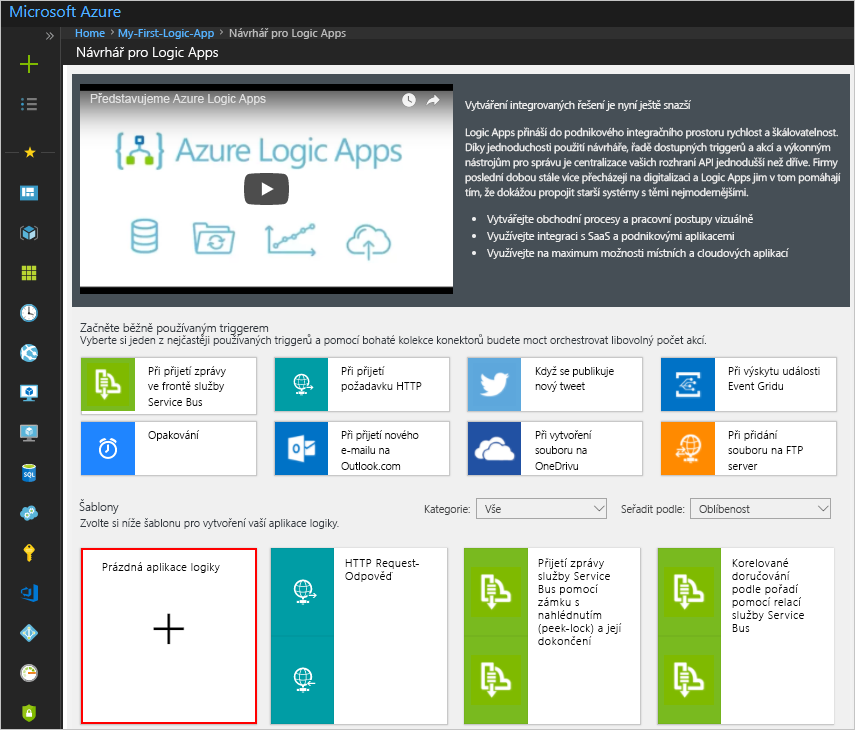
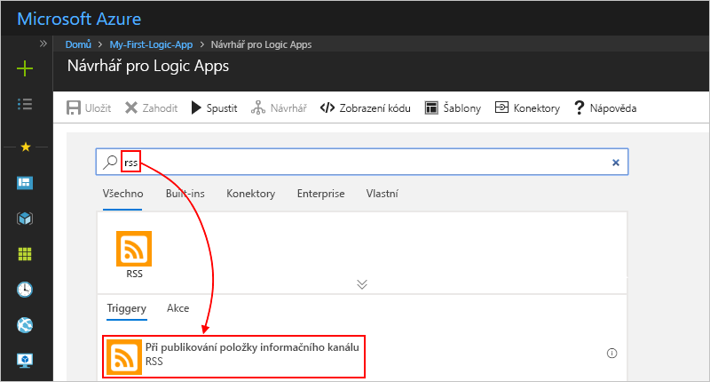
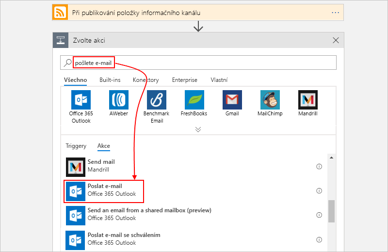
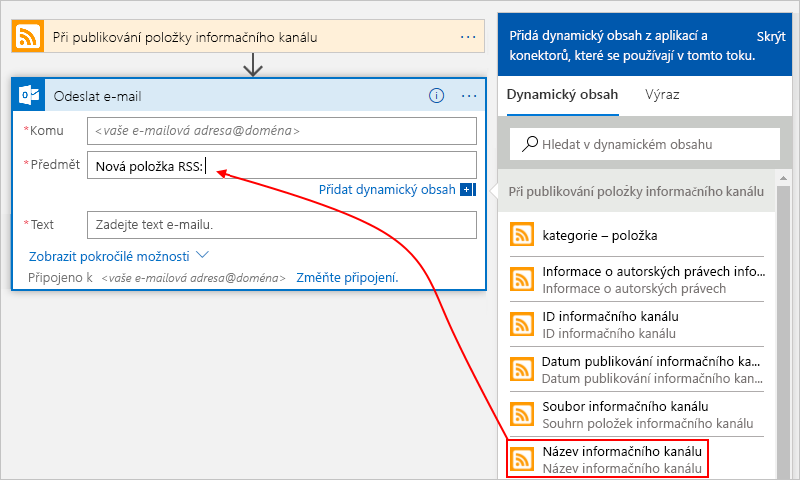
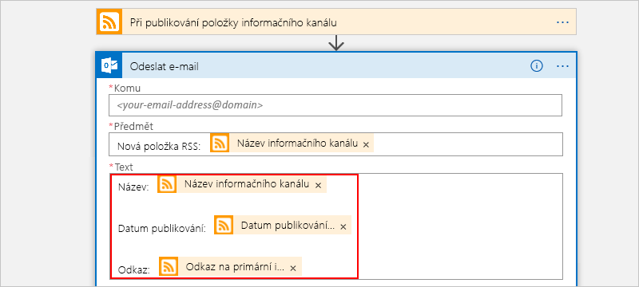
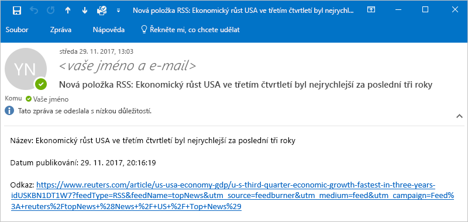
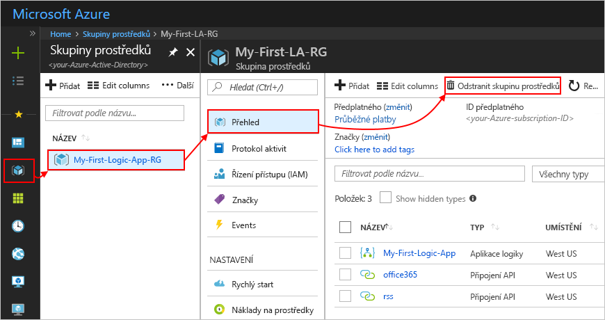

# <a name="quickstart-create-your-first-automated-workflow-with-azure-logic-apps---azure-portal"></a>Rychlý start: Vytvoření prvního automatizovaného pracovního postupu pomocí Azure Logic Apps – Azure Portal

V tomto rychlém startu se seznámíte se sestavením prvního automatizovaného pracovního postupu pomocí [Azure Logic Apps](../logic-apps/logic-apps-overview.md). V tomto článku vytvoříte aplikaci logiky, která pravidelně kontrolujte nové položky v informačním kanálu RSS webu. Pokud se najdou nové položky, aplikace logiky za každou z nich odešle e-mail. Jakmile budete hotovi, vaše aplikace logiky bude na základní úrovni vypadat jako tento pracovní postup:


Abyste mohli postupovat podle tohoto rychlého startu, potřebujete e-mailový účet od poskytovatele podporovaného v Logic Apps, jako je Office 365 Outlook, Outlook.com nebo Gmail. Pokud máte jiného poskytovatele, [tady se podívejte na seznam konektorů](https://docs.microsoft.com/connectors/). Tato aplikace logiky používá účet Office 365 Outlook. Pokud použijete jiný e-mailový účet, celkový postup bude stejný, ale vaše uživatelské rozhraní se může mírně lišit. 

Zároveň pokud ještě nemáte předplatné Azure, <a href="https://azure.microsoft.com/free/" target="_blank">zaregistrujte si bezplatný účet Azure</a>.

## <a name="sign-in-to-the-azure-portal"></a>Přihlášení k webu Azure Portal

Přihlaste se k webu <a href="https://portal.azure.com" target="_blank">Azure Portal</a> pomocí přihlašovacích údajů svého účtu Azure.

## <a name="create-your-logic-app"></a>Vytvoření aplikace logiky 

1. V hlavní nabídce Azure zvolte **Vytvořit prostředek** > **Podniková integrace** > **Aplikace logiky**.

   

3. V části **Vytvořit aplikaci logiky** zadejte podrobnosti o vaší aplikaci logiky, jak je vidět zde. Až budete hotovi, zvolte **Připnout na řídicí panel** > **Vytvořit**.

   

   | Nastavení | Hodnota | Popis | 
   | ------- | ----- | ----------- | 
   | **Název** | MyFirstLogicApp | Název vaší aplikace logiky | 
   | **Předplatné** | <*název_vašeho_předplatného_Azure*> | Název vašeho předplatného Azure | 
   | **Skupina prostředků** | My-First-LA-RG | Název [skupiny prostředků Azure](../azure-resource-manager/resource-group-overview.md) sloužící k uspořádání souvisejících prostředků | 
   | **Umístění** | Východní USA 2 | Oblast, do které se uloží informace o vaší aplikaci logiky | 
   | **Log Analytics** | Vypnuto | Pokud chcete zapnout protokolování diagnostiky, ponechte nastavení **Vypnuto**. | 
   |||| 

3. Jakmile Azure nasadí vaši aplikaci, otevře se Návrhář pro Logic Apps se zobrazenou stránkou s úvodním videem a běžně používanými triggery. V části **Šablony** zvolte **Prázdná aplikace logiky**.

   

Dále přidejte [trigger](../logic-apps/logic-apps-overview.md#logic-app-concepts), který se aktivuje, když se v informačním kanálu RSS objeví nová položka. Každá aplikace logiky se musí spouštět triggerem, který se aktivuje při určité události nebo splnění určité podmínky. Pokaždé, když se trigger aktivuje, vytvoří modul Logic Apps instanci aplikace logiky pro spuštění vašeho pracovního postupu.

<a name="add-rss-trigger"></a>

## <a name="check-rss-feed-with-a-trigger"></a>Kontrola informačního kanálu RSS pomocí triggeru

1. V návrháři zadejte do vyhledávacího pole „rss“. Vyberte trigger **RSS – Při publikování položky informačního kanálu**.

   

2. Zadejte pro trigger informace zobrazené a popsané níže: 

   

   | Nastavení | Hodnota | Popis | 
   | ------- | ----- | ----------- | 
   | **Adresa URL informačního kanálu RSS** | ```http://feeds.reuters.com/reuters/topNews``` | Odkaz na informační kanál RSS, který chcete monitorovat | 
   | **Interval** | 1 | Počet intervalů, po které se má čekat mezi kontrolami | 
   | **Frekvence** | Minuta | Jednota času pro každý interval mezi kontrolami  | 
   |  |  |  | 

   Interval a frekvence společně definují plán pro trigger vaší aplikace logiky. 
   Tato aplikace logiky kontroluje kanál každou minutu.

3. Pokud chcete podrobnosti o triggeru prozatím skrýt, klikněte na záhlaví triggeru.

   

4. Uložte svou aplikaci logiky. Na panelu nástrojů návrháře zvolte **Uložit**. 

Vaše aplikace logiky je teď v provozu, ale kromě kontroly informačního kanálu nic nedělá. Přidejte tedy akci, která bude reagovat na aktivaci triggeru.

## <a name="send-email-with-an-action"></a>Odeslání e-mailu pomocí akce

Nyní přidejte [akci](../logic-apps/logic-apps-overview.md#logic-app-concepts), která odešle e-mail, když se v informačním kanálu RSS objeví nová položka. 

1. Pod triggerem **Při publikování položky informačního kanálu** zvolte **+ Nový krok** > **Přidat akci**.

   

2. V části **Zvolit akci** vyhledejte „odeslat e-mail“ a pak vyberte akci „odeslat e-mail“ pro požadovaného poskytovatele e-mailu. Pokud chcete v seznamu akcí vyfiltrovat konkrétní službu, můžete nejprve vybrat konektor v části **Konektory**.

   

   * Pro pracovní nebo školní účty Azure vyberte Office 365 Outlook. 
   * Pro osobní účty Microsoft vyberte Outlook.com.

3. Pokud se zobrazí výzva k zadání přihlašovacích údajů, přihlaste se ke svému e-mailovému účtu a Logic Apps vytvoří připojení k vašemu e-mailovému účtu.

4. V akci **Odeslat e-mail** určete data, která má e-mail zahrnovat. 

   1. Do pole **Komu** zadejte e-mailovou adresu příjemce. 
   Pro účely testování můžete použít svou vlastní e-mailovou adresu.

      Prozatím ignorujte seznam parametrů nebo seznam **Přidat dynamický obsah**, které se zobrazí. 
      Tento seznam se zobrazí po kliknutí do některých textových polí a zobrazí všechny dostupné parametry z předchozího kroku, které můžete do svého pracovního postupu zahrnout jako vstupy.
      Šířka vašeho prohlížeče určuje, který seznam se zobrazí.

   2. Do pole **Předmět** zadejte tento text s mezerou na konci: ```New RSS item: ```

      
 
   3. Ze seznamu parametrů nebo seznamu **Přidat dynamický obsah** vyberte **Název informačního kanálu** a zahrňte název položky RSS.

      Tady je příklad seznamu parametrů:

      

      A tady je seznam dynamického obsahu:

      

      Jakmile budete hotovi, předmět e-mailu bude vypadat jako v tomto příkladu:

      

      Pokud se v návrháři zobrazí smyčka For each, pak jste vybrali pole obsahující pole, například pole **categories-item**. 
      Pro tyto typy polí návrhář automaticky přidá tuto smyčku okolo akce, která obsahuje referenci na příslušné pole. 
      Aplikace logiky tak provede stejnou akci pro každou položku pole. 
      Pokud chcete smyčku odebrat, zvolte **tři tečky** (**...**) v záhlaví smyčky a pak zvolte **Odstranit**.

   4. Do pole **Text** zadejte tento text a pro text e-mailu vyberte tato pole. 
   Pokud chcete do textového pole přidat prázdné řádky, stiskněte Shift + Enter. 

      

      | Nastavení | Popis | 
      | ------- | ----------- | 
      | **Název informačního kanálu** | Název položky | 
      | **Datum publikování informačního kanálu** | Datum a čas publikování položky | 
      | **Odkaz na primární informační kanál** | Adresa URL položky | 
      ||| 
   
5. Uložte svou aplikaci logiky.

Dále svou aplikaci logiky otestujte.

## <a name="run-your-logic-app"></a>Spuštění aplikace logiky

Pokud chcete aplikaci logiky spustit ručně, na panelu nástrojů návrháře zvolte **Spustit**. Nebo počkejte, až aplikace logiky zkontroluje informační kanál RSS podle zadaného plánu (každou minutu). Pokud informační kanál RSS obsahuje nové položky, aplikace logiky za každou novou položku odešle e-mail. Jinak vaše aplikace logiky s další kontrolou počká na další interval. 

Například tady je ukázka e-mailu, který tato aplikace logiky odešle. Pokud neobdržíte žádné e-maily, zkontrolujte složku s nevyžádanými e-maily.



Technicky vzato, když trigger zkontroluje informační kanál RSS a najde nové položky, aktivuje se a modul Logic Apps vytvoří instanci pracovního postupu vaší aplikace logiky, která provede akce v tomto pracovním postupu.
Pokud trigger nenajde nové položky, neaktivuje se a přeskočí vytvoření instance pracovního postupu.

Blahopřejeme, právě jste pomocí webu Azure Portal úspěšně sestavili a spustili svou první aplikaci logiky.

## <a name="clean-up-resources"></a>Vyčištění prostředků

Pokud už je nepotřebujete, odstraňte skupinu prostředků, která obsahuje vaši aplikaci logiky, a všechny související prostředky. V hlavní nabídce Azure přejděte na **Skupiny prostředků** a vyberte skupinu prostředků pro vaši aplikaci logiky. Zvolte **Odstranit skupinu prostředků**. Pro ověření zadejte název skupiny prostředků a zvolte **Odstranit**.



## <a name="get-support"></a>Získat podporu

* Pokud máte dotazy, navštivte [fórum Azure Logic Apps](https://social.msdn.microsoft.com/Forums/en-US/home?forum=azurelogicapps).
* Pokud chcete zanechat své nápady na funkce nebo hlasovat, navštivte [web zpětné vazby od uživatelů Logic Apps](http://aka.ms/logicapps-wish).

## <a name="next-steps"></a>Další kroky

V tomto rychlém startu jste vytvořili svou první aplikaci logiky, která podle zadaného plánu (každou minutu) kontroluje aktualizace informačního kanálu RSS a při nalezení aktualizace provede akci. Další informace najdete v tomto kurzu, ve kterém se vytváří pokročilejší pracovní postupy založené na plánu:

> [!div class="nextstepaction"]
> [Kontrola provozu s využitím aplikace logiky založené na plánu](../logic-apps/tutorial-build-schedule-recurring-logic-app-workflow.md)
