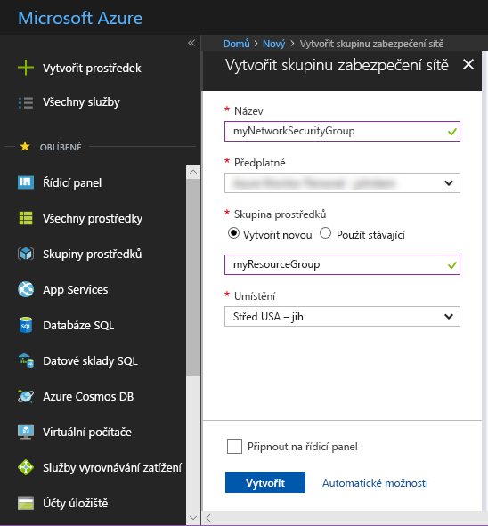
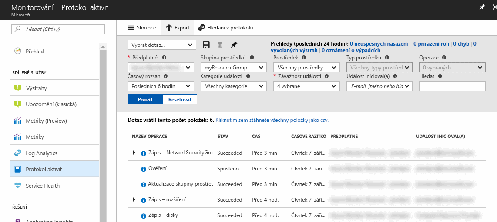
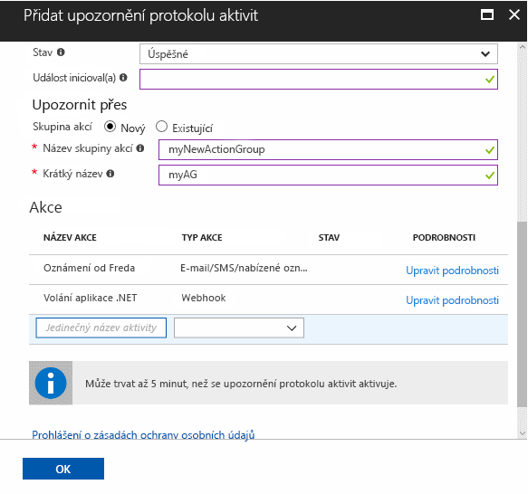

# Audit a přijímat oznámení o důležité akce v rámci vašeho předplatného Azure

**Protokol činnosti Azure** poskytuje historii událostí na úrovni předplatného v Azure. Nabízí informace o *kdo* vytvořené, aktualizovat nebo odstranit *co* prostředky a *při* tomu bylo ho. Můžete vytvořit **protokol aktivit výstraha** pro příjem e-mailu, SMS nebo webhooku oznámení, když dojde k aktivitě, která odpovídají vašim výstrahy podmínkám. Tento postup rychlého spuštění prostřednictvím vytváření skupinu zabezpečení sítě jednoduchý, procházení protokol aktivit pochopit událost, která došlo k chybě a pak vytváření výstrahu protokolu aktivit stát upozorněni na žádnou skupinu zabezpečení sítě se vytvoří probíhající předávání.

Pokud ještě nemáte předplatné Azure, vytvořte si [bezplatný účet](https://azure.microsoft.com/free/) před tím, než začnete.

## Přihlášení k portálu Azure Portal

Přihlaste se k portálu [Azure Portal](https://portal.azure.com/).

## Vytvořit skupinu zabezpečení sítě

1. Klikněte na tlačítko **Nový** v levém horním rohu webu Azure Portal.

2. Vyberte **sítě**, vyberte **skupinu zabezpečení sítě**.

3. Zadejte "myNetworkSG" jako **název** a vytvořte novou skupinu prostředků s názvem **myResourceGroup**. Klikněte na tlačítko **Vytvořit**.

    

## Vyhledejte v protokolu aktivit na portálu

Událost teď přidaná do aktivity protokolu, který popisuje vytvoření skupiny zabezpečení sítě. Postupujte podle následujících pokynů k identifikaci této události.

1. Klikněte **monitorování** nalezeno v seznamu levé navigační tlačítko. Otevře se do části protokol aktivit. Tato část obsahuje historii všechny akce, které uživatelé uskutečnili na prostředky v rámci vašeho předplatného, filtrování podle několik vlastností, jako **skupiny prostředků**, **časový interval**, a  **Kategorie**.

2. V **protokol aktivit** klikněte na položku **skupiny prostředků** rozevírací seznam a vyberte **myResourceGroup**. Změna **časový interval** rozevírací k **poslední 1 hodinu**. Klikněte na tlačítko **Použít**.

    

3. Klikněte na **zápis skupin zabezpečení sítě** událostí v tabulce zobrazených událostí.

## Procházet událost v protokolu aktivit

Oddíl, který se zobrazí obsahuje základní podrobnosti o operaci, která byla provedena, včetně názvu, časové razítko a uživatel nebo aplikace, která ho provést.

Klikněte na **JSON** zobrazíte podrobnosti úplné události. To zahrnuje podrobnosti o tom, jak se k provedení operaci, kategorii události a úroveň a stav operace oprávnění uživatele nebo aplikace.

## Vytvořit výstrahu protokolu aktivit

1. Klikněte na **souhrnné** karta se vraťte do souhrn události.

2. V části Souhrn, který se zobrazí, klikněte na tlačítko **přidat aktivitu protokolu upozornění**.

    

3. V oddílu, který se zobrazí zadejte název a popis výstrahy protokol aktivit.

4. V části **kritéria** Ujistěte se, že **kategorie události** je nastaven na **správy**, **typ prostředku** je nastaven na **sítě skupiny zabezpečení**, **název operace** je nastaven na **vytvořit nebo aktualizovat skupinu zabezpečení sítě**, **stav** je nastaven na  **Úspěšné** a všechny ostatní pole kritéria jsou prázdné nebo je nastavený na **všechny**. Kritéria definovat pravidla používá k určení, zda by měl být výstraha aktivován, jakmile se zobrazí novou událost v protokolu aktivit.

    

5. V části **výstrahy prostřednictvím** vyberte **nový** akce skupiny a poskytují **název** a **krátký název** pro skupinu akce. Skupina akce definuje sadu akcí při aktivaci výstrahy (při kritéria odpovídat novou událost).

6. V části **akce** přidat 1 nebo více akcí tím, že poskytuje **název** pro akce, **typ akce** (například e-mailu nebo SMS), a **podrobnosti**pro konkrétní akce typu (například URL webhooku se nenačetla, e-mailovou adresu nebo číslo SMS).

    

7. Klikněte na tlačítko **Ok** uložit protokol aktivit výstrahy.

## Testování výstrahu protokolu aktivit

> [!NOTE]
> Jak dlouho trvá přibližně 10 minut na výstrahu protokolu aktivit plně přístupné. Nové události, které nastaly předtím, než je plně podporují protokol aktivit výstrahy negenerují oznámení.
>
>

Chcete-li otestovat výstrahy, opakujte předchozím oddílu, který má **vytvořit skupinu zabezpečení sítě**, ale zadejte jiný název této skupině zabezpečení sítě a znovu použít existující skupinu prostředků. Během několika minut obdržíte oznámení, že byla vytvořena skupina zabezpečení sítě.

## Vyčištění prostředků

Pokud již nepotřebujete, odstraňte skupinu prostředků a skupina zabezpečení sítě. Uděláte to tak, zadejte název skupiny prostředků, kterou jste vytvořili do vyhledávacího pole v horní části portálu a klikněte na název skupiny prostředků. V oddílu, který se zobrazí, klikněte na **odstranit skupinu prostředků** tlačítko, zadejte název skupiny prostředků a klikněte na tlačítko **odstranit**.

## Další kroky

V této úvodní provedena operace ke generování aktivity protokolu události a poté jste vytvořili výstrahu protokolu aktivit stát upozorněni, když dojde k této operaci znovu v budoucnu. Potom otestovat výstrahy provedením tuto operaci opakujte. Díky Azure je k dispozici aktivity protokolu události za posledních 90 dnů. Pokud je potřeba zachovat události delší než 90 dní, zkuste archivace data protokolu aktivit spolu s dalšími daty monitorování.

> [!div class="nextstepaction"]
> [Archivace dat monitorování](./monitor-tutorial-archive-monitoring-data.md)
