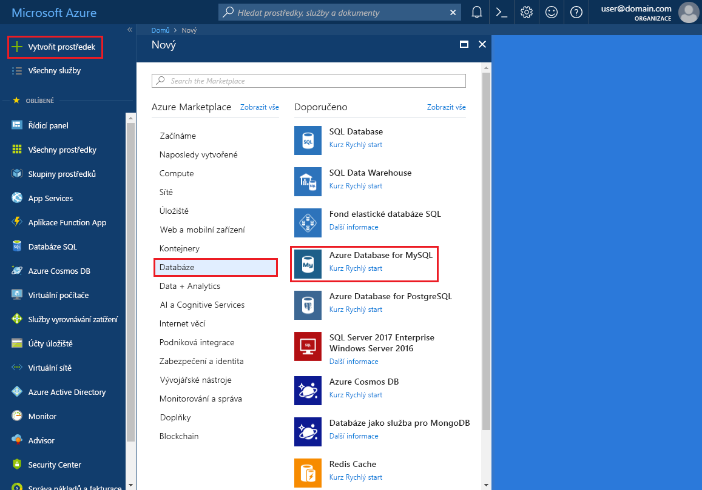
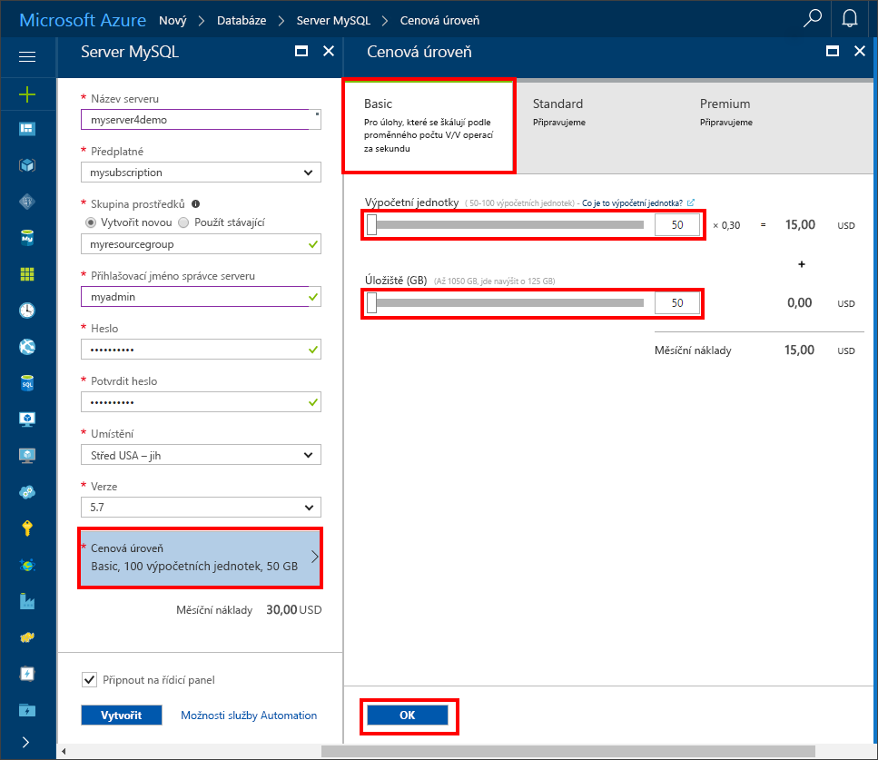

<a id="create-an-azure-database-for-mysql-server-using-azure-portal" class="xliff"></a>

# Vytvoření serveru Azure Database for MySQL pomocí portálu Azure Portal
Tento článek vás provede vytvořením serveru Azure Database for MySQL v pěti minutách pomocí webu Azure Portal. 

Pokud ještě nemáte předplatné Azure, vytvořte si [bezplatný účet](https://azure.microsoft.com/free/) před tím, než začnete.

<a id="log-in-to-azure" class="xliff"></a>

## Přihlaste se k Azure.
Otevřete svůj webový prohlížeč a přejděte na [portál Microsoft Azure Portal](https://portal.azure.com/). Zadejte přihlašovací údaje pro přihlášení k portálu. Výchozím zobrazením je váš řídicí panel služby.

<a id="create-azure-database-for-mysql-server" class="xliff"></a>

## Vytvoření serveru Azure Database for MySQL
1. Klikněte na tlačítko **Nový** v levém horním rohu webu Azure Portal.

2. Na stránce **Nový** vyberte **Databáze** a na stránce **Databáze** vyberte **Azure Database for MySQL**. Službu můžete najít také zadáním **MySQL** do vyhledávacího pole na stránce Nový.


3. Vyplňte formulář podrobností nového serveru pomocí následujících informací, jak je vidět na předchozím obrázku:

| **Nastavení** | **Navrhovaná hodnota** | **Popis pole** |
|---|---|---|
| *Název serveru* | myserver4demo  | Název serveru musí být globálně jedinečný. |
| *Předplatné* | mysubscription | Vyberte vaše předplatné z rozevíracího seznamu. |
| *Skupina prostředků* | myresourcegroup | Vytvořte skupinu prostředků nebo použijte existující. |
| *Přihlašovací jméno správce serveru* | myadmin | Zadejte název účtu, který bude správcem stroje MySQL. |
| *Heslo* |  | Nastavte silné heslo účtu správce. |
| *Potvrdit heslo* |  | Potvrďte heslo účtu správce. |
| *Umístění* |  | Vyberte dostupnou oblast. |
| *Verze* | 5.7 | Zvolte nejnovější verzi. |
| *Cenová úroveň* | Basic, 50 výpočetních jednotek, 50 GB úložiště  | Zvolte **Cenovou úroveň**, **Výpočetní jednotky**, **Úložiště (GB)** a potom klikněte na **OK**. |
| *Připnout na řídicí panel* | Zaškrtnout | Doporučuje se toto zaškrtávací políčko zaškrtnout, abyste později server snadno našli. |

   Klikněte na **Cenová úroveň** a určete cenovou úroveň a úroveň výkonu pro novou databázi. Pro tento rychlý start vyberte úroveň Basic, 50 výpočetních jednotek a 50 GB zahrnutého úložiště. Pak kliknutím na **OK** cenovou úroveň uložte.
   
   

   Poté klikněte na možnost **Vytvořit**. Po jedné až dvou minutách bude server Azure Database for MySQL spuštěný v cloudu. Pokud chcete monitorovat proces nasazení, klikněte na tlačítko **Oznámení** (ikona zvonku) na panelu nástrojů.

<a id="configure-the-firewall" class="xliff"></a>

## Konfigurace brány firewall
Dříve než se poprvé připojíte k Azure Database for MySQL, nakonfigurujte bránu firewall a přidejte IP adresu veřejné sítě klienta (nebo rozsah IP adres) na seznam povolených adres.

1. Jakmile se nasazení dokončí, klikněte na **Všechny prostředky** v nabídce vlevo a zadejte název **myserver4demo**. Vyhledáte tak nově vytvořený server. Klikněte na název serveru uvedený ve výsledcích hledání. Otevře se stránka Přehled vašeho serveru a poskytne vám možnosti další konfigurace.

2. V okně serveru vyberte **Zabezpečení připojení**.

3. Pokud chcete přidat IP adresu místního počítače nebo nakonfigurovat rozsah IP adres, klikněte na **Přidat moji IP adresu**. Po vytvoření pravidel nezapomeňte kliknout na **Uložit**.
  

<a id="get-connection-information" class="xliff"></a>

## Získání informací o připojení
Na portálu Azure Portal získejte plně kvalifikovaný název domény pro server Azure MySQL. Plně kvalifikovaný název domény použijte pro připojení k vašemu serveru pomocí nástroje pro příkazový řádek **mysql.exe**.

1.  Na portálu [Azure Portal](https://portal.azure.com/) klikněte v levé nabídce na **Všechny prostředky** a klikněte na server Azure Database for MySQL.

2.  Klikněte na **Vlastnosti**. Poznamenejte si **NÁZEV SERVERU** a **PŘIHLAŠOVACÍ JMÉNO SPRÁVCE SERVERU**.
V tomto příkladu je název serveru *myserver4demo.mysql.database.azure.com* a přihlašovací jméno správce serveru je *myadmin@myserver4demo*.

<a id="connect-to-the-server-using-mysqlexe-command-line-tool" class="xliff"></a>

## Připojení k serveru pomocí nástroje příkazového řádku mysqlexe
Použijte [nástroj pro příkazový řádek mysql](https://dev.mysql.com/doc/refman/5.7/en/mysql.html) k navázání připojení k serveru Azure Database for MySQL. Nástroj pro příkazový řádek mysql můžete spustit v prohlížeči pomocí služby Azure Cloud Shell nebo na vlastním počítači pomocí lokálně nainstalovaných nástrojů mysql. Pokud chcete spustit Azure Cloud Shell, klikněte na tlačítko`Try It` na bloku kódu v tomto článku nebo přejděte na web [Azure Portal](https://portal.azure.com) a klikněte na ikonu `>_` na panelu nástrojů vpravo nahoře. 

1. Zadejte příkaz pro připojení:
```azurecli-interactive
mysql -h myserver4demo.mysql.database.azure.com -u myadmin@myserver4demo -p
```

2. Zobrazte stav serveru a ujistěte se, že je připojení funkční. Po připojení zadejte na příkazovém řádku mysql> `status`.
```sql
status
```

   

   > [!TIP]
   > Další příkazy najdete v [Referenční příručce k MySQL 5.7 – v kapitole 4.5.1](https://dev.mysql.com/doc/refman/5.7/en/mysql.html).

3. Vytvořte prázdnou databázi zadáním příkazu `CREATE DATABASE` na příkazovém řádku mysql>.

   ```sql
   CREATE DATABASE quickstartdb;
   ```

   V rámci serveru Azure Database for MySQL můžete mít jednu nebo několik databází. Můžete se rozhodnout vytvořit jednu databázi na server pro využití všech prostředků nebo vytvořit několik databází, které budou prostředky sdílet. Neexistuje žádné omezení počtu databází, které je možné vytvořit. Více databází ale sdílí stejné prostředky serveru.  

4. Seznam databází zobrazíte zadáním příkazu `SHOW DATABASES` na příkazovém řádku mysql>.

   ```sql
   SHOW DATABASES;
   ```

<a id="connect-to-the-server-using-the-mysql-workbench-gui-tool" class="xliff"></a>

## Připojení k serveru pomocí nástroje grafického uživatelského rozhraní MySQL Workbench
1.  Na klientském počítači spusťte aplikaci MySQL Workbench. MySQL Workbench můžete stáhnout a nainstalovat [odtud](https://dev.mysql.com/downloads/workbench/).

2.  V dialogovém okně pro **nastavení nového připojení** zadejte na kartě **Parametry** následující informace:

   

| **Nastavení** | **Navrhovaná hodnota** | **Popis pole** |
|---|---|---|
|   *Název připojení* | Ukázkové připojení| Zadejte popisek pro toto připojení. |
| *Způsob připojení* | Standard (TCP/IP) | Standard (TCP/IP) je dostačující. |
| *Název hostitele* | myserver4demo.mysql.database.azure.com | Použijte plně kvalifikovaný název vašeho serveru. |
| *Port* | 3306 | Použijte výchozí port 3306. |
| *Uživatelské jméno* | myadmin@myserver4demo  | Použijte přihlašovací jméno správce serveru, které jste si poznamenali dříve, následované znakem @ a názvem serveru. |
| *Heslo* | vaše heslo | Kliknutím na tlačítko Uložit v trezoru... heslo uložte. |

Pokud chcete otestovat, jestli jsou všechny parametry správně nakonfigurované, klikněte na **Test připojení**. Kliknutím na tlačítko OK uložte připojení. 

> [!NOTE]
> Ve výchozím nastavení se na vašem serveru vynucuje SSL, což vyžaduje další konfiguraci, která zajistí úspěšné připojení. Podívejte se na téma [Konfigurace připojení SSL v aplikaci pro zabezpečené připojení k Azure Database for MySQL](./howto-configure-ssl.md).  Pokud chcete pro tento rychlý start zakázat SSL, přejděte na web Azure Portal, klikněte na stránku Zabezpečení připojení a deaktivujte přepínací tlačítko Vynucení připojení SSL.

<a id="clean-up-resources" class="xliff"></a>

## Vyčištění prostředků
Všechny prostředky, které jste v rychlém startu vytvořili, můžete vyčistit odstraněním [skupiny prostředků Azure](../azure-resource-manager/resource-group-overview.md).

> [!TIP]
> Další rychlé starty v této kolekci vycházejí z tohoto rychlého startu. Pokud chcete pokračovat v práci s dalšími rychlými starty, neprovádějte čištění prostředků vytvořených v rámci tohoto rychlého startu. Pokud pokračovat nechcete, pomocí následujících kroků odstraňte všechny prostředky vytvořené tímto rychlým startem na portálu Azure Portal.

1.  Na portálu Azure Portal v nabídce vlevo klikněte na **Skupiny prostředků** a pak klikněte na **myresourcegroup**.
2.  Na stránce skupiny prostředků klikněte na **Odstranit**, do textového pole zadejte **myresourcegroup** a pak klikněte na Odstranit.

Pokud byste chtěli odstranit nově vytvořený server:
1.  V nabídce na levé straně na portálu Azure Portal klikněte na servery PostgreSQL a vyhledejte právě vytvořený server.
2.  Na stránce Přehled klikněte na tlačítko Odstranit v horním podokně .
3.  Potvrďte název serveru, který chcete odstranit, a zobrazte jeho databáze, které tím ovlivníte. Do textového pole zadejte **myserver4demo** a pak klikněte na Odstranit.


<a id="next-steps" class="xliff"></a>

## Další kroky

> [!div class="nextstepaction"]
> [Návrh první databáze Azure Database for MySQL](./tutorial-design-database-using-portal.md)


