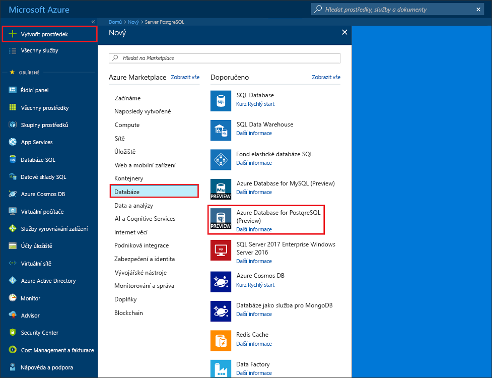
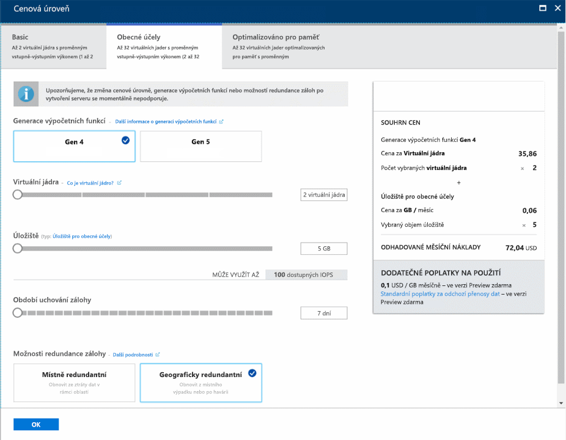

# <a name="tutorial-design-an-azure-database-for-postgresql-using-the-azure-portal"></a>Kurz: Návrh databáze Azure Database for PostgreSQL pomocí webu Azure Portal

Azure Database for PostgreSQL je spravovaná služba, která umožňuje spouštět, spravovat a škálovat vysoce dostupné databáze PostgreSQL v cloudu. Azure Portal umožňuje snadnou správu vašeho serveru a návrh databáze.

V tomto kurzu se naučíte, jak pomocí webu Azure Portal provést následující kroky:
> [!div class="checklist"]
> * Vytvoření serveru Azure Database for PostgreSQL
> * Konfigurace brány firewall serveru
> * Vytvoření databáze pomocí nástroje [**psql**](https://www.postgresql.org/docs/9.6/static/app-psql.html)
> * Načtení ukázkových dat
> * Dotazování dat
> * Aktualizace dat
> * Obnovení dat

## <a name="prerequisites"></a>Požadavky
Pokud ještě nemáte předplatné Azure, vytvořte si [bezplatný účet](https://azure.microsoft.com/free/) před tím, než začnete.

## <a name="log-in-to-the-azure-portal"></a>Přihlášení k portálu Azure Portal
Přihlaste se k portálu [Azure Portal](https://portal.azure.com).

## <a name="create-an-azure-database-for-postgresql"></a>Vytvoření Azure Database for PostgreSQL

Server Azure Database for PostgreSQL se vytvoří s definovanou sadou [výpočetních prostředků a prostředků úložiště](./concepts-compute-unit-and-storage.md). Server se vytvoří v rámci [skupiny prostředků Azure](../azure-resource-manager/resource-group-overview.md).

Server Azure Database for PostgreSQL vytvoříte pomocí tohoto postupu:
1.  Klikněte na **Vytvořit prostředek** v levém horním rohu webu Azure Portal.
2.  Na stránce **Nový** vyberte **Databáze** a na stránce **Databáze** vyberte **Azure Database for PostgreSQL**.
  

3.  Do formuláře podrobností o novém serveru zadejte následující informace:

    

    - Název serveru: **mydemoserver** (název serveru se mapuje na název DNS a proto musí být globálně jedinečný) 
    - Předplatné: Pokud máte více předplatných, vyberte odpovídající předplatné, ve kterém prostředek existuje nebo je účtován.
    - Skupina prostředků: **myresourcegroup**
    - Přihlašovací jméno správce serveru a heslo dle vašeho výběru
    - Umístění
    - Verze PostgreSQL

   > [!IMPORTANT]
   > Zde zadané přihlašovací jméno a heslo správce serveru se vyžadují pro přihlášení k serveru a jeho databázím dále v tomto kurzu. Tyto informace si zapamatujte nebo poznamenejte pro pozdější použití.

4.  Klikněte na **Cenová úroveň** a určete cenovou úroveň pro nový server. Pro účely tohoto kurzu vyberte **Obecné účely**, výpočetní generaci **Gen 4**, 2 **virtuální jádra**, 5 GB **úložiště** a 7denní **období uchování zálohy**. Vyberte možnost redundance záloh **Geograficky redundantní**, aby se automatické zálohy vašeho serveru ukládali v geograficky redundantním úložišti.
 

5.  Klikněte na tlačítko **OK**.

6.  Klikněte na **Vytvořit**, aby se server zřídil. Zřizování trvá několik minut.

7.  Na panelu nástrojů klikněte na **Oznámení** a sledujte proces nasazení.
 

   > [!TIP]
   > Zaškrtněte možnost **Připnout na řídicí panel**, abyste povolili snadné sledování vašich nasazení.

   Ve výchozím nastavení se databáze **postgres** vytvoří v rámci vašeho serveru. Databáze [postgres](https://www.postgresql.org/docs/9.6/static/app-initdb.html) je výchozí databáze určená pro uživatele, nástroje a aplikace třetích stran. 

## <a name="configure-a-server-level-firewall-rule"></a>Konfigurace pravidla brány firewall na úrovni serveru

Služba Azure Database for PostgreSQL využívá bránu firewall na úrovni serveru. Tato brána firewall ve výchozím nastavení brání všem externím aplikacím a nástrojům v připojení k serveru a kterékoli databázi na serveru, pokud není vytvořené pravidlo brány firewall k otevření brány firewall pro konkrétní rozsah IP adres. 

1.  Jakmile se nasazení dokončí, klikněte na **Všechny prostředky** v nabídce vlevo a zadejte název **mydemoserver**. Vyhledáte tak nově vytvořený server. Klikněte na název serveru uvedený ve výsledcích hledání. Otevře se stránka **Přehled** vašeho serveru a poskytne vám možnosti další konfigurace.

   

2.  Na stránce serveru vyberte **Zabezpečení připojení**. 

3.  Klikněte do textového pole pod **Názvem pravidla** a přidejte nové pravidlo brány firewall, kterým povolíte připojení rozsahu IP adres. Pro tento kurz můžeme povolit všechny IP adresy zadáním **Název pravidla = AllowAllIps**, **Počáteční IP adresa = 0.0.0.0** a **Koncová IP adresa = 255.255.255.255**. Pak klikněte na **Uložit**. Abyste se mohli připojit z vaší sítě, můžete nastavit konkrétní pravidlo brány firewall, které pokrývá menší rozsah IP adres.

   

4.  Klikněte na **Uložit** a pak kliknutím na **X** zavřete stránku **Zabezpečení připojení**.

   > [!NOTE]
   > Server Azure PostgreSQL komunikuje přes port 5432. Pokud se pokoušíte připojit z podnikové sítě, nemusí být odchozí provoz přes port 5432 bránou firewall vaší sítě povolený. Pokud je to tak, nebudete se moct připojit k serveru Azure SQL Database, dokud vaše IT oddělení neotevře port 5432.
   >

## <a name="get-the-connection-information"></a>Získání informací o připojení

Při vytváření serveru Azure Database for PostgreSQL se vytvořila i výchozí databáze **postgres**. Pokud se chcete připojit k databázovému serveru, budete muset zadat informace o hostiteli a přihlašovací údaje pro přístup.

1. V nabídce na levé straně webu Azure Portal klikněte na **Všechny prostředky** a vyhledejte právě vytvořený server.

   

2. Klikněte na název serveru **mydemoserver**.

3. Vyberte stránku **Přehled** serveru. Poznamenejte si **Název serveru** a **Přihlašovací jméno správce serveru**.

   


## <a name="connect-to-postgresql-database-using-psql-in-cloud-shell"></a>Připojení k databázi PostgreSQL pomocí psql ve službě Cloud Shell

Teď se pomocí nástroje příkazového řádku [psql](https://www.postgresql.org/docs/9.6/static/app-psql.html) připojíme k serveru Azure Database for PostgreSQL. 
1. Pomocí ikony terminálu v horním navigačním podokně spusťte službu Azure Cloud Shell.

   

2. Služba Azure Cloud Shell se otevře v prohlížeči a umožní vám zadat příkazy Bash.

   

3. V příkazovém řádku služby Cloud Shell se pomocí příkazů psql připojte k serveru Azure Database for PostgreSQL. Následující formát se používá pro připojení k serveru Azure Database for PostgreSQL s nástrojem [psql](https://www.postgresql.org/docs/9.6/static/app-psql.html):
   ```bash
   psql --host=<myserver> --port=<port> --username=<server admin login> --dbname=<database name>
   ```

   Třeba tento příkaz provádí pomocí přihlašovacích údajů pro přístup připojení k výchozí databázi s názvem **postgres** na serveru PostgreSQL **mydemoserver.postgres.database.azure.com**. Po zobrazení výzvy zadejte heslo správce serveru.

   ```bash
   psql --host=mydemoserver.postgres.database.azure.com --port=5432 --username=myadmin@mydemoserver --dbname=postgres
   ```

## <a name="create-a-new-database"></a>Vytvoření nové databáze
Po připojení k serveru vytvořte v příkazovém řádku prázdnou databázi.
```bash
CREATE DATABASE mypgsqldb;
```

V příkazovém řádku proveďte následující příkaz pro přepnutí připojení na nově vytvořenou databázi **mypgsqldb**.
```bash
\c mypgsqldb
```
## <a name="create-tables-in-the-database"></a>Vytvoření tabulek v databázi
Teď víte, jak se připojit k databázi Azure Database for PostgreSQL, a můžete začít provádět některé základní úlohy:

Nejdřív vytvoříte tabulku a načtete do ní data. Pomocí následujícího kódu SQL vytvoříme tabulku, která sleduje informace o inventáři:
```sql
CREATE TABLE inventory (
    id serial PRIMARY KEY, 
    name VARCHAR(50), 
    quantity INTEGER
);
```

Teď můžete nově vytvořenou databázi zobrazit v seznamu databází zadáním:
```sql
\dt
```

## <a name="load-data-into-the-tables"></a>Načtení dat do tabulek
Teď máte vytvořenou tabulku a můžete do ní vložit data. V otevřeném okně příkazového řádku spusťte následující dotaz, který vloží několik řádků dat.
```sql
INSERT INTO inventory (id, name, quantity) VALUES (1, 'banana', 150); 
INSERT INTO inventory (id, name, quantity) VALUES (2, 'orange', 154);
```

Tabulka inventáře, kterou jste vytvořili dříve, teď obsahuje dva řádky ukázkových dat.

## <a name="query-and-update-the-data-in-the-tables"></a>Dotazování na data a aktualizace dat v tabulkách
Provedením následujícího dotazu načtěte informace z databázové tabulky inventáře. 
```sql
SELECT * FROM inventory;
```

Data v tabulce můžete také aktualizovat.
```sql
UPDATE inventory SET quantity = 200 WHERE name = 'banana';
```

Aktualizované hodnoty se zobrazí po načtení dat.
```sql
SELECT * FROM inventory;
```

## <a name="restore-data-to-a-previous-point-in-time"></a>Obnovení dat k dřívějšímu bodu v čase
Představte si, že jste tuto tabulku omylem odstranili. Taková situace se těžko napravuje. Azure Database for PostgreSQL umožňuje přejít zpět k jakémukoli bodu v čase, pro který má server zálohy (závisí na konfigurovaném období uchovávání záloh), a obnovit tento bod v čase na nový server. Tento nový server můžete použít k obnovení odstraněných dat. Následující kroky obnoví server **mydemoserver** do bodu před přidáním tabulky inventáře.

1.  Na stránce **Přehled** Azure Database for PostgreSQL pro váš server klikněte na **Obnovit** na panelu nástrojů. Otevře se stránka **Obnovit**.

   

2.  Do formuláře **Restore** zadejte požadované údaje:

   

   - **Bod obnovení:** Vyberte bod v čase, který nastal dřív, než došlo ke změně serveru.
   - **Cílový server:** Zadejte nový název serveru, na který chcete provést obnovení.
   - **Umístění:** Oblast nemůžete vybrat, ve výchozím nastavení je stejná jako u zdrojového serveru.
   - **Cenová úroveň:** Při obnovování serveru tuto hodnotu nemůžete změnit. Je stejná jako u zdrojového serveru. 
3.  Kliknutím na **OK** provedete [obnovení serveru k určitému bodu v čase](./howto-restore-server-portal.md) před odstraněním tabulky. Obnovení serveru k jinému bodu v čase vytvoří duplicitní nový server k původnímu serveru v bodu v čase, který zadáte, a to za předpokladu, že spadá do doby uchování pro vaši [cenovou úroveň](./concepts-pricing-tiers.md).

## <a name="next-steps"></a>Další kroky
V tomto kurzu jste se naučili, jak pomocí webu Azure Portal a dalších nástrojů provádět následující úlohy:
> [!div class="checklist"]
> * Vytvoření serveru Azure Database for PostgreSQL
> * Konfigurace brány firewall serveru
> * Vytvoření databáze pomocí nástroje [**psql**](https://www.postgresql.org/docs/9.6/static/app-psql.html)
> * Načtení ukázkových dat
> * Dotazování dat
> * Aktualizace dat
> * Obnovení dat

Pokud teď chcete zjistit, jak podobné úlohy provést pomocí Azure CLI, přečtěte si tento kurz: [Návrh první databáze Azure Database for PostgreSQL pomocí Azure CLI](tutorial-design-database-using-azure-cli.md).
