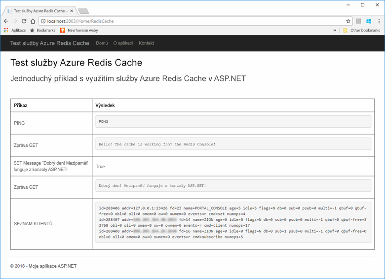
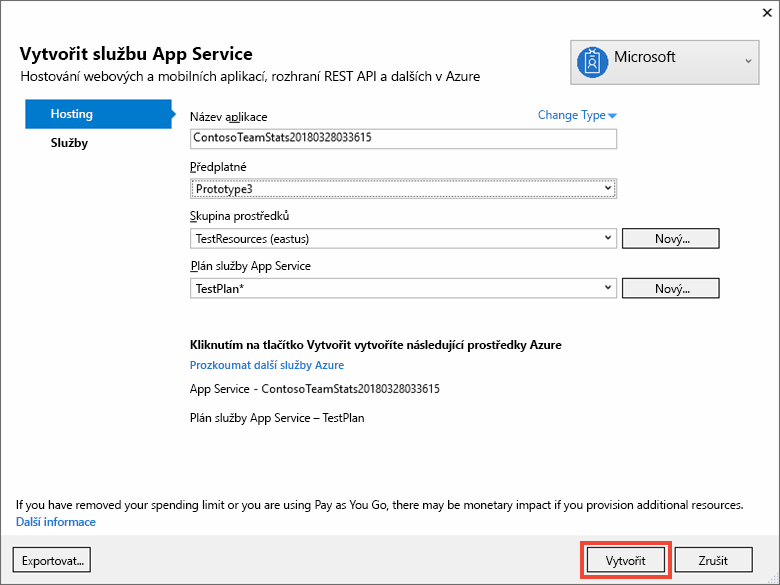
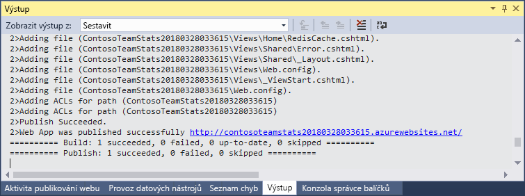
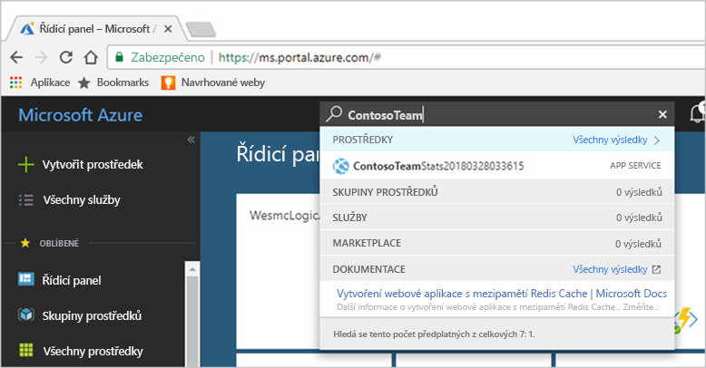
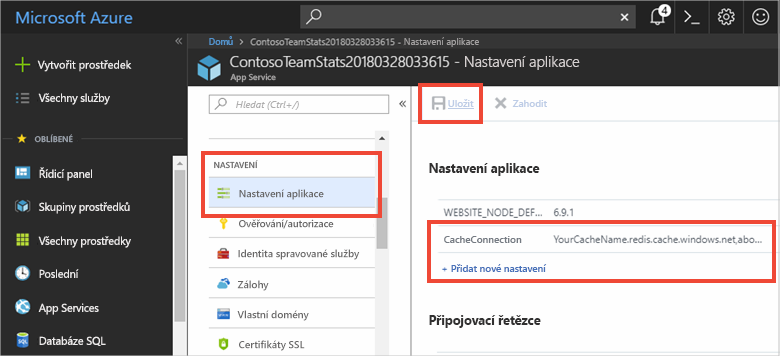
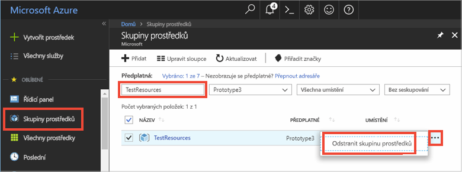

# <a name="quickstart-create-a-aspnet-web-app-with-redis-cache"></a>Rychlý start: Vytvoření webové aplikace ASP.NET s mezipamětí Redis Cache

> [!div class="op_single_selector"]
> * [.NET](cache-dotnet-how-to-use-azure-redis-cache.md)
> * [ASP.NET](cache-web-app-howto.md)
> * [Node.js](cache-nodejs-get-started.md)
> * [Java](cache-java-get-started.md)
> * [Python](cache-python-get-started.md)
>

## <a name="introduction"></a>Úvod

V tomto rychlém startu se dozvíte, jak vytvořit a nasadit webovou aplikaci ASP.NET do služby Azure App Service pomocí sady Visual Studio 2017. Tato ukázková aplikace se připojuje k mezipaměti Azure Redis Cache za účelem ukládání a načítání dat z mezipaměti. Až tento rychlý start dokončíte, budete mít běžící webovou aplikaci hostovanou v Azure, která čte a zapisuje do mezipaměti Azure Redis Cache.


## <a name="prerequisites"></a>Požadavky

Pro absolvování tohoto rychlého startu musí být splněné následující požadavky:

* Nainstalované [Visual Studio 2017](https://www.visualstudio.com/downloads/) s následujícími sadami funkcí:
    * Vývoj pro ASP.NET a web
    * Vývoj pro Azure

[!INCLUDE [quickstarts-free-trial-note](../../includes/quickstarts-free-trial-note.md)]

## <a name="create-the-visual-studio-project"></a>Vytvoření projektu sady Visual Studio

Otevřete sadu Visual Studio a klikněte na **Soubor**, **Nový**, **Projekt**.


V dialogovém okně Nový projekt postupujte takto:

1. Rozbalte uzel **Visual C#** v seznamu **Šablony**.
1. Vyberte **Cloud**.
1. Klikněte na **Webová aplikace ASP.NET**.
1. Ověřte, že je vybrané rozhraní **.NET Framework 4.5.2** nebo vyšší.
1. Do textového pole **Název** zadejte název projektu. V tomto příkladu je to **StatistikyTýmuContoso**.
1. Klikněte na **OK**.

Uvidíte obrazovku Nová webová aplikace ASP.NET:


Jako typ projektu vyberte **MVC**.

Ujistěte se, že v nastavení **Ověřování** je zadáno **Bez ověřování**. V závislosti na verzi sady Visual Studio může být výchozí hodnotou něco jiného. Chcete-li ji změnit, klikněte na **Změnit ověřování** a vyberte **Bez ověřování**.

Projekt vytvoříte kliknutím na **OK**.

## <a name="create-a-cache"></a>Vytvoření mezipaměti

V dalším kroku vytvoříte pro aplikaci mezipaměť.

[!INCLUDE [redis-cache-create](../../includes/redis-cache-create.md)]

[!INCLUDE [redis-cache-access-keys](../../includes/redis-cache-access-keys.md)]

Vytvořte v počítači soubor s názvem *TajnéKódyMezipaměti.config* a uložte ho do umístění, které se nebude vracet se zdrojovým kódem této ukázkové aplikace. V tomto rychlém startu je soubor *TajnéKódyMezipaměti.config* umístěný zde: *C:\AppSecrets\TajnéKódyMezipaměti.config*.

Upravte soubor *TajnéKódyMezipaměti.config* a přidejte do něj následující obsah:

```xml
<appSettings>
    <add key="CacheConnection" value="<cache-name>.redis.cache.windows.net,abortConnect=false,ssl=true,password=<access-key>"/>
</appSettings>
```

`<cache-name>` nahraďte názvem hostitele mezipaměti.

`<access-key>` nahraďte primárním klíčem mezipaměti.

> [!TIP]
> Sekundární přístupový klíč se používá při rotaci klíčů jako alternativní klíč během opětovného generování primárního přístupového klíče.
>

Uložte soubor.

## <a name="update-the-mvc-application"></a>Aktualizace aplikace MVC

V této části aplikaci aktualizujete tak, aby podporovala nové zobrazení, které ukáže jednoduchý test vůči mezipaměti Azure Redis Cache.

* [Aktualizace souboru web.config o nastavení aplikace pro mezipaměť](#Update-the-webconfig-file-with-an-app-setting-for-the-cache)
* [Konfigurace aplikace pro používání klienta StackExchange.Redis](#configure-the-application-to-use-stackexchangeredis)
* [Aktualizace souboru HomeController a rozložení](#update-the-homecontroller-and-layout)
* [Přidání nového zobrazení RedisCache](#add-a-new-rediscache-view)

### <a name="update-the-webconfig-file-with-an-app-setting-for-the-cache"></a>Aktualizace souboru web.config o nastavení aplikace pro mezipaměť

Když aplikaci spustíte místně, použijí se informace v souboru *TajnéKódyMezipaměti.config* pro připojení k instanci Azure Redis Cache. Později tuto aplikaci nasadíte do Azure. Přitom nakonfigurujete nastavení aplikace v Azure tak, aby aplikace místo použití tohoto souboru načetla informace o připojení k mezipaměti. Protože soubor *TajnéKódyMezipaměti.config* není nasazený v Azure společně s aplikací, použijete ho jen při místním testování aplikace. Tyto informace chcete mít co nejvíce zabezpečené, abyste zabránili škodlivému přístupu k datům mezipaměti.

V **Průzkumníku řešení** otevřete poklikáním soubor *web.config*.


V souboru *web.config* najděte element `<appSetting>` a přidejte následující atribut `file`. Pokud jste použili jiný název souboru nebo umístění, nahraďte těmito hodnotami hodnoty v příkladu.

* Před: `<appSettings>`
* Po: ` <appSettings file="C:\AppSecrets\CacheSecrets.config">`

Modul runtime ASP.NET sloučí obsah externího souboru se značkami v elementu `<appSettings>`. Pokud zadaný soubor nelze nalézt, modul runtime atribut souboru ignoruje. Vaše tajné kódy (připojovací řetězce k mezipaměti) nejsou součástí zdrojového kódu aplikace. Při nasazování webové aplikace do Azure se soubor *TajnéKódyMezipaměti.config* nenasadí.

### <a name="configure-the-application-to-use-stackexchangeredis"></a>Konfigurace aplikace pro používání StackExchange.Redis

Pokud chcete aplikaci nakonfigurovat tak, aby používala balíček NuGet [StackExchange.Redis](https://github.com/StackExchange/StackExchange.Redis) pro Visual Studio, klikněte na **Nástroje > Správce balíčků NuGet > Konzola Správce balíčků**.

V okně `Package Manager Console` spusťte následující příkaz:

```powershell
Install-Package StackExchange.Redis
```

Balíček NuGet se stáhne a přidá klientským aplikacím požadované odkazy na sestavení pro přístup do Azure Redis Cache pomocí klienta mezipaměti StackExchange.Redis. Pokud upřednostňujete použití verze klientské knihovny `StackExchange.Redis` se silným názvem, nainstalujte balíček `StackExchange.Redis.StrongName`.

### <a name="update-the-homecontroller-and-layout"></a>Aktualizace souboru HomeController a rozložení

V **Průzkumníku řešení** rozbalte složku **Kontrolery** a otevřete soubor *HomeController.cs*.

Na začátek souboru přidejte dva příkazy `using` pro podporu klienta mezipaměti a nastavení aplikace.

```csharp
using System.Configuration;
using StackExchange.Redis;
```

Přidejte následující metody do třídy `HomeController` pro podporu nové akce `RedisCache`, která spustí několik příkazů vůči nové mezipaměti.

```csharp
    public ActionResult RedisCache()
    {
        ViewBag.Message = "A simple example with Azure Redis Cache on ASP.NET.";

        var lazyConnection = new Lazy<ConnectionMultiplexer>(() =>
        {
            string cacheConnection = ConfigurationManager.AppSettings["CacheConnection"].ToString();
            return ConnectionMultiplexer.Connect(cacheConnection);
        });

        // Connection refers to a property that returns a ConnectionMultiplexer
        // as shown in the previous example.
        IDatabase cache = lazyConnection.Value.GetDatabase();

        // Perform cache operations using the cache object...

        // Simple PING command
        ViewBag.command1 = "PING";
        ViewBag.command1Result = cache.Execute(ViewBag.command1).ToString();

        // Simple get and put of integral data types into the cache
        ViewBag.command2 = "GET Message";
        ViewBag.command2Result = cache.StringGet("Message").ToString();

        ViewBag.command3 = "SET Message \"Hello! The cache is working from ASP.NET!\"";
        ViewBag.command3Result = cache.StringSet("Message", "Hello! The cache is working from ASP.NET!").ToString();

        // Demostrate "SET Message" executed as expected...
        ViewBag.command4 = "GET Message";
        ViewBag.command4Result = cache.StringGet("Message").ToString();

        // Get the client list, useful to see if connection list is growing...
        ViewBag.command5 = "CLIENT LIST";
        ViewBag.command5Result = cache.Execute("CLIENT", "LIST").ToString().Replace(" id=", "\rid=");

        lazyConnection.Value.Dispose();

        return View();
    }
```

V **Průzkumníku řešení** rozbalte složku **Zobrazení**>**Sdílená** a otevřete soubor *_Layout.cshtml*.

Nahraďte:

```csharp
@Html.ActionLink("Application name", "Index", "Home", new { area = "" }, new { @class = "navbar-brand" })
```

Za:

```csharp
@Html.ActionLink("Azure Redis Cache Test", "RedisCache", "Home", new { area = "" }, new { @class = "navbar-brand" })
```

### <a name="add-a-new-rediscache-view"></a>Přidání nového zobrazení RedisCache

V **Průzkumníku řešení** rozbalte složku **Zobrazení** a klikněte pravým tlačítkem na složku **Domů**. Zvolte **Přidat** > **Zobrazení**.

V dialogu Přidat zobrazení zadejte **RedisCache** jako název zobrazení a klikněte na **Přidat**.

Kód v souboru *RedisCache.cshtml* nahraďte následujícím kódem:

```csharp
@{
    ViewBag.Title = "Azure Redis Cache Test";
}

<h2>@ViewBag.Title.</h2>
<h3>@ViewBag.Message</h3>
<br /><br />
<table border="1" cellpadding="10">
    <tr>
        <th>Command</th>
        <th>Result</th>
    </tr>
    <tr>
        <td>@ViewBag.command1</td>
        <td><pre>@ViewBag.command1Result</pre></td>
    </tr>
    <tr>
        <td>@ViewBag.command2</td>
        <td><pre>@ViewBag.command2Result</pre></td>
    </tr>
    <tr>
        <td>@ViewBag.command3</td>
        <td><pre>@ViewBag.command3Result</pre></td>
    </tr>
    <tr>
        <td>@ViewBag.command4</td>
        <td><pre>@ViewBag.command4Result</pre></td>
    </tr>
    <tr>
        <td>@ViewBag.command5</td>
        <td><pre>@ViewBag.command5Result</pre></td>
    </tr>
</table>
```

## <a name="run-the-app-locally"></a>Místní spuštění aplikace

Projekt je standardně nakonfigurovaný tak, aby pro účely testování a ladění byla aplikace hostovaná místně ve službě [IIS Express](https://docs.microsoft.com/iis/extensions/introduction-to-iis-express/iis-express-overview).

Kliknutím na **Ladění** > **Spustit ladění** v nabídce sady Visual Studio sestavte a spusťte aplikaci místně pro účely testování a ladění.

V prohlížeči klikněte v navigačním panelu na **Test Azure Redis Cache**.

V níže uvedeném příkladu můžete vidět, že klíč `Message` měl předtím hodnotu z mezipaměti, která byla nastavena pomocí konzoly Redis na portálu. Aplikace tuto hodnotu z mezipaměti aktualizovala. Aplikace rovněž spustila příkazy `PING` a `CLIENT LIST`.



## <a name="publish-and-run-in-azure"></a>Publikování a spuštění v Azure

Jakmile aplikaci úspěšně místně otestujete, nasadíte ji do Azure a spustíte v cloudu.

### <a name="publish-the-app-to-azure"></a>Publikování aplikace do Azure

V sadě Visual Studio klikněte pravým tlačítkem na uzel projektu v Průzkumníku řešení a zvolte **Publikovat**.


Klikněte na **Microsoft Azure App Service**, zvolte **Vytvořit nový** a klikněte na **Publikovat**.


V dialogu **Vytvořit plán App Service** udělejte následující změny:

| Nastavení | Doporučená hodnota | Popis |
| ------- | :---------------: | ----------- |
| **Název aplikace** | Použijte výchozí. | Po nasazení do Azure se název aplikace stane názvem hostitele této aplikace. Kvůli zachování jedinečnosti může být tento název doplněný o časové razítko. |
| **Předplatné** | Zvolte svoje předplatné Azure. | K tomuto předplatnému budou účtovány všechny související poplatky za hosting. Pokud máte několik předplatných Azure, ověřte, že je vybrané to správné.|
| **Skupina prostředků** | Použijte stejnou skupinu prostředků, ve které jste vytvořili mezipaměť. Příklad: *TestovacíSkupinaProstředků*. | Skupina prostředků vám pomůže spravovat všechny prostředky jako skupinu. Až budete později chtít aplikaci odstranit, stačí jen odstranit tuto skupinu. |
| **Plán služby App Service** | Klikněte na **Nový** a vytvořte nový plán služby App Service s názvem *TestovacíPlán*. <br />Použijte stejné **Umístění** jako při vytváření mezipaměti. <br />Jako velikost zvolte **Free**. | Plán služby App Service definuje sadu výpočetních prostředků pro provozování webové aplikace. |



Až nastavení hostingu služby App Service nakonfigurujete, kliknutím na **Vytvořit** vytvořte novou službu App Service pro svou aplikaci.

Sledujte okno **Výstup** v sadě Visual Studio, kde se zobrazuje stav publikování do Azure. Po úspěšném dokončení publikování se zaznamená adresa URL služby App Service, jak je zobrazeno níže:



### <a name="add-the-app-setting-for-the-cache"></a>Přidání nastavení aplikace pro mezipaměť

Jakmile se publikování nové služby App Service dokončí, přidejte nové nastavení aplikace. Toto nastavení bude sloužit k uložení informací o připojení k mezipaměti. Do panelu hledání v horní části Azure Portalu zadejte název aplikace a najděte novou službu App Service, kterou jste právě vytvořili.



Přidejte nové nastavení aplikace s názvem **PřipojeníKMezipaměti**, které aplikace použije pro připojení k mezipaměti. Použijte stejnou hodnotu, jakou jste pro `CacheConnection` nakonfigurovali v souboru *TajnéKódyMezipaměti.config*. Tato hodnota obsahuje název hostitele mezipaměti a přístupový klíč.



### <a name="run-the-app-in-azure"></a>Spuštění aplikace v Azure

V prohlížeči přejděte na adresu URL služby App Service. Tato adresa se zobrazuje ve výsledcích operace publikování v okně Výstup sady Visual Studio. Je také k dispozici na Azure Portalu na stránce Přehled služby App Service, kterou jste vytvořili.

Kliknutím na **Test Azure Redis Cache** na navigačním panelu otestujte přístup k mezipaměti.


## <a name="clean-up-resources"></a>Vyčištění prostředků

Pokud budete pokračovat k dalšímu kurzu, můžete prostředky vytvořené v tomto rychlém startu zachovat a znovu je použít.

V opačném případě, pokud jste už s ukázkovou aplikací v tomto rychlém startu skončili, můžete prostředky Azure vytvořené v tomto rychlém startu odstranit, abyste se vyhnuli poplatkům. 

> [!IMPORTANT]
> Odstranění skupiny prostředků je nevratné a skupina prostředků včetně všech v ní obsažených prostředků bude trvale odstraněna. Ujistěte se, že nechtěně neodstraníte nesprávnou skupinu prostředků nebo prostředky. Pokud jste vytvořili prostředky pro hostování této ukázky ve stávající skupině prostředků obsahující prostředky, které chcete zachovat, můžete místo odstranění skupiny prostředků odstranit jednotlivé prostředky z jejich odpovídajících oken.
>

Přihlaste se na web [Azure Portal ](https://portal.azure.com) a klikněte na **Skupiny prostředků**.

Do textového pole **Filtrovat podle názvu** zadejte název vaší skupiny prostředků. V tomto tématu byla použita skupina prostředků s názvem *TestResources* (TestovacíProstředky). Ve výsledcích hledání klikněte na **...** u vaší skupiny prostředků a pak na **Odstranit skupinu prostředků**.



Zobrazí se výzva k potvrzení odstranění skupiny prostředků. Potvrďte odstranění zadáním názvu vaší skupiny prostředků a klikněte na **Odstranit**.

Za chvíli je skupina prostředků včetně všech obsažených prostředků odstraněna.

## <a name="next-steps"></a>Další kroky

V tomto dalším kurzu použijete mezipaměť Azure Redis Cache v reálnější situaci ke zvýšení výkonu aplikace. Tuto aplikaci aktualizujete tak, aby do mezipaměti ukládala tabulku výsledků s využitím principu s doplňováním mezipaměti aplikací pomocí ASP.NET a databáze.

> [!div class="nextstepaction"]
> [Vytvoření tabulky výsledků s principem doplňování mezipaměti aplikací v ASP.NET](cache-web-app-cache-aside-leaderboard.md)
