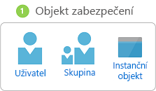
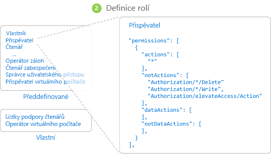
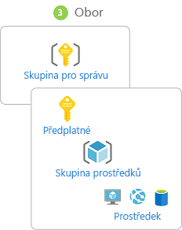
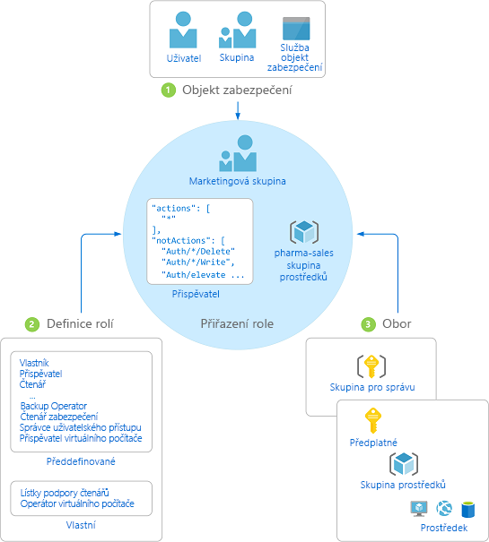

# Co je řízení přístupu na základě role (RBAC)?

Správa přístupu ke cloudovým prostředkům je velmi důležitou funkcí pro jakoukoli organizaci, která používá cloud. Řízení přístupu na základě role (RBAC) pomáhá spravovat, kdo má přístup k prostředkům Azure, co může s těmito prostředky dělat a k jakým oblastem má přístup.

RBAC je systém autorizace založený na [Azure Resource Manageru](../azure-resource-manager/resource-group-overview.md), který poskytuje přesnou správu přístupu k prostředkům v Azure.

## Co mi RBAC umožňuje?

Tady je několik příkladů toho, co vám RBAC umožňuje:

- Jednomu uživateli můžete povolit správu virtuálních počítačů v předplatném a jinému uživateli správu virtuálních sítí.
- Skupině DBA můžete povolit správu databází SQL v předplatném.
- Uživateli můžete povolit správu všech prostředků ve skupině prostředků, například virtuálních počítačů, webů a podsítí.
- Aplikaci můžete povolit přístup ke všem prostředkům ve skupině prostředků.

## Osvědčený postup pro použití RBAC

Pomocí řízení přístupu na základě role můžete povinnosti v rámci týmu oddělit a udělit uživatelům jenom takový přístup, který potřebují k výkonu své práce. Místo toho, abyste všem uživatelům udělili neomezená oprávnění v předplatném nebo prostředcích Azure, můžete povolit pouze určité akce v určitém oboru.

Osvědčeným postupem při plánování strategie řízení přístupu je udělit uživatelům nejnižší úroveň oprávnění, kterou k práci potřebují. Následující diagram ukazuje navrhovaný způsob používání RBAC.

## Jak RBAC funguje

Způsob řízení přístupu k prostředkům pomocí RBAC spočívá ve vytvoření přiřazení rolí. To je klíčový koncept, který je třeba pochopit, protože udává, jak se oprávnění vynucují. Přiřazení role se skládá ze tří prvků: objekt zabezpečení, definice role a obor.

### Objekt zabezpečení

*Objekt zabezpečení* je objekt, který představuje uživatele, skupinu nebo instanční objekt žádající o přístup k prostředkům Azure.

- Uživatel – jednotlivec, který má profil ve službě Azure Active Directory. Můžete také přiřadit role uživatelům v jiných tenantech. Informace o uživatelích v jiných organizacích najdete v článku o [B2B ve službě Azure Active Directory](/azure/active-directory/active-directory-b2b-what-is-azure-ad-b2b).
- Skupina – skupina uživatelů vytvořená ve službě Azure Active Directory. Když přiřadíte roli skupině, budou mít danou roli všichni její uživatelé. 
- Instanční objekt – identita zabezpečení, kterou používají aplikace nebo služby pro přístup ke konkrétním prostředkům Azure. Můžete si ji představit jako *identitu uživatele* (uživatelské jméno a heslo nebo certifikát) pro aplikaci.

### Definice role

*Definice role* je kolekce oprávnění. Někdy jí jednoduše říká *role*. Definice role poskytuje seznam operací, které je možné provádět, například čtení, zápis a odstranění. Role mohou být souhrnné, například vlastník, nebo konkrétní, například čtenář virtuálních počítačů.

Azure obsahuje několik [předdefinovaných rolí](built-in-roles.md), které můžete využít. V následujícím seznamu najdete čtyři základní předdefinované role. První tři se vztahují ke všem typům prostředků.

- [Vlastník](built-in-roles.md#owner) – má úplný přístup ke všem prostředkům, včetně práva delegovat přístup na ostatní.
- [Přispěvatel](built-in-roles.md#contributor) – může vytvářet a spravovat všechny typy prostředků Azure, ale nemůže udělovat přístup ostatním.
- [Čtenář](built-in-roles.md#reader) – může zobrazit existující prostředky Azure.
- [Správce uživatelských přístupů](built-in-roles.md#user-access-administrator) – může spravovat uživatelský přístup k prostředkům Azure.

Zbývající předdefinované role umožňují správu konkrétních prostředků Azure. Role [Přispěvatel virtuálních počítačů](built-in-roles.md#virtual-machine-contributor) například uživateli umožňuje vytvářet a spravovat virtuální počítače. Pokud předdefinované role nesplňují konkrétní požadavky vaší organizace, můžete si vytvořit [vlastní role](custom-roles.md).

Azure zavádí datové operace (momentálně ve verzi Preview), které vám umožní udělit přístup k datům v rámci objektu. Pokud má uživatel například přístup ke čtení dat u účtu úložiště, bude moci číst objekty blob nebo zprávy v rámci daného účtu úložiště. Další informace najdete v článku, který [vysvětluje definice rolí](role-definitions.md).

### Rozsah

*Obor* je hranice, pro kterou přístup platí. Když přiřadíte roli, můžete definováním oboru dále omezit akce, které jsou povoleny. To je užitečné v případě, kdy někomu chcete udělit roli [Přispěvatel webů](built-in-roles.md#website-contributor), ale pouze pro jednu skupinu prostředků.

V Azure můžete zadat obor na více úrovních: na úrovni [skupiny pro správu](../azure-resource-manager/management-groups-overview.md), předplatného, skupiny prostředků nebo prostředku. Obory jsou strukturovány ve vztahu nadřazený-podřízený obor.

Když udělíte přístup na úrovni nadřízeného oboru, podřízené obory zdědí příslušná oprávnění. Příklad:

- Pokud uživateli přiřadíte roli [Vlastník](built-in-roles.md#owner) na úrovni oboru skupiny pro správu, může tento uživatel spravovat vše ve všech předplatných v příslušné skupině pro správu.
- Pokud přiřadíte roli [Čtenář](built-in-roles.md#reader) skupině v oboru předplatného, členové takové skupiny mohou zobrazit všechny skupiny prostředků a prostředky v daném předplatném.
- Pokud přiřadíte roli [Přispěvatel](built-in-roles.md#contributor) aplikaci v oboru skupiny prostředků, může aplikace spravovat prostředky všech typů v dané skupině prostředků, ale už ne žádné jiné skupiny prostředků v předplatném.

### Přiřazení role

*Přiřazení role* je proces svázání definice role s uživatelem, skupinou nebo instančním objektem v určitém oboru za účelem udělení přístupu. Přístup se uděluje vytvořením přiřazení role a odvolává se odebráním přiřazení role.

Následující diagram znázorňuje příklad přiřazení role. V tomto příkladu byla marketingové skupině přiřazena role [Přispěvatel](built-in-roles.md#contributor) pro skupinu prostředků prodeje farmaceutických výrobků. To znamená, že uživatelé marketingové skupiny mohou vytvářet a spravovat prostředky Azure ve skupině prostředků prodeje farmaceutických výrobků. Uživatelé marketingové skupiny nemají přístup k prostředkům mimo skupinu prostředků prodeje farmaceutických výrobků, pokud nejsou součástí přiřazení jiné role.

Přiřazení rolí můžete vytvořit pomocí portálu Azure Portal, Azure CLI, Azure PowerShellu, sad Azure SDK nebo rozhraní REST API. V každém předplatném můžete mít až 2 000 přiřazení rolí. K vytváření a odebírání přiřazení rolí musíte mít oprávnění `Microsoft.Authorization/roleAssignments/*`. Toto oprávnění se uděluje prostřednictvím role [Vlastník](built-in-roles.md#owner) nebo [Správce uživatelských přístupů](built-in-roles.md#user-access-administrator).

## Další kroky

- [Rychlý start: Udělení přístupu pro uživatele pomocí RBAC a webu Azure Portal](quickstart-assign-role-user-portal.md)
- [Správa přístupu pomocí RBAC a portálu Azure Portal](role-assignments-portal.md)
- [Vysvětlení různých rolí v Azure](rbac-and-directory-admin-roles.md)
