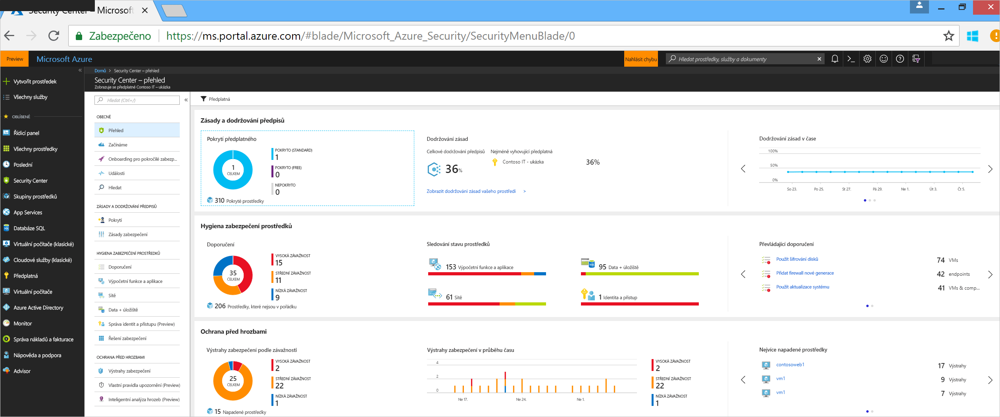
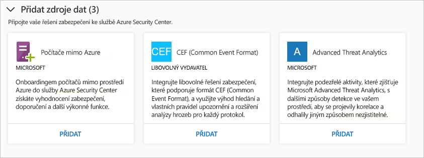
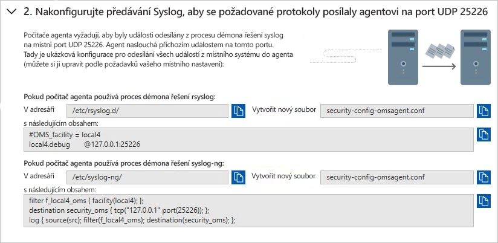
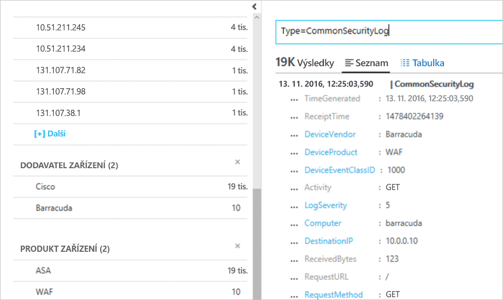

# Rychlý start: Připojení řešení zabezpečení ke službě Security Center

Kromě shromažďování dat o zabezpečení z počítačů můžete také integrovat data přicházející z mnoha různých jiných řešení zabezpečení, včetně těch, které podporují protokol Common Event Format (CEF). CEF je standardní formát nad zprávami Syslog, který používá mnoho dodavatelů zabezpečení, aby byla možná vzájemná integrace událostí mezi různými platformami.

V tomto rychlém startu se naučíte:
- Připojit řešení zabezpečení do služby Azure Security Center pomocí protokolů CEF
- Ověření připojení pomocí řešení zabezpečení

## Požadavky
Pokud chcete začít využívat Security Center, musíte mít předplatné pro Microsoft Azure. Pokud nemáte předplatné, můžete si vytvořit [bezplatný účet](https://azure.microsoft.com/free/).

Chcete-li si tento rychlý start použít, budete potřebovat služby Security Center na cenové úrovni Standard. Službu Security Center v cenové úrovni Standard si můžete zdarma vyzkoušet na 60 dní. Článek Rychlý Start: [Onboarding předplatného Azure na Security Center Standard](security-center-get-started.md) vás provede postupem upgradu na úroveň Standard.

Budete také potřebovat [počítač s Linuxem](https://docs.microsoft.com/azure/log-analytics/log-analytics-agent-linux) a službou Syslog, který je již připojený ke službě Security Center.

## Připojit řešení pomocí CEF

1. Přihlaste se k webu [Azure Portal](https://azure.microsoft.com/features/azure-portal/).
2. V nabídce **Microsoft Azure** vyberte **Security Center**. Otevře se obrazovka **Security Center – Přehled**.

      

3. V hlavní nabídce služby Security Center vyberte **Zásady zabezpečení**.
4. Na stránce Řešení zabezpečení v části **Přidat zdroje dat (3)** klikněte na tlačítko **Přidat** pod položkou **Common Event Format**.

    

5. Na stránce Protokoly Common Event Format rozbalte druhý krok, **Configure Syslog forwarding to send the required logs to the agent on UDP port 25226** (Konfigurace předávání protokolu Syslog pro odesílání požadovaných dat agentovi na portu UDP 25226) a pokračujte na počítači s Linuxem podle následujících pokynů:

    

6. Rozbalte třetí krok, **Place the agent configuration file on the agent computer** (Uložení konfiguračního souboru agenta do počítače agenta) a pokračujte na počítači s Linuxem podle následujících pokynů:

    

7. Rozbalte čtvrtý krok, **Restart the syslog daemon and the agent** (Restartování démona syslog a agenta) a pokračujte na počítači s Linuxem podle následujících pokynů:

    

## Ověření připojení

Než budete pokračovat následujícím postupem, musíte počkat, dokud syslog nezačne odesílat zprávy do služby Security Center. To může nějakou dobu trvat, závisí to na velikosti prostředí.

1.  V levém podokně řídicího panelu Security Center klikněte na tlačítko **Hledat**.
2.  Vyberte pracovní prostor, ke kterému je Syslog (počítač s Linuxem) připojený.
3.  Zadejte *CommonSecurityLog* a klikněte na tlačítko **Hledat**.

Následující příklad ukazuje výsledek tohoto postupu: 

## Vyčištění prostředků
Další rychlé starty a kurzy v této kolekci vycházejí z tohoto rychlého startu. Pokud budete chtít pokračovat v práci s následnými kurzy a rychlými starty, ponechte v provozu úroveň Standard a nechte zapnuté automatické zřizování. Pokud neplánujete pokračovat nebo se chcete vrátit na úroveň Free:

1. Vraťte se do hlavní nabídky služby Security Center a vyberte **Zásady zabezpečení**.
2. Vyberte předplatné nebo zásady, které chcete vrátit na úroveň Free. Otevře se okno **Zásady zabezpečení**.
3. V části **SOUČÁSTI ZÁSAD** vyberte **Cenová úroveň**.
4. Výběrem **Free** změníte předplatné z úrovně Standard na úroveň Free.
5. Vyberte **Uložit**.

Pokud chcete vypnout automatické zřizování:

1. Vraťte se do hlavní nabídky služby Security Center a vyberte **Zásady zabezpečení**.
2. Vyberte předplatné, pro které chcete vypnout automatické zřizování.
3. V části **Zásady zabezpečení – shromažďování dat** výběrem možnosti **Vypnuto** u volby **Onboarding** vypnete automatické zřizování.
4. Vyberte **Uložit**.

>[!NOTE]
> Vypnutím automatického zřizování neodeberete agenta Microsoft Monitoring Agent z virtuálních počítačů Azure, na kterých byl agent zřízen. Vypnutí automatického zřizování omezí sledování zabezpečení pro vaše prostředky.
>

## Další kroky
V tomto rychlém startu jste se naučili, jak připojit počítač s Linuxem a službou syslog do služby Security Center pomocí protokolů CEF. Propojením protokolů CEF se službou Security Center můžete využít výhod vyhledávání a vlastních pravidel výstrah a posílit inteligenci zabezpečení pro každý z protokolů. Další informace o tom, jak používat Security Center, najdete v následném kurzu o konfiguraci zásad zabezpečení a o vyhodnocení zabezpečení vašich prostředků.

> [!div class="nextstepaction"]
> [Kurz: Definování a vyhodnocení zásad zabezpečení](./tutorial-security-policy.md)
