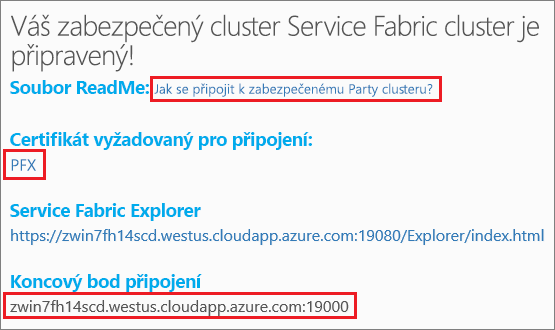
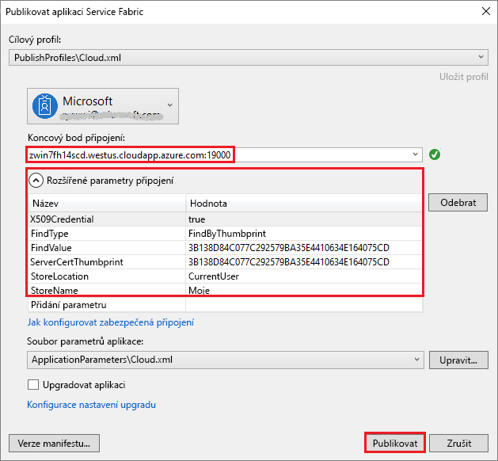

# <a name="quickstart-deploy-a-service-fabric-windows-container-application-on-azure"></a>Rychlý start: Nasazení aplikace Service Fabric typu kontejner pro Windows v Azure
Azure Service Fabric je platforma distribuovaných systémů pro nasazování a správu škálovatelných a spolehlivých mikroslužeb a kontejnerů. 

Spuštění existující aplikace v kontejneru Windows v clusteru Service Fabric nevyžaduje žádné změny aplikace. Tento rychlý start ukazuje, jak nasadit předem připravenou image kontejneru Dockeru v aplikaci Service Fabric. Až budete hotovi, budete mít funkční kontejner Windows Server 2016 Nano Serveru a služby IIS. Tento rychlý start popisuje nasazení kontejneru Windows. Pokud chcete nasadit kontejner Linuxu, přečtěte si [tento rychlý start](service-fabric-quickstart-containers-linux.md).

![Výchozí webová stránka služby IIS][iis-default]

V tomto rychlém startu se naučíte:
> [!div class="checklist"]
> * Zabalení kontejneru image Dockeru
> * Konfigurace komunikace
> * Sestavení a zabalení aplikace Service Fabric
> * Nasazení aplikace typu kontejner do Azure

## <a name="prerequisites"></a>Požadavky
* Předplatné Azure (můžete si vytvořit [bezplatný účet](https://azure.microsoft.com/free/?WT.mc_id=A261C142F)).
* Vývojový počítač s:
  * Visual Studio 2015 nebo Visual Studio 2017.
  * [Sada Service Fabric SDK a nástroje](service-fabric-get-started.md).

## <a name="package-a-docker-image-container-with-visual-studio"></a>Zabalení kontejneru image Dockeru pomocí sady Visual Studio
Sada Service Fabric SDK a nástroje poskytují šablonu služby, která vám pomůže s nasazením kontejneru do clusteru Service Fabric.

Spusťte sadu Visual Studio jako správce.  Vyberte **Soubor** > **Nový** > **Projekt**.

Vyberte **Aplikace Service Fabric**, pojmenujte ji MyFirstContainer a klikněte na **OK**.

Z šablon **Hostované kontejnery a aplikace** vyberte **Kontejner**.

Do pole **Název image** zadejte microsoft/iis:nanoserver, což je [základní image Windows Server Nano Serveru a služby IIS](https://hub.docker.com/r/microsoft/iis/). 

Pojmenujte službu MyContainerService a klikněte na **OK**.

## <a name="configure-communication-and-container-port-to-host-port-mapping"></a>Konfigurace komunikace a mapování portu kontejneru na port hostitele
Služba potřebuje koncový bod pro komunikaci.  Pro účely tohoto rychlého startu kontejnerizovaná služba naslouchá na portu 80.  V Průzkumníku řešení otevřete soubor *MyFirstContainer/ApplicationPackageRoot/MyContainerServicePkg/ServiceManifest.xml*.  V souboru ServiceManifest.xml aktualizujte stávající `Endpoint` a přidejte protokol, port a schéma identifikátoru URI: 

```xml
<Resources>
    <Endpoints>
        <Endpoint Name="MyContainerServiceTypeEndpoint" UriScheme="http" Port="80" Protocol="http"/>
   </Endpoints>
</Resources>
```
Pokud zadáte `UriScheme`, koncový bod kontejneru se automaticky zaregistruje ve Službě pojmenování Service Fabric, aby byl zjistitelný. Úplný ukázkový soubor ServiceManifest.xml najdete na konci tohoto článku. 

Nakonfigurujte mapování portů kontejneru na porty hostitele tak, aby se příchozí požadavky na službu na portu 80 mapovaly na port 80 v kontejneru.  V Průzkumníku řešení otevřete soubor *MyFirstContainer/ApplicationPackageRoot/ApplicationManifest.xml* a v části `ContainerHostPolicies` zadejte zásadu `PortBinding`.  Pro účely tohoto rychlého startu má `ContainerPort` hodnotu 80 a `EndpointRef` je MyContainerServiceTypeEndpoint (koncový bod definovaný v manifestu služby).    

```xml
<ServiceManifestImport>
...
  <ConfigOverrides />
  <Policies>
    <ContainerHostPolicies CodePackageRef="Code">
      <PortBinding ContainerPort="80" EndpointRef="MyContainerServiceTypeEndpoint"/>
    </ContainerHostPolicies>
  </Policies>
</ServiceManifestImport>
```

Úplný ukázkový soubor ApplicationManifest.xml najdete na konci tohoto článku.

## <a name="create-a-cluster"></a>Vytvoření clusteru
Pokud chcete nasadit aplikaci do clusteru v Azure, můžete se připojit k Party Clusteru. Party clustery jsou bezplatné, časově omezené clustery Service Fabric hostované v Azure a provozované týmem Service Fabric, na kterých může kdokoli nasazovat aplikace a seznamovat se s platformou.  Cluster používá jediný certifikát podepsaný svým držitelem (self-signed certificate) pro zabezpečení mezi uzly i mezi klientem a uzlem. Party Clustery podporují kontejnery. Pokud však nastavíte vlastní cluster, musí tento cluster používat Windows Server 2016 s kontejnery, aby na něm bylo možné spouštět kontejnery.

Přihlaste se a [připojte se ke clusteru Windows](http://aka.ms/tryservicefabric). Stáhněte si certifikát PFX do počítače kliknutím na odkaz **PFX**. Certifikát a hodnota **Koncový bod připojení** použijete v následujících krocích.



Na počítači s Windows nainstalujte PFX do úložiště certifikátů *CurrentUser\My*.

```powershell
PS C:\mycertificates> Import-PfxCertificate -FilePath .\party-cluster-873689604-client-cert.pfx -CertStoreLocation Cert:
\CurrentUser\My


  PSParentPath: Microsoft.PowerShell.Security\Certificate::CurrentUser\My

Thumbprint                                Subject
----------                                -------
3B138D84C077C292579BA35E4410634E164075CD  CN=zwin7fh14scd.westus.cloudapp.azure.com
```

Zapamatujte si kryptografický otisk pro následující krok.  

## <a name="deploy-the-application-to-azure-using-visual-studio"></a>Nasazení aplikace do Azure pomocí sady Visual Studio
Aplikace je teď připravená a přímo ze sady Visual Studio ji můžete nasadit do clusteru.

V Průzkumníku řešení klikněte pravým tlačítkem na **MyFirstContainer** a zvolte **Publikovat**. Zobrazí se dialogové okno Publikovat.

Do pole **Koncový bod připojení** zkopírujte **Koncový bod připojení** ze stránky Party clusteru. Například, `zwin7fh14scd.westus.cloudapp.azure.com:19000`. Klikněte na **Rozšířené parametry připojení** a ověřte informace o parametrech připojení.  Hodnoty *FindValue* and *ServerCertThumbprint* musí odpovídat kryptografickému otisku certifikátu nainstalovanému v předchozím kroku. 



Klikněte na **Publikovat**.

Každá aplikace v clusteru musí mít jedinečný název.  Party clustery jsou však veřejné a sdílené prostředí a může dojít ke konfliktu s již existující aplikací.  Pokud dojde ke konfliktu názvů, přejmenujte projekt sady Visual Studio a opakujte nasazení.

Otevřete prohlížeč a přejděte na adresu http://zwin7fh14scd.westus.cloudapp.azure.com:80. Měla by se zobrazit výchozí webová stránka služby IIS: ![Výchozí webová stránka služby IIS][iis-default]

## <a name="complete-example-service-fabric-application-and-service-manifests"></a>Kompletní příklad manifestů služby a aplikace Service Fabric
Tady jsou kompletní manifesty aplikace a služby použité v tomto rychlém startu.

### <a name="servicemanifestxml"></a>ServiceManifest.xml
```xml
<?xml version="1.0" encoding="utf-8"?>
<ServiceManifest Name="MyContainerServicePkg"
                 Version="1.0.0"
                 xmlns="http://schemas.microsoft.com/2011/01/fabric"
                 xmlns:xsd="http://www.w3.org/2001/XMLSchema"
                 xmlns:xsi="http://www.w3.org/2001/XMLSchema-instance">
  <ServiceTypes>
    <!-- This is the name of your ServiceType.
         The UseImplicitHost attribute indicates this is a guest service. -->
    <StatelessServiceType ServiceTypeName="MyContainerServiceType" UseImplicitHost="true" />
  </ServiceTypes>

  <!-- Code package is your service executable. -->
  <CodePackage Name="Code" Version="1.0.0">
    <EntryPoint>
      <!-- Follow this link for more information about deploying Windows containers to Service Fabric: https://aka.ms/sfguestcontainers -->
      <ContainerHost>
        <ImageName>microsoft/iis:nanoserver</ImageName>
      </ContainerHost>
    </EntryPoint>
    <!-- Pass environment variables to your container: -->
    <!--
    <EnvironmentVariables>
      <EnvironmentVariable Name="VariableName" Value="VariableValue"/>
    </EnvironmentVariables>
    -->
  </CodePackage>

  <!-- Config package is the contents of the Config directoy under PackageRoot that contains an 
       independently-updateable and versioned set of custom configuration settings for your service. -->
  <ConfigPackage Name="Config" Version="1.0.0" />

  <Resources>
    <Endpoints>
      <!-- This endpoint is used by the communication listener to obtain the port on which to 
           listen. Please note that if your service is partitioned, this port is shared with 
           replicas of different partitions that are placed in your code. -->
      <Endpoint Name="MyContainerServiceTypeEndpoint" UriScheme="http" Port="80" Protocol="http"/>
    </Endpoints>
  </Resources>
</ServiceManifest>
```
### <a name="applicationmanifestxml"></a>ApplicationManifest.xml
```xml
<?xml version="1.0" encoding="utf-8"?>
<ApplicationManifest ApplicationTypeName="MyFirstContainerType"
                     ApplicationTypeVersion="1.0.0"
                     xmlns="http://schemas.microsoft.com/2011/01/fabric"
                     xmlns:xsd="http://www.w3.org/2001/XMLSchema"
                     xmlns:xsi="http://www.w3.org/2001/XMLSchema-instance">
  <Parameters>
    <Parameter Name="MyContainerService_InstanceCount" DefaultValue="-1" />
  </Parameters>
  <!-- Import the ServiceManifest from the ServicePackage. The ServiceManifestName and ServiceManifestVersion 
       should match the Name and Version attributes of the ServiceManifest element defined in the 
       ServiceManifest.xml file. -->
  <ServiceManifestImport>
    <ServiceManifestRef ServiceManifestName="MyContainerServicePkg" ServiceManifestVersion="1.0.0" />
    <ConfigOverrides />
    <Policies>
      <ContainerHostPolicies CodePackageRef="Code">
        <PortBinding ContainerPort="80" EndpointRef="MyContainerServiceTypeEndpoint"/>
      </ContainerHostPolicies>
    </Policies>
  </ServiceManifestImport>
  <DefaultServices>
    <!-- The section below creates instances of service types, when an instance of this 
         application type is created. You can also create one or more instances of service type using the 
         ServiceFabric PowerShell module.
         
         The attribute ServiceTypeName below must match the name defined in the imported ServiceManifest.xml file. -->
    <Service Name="MyContainerService" ServicePackageActivationMode="ExclusiveProcess">
      <StatelessService ServiceTypeName="MyContainerServiceType" InstanceCount="[MyContainerService_InstanceCount]">
        <SingletonPartition />
      </StatelessService>
    </Service>
  </DefaultServices>
</ApplicationManifest>
```

## <a name="next-steps"></a>Další kroky
V tomto rychlém startu jste se naučili:
> [!div class="checklist"]
> * Zabalení kontejneru image Dockeru
> * Konfigurace komunikace
> * Sestavení a zabalení aplikace Service Fabric
> * Nasazení aplikace typu kontejner do Azure

* Další informace o spouštění [kontejnerů v Service Fabric](service-fabric-containers-overview.md).
* Přečtěte si kurz [Nasazení aplikace .NET v kontejneru](service-fabric-host-app-in-a-container.md).
* Informace o [životním cyklu aplikace](service-fabric-application-lifecycle.md) Service Fabric.
* Prohlédněte si [ukázky kódu kontejneru Service Fabric](https://github.com/Azure-Samples/service-fabric-containers) na GitHubu.

[iis-default]: ./media/service-fabric-quickstart-containers/iis-default.png
[publish-dialog]: ./media/service-fabric-quickstart-containers/publish-dialog.png
