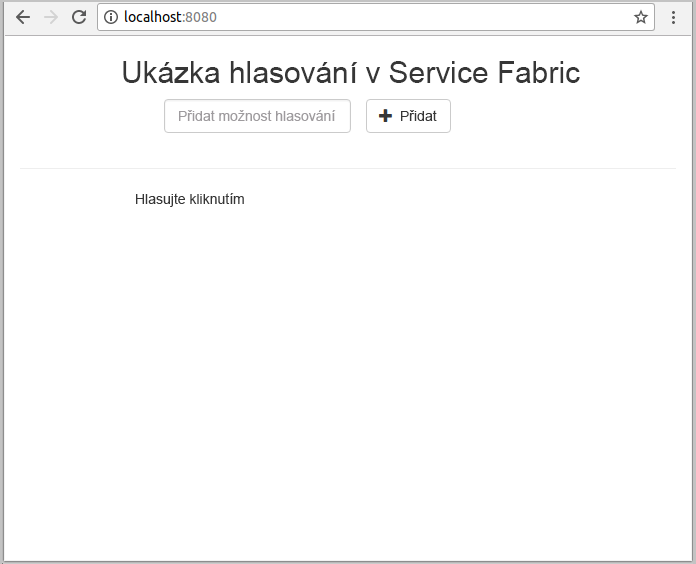
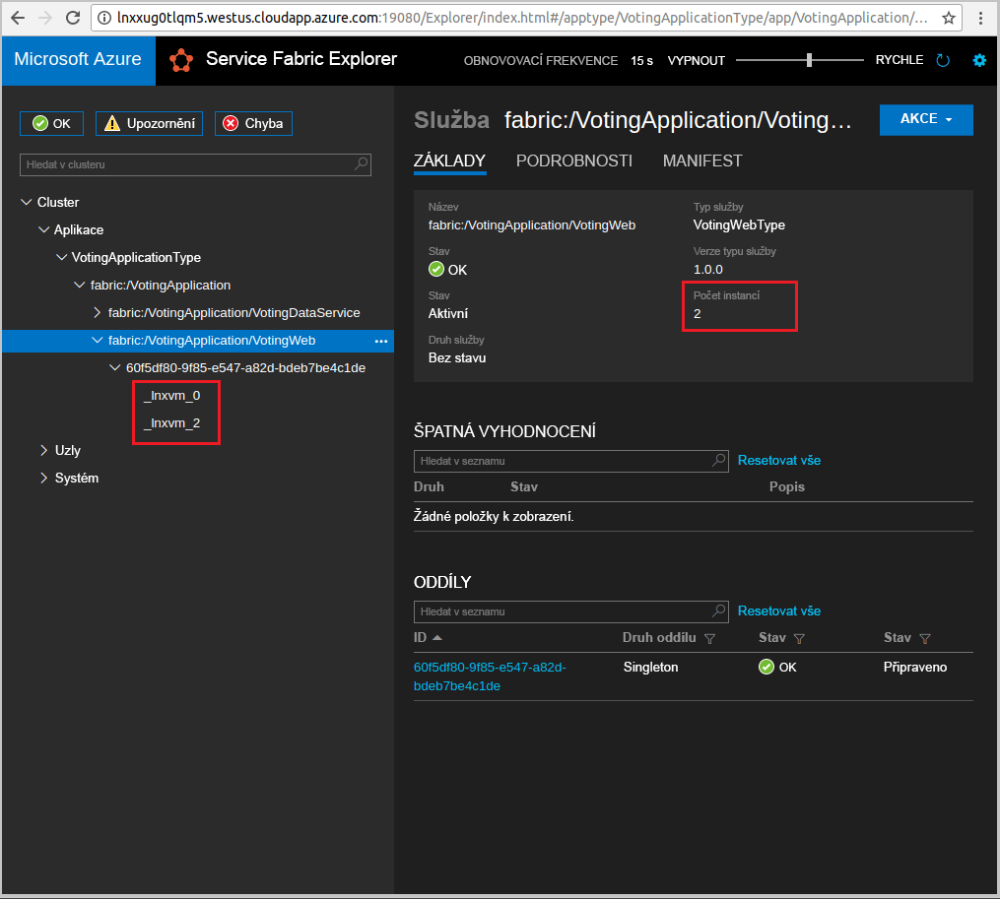

# <a name="quickstart-deploy-a-java-service-fabric-reliable-services-application-to-azure"></a>Rychlý start: Nasazení aplikace Service Fabric Reliable Services v Javě do Azure
Azure Service Fabric je platforma distribuovaných systémů pro nasazování a správu mikroslužeb a kontejnerů. 

Tento rychlý start ukazuje, jak nasadit první aplikaci v Javě do Service Fabric pomocí integrovaného vývojového prostředí (IDE) Eclipse na vývojovém počítači s Linuxem. Až budete hotovi, budete mít hlasovací aplikaci s webovým front-endem v Javě, která ukládá výsledky hlasování do stavové back-end služby v clusteru.


V tomto rychlém startu se naučíte:

* Používat Eclipse jako nástroj pro aplikace Service Fabric v Javě.
* Nasadit aplikaci do místního clusteru. 
* Nasazení aplikace do clusteru v Azure
* Škálování aplikace na více instancí napříč několika uzly

## <a name="prerequisites"></a>Požadavky
K provedení kroků v tomto kurzu Rychlý start je potřeba:
1. [Nainstalovat sadu Service Fabric SDK a rozhraní příkazového řádku (CLI) Service Fabric](https://docs.microsoft.com/azure/service-fabric/service-fabric-get-started-linux#installation-methods).
2. [Nainstalovat Git](https://git-scm.com/).
3. [Nainstalovat Eclipse](https://www.eclipse.org/downloads/).
4. [Nastavit prostředí Java](https://docs.microsoft.com/azure/service-fabric/service-fabric-get-started-linux#set-up-java-development) a provést volitelné kroky pro instalaci modulu plug-in pro Eclipse. 

## <a name="download-the-sample"></a>Stažení ukázky
V příkazovém okně naklonujte spuštěním následujícího příkazu úložiště ukázkové aplikace do místního počítače.
```
git clone https://github.com/Azure-Samples/service-fabric-java-quickstart.git
```

## <a name="run-the-application-locally"></a>Místní spuštění aplikace
1. Spusťte místní cluster spuštěním následujícího příkazu:

    ```bash
    sudo /opt/microsoft/sdk/servicefabric/common/clustersetup/devclustersetup.sh
    ```
    Spuštění místního clusteru nějakou dobu trvá. Pokud chcete potvrdit, že je cluster plně funkční, přejděte do Service Fabric Exploreru na adrese **http://localhost:19080**. Pět uzlů v pořádku značí, že je místní cluster zprovozněný. 
    
    

2. Otevřete Eclipse.
3. Klikněte na File (Soubor) > Open Projects from File System... (Otevřít projekty ze systému souborů...). 
4. Klikněte na Directory (Adresář) a zvolte adresář `Voting` ze složky `service-fabric-java-quickstart`, kterou jste naklonovali z GitHubu. Klikněte na tlačítko Dokončit. 

    
    
5. V průzkumníku balíčků v Eclipse teď máte projekt `Voting`. 
6. Klikněte na projekt pravým tlačítkem a v rozevíracím seznamu **Service Fabric** vyberte **Publish Application...** (Publikovat aplikaci...). Jako Target Profile (Cílový profil) zvolte **PublishProfiles/Local.json** a klikněte na Publish (Publikovat). 

    
    
7. Otevřete oblíbený webový prohlížeč a přejděte do aplikace na adrese **http://localhost:8080**. 

    
    
Teď můžete přidat sadu možností hlasování a začít přijímat hlasy. Aplikace je spuštěná a ukládá veškerá data v clusteru Service Fabric, aniž by potřebovala samostatnou databázi.

## <a name="deploy-the-application-to-azure"></a>Nasazení aplikace v Azure

### <a name="set-up-your-azure-service-fabric-cluster"></a>Nastavení clusteru Azure Service Fabric
Pokud chcete nasadit aplikaci do clusteru v Azure, vytvořte si vlastní cluster.

Party Clustery jsou bezplatné, časově omezené clustery Service Fabric hostované v Azure a provozované týmem Service Fabric. Party Clustery můžete použít k nasazování aplikací a seznámení se s platformou. Cluster k zajištění zabezpečení mezi uzly a mezi klientem a uzlem využívá jeden certifikát podepsaný svým držitelem.

Přihlaste se a připojte se ke [clusteru s Linuxem](http://aka.ms/tryservicefabric). Stáhněte si certifikát PFX do počítače kliknutím na odkaz **PFX**. Kliknutím na odkaz **ReadMe** zobrazíte heslo certifikátu a pokyny ke konfiguraci různých prostředí pro použití certifikátu. **Úvodní** stránku a stránku **ReadMe** nechte otevřené, protože některé pokyny využijete v následujících krocích. 

> [!Note]
> Každou hodinu je k dispozici omezený počet Party Clusterů. Pokud se vám při pokusu o registraci Party Clusteru zobrazí chyba, můžete chvíli počkat a zkusit to znovu nebo můžete podle kroků v kurzu [Vytvoření clusteru Service Fabric v Azure](service-fabric-tutorial-create-vnet-and-linux-cluster.md) vytvořit cluster ve svém předplatném. 
>
> Služba Spring Bot je nakonfigurovaná k naslouchání příchozímu provozu na portu 8080. Ujistěte se, že je ve vašem clusteru tento port otevřený. Pokud používáte Party Cluster, je tento port otevřený.
>

Service Fabric poskytuje několik nástrojů, pomocí kterých můžete spravovat cluster a jeho aplikace:

- Nástroj v prohlížeči Service Fabric Explorer.
- Rozhraní příkazového řádku (CLI) Service Fabric, které se spouští nad Azure CLI 2.0.
- Příkazy PowerShellu. 

V tomto rychlém startu použijete Service Fabric CLI a Service Fabric Explorer. 

Pokud chcete použít rozhraní příkazového řádku, musíte ze souboru PFX, který jste stáhli, vytvořit soubor PEM. K převodu souboru použijte následující příkaz. (V případě Party Clusterů můžete zkopírovat příkaz specifický pro váš soubor PFX z pokynů na stránce **ReadMe**.)

    ```bash
    openssl pkcs12 -in party-cluster-1486790479-client-cert.pfx -out party-cluster-1486790479-client-cert.pem -nodes -passin pass:1486790479
    ``` 

Pokud chcete použít Service Fabric Explorer, musíte importovat soubor PFX certifikátu, který jste stáhli z webu Party Clusteru, do svého úložiště certifikátů (Windows nebo Mac) nebo do samotného prohlížeče (Ubuntu). Potřebujete heslo privátního klíče PFX, které můžete získat na stránce **ReadMe**.

K importování certifikátu do svého systému použijte jakoukoli metodu, která vám vyhovuje nejvíce. Příklad:

- Windows: Dvakrát klikněte na soubor PFX a podle zobrazených výzev nainstalujte certifikát do svého osobního úložiště `Certificates - Current User\Personal\Certificates`. Alternativně můžete použít příkaz PowerShellu uvedený v pokynech **ReadMe**.
- Mac: Dvakrát klikněte na soubor PFX a podle zobrazených výzev nainstalujte certifikát do své klíčenky.
- Ubuntu: Výchozím prohlížečem v Ubuntu 16.04 je Mozilla Firefox. Pokud chcete certifikát importovat do prohlížeče Firefox, klikněte na tlačítko nabídky v pravém horním rohu prohlížeče a pak klikněte na **Možnosti**. Na stránce **Předvolby** pomocí vyhledávacího pole vyhledejte „certifikáty“. Klikněte na **Zobrazit certifikáty**, vyberte kartu **Osobní**, klikněte na **Importovat** a podle zobrazených výzev importujte certifikát.
 
    


### <a name="add-certificate-information-to-your-application"></a>Přidání informací o certifikátu do aplikace

Vzhledem k tomu, že aplikace používá programovací modely Service Fabric, je potřeba do ní přidat kryptografický otisk certifikátu. 

1. Při spouštění aplikace na zabezpečeném clusteru budete muset mít kryptografický otisk certifikátu v souboru ```Voting/VotingApplication/ApplicationManiest.xml```. Spuštěním následujícího příkazu extrahujte kryptografický otisk certifikátu.

    ```bash
    openssl x509 -in [CERTIFICATE_PEM_FILE] -fingerprint -noout
    ```

2. V souboru ```Voting/VotingApplication/ApplicationManiest.xml``` přidejte pod značku **ApplicationManifest** následující fragment kódu. **X509FindValue** by měl být kryptografický otisk z předchozího kroku (bez středníků). 

    ```xml
    <Certificates>
        <SecretsCertificate X509FindType="FindByThumbprint" X509FindValue="0A00AA0AAAA0AAA00A000000A0AA00A0AAAA00" />
    </Certificates>   
    ```
    
### <a name="deploy-the-application-using-eclipse"></a>Nasazení aplikace pomocí Eclipse
Když jsou teď aplikace i cluster připravené, můžete aplikaci nasadit do clusteru přímo z Eclipse.

1. Otevřete soubor **Cloud.json** z adresáře **PublishProfiles** a odpovídajícím způsobem vyplňte pole `ConnectionIPOrURL` a `ConnectionPort`. Tady je příklad: 

    ```bash
    {
         "ClusterConnectionParameters": 
         {
            "ConnectionIPOrURL": "lnxxug0tlqm5.westus.cloudapp.azure.com",
            "ConnectionPort": "19080",
            "ClientKey": "[path_to_your_pem_file_on_local_machine]",
            "ClientCert": "[path_to_your_pem_file_on_local_machine]"
         }
    }
    ```

2. Klikněte na projekt pravým tlačítkem a v rozevíracím seznamu **Service Fabric** vyberte **Publish Application...** (Publikovat aplikaci...). Jako Target Profile (Cílový profil) zvolte **PublishProfiles/Cloud.json** a klikněte na Publish (Publikovat). 

    

3. Otevřete webový prohlížeč a přejděte do aplikace na adrese **http://\<IP_adresa_nebo_adresa_URL_připojení>:8080**. 

    
    
## <a name="scale-applications-and-services-in-a-cluster"></a>Škálování aplikací a služeb v clusteru
Služby je možné škálovat napříč clusterem a vyřešit tak změny v jejich zatížení. Služby se škálují změnou počtu instancí spuštěných v clusteru. Služby můžete škálovat mnoha způsoby – můžete použít například skripty nebo příkazy v Service Fabric CLI (sfctl). V následujících krocích se používá Service Fabric Explorer.

Service Fabric Explorer běží na všech clusterech Service Fabric a je přístupný z prohlížeče po přechodu na port HTTP pro správu clusteru (19080), například `http://lnxxug0tlqm5.westus.cloudapp.azure.com:19080`.

Pokud chcete škálovat webovou front-end službu, postupujte následovně:

1. Otevřete ve vašem clusteru Service Fabric Explorer – například `https://lnxxug0tlqm5.westus.cloudapp.azure.com:19080`.
2. Ve stromovém zobrazení klikněte na tři tečky vedle uzlu **fabric:/Voting/VotingWeb** a zvolte **Škálovat službu**.

    

    Nyní můžete škálovat počet instancí webové front-end služby.

3. Změňte počet na **2** a klikněte na **Škálovat službu**.
4. Ve stromovém zobrazení klikněte na uzel **fabric:/Voting/VotingWeb** a rozbalte uzel oddílu (reprezentovaný identifikátorem GUID).

    

    Nyní je vidět, že služba má dvě instance, a ve stromovém zobrazení vidíte, na kterých uzlech jsou tyto instance spuštěné.

Touto jednoduchou úlohou správy jste zdvojnásobili prostředky, které má front-end služba k dispozici pro zpracování uživatelské zátěže. Je důležité si uvědomit, že pro spolehlivý provoz služby nepotřebujete více jejích instancí. Pokud služba selže, Service Fabric zajistí v clusteru spuštění nové instance služby.

## <a name="next-steps"></a>Další kroky
V tomto rychlém startu jste se naučili:

* Používat Eclipse jako nástroj pro aplikace Service Fabric v Javě.
* Nasazovat aplikace v Javě do místního clusteru. 
* Nasazovat aplikace v Javě do clusteru v Azure.
* Škálování aplikace na více instancí napříč několika uzly

Další informace o práci s aplikacemi v Javě v Service Fabric najdete v kurzu věnovaném aplikacím v Javě.

> [!div class="nextstepaction"]
> [Nasazení aplikace v Javě](./service-fabric-tutorial-create-java-app.md)
