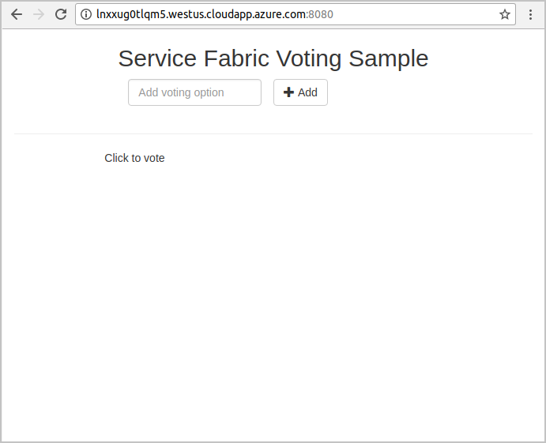

# <a name="create-a-java-application"></a>Vytvořit aplikaci Java
Azure Service Fabric je platforma distribuovaných systémů pro nasazení a správa mikroslužeb a kontejnery. 

Tento rychlý start ukazuje, jak nasadit první aplikace v jazyce Java do Service Fabric pomocí integrovaného vývojového prostředí Eclipse na počítač s Linuxem developer. Jakmile budete hotovi, máte hlasovací aplikaci s Java webový front-end, který uloží výsledků hlasování ve stavové služby back-end v clusteru.


V tomto rychlém startu se naučíte:

> [!div class="checklist"]
> * Použít Eclipse jako nástroj pro aplikace Service Fabric Java
> * Nasazení aplikace na místním clusteru 
> * Nasaďte aplikaci do clusteru s podporou v Azure
> * Škálování aplikací mezi několika uzly

## <a name="prerequisites"></a>Požadavky
K provedení kroků v tomto kurzu Rychlý start je potřeba:
1. [Instalace Service Fabric SDK & rozhraní příkazového řádku služby prostředků infrastruktury (CLI)](https://docs.microsoft.com/en-us/azure/service-fabric/service-fabric-get-started-linux#installation-methods)
2. [Nainstalovat Git](https://git-scm.com/).
3. [Instalace prostředí Eclipse](https://www.eclipse.org/downloads/)
4. [Nastavení prostředí Java](https://docs.microsoft.com/en-us/azure/service-fabric/service-fabric-get-started-linux#set-up-java-development), které opravdu dodržovat volitelný postup instalace modulu plug-in Eclipse 

## <a name="download-the-sample"></a>Stažení ukázky
V příkazovém okně spusťte následující příkaz, který klonovat úložiště ukázkové aplikace do místního počítače.
```
git clone https://github.com/Azure-Samples/service-fabric-java-quickstart.git
```

## <a name="run-the-application-locally"></a>Místní spuštění aplikace
1. Spusťte místní cluster tak, že spustíte následující příkaz:

    ```bash
    sudo /opt/microsoft/sdk/servicefabric/common/clustersetup/devclustersetup.sh
    ```
    Spuštění místního clusteru nějakou dobu trvá. Pokud chcete potvrdit, že cluster je plně aktuálním, přístup k Service Fabric Explorer na **http://localhost: 19080**. Pět uzlů v pořádku označují, že místní cluster je spuštěná. 
    
    

2. Otevřete prostředí Eclipse.
3. Klikněte na soubor -> otevřete projektů ze systému souborů... 
4. Klikněte na adresář a vyberte `Voting` z adresáře `service-fabric-java-quickstart` složky klonovat z Githubu. Klikněte na tlačítko Dokončit. 

    
    
5. Nyní máte `Voting` projekt v Průzkumníkovi balíčku pro Eclipse. 
6. Klikněte pravým tlačítkem na projekt a vyberte **publikovat aplikace...**  pod **Service Fabric** rozevíracího seznamu. Zvolte **PublishProfiles/Local.json** jako je profil cílového a klikněte na tlačítko Publikovat. 

    
    
7. Otevřete Oblíbené webový prohlížeč a přístup k aplikaci pomocí přístupu k **adrese http://localhost: 8080**. 

    
    
Teď můžete přidat sadu hlasovací tlačítka a spuštění trvá hlasy. Aplikace běží a ukládá všechna data v clusteru Service Fabric, bez nutnosti samostatné databáze.

## <a name="deploy-the-application-to-azure"></a>Nasazení aplikace v Azure

### <a name="set-up-your-azure-service-fabric-cluster"></a>Nastavení clusteru Azure Service Fabric
K nasazení aplikací do clusteru s podporou v Azure, vytvořte vlastní cluster nebo použijte Cluster strany.

Party Clustery jsou bezplatné, časově omezené clustery Service Fabric hostované v Azure. Spuštění tým Service Fabric, kde každý, kdo můžete nasadit aplikace a další informace o platformě. Pokud chcete získat přístup k Party Clusteru, [postupujte podle těchto pokynů](http://aka.ms/tryservicefabric). 

Informace o vytváření vlastního clusteru najdete v tématu [vytvořit cluster Service Fabric na platformě Azure](service-fabric-tutorial-create-vnet-and-linux-cluster.md).

> [!Note]
> Front-endu webové služby je nakonfigurován pro naslouchání na portu 8080 pro příchozí provoz. Ujistěte se, že je ve vašem clusteru tento port otevřený. Pokud používáte Cluster strany, tento port je otevřený.
>

### <a name="deploy-the-application-using-eclipse"></a>Nasazení aplikace pomocí Eclipse
Teď, když aplikace a cluster se připraveno, můžete ho nasadit do clusteru přímo z prostředí Eclipse.

1. Otevřete **Cloud.json** souboru pod **PublishProfiles** adresář a vyplňte `ConnectionIPOrURL` a `ConnectionPort` polí správně. Příklad je k dispozici: 

    ```bash
    {
         "ClusterConnectionParameters": 
         {
            "ConnectionIPOrURL": "lnxxug0tlqm5.westus.cloudapp.azure.com",
            "ConnectionPort": "19080",
            "ClientKey": "",
            "ClientCert": ""
         }
    }
    ```

2. Klikněte pravým tlačítkem na projekt a vyberte **publikovat aplikace...**  pod **Service Fabric** rozevíracího seznamu. Zvolte **PublishProfiles/Cloud.json** jako je profil cílového a klikněte na tlačítko Publikovat. 

    

3. Otevřete Oblíbené webový prohlížeč a přístup k aplikaci pomocí přístupu k **http://\<ConnectionIPOrURL >: 8080**. 

    
    
## <a name="scale-applications-and-services-in-a-cluster"></a>Škálování aplikací a služeb v clusteru
Služby je možné rozšířit mezi clustery pro přizpůsobení pro změnu zatížení v rámci služeb. Služby se škálují změnou počtu instancí spuštěných v clusteru. Máte více způsobů škálování vašim službám, můžete použít skripty nebo příkazy z příkazového řádku prostředků infrastruktury služby (sfctl). V tomto příkladu používáme Service Fabric Exploreru.

Service Fabric Explorer běží v na všech clusterech Service Fabric a je přístupný z prohlížeče, procházením port pro správu clusterů HTTP (19080), například `http://lnxxug0tlqm5.westus.cloudapp.azure.com:19080`.

Pokud chcete škálovat webovou front-end službu, proveďte následující kroky:

1. Otevřete ve vašem clusteru Service Fabric Explorer – například `http://lnxxug0tlqm5.westus.cloudapp.azure.com:19080`.
2. Klikněte na znak výpustky (tři tečky) vedle položky **fabric: / Voting/VotingWeb** uzlu ve stromovém zobrazení a zvolte **škálování služby**.

    

    Nyní můžete škálovat počet instancí webové front-end služby.

3. Změňte počet na **2** a klikněte na **Škálovat službu**.
4. Klikněte na **fabric: / Voting/VotingWeb** uzlu ve stromovém zobrazení a rozbalte uzel oddílu (představované identifikátor GUID).

    

    Nyní můžete vidět, že služba má dvě instance, a ve stromovém zobrazení uzlů, které instance spustili.

Touto jednoduchou úlohou správy jsme zdvojnásobili prostředky, které má naše front-end služba k dispozici pro zpracování uživatelské zátěže. Je důležité si uvědomit, že pro spolehlivý provoz služby nepotřebujete více jejích instancí. Pokud služba selže, Service Fabric zajistí v clusteru spuštění nové instance služby.

## <a name="next-steps"></a>Další kroky
V tomto rychlém startu jste se naučili:

> [!div class="checklist"]
> * Použít Eclipse jako nástroj pro aplikace Service Fabric Java
> * Nasazení aplikací v jazyce Java k místnímu clusteru 
> * Nasazení aplikací v jazyce Java do clusteru s podporou v Azure
> * Škálování aplikací mezi několika uzly

* Další informace o [ladění služeb v jazyce Java pomocí Eclipse](service-fabric-debugging-your-application-java.md)
* Další informace o [nastavení průběžné integreation & nasazení pomocí volaných](service-fabric-cicd-your-linux-applications-with-jenkins.md)
* Rezervovat Další [ukázky Java](https://github.com/Azure-Samples/service-fabric-java-getting-started)