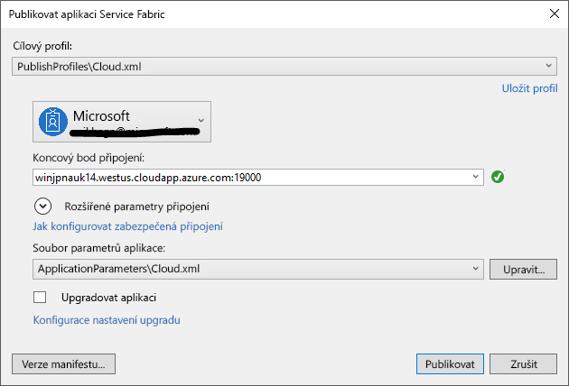

# <a name="tutorial-deploy-an-application-to-a-service-fabric-cluster-in-azure"></a>Kurz: Nasazení aplikace do clusteru Service Fabric v Azure
V tomto kurzu, který je druhou částí série, se dozvíte, jak nasadit aplikaci Azure Service Fabric do nového clusteru v Azure přímo ze sady Visual Studio.

V tomto kurzu se naučíte:
> [!div class="checklist"]
> * Vytvoření clusteru v sadě Visual Studio
> * Nasadit aplikaci do vzdáleného clusteru pomocí sady Visual Studio


V této sérii kurzů se naučíte:
> [!div class="checklist"]
> * [Sestavit aplikaci .NET pro Service Fabric](service-fabric-tutorial-create-dotnet-app.md)
> * Nasadit aplikaci do vzdáleného clusteru
> * [Přidat koncový bod HTTPS do front-end služby ASP.NET Core](service-fabric-tutorial-dotnet-app-enable-https-endpoint.md)
> * [Nakonfigurovat CI/CD pomocí Visual Studio Team Services](service-fabric-tutorial-deploy-app-with-cicd-vsts.md)
> * [Nastavit monitorování a diagnostiku aplikace](service-fabric-tutorial-monitoring-aspnet.md)


## <a name="prerequisites"></a>Požadavky
Než začnete s tímto kurzem:
- Pokud ještě nemáte předplatné Azure, vytvořte si [bezplatný účet](https://azure.microsoft.com/free/?WT.mc_id=A261C142F).
- [Nainstalujte sadu Visual Studio 2017](https://www.visualstudio.com/) se sadami funkcí **Vývoj pro Azure** a **Vývoj pro ASP.NET a web**.
- [Nainstalujte sadu Service Fabric SDK](service-fabric-get-started.md).

## <a name="download-the-voting-sample-application"></a>Stažení ukázkové hlasovací aplikace
Pokud jste nesestavili ukázkovou hlasovací aplikaci v [první části této série kurzů](service-fabric-tutorial-create-dotnet-app.md), můžete si ji stáhnout. V příkazovém okně naklonujte spuštěním následujícího příkazu úložiště ukázkové aplikace do místního počítače.

```
git clone https://github.com/Azure-Samples/service-fabric-dotnet-quickstart
```

## <a name="create-a-service-fabric-cluster"></a>Vytvoření clusteru Service Fabric
Aplikace je teď připravená a přímo ze sady Visual Studio ji můžete nasadit do clusteru. [Cluster Service Fabric](/service-fabric/service-fabric-deploy-anywhere.md) je síťově propojená sada virtuálních nebo fyzických počítačů, ve které se nasazují a spravují mikroslužby.

Máte dvě možnosti nasazení ze sady Visual Studio:
- Vytvořit cluster v Azure ze sady Visual Studio. Tato možnost umožňuje vytvořit zabezpečený cluster přímo ze sady Visual Studio s použitím upřednostňované konfigurace. Tento typ clusteru je ideální pro testovací scénáře, kdy můžete vytvořit cluster a pak do něj publikovat přímo ze sady Visual Studio.
- Publikovat do existujícího clusteru ve vašem předplatném.  Clustery Service Fabric lze vytvořit prostřednictvím webu [Azure Portal](https://portal.azure.com), pomocí skriptů [PowerShellu](./scripts/service-fabric-powershell-create-secure-cluster-cert.md) nebo [Azure CLI](./scripts/cli-create-cluster.md) nebo ze [šablony Azure Resource Manageru](service-fabric-tutorial-create-vnet-and-windows-cluster.md).

V tomto kurzu se cluster vytváří ze sady Visual Studio. Pokud máte cluster už nasazený, můžete zkopírovat a vložit svůj koncový bod připojení nebo ho zvolit ze svého předplatného.
> [!NOTE]
> Řada služeb ke komunikaci mezi sebou používá reverzní proxy server. Clustery vytvořené v sadě Visual Studio a Party Clustery mají ve výchozím nastavení reverzní proxy server povolený.  Pokud používáte existující cluster, musíte [v clusteru povolit reverzní proxy server](service-fabric-reverseproxy.md#setup-and-configuration).

### <a name="find-the-votingweb-service-endpoint"></a>Vyhledání koncového bodu služby VotingWeb
Nejprve vyhledejte koncový bod webové služby front-endu.  Webová služba front-endu naslouchá na určitém portu.  Když se aplikace nasadí do clusteru v Azure, běží cluster i aplikace na pozadí služby Azure Load Balancer.  Port aplikace ve službě Azure Load Balancer musí být otevřený, aby příchozí přenosy měly k webové službě přístup.  Tento port (například 8080) se nachází v souboru *VotingWeb/PackageRoot/ServiceManifest.xml* v elementu **Endpoint**:

```xml
<Endpoint Protocol="http" Name="ServiceEndpoint" Type="Input" Port="8080" />
```

V dalším kroku zadáte tento port na kartě **Upřesnit** v dialogovém okně **Vytvořit cluster**.  Pokud nasazujete aplikaci do existujícího clusteru, můžete tento port otevřít ve službě Azure Load Balancer pomocí [skriptu PowerShellu](./scripts/service-fabric-powershell-open-port-in-load-balancer.md) nebo na webu [Azure Portal](https://portal.azure.com).

### <a name="create-a-cluster-in-azure-through-visual-studio"></a>Vytvoření clusteru v Azure pomocí sady Visual Studio
V Průzkumníku řešení klikněte pravým tlačítkem na projekt aplikace a zvolte **Publikovat**.

Přihlaste se pomocí svého účtu Azure, abyste získali přístup ke svým předplatným. Tento krok je volitelný, pokud používáte Party Cluster.

Vyberte rozevírací seznam **Koncový bod připojení** a v něm možnost **<Create New Cluster...>**.
    

    
V dialogovém okně **Vytvořit cluster** upravte následující nastavení:

1. Do pole **Název clusteru** zadejte název svého clusteru a zadejte také předplatné a umístění, které chcete použít.
2. Volitelné: Můžete upravit počet uzlů. Ve výchozím nastavení máte tři uzly, což je požadované minimum pro testovací scénáře pro Service Fabric.
3. Vyberte kartu **Certifikát**. Na této kartě zadejte heslo, které se použije k zabezpečení certifikátu vašeho clusteru. Tento certifikát pomáhá zabezpečit váš cluster. Můžete také upravit cestu, kam chcete certifikát uložit. Sada Visual Studio může také importovat certifikát za vás, protože se jedná o požadovaný krok pro publikování aplikace do clusteru.
4. Vyberte kartu **Podrobnosti virtuálního počítače**. Zadejte heslo, které chcete použít pro virtuální počítače, které tvoří cluster. Pomocí uživatelského jména a hesla je možné se vzdáleně připojit k virtuálním počítačům. Musíte také vybrat velikost virtuálních počítačů a v případě potřeby změnit image virtuálního počítače.
5. Na kartě **Upřesnit** můžete upravit seznam portů, které chcete otevřít ve službě Azure Load Balancer, která se vytvoří společně s clusterem.  Přidáte koncový bod služby VotingWeb, který jste vyhledali v předchozím kroku. Můžete také přidat existující klíč Application Insights, který bude směrovat soubory aplikačních protokolů.
6. Až dokončíte úpravy nastavení, vyberte tlačítko **Vytvořit**. Vytvoření trvá několik minut. Po úplném vytvoření clusteru se zobrazí oznámení v okně výstupu.


## <a name="deploy-the-sample-application"></a>Nasazení ukázkové aplikace
Jakmile bude připravený cluster, který chcete použít, klikněte pravým tlačítkem na projekt aplikace a zvolte **Publikovat**.

Po dokončení publikování by mělo být možné odeslat do aplikace požadavek z prohlížeče.

Otevřete svůj upřednostňovaný prohlížeč a zadejte adresu clusteru (koncový bod připojení bez informací o portu, třeba win1kw5649s.westus.cloudapp.azure.com).

Teď byste měli vidět stejný výsledek, jako když jste aplikaci spustili v místním prostředí.


## <a name="next-steps"></a>Další kroky
V tomto kurzu jste se naučili:

> [!div class="checklist"]
> * Vytvoření clusteru v sadě Visual Studio
> * Nasadit aplikaci do vzdáleného clusteru pomocí sady Visual Studio

Přejděte k dalšímu kurzu:
> [!div class="nextstepaction"]
> [Povolení HTTPS](service-fabric-tutorial-dotnet-app-enable-https-endpoint.md)
