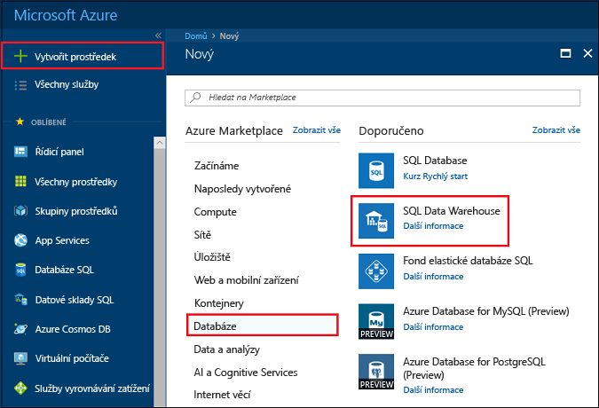
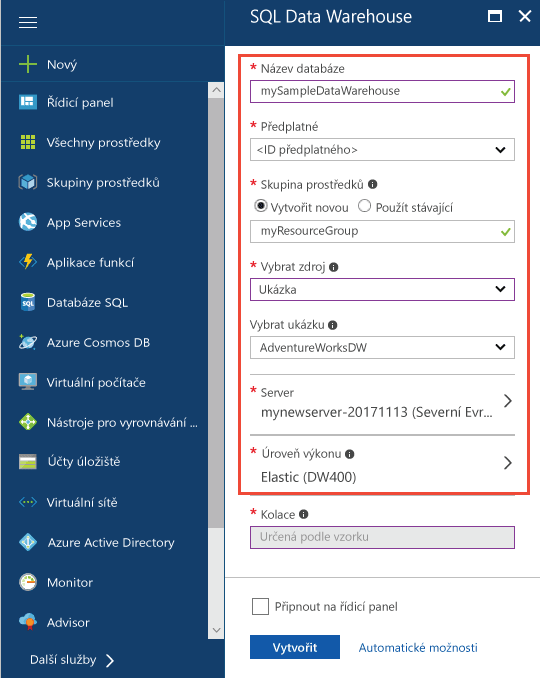
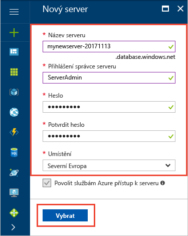
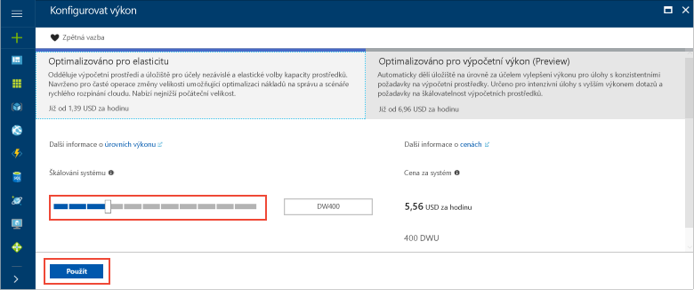
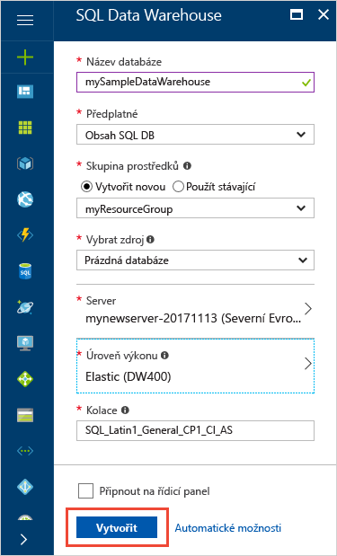
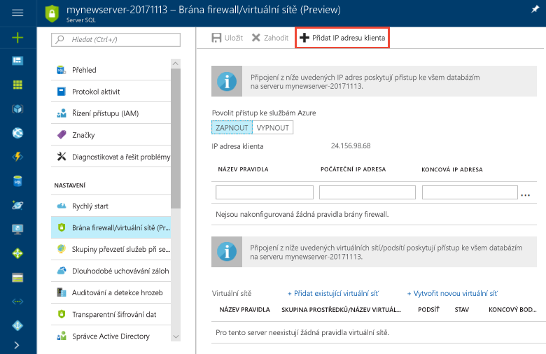
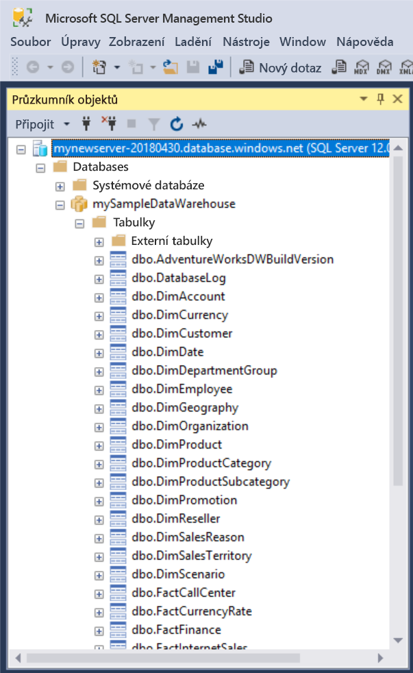
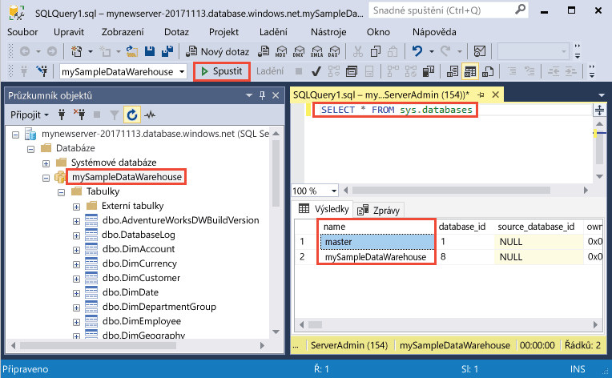
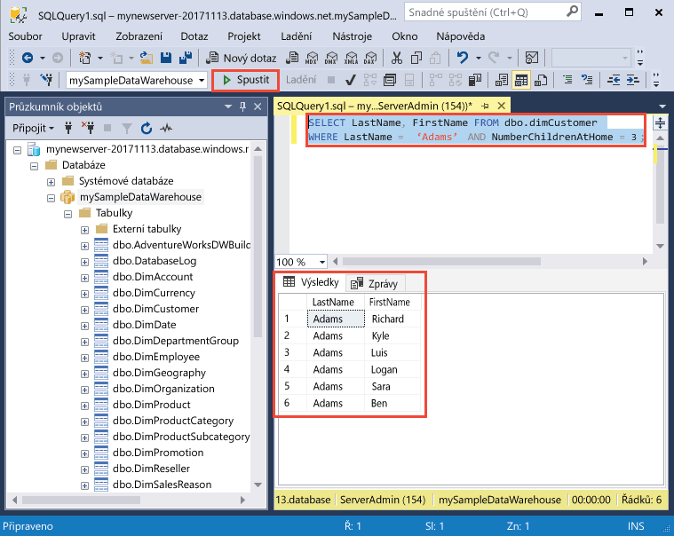

# <a name="create-an-azure-sql-data-warehouse-in-the-azure-portal"></a>Vytvoření služby Azure SQL data warehouse na portálu Azure

Tento úvodní kurz vytvoří datový sklad pomocí služby Azure SQL Data Warehouse a inicializuje ukázková data AdventureWorksDW. Pak připojí k datovému skladu a spustit dotaz na data. Tento kurz používá [portál Azure](https://portal.azure.com) a [SQL Server Management Studio](/sql/ssms/download-sql-server-management-studio-ssms.md) (SSMS)

Pokud ještě nemáte předplatné Azure, vytvořte si [bezplatný účet](https://azure.microsoft.com/free/) před tím, než začnete.

## <a name="before-you-begin"></a>Než začnete

Než začnete tento rychlý start, stáhněte a nainstalujte nejnovější verzi [SQL Server Management Studio](/sql/ssms/download-sql-server-management-studio-ssms.md) (SSMS).

## <a name="log-in-to-the-azure-portal"></a>Přihlášení k portálu Azure Portal

Přihlaste se k portálu [Azure Portal](https://portal.azure.com/).

## <a name="create-a-data-warehouse"></a>Vytvoření datového skladu

Datovému skladu Azure SQL je vytvořena s definovanou sadu [výpočetní prostředky](performance-tiers.md). Vytvoření databáze v rámci [skupina prostředků Azure](../azure-resource-manager/resource-group-overview.md) a v [logického serveru Azure SQL](../sql-database/sql-database-features.md). 

Postupujte podle těchto kroků můžete vytvořit SQL data warehouse, který obsahuje ukázková data AdventureWorksDW. 

1. Klikněte **nový** tlačítko v levém horním rohu portálu Azure.

2. Vyberte **databáze** z **nový** a vyberte **SQL Data Warehouse** pod **doporučený** na **nový**stránky.

    

3. Vyplňte formulář SQL Data Warehouse s následujícími informacemi:   

    | Nastavení | Navrhovaná hodnota | Popis | 
    | ------- | --------------- | ----------- | 
    | **Název databáze** | mySampleDataWarehouse | Platné názvy databází najdete v tématu [Identifikátory databází](/sql/relational-databases/databases/database-identifiers). Všimněte si, datový sklad je typ databáze.| 
    | **Předplatné** | Vaše předplatné  | Podrobnosti o vašich předplatných najdete v tématu [Předplatná](https://account.windowsazure.com/Subscriptions). |
    | **Skupina prostředků** | myResourceGroup | Platné názvy skupin prostředků najdete v tématu [Pravidla a omezení pojmenování](https://docs.microsoft.com/azure/architecture/best-practices/naming-conventions). |
    | **Vyberte zdroj** | Ukázka | Určuje načíst ukázková databáze. Všimněte si, datový sklad je jeden typ databáze. |
    | **Zvolit vzorek** | AdventureWorksDW | Určuje načíst ukázková databáze AdventureWorksDW.  |

    

4. Klikněte na **Server** a vytvořte a nakonfigurujte nový server pro novou databázi. Vyplňte **nového formuláře serveru** s následujícími informacemi: 

    | Nastavení | Navrhovaná hodnota | Popis | 
    | ------------ | ------------------ | ------------------------------------------------- | 
    | **Název serveru** | Libovolný globálně jedinečný název | Platné názvy serverů najdete v tématu [Pravidla a omezení pojmenování](https://docs.microsoft.com/azure/architecture/best-practices/naming-conventions). | 
    | **Přihlašovací jméno správce serveru** | Libovolné platné jméno | Platná přihlašovací jména najdete v tématu [Identifikátory databází](https://docs.microsoft.com/sql/relational-databases/databases/database-identifiers).|
    | **Heslo** | Libovolné platné heslo | Heslo musí mít aspoň osm znaků a musí obsahovat znaky ze tří z následujících kategorií: velká písmena, malá písmena, číslice a jiné než alfanumerické znaky. |
    | **Umístění** | Libovolné platné umístění | Informace o oblastech najdete v tématu [Oblasti služeb Azure](https://azure.microsoft.com/regions/). |

    

5. Klikněte na **Vybrat**.

6. Klikněte na tlačítko **úroveň výkonu** k určení, zda datový sklad je optimalizován pro pružnost nebo výpočetní a počet datových skladů jednotky. 

7. V tomto kurzu vyberte **optimalizované pro pružnost** vrstvy služeb. Posuvník, ve výchozím nastavení, je nastavený na **DW400**.  Zkuste přesunout nahoru a dolů a zkontrolovat, jak to funguje. 

    

8. Klikněte na tlačítko **Použít**.

9. Po vyplnění formuláře pro SQL Database klikněte na **Vytvořit** a databázi zřiďte. Zřizování trvá několik minut. 

    

10. Na panelu nástrojů klikněte na **Oznámení** a sledujte proces nasazení.
    
     

## <a name="create-a-server-level-firewall-rule"></a>Vytvoření pravidla brány firewall na úrovni serveru

Služba SQL Data Warehouse vytvoří brána firewall na úrovni serveru zabraňující externí aplikace a nástroje pro připojení k serveru nebo kterékoli databázi na serveru. Pokud chcete povolit připojení, můžete přidat pravidla brány firewall, které umožňují připojení pro konkrétní IP adresy.  Postupujte podle těchto kroků můžete vytvořit [pravidlo brány firewall na úrovni serveru](../sql-database/sql-database-firewall-configure.md) pro IP adresu vašeho klienta. 

> [!NOTE]
> SQL Data Warehouse komunikuje přes port 1433. Pokud se pokoušíte připojit z podnikové sítě, nemusí mít odchozí provoz přes port 1433 povolený bránou firewall vaší sítě. Pokud je to tak, nebudete se moct připojit k serveru Azure SQL Database, dokud vaše IT oddělení neotevře port 1433.
>

1. Po dokončení nasazení klikněte na **Databáze SQL** z nabídky na levé straně a klikněte na **mySampleDatabase** na stránce **Databáze SQL**. Otevře se stránka Přehled pro vaši databázi, ukazuje název plně kvalifikovaný serveru (například **mynewserver 20171113.database.windows.net**) a poskytuje možnosti pro další konfiguraci. 

2. Zkopírujte tento plně kvalifikovaný název serveru, abyste ho mohli použít pro připojení k serveru a jeho databázím v následujících rychlých startech. Potom klikněte na název serveru a otevřete nastavení serveru.

    

3. Klikněte na název serveru a otevřete nastavení serveru.

    

5. Klikněte na tlačítko **zobrazit nastavení brány firewall**. Otevře se stránka **Nastavení brány firewall** pro server služby SQL Database. 

    

4. Klikněte na **Přidat IP adresu klienta** na panelu nástrojů a přidejte svoji aktuální IP adresu do nového pravidla brány firewall. Pravidlo brány firewall může otevřít port 1433 pro jednu IP adresu nebo rozsah IP adres.

5. Klikněte na **Uložit**. Vytvoří se pravidlo brány firewall na úrovni serveru pro vaši aktuální IP adresu, které otevře port 1433 na logickém serveru.

6. Klikněte na **OK** a pak zavřete stránku **Nastavení brány firewall**.

Nyní můžete připojit k serveru SQL server a jeho datových skladů používají tuto IP adresu. Připojení funguje, než SQL Server Management Studio nebo jiný nástroj podle svého výběru. Jakmile se připojíte, použijte účet správce serveru, který jste předtím vytvořili.  

> [!IMPORTANT]
> Standardně je přístup přes bránu firewall služby SQL Database povolený pro všechny služby Azure. Klikněte na tlačítko **OFF** v tomto a pak klikněte na tlačítko **Uložit** zakázat brány firewall pro všechny služby Azure.

## <a name="get-the-fully-qualified-server-name"></a>Získat název plně kvalifikovaný serveru

Získáte název plně kvalifikovaný serveru pro SQL server na portálu Azure. Plně kvalifikovaný název budete později používat při připojování k serveru.

1. Přihlaste se k portálu [Azure Portal](https://portal.azure.com/).
2. V nabídce vlevo vyberte **SQL Database** a na stránce **Databáze SQL** klikněte na vaši databázi. 
3. V podokně **Základy** na stránce webu Azure Portal pro vaši databázi vyhledejte a potom zkopírujte **Název serveru**. V tomto příkladu je plně kvalifikovaný název mynewserver 20171113.database.windows.net. 

      

## <a name="connect-to-the-server-as-server-admin"></a>Připojení k serveru jako správce serveru

Tato část používá [SQL Server Management Studio](/sql/ssms/download-sql-server-management-studio-ssms.md) (SSMS) k navázání připojení k serveru Azure SQL.

1. Otevřete SQL Server Management Studio.

2. V dialogovém okně **Připojení k serveru** zadejte následující informace:

   | Nastavení       | Navrhovaná hodnota | Popis | 
   | ------------ | ------------------ | ------------------------------------------------- | 
   | Typ serveru | Databázový stroj | Tato hodnota je povinná. |
   | Název serveru | Plně kvalifikovaný název serveru | Název musí být přibližně takto: **mynewserver 20171113.database.windows.net**. |
   | Authentication | Ověřování SQL Serveru | Ověřování SQL je jediný typ ověřování, který jsme v tomto kurzu nakonfigurovali. |
   | Přihlásit | Účet správce serveru | Jedná se o účet, který jste zadali při vytváření serveru. |
   | Heslo | Heslo pro účet správce serveru | Jedná se o heslo, které jste zadali při vytváření serveru. |

    

4. Klikněte na **Připojit**. V aplikaci SSMS se otevře okno Průzkumníka objektů. 

5. V Průzkumníku objektů rozbalte **databáze**. Potom rozbalte **mySampleDatabase** zobrazit objekty v nové databáze.

     

## <a name="run-some-queries"></a>Spuštění některých dotazů

SQL Data Warehouse používá jako jazyk dotazu T-SQL. Otevřete okno dotazu a spustit několik dotazů T-SQL, použijte následující postup.

1. Klikněte pravým tlačítkem na **mySampleDataWarehouse** a vyberte **nový dotaz**.  Otevře se nové okno dotazu.
2. V okně dotazu zadejte následující příkaz zobrazíte seznam databází.

    ```sql
    SELECT * FROM sys.databases
    ```

3. Klikněte na tlačítko **Spustit**.  Výsledky dotazu zobrazit dvě databáze: **hlavní** a **mySampleDataWarehouse**.

    

4. Podívat se na některá data, použijte následující příkaz zobrazíte počet zákazníků s příjmení Adams, které mají tři podřízené doma. Seznam výsledků šesti zákazníků. 

    ```sql
    SELECT LastName, FirstName FROM dbo.dimCustomer
    WHERE LastName = 'Adams' AND NumberChildrenAtHome = 3;
    ```

    

## <a name="clean-up-resources"></a>Vyčištění prostředků

Vám budou účtovány výpočetní prostředky a data, která načíst do datového skladu. Ty se účtují samostatně. 

- Pokud chcete zachovat data v úložišti, můžete pozastavit výpočetní, když nepoužíváte datového skladu. Pomocí pozastavení výpočetní bude pouze zdarma pro úložiště dat a můžete obnovit výpočetní vždy, když budete chtít pracovat s daty.
- Pokud chcete odebrat budoucí poplatky, můžete odstranit datového skladu. 

Postupujte podle těchto kroků k vyčištění prostředků si přejete.

1. Přihlášení k [portál Azure](https://portal.azure.com), klikněte na váš datový sklad.

    

1. Chcete-li pozastavit výpočetní, klikněte na tlačítko **pozastavit** tlačítko. Pokud datový sklad je pozastavena, zobrazí se **spustit** tlačítko.  Chcete-li obnovit výpočty, klikněte na tlačítko **spustit**.

2. Chcete-li odebrat datového skladu, takže vám nebude nic účtováno výpočtů nebo úložiště, klikněte na tlačítko **odstranit**.

3. Chcete-li odebrat serveru SQL, který jste vytvořili, klikněte na tlačítko **mynewserver 20171113.database.windows.net** předchozí obrázek, a pak klikněte na **odstranit**.  Buďte opatrní s jako odstranění serveru se odstraní všechny databáze, které jsou přiřazené k serveru.

4. Chcete-li odebrat skupinu prostředků, klikněte na tlačítko **myResourceGroup**a potom klikněte na **odstranit skupinu prostředků**.


## <a name="next-steps"></a>Další kroky

Teď, když máte databázi, můžete se k ní připojit a provádět dotazování pomocí vašich oblíbených nástrojů. Další informace získáte výběrem vašeho nástroje níže:

- [SQL Server Management Studio](../sql-database/sql-database-connect-query-ssms.md?toc=%2fazure%2fsql-data-warehouse%2ftoc.json)
- [Visual Studio Code](../sql-database/sql-database-connect-query-vscode.md?toc=%2fazure%2fsql-data-warehouse%2ftoc.json)
- [.NET](../sql-database/sql-database-connect-query-dotnet.md?toc=%2fazure%2fsql-data-warehouse%2ftoc.json)
- [PHP](../sql-database/sql-database-connect-query-php.md?toc=%2fazure%2fsql-data-warehouse%2ftoc.json)
- [Node.js](../sql-database/sql-database-connect-query-nodejs.md?toc=%2fazure%2fsql-data-warehouse%2ftoc.json)
- [Java](../sql-database/sql-database-connect-query-java.md?toc=%2fazure%2fsql-data-warehouse%2ftoc.json)
- [Python](../sql-database/sql-database-connect-query-python.md?toc=%2fazure%2fsql-data-warehouse%2ftoc.json)
- [Ruby](../sql-database/sql-database-connect-query-ruby.md?toc=%2fazure%2fsql-data-warehouse%2ftoc.json)