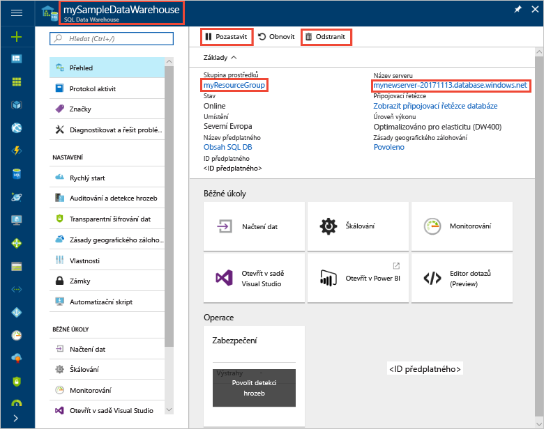

# <a name="quickstart-pause-and-resume-compute-for-an-azure-sql-data-warehouse-in-powershell"></a>Rychlý úvod: Pozastavení a obnovení výpočetní pro Azure SQL Data Warehouse v prostředí PowerShell
Pomocí prostředí PowerShell můžete pozastavit výpočetní pro Azure SQL Data Warehouse abyste ušetřili náklady. Když budete chtít použít datový sklad, obnovit výpočty.

Pokud ještě nemáte předplatné Azure, vytvořte si [bezplatný účet](https://azure.microsoft.com/free/) před tím, než začnete.

Tento kurz vyžaduje prostředí Azure PowerShell verze modulu 5.1.1 nebo novější. Spustit ` Get-Module -ListAvailable AzureRM` najít verzi můžete nyní k dispozici. Pokud potřebujete instalaci nebo upgrade, přečtěte si téma [Instalace modulu Azure PowerShell](/powershell/azure/install-azurerm-ps.md). 

## <a name="before-you-begin"></a>Než začnete

Tento rychlý start předpokládá, že již máte datový sklad SQL, který můžete pozastavit a obnovit. Pokud potřebujete vytvořit, můžete použít [vytvořit a připojit - portál](create-data-warehouse-portal.md) k vytvoření datového skladu názvem **mySampleDataWarehouse**. 

## <a name="log-in-to-azure"></a>Přihlášení k Azure

Přihlaste se k předplatnému Azure pomocí příkazu [Add-AzureRmAccount](/powershell/module/azurerm.profile/add-azurermaccount) a postupujte podle pokynů na obrazovce.

```powershell
Add-AzureRmAccount
```

Chcete-li zobrazit předplatné, které používáte, spusťte [Get-AzureRmSubscription](/powershell/module/azurerm.profile/get-azurermsubscription).

```powershell
Get-AzureRmSubscription
```

Pokud budete muset použít jiné předplatné než výchozí, spusťte [Select-AzureRmSubscription](/powershell/module/azurerm.profile/select-azurermsubscription).

```powershell
Select-AzureRmSubscription -SubscriptionName "MySubscription"
```

## <a name="look-up-data-warehouse-information"></a>Vyhledat informace o datovém skladu

Najděte název databáze, název serveru a skupinu prostředků pro datový sklad, který máte v úmyslu pozastavení a obnovení. 

Postupujte podle těchto kroků se najít informace o umístění pro datový sklad.

1. Přihlaste se k webu [Azure Portal](https://portal.azure.com/).
2. Klikněte na tlačítko **databází SQL** v levé straně na portálu Azure.
3. Vyberte **mySampleDataWarehouse** z **databází SQL** stránky. Otevře se datového skladu. 

    

4. Poznamenejte si název datového skladu, který se použije jako název databáze. Také poznamenejte si název serveru a skupině prostředků. Budete používat v pozastavit a obnovit příkazy.
5. Pokud je server foo.database.windows.net, použijte pouze první část jako název serveru v rutin prostředí PowerShell. Na předchozím obrázku je úplný název serveru NovyServer 20171113.database.windows.net. Budeme používat **NovyServer 20171113** jako název serveru ve výsledcích rutiny Powershellu.

## <a name="pause-compute"></a>Pozastavit výpočetní
Abyste ušetřili náklady, můžete pozastavit a obnovit výpočetní prostředky na vyžádání. Například pokud nebudete používat databázi v noci a o víkendech, můžete pozastavit tyto v době a obnovit během dne. Zatímco databáze byla pozastavena, se nezapočítávají za výpočetní prostředky. Můžete však bude účtovat poplatek za úložiště. 

Chcete-li pozastavit databázi, použijte [Suspend-AzureRmSqlDatabase](/powershell/module/azurerm.sql/suspend-azurermsqldatabase.md) rutiny. Následující příklad pozastaví datového skladu s názvem **mySampleDataWarehouse** hostovaná na serveru s názvem **NovyServer 20171113**. Server je ve skupině prostředků Azure s názvem **myResourceGroup**.


```Powershell
Suspend-AzureRmSqlDatabase –ResourceGroupName "myResourceGroup" `
–ServerName "newserver-20171113" –DatabaseName "mySampleDataWarehouse"
```

Variace, načte tento další příklad databázi do $database objektu. Je následně prostřednictvím kanálu předá objekt, který má [Suspend-AzureRmSqlDatabase](/powershell/module/azurerm.sql/suspend-azurermsqldatabase). Výsledky jsou uloženy v resultDatabase objektu. Poslední příkaz zobrazí výsledky.

```Powershell
$database = Get-AzureRmSqlDatabase –ResourceGroupName "myResourceGroup" `
–ServerName "newserver-20171113" –DatabaseName "mySampleDataWarehouse"
$resultDatabase = $database | Suspend-AzureRmSqlDatabase
$resultDatabase
```


## <a name="resume-compute"></a>Obnovit výpočetní
Chcete-li spustit databázi, použijte [Resume-AzureRmSqlDatabase](/powershell/module/azurerm.sql/resume-azurermsqldatabase) rutiny. Následující příklad spustí databáze s názvem mySampleDataWarehouse hostovaná na serveru s názvem NovyServer 20171113. Server je ve skupině prostředků Azure s názvem myResourceGroup.

```Powershell
Resume-AzureRmSqlDatabase –ResourceGroupName "myResourceGroup" `
–ServerName "newserver-20171113" -DatabaseName "mySampleDataWarehouse"
```

Variace, načte tento další příklad databázi do $database objektu. Je následně prostřednictvím kanálu předá objekt, který má [Resume-AzureRmSqlDatabase](/powershell/module/azurerm.sql/resume-azurermsqldatabase.md) a ukládá výsledky do $resultDatabase. Poslední příkaz zobrazí výsledky.

```Powershell
$database = Get-AzureRmSqlDatabase –ResourceGroupName "ResourceGroup1" `
–ServerName "Server01" –DatabaseName "Database02"
$resultDatabase = $database | Resume-AzureRmSqlDatabase
$resultDatabase
```

## <a name="clean-up-resources"></a>Vyčištění prostředků

Účtují se vám poplatky za jednotky datového skladu a uložená data v datovém skladu. Výpočetní prostředky a prostředky úložiště se účtují odděleně. 

- Pokud chcete zachovat data v úložišti, pozastavte výpočetní.
- Pokud chcete zamezit budoucím poplatkům, můžete datový sklad odstranit. 

Pomocí tohoto postupu podle potřeby vyčistěte prostředky.

1. Přihlaste se k [portál Azure](https://portal.azure.com)a klikněte na váš datový sklad.

    

1. Pokud chcete pozastavit výpočetní prostředky, klikněte na tlačítko **Pozastavit**. Když je datový sklad pozastavený, zobrazí se tlačítko **Spustit**.  Pokud chcete obnovit výpočetní prostředky, klikněte na **Spustit**.

2. Pokud chcete odebrat datový sklad, aby se vám neúčtovaly výpočetní prostředky ani prostředky úložiště, klikněte na **Odstranit**.

3. Chcete-li odebrat serveru SQL, který jste vytvořili, klikněte na tlačítko **mynewserver 20171113.database.windows.net**a potom klikněte na **odstranit**.  S tímto odstraněním buďte opatrní, protože odstraněním serveru se odstraní také všechny databáze k tomuto serveru přiřazené.

4. Pokud chcete odebrat skupinu prostředků, klikněte na **myResourceGroup** a pak klikněte na **Odstranit skupinu prostředků**.


## <a name="next-steps"></a>Další postup
Nyní máte pozastavený a obnovený výpočetní pro datový sklad. Další informace o službě Azure SQL Data Warehouse najdete v kurzu načítání dat.

> [!div class="nextstepaction"]
>[Načtení dat do datového skladu SQL](load-data-from-azure-blob-storage-using-polybase.md)