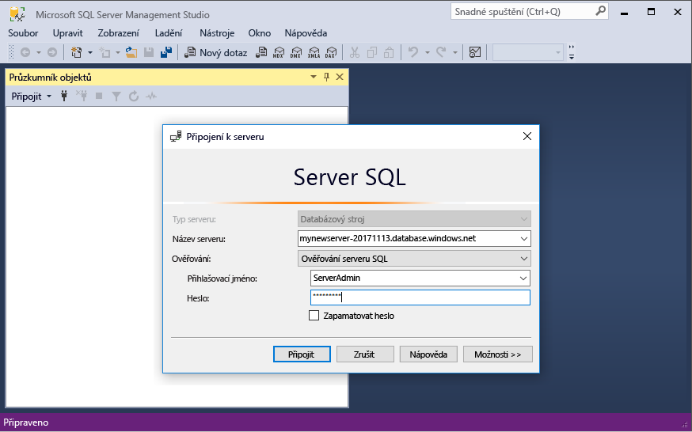

# <a name="quickstart-scale-compute-in-azure-sql-data-warehouse-using-t-sql"></a>Rychlý úvod: Škálování výpočetní kapacity v Azure SQL Data Warehouse pomocí T-SQL

Škálování výpočetní kapacity v Azure SQL Data Warehouse pomocí T-SQL a SQL Server Management Studio (SSMS). [Škálovat výpočetní](sql-data-warehouse-manage-compute-overview.md) pro lepší výkon, nebo určený počet číslic zpět výpočetní abyste ušetřili náklady. 

Pokud ještě nemáte předplatné Azure, vytvořte si [bezplatný účet](https://azure.microsoft.com/free/) před tím, než začnete.

## <a name="before-you-begin"></a>Než začnete

Stáhněte a nainstalujte nejnovější verzi aplikace [SQL Server Management Studio](/sql/ssms/download-sql-server-management-studio-ssms.md) (SSMS).

Předpokladem je, když jste dokončili [rychlý start: Vytvořte a připojte - portál](create-data-warehouse-portal.md). Po dokončení rychlé spuštění vytvořit a připojit víte, jak se připojit k: vytvoření datového skladu s názvem **mySampleDataWarehouse**, vytvořit pravidlo brány firewall umožňující našeho klienta pro přístup k serveru nainstalován.
 
## <a name="create-a-data-warehouse"></a>Vytvoření datového skladu

Použití [rychlý start: Vytvořte a připojte - portál](create-data-warehouse-portal.md) k vytvoření datového skladu s názvem **mySampleDataWarehouse**. Dokončete rychlý start a zajistit mít pravidlo brány firewall a může připojit k vašemu datovému skladu z v rámci SQL Server Management Studio.

## <a name="connect-to-the-server-as-server-admin"></a>Připojení k serveru jako správce serveru

V této části se pomocí aplikace [SQL Server Management Studio](/sql/ssms/download-sql-server-management-studio-ssms.md) (SSMS) naváže připojení k serveru SQL Azure.

1. Otevřete SQL Server Management Studio.

2. V dialogovém okně **Připojení k serveru** zadejte následující informace:

   | Nastavení       | Navrhovaná hodnota | Popis | 
   | ------------ | ------------------ | ------------------------------------------------- | 
   | Typ serveru | Databázový stroj | Tato hodnota se vyžaduje. |
   | Název serveru | Plně kvalifikovaný název serveru | Tady je příklad: **mynewserver-20171113.database.windows.net**. |
   | Authentication | Ověřování SQL Serveru | Ověřování SQL je jediný typ ověřování, který se v tomto kurzu konfiguruje. |
   | Přihlásit | Účet správce serveru | Jedná se o účet, který jste zadali při vytváření serveru. |
   | Heslo | Heslo pro účet správce serveru | Jedná se o heslo, které jste zadali při vytváření serveru. |

    

4. Klikněte na **Připojit**. V aplikaci SSMS se otevře okno Průzkumníka objektů. 

5. V Průzkumníku objektů rozbalte **Databáze**. Pak rozbalte **mySampleDatabase** a zobrazte objekty v nové databázi.

     

## <a name="view-service-objective"></a>Cíl služby zobrazení
Nastavení cíle služby obsahuje počet jednotky datového skladu pro datový sklad. 

Chcete-li zobrazit aktuální jednotky datového skladu pro datový sklad:

1. V části připojení k **mynewserver 20171113.database.windows.net**, rozbalte položku **systémové databáze**.
2. Klikněte pravým tlačítkem na **hlavní** a vyberte **nový dotaz**. Otevře se nové okno dotazu.
3. Spusťte následující dotaz, který vyberte v zobrazení dynamické správy sys.database_service_objectives. 

    ```sql
    SELECT
        db.name [Database]
    ,   ds.edition [Edition]
    ,   ds.service_objective [Service Objective]
    FROM
        sys.database_service_objectives ds
    JOIN
        sys.databases db ON ds.database_id = db.database_id
    WHERE 
        db.name = 'mySampleDataWarehouse'
    ```

4. Následující výsledky zobrazit **mySampleDataWarehouse** má cílem služby DW400. 

    


## <a name="scale-compute"></a>Škálování výpočetního výkonu
V SQL Data Warehouse můžete zvýšit nebo snížit výpočetní prostředky úpravou jednotky datového skladu. [Vytvořit a připojit - portál](create-data-warehouse-portal.md) vytvořit **mySampleDataWarehouse** a inicializovat se 400 Dwu. Následující kroky upravit Dwu pro **mySampleDataWarehouse**.

Chcete-li změnit jednotky datového skladu:

1. Klikněte pravým tlačítkem na **hlavní** a vyberte **nový dotaz**.
2. Použití [ALTER DATABASE](/sql/t-sql/statements/alter-database-azure-sql-database) příkaz T-SQL změnit cíl služby. Spusťte následující dotaz změnit cíl služby na DW300. 

```Sql
ALTER DATABASE mySampleDataWarehouse
MODIFY (SERVICE_OBJECTIVE = 'DW300')
;
```

## <a name="check-database-state"></a>Zkontrolujte stav databáze

Pokud chcete zkontrolovat stav databáze, spusťte následující dotaz proti **hlavní** databáze.

```sql
SELECT name AS "Database Name", state_desc AS "Status" 
FROM sys.databases db
WHERE db.name = 'mySampleDataWarehouse'
;
```

Když spustíte tento příkaz, měli byste obdržet hodnotou stavu Online, pozastavení, obnovování, škálování nebo pozastaveno.

## <a name="check-operation-status"></a>Zkontrolujte stav operace

K vrácení informací o různé operace správy v SQL Data Warehouse, spusťte následující dotaz [sys.dm_operation_status](/sql/relational-databases/system-dynamic-management-views/sys-dm-operation-status-azure-sql-database) DMV. Například vrátí operaci a stav operace, který bude buď IN_PROGRESS nebo byla DOKONČENA.

```sql
SELECT *
FROM
    sys.dm_operation_status
WHERE
    resource_type_desc = 'Database'
AND 
    major_resource_id = 'MySQLDW'
```


## <a name="next-steps"></a>Další postup
Jste se naučili nyní škálování výpočetní pro datový sklad. Další informace o službě Azure SQL Data Warehouse najdete v kurzu načítání dat.

> [!div class="nextstepaction"]
>[Načtení dat do datového skladu SQL](load-data-from-azure-blob-storage-using-polybase.md)
