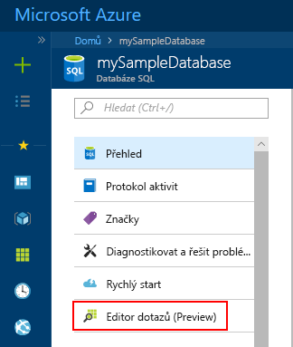
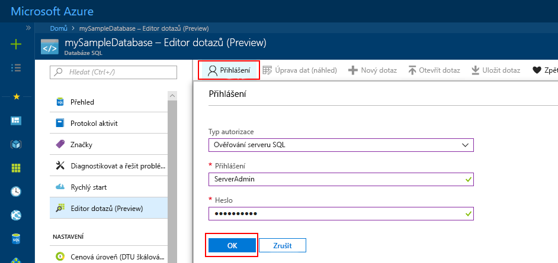
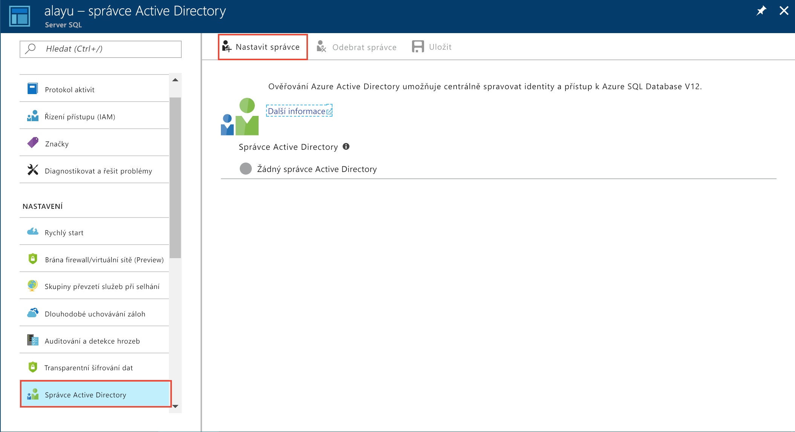
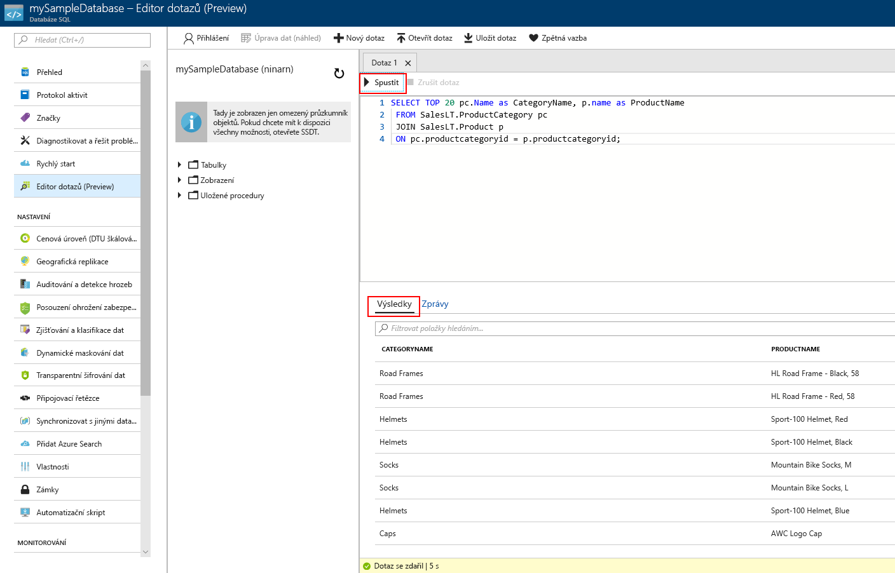

# <a name="azure-portal-use-the-sql-query-editor-to-connect-and-query-data"></a>Azure Portal: Použití editoru dotazů SQL k připojení a dotazování dat

Editor dotazů SQL je dotazovací nástroj založený na prohlížeči, který poskytuje efektivní a jednoduchý způsob zpracování dotazů SQL pro Azure SQL Database nebo Azure SQL Data Warehouse, aniž byste museli opustit Azure Portal. Tento rychlý úvodní kurz ukazuje použití editoru dotazů k připojení k databázi SQL a následné použití příkazů jazyka Transact-SQL k dotazování, vkládání, aktualizaci a odstraňování dat v databázi.

## <a name="prerequisites"></a>Požadavky

Tento rychlý start používá jako výchozí bod prostředky vytvořené v některém z těchto rychlých startů:

[!INCLUDE [prerequisites-create-db](../../includes/sql-database-connect-query-prerequisites-create-db-includes.md)]

> [!NOTE]
> Ověřte, že v nastavení brány firewall SQL Serveru je zapnutá možnost Povolit přístup ke službám Azure. Tato možnost poskytuje editoru dotazů SQL přístup k databázím a datovým skladům.

## <a name="log-in-to-the-azure-portal"></a>Přihlášení k portálu Azure Portal

Přihlaste se k portálu [Azure Portal](https://portal.azure.com/).


## <a name="connect-using-sql-authentication"></a>Připojení s využitím ověřování SQL

1. V nabídce nalevo klikněte na **Databáze SQL** a potom klikněte na databázi, pro kterou chcete zadat dotaz.

2. Na stránce databáze SQL pro vaši databázi klikněte v levé nabídce na **Editor dotazů (Preview)**.

    

3. Klikněte na **Přihlásit**, na vyzvání vyberte **Ověřování SQL Serveru** a potom zadejte přihlašovací jméno a heslo správce serveru, které jste zadali při vytváření této databáze.

    

4. Přihlaste se kliknutím na **OK**.


## <a name="connect-using-azure-ad"></a>Připojení pomocí Azure AD

Konfigurace správce služby Active Directory umožňuje používat jednu identitu pro přihlášení k webu Azure Portal i k databázi SQL. Při konfiguraci správce Active Directory pro SQL Server, kterého jste vytvořili, použijte následující postup.

> [!NOTE]
> E-mailové účty (například outlook.com, hotmail.com, live.com, gmail.com, yahoo.com) se zatím jako správce Active Directory nepodporují. Nezapomeňte vybrat uživatele, který byl buď v Azure Active Directory vytvořený nativně, nebo který byl do Azure Active Directory federovaný.

1. V nabídce nalevo vyberte **SQL servery** a v seznamu serverů vyberte váš SQL Server.

2. V nabídce nastavení SQL Serveru vyberte nastavení **Správce Active Directory**.

3. V okně správce Active Directory klikněte na příkaz **Nastavit správce** a vyberte uživatele nebo skupinu, kteří budou správcem Active Directory.

    

4. Kliknutím na příkaz **Uložit** v horní části okna správce Active Directory nastavíte správce Active Directory.

Přejděte k databázi SQL, pro kterou chcete zadat dotaz, a v nabídce vlevo klikněte na **Průzkumník dat (Preview)**. Průzkumník dat se otevře a automaticky vás připojí k databázi.


## <a name="run-query-using-query-editor"></a>Spuštění dotazu pomocí editoru dotazů

Po ověření zadejte do podokna editoru dotazů následující dotaz pro zobrazení nejlepších 20 produktů podle kategorie.

```sql
 SELECT TOP 20 pc.Name as CategoryName, p.name as ProductName
 FROM SalesLT.ProductCategory pc
 JOIN SalesLT.Product p
 ON pc.productcategoryid = p.productcategoryid;
```

Klikněte na **Spustit** a pak zkontrolujte výsledky dotazu v podokně **Výsledky**.



## <a name="insert-data-using-query-editor"></a>Vložení dat pomocí editoru dotazů

Použijte následující kód k vložení nového produktu do tabulky SalesLT.Product pomocí příkazu jazyka Transact-SQL [INSERT](https://msdn.microsoft.com/library/ms174335.aspx).

1. V okně dotazu nahraďte předchozí dotaz následujícím dotazem:

   ```sql
   INSERT INTO [SalesLT].[Product]
           ( [Name]
           , [ProductNumber]
           , [Color]
           , [ProductCategoryID]
           , [StandardCost]
           , [ListPrice]
           , [SellStartDate]
           )
     VALUES
           ('myNewProduct'
           ,123456789
           ,'NewColor'
           ,1
           ,100
           ,100
           ,GETDATE() );
   ```

2. Kliknutím na **Spustit** na panelu nástrojů vložíte nový řádek do tabulky Product.

## <a name="update-data-using-query-editor"></a>Aktualizace dat pomocí editoru dotazů

Použijte následující kód k aktualizaci nového produktu, který jste přidali dříve, pomocí příkazu jazyka Transact-SQL [UPDATE](https://msdn.microsoft.com/library/ms177523.aspx).

1. V okně dotazu nahraďte předchozí dotaz následujícím dotazem:

   ```sql
   UPDATE [SalesLT].[Product]
   SET [ListPrice] = 125
   WHERE Name = 'myNewProduct';
   ```

2. Kliknutím na **Spustit** na panelu nástrojů aktualizujete zadaný řádek v tabulce Product.

## <a name="delete-data-using-query-editor"></a>Odstranění dat pomocí editoru dotazů

Použijte následující kód k odstranění nového produktu, který jste přidali dříve, pomocí příkazu jazyka Transact-SQL [DELETE](https://msdn.microsoft.com/library/ms189835.aspx).

1. V okně dotazu nahraďte předchozí dotaz následujícím dotazem:

   ```sql
   DELETE FROM [SalesLT].[Product]
   WHERE Name = 'myNewProduct';
   ```

2. Kliknutím na **Spustit** na panelu nástrojů odstraníte zadaný řádek v tabulce Product.


## <a name="query-editor-considerations"></a>Požadavky editoru dotazů

Při práci s editorem dotazů byste měli vědět pár věcí:

1. Ověřte, že jste v nastavení brány firewall Azure SQL Serveru zapnuli možnost Povolit přístup ke službám Azure. Tato možnost poskytuje editoru dotazů SQL přístup k datovým skladům a databázím SQL.

2. Editor dotazů není možné použít k dotazování databází na serveru SQL, který je ve virtuální síti.

3. Stisknutí klávesy F5 aktualizuje stránku editoru dotazů a způsobí ztrátu dotazu, který se právě zpracovává. K provádění dotazů použijte tlačítko Spustit na panelu nástrojů.

4. Editor dotazů nepodporuje připojení k hlavní databázi.

5. Pro provedení dotazu platí časový limit 5 minut.

6. Přihlášení správce Azure Active Directory nefunguje pro účty, které mají povolené dvoufaktorové ověřování.

7. E-mailové účty (například outlook.com, hotmail.com, live.com, gmail.com, yahoo.com) se zatím jako správce Active Directory nepodporují. Nezapomeňte vybrat uživatele, který byl buď v Azure Active Directory vytvořený nativně, nebo který byl do Azure Active Directory federovaný.

8. Editor dotazů podporuje pouze válcové zobrazení geografických datových typů.

9. IntelliSense pro databázové tabulky a zobrazení se nepodporuje. Editor ale podporuje automatické dokončování názvů, které jste už zadali.


## <a name="next-steps"></a>Další kroky

- Další informace o jazyku Transact-SQL, který je podporovaný v databázích Azure SQL, najdete v tématu věnovaném [rozdílům Transact-SQL v databázi SQL](sql-database-transact-sql-information.md).
