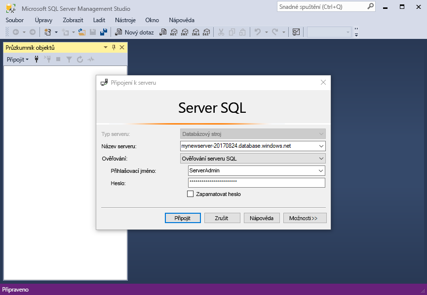
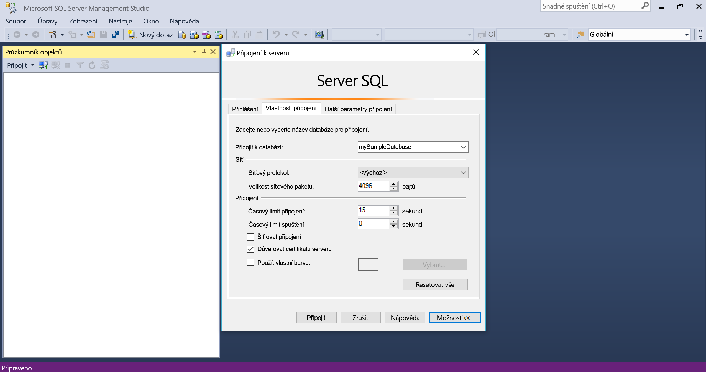

# <a name="azure-sql-database-use-sql-server-management-studio-to-connect-and-query-data"></a>Azure SQL Database: Připojení a dotazování dat pomocí aplikace SQL Server Management Studio

[SQL Server Management Studio](https://msdn.microsoft.com/library/ms174173.aspx) (SSMS) je integrované prostředí pro správu jakékoliv infrastruktury SQL, od SQL Serveru po SQL Database pro Microsoft Windows. Tento rychlý start ukazuje použití SSMS k připojení k Azure SQL Database a následné použití příkazů jazyka Transact-SQL k dotazování, vkládání, aktualizaci a odstraňování dat v databázi. 

## <a name="prerequisites"></a>Požadavky

Tento rychlý start používá jako výchozí bod prostředky vytvořené v některém z těchto rychlých startů:

- [Vytvoření databáze – portál](sql-database-get-started-portal.md)
- [Vytvoření databáze – rozhraní příkazového řádku](sql-database-get-started-cli.md)
- [Vytvoření databáze – PowerShell](sql-database-get-started-powershell.md)

Než začnete, ujistěte se, že máte nainstalovanou nejnovější verzi aplikace [SSMS](https://msdn.microsoft.com/library/mt238290.aspx). 

## <a name="sql-server-connection-information"></a>Informace o připojení k SQL serveru

Získejte informace o připojení potřebné pro připojení k databázi SQL Azure. V dalších postupech budete potřebovat plně kvalifikovaný název serveru, název databáze a přihlašovací údaje.

1. Přihlaste se k portálu [Azure Portal](https://portal.azure.com/).
2. V nabídce vlevo vyberte **SQL Database** a na stránce **Databáze SQL** klikněte na vaši databázi. 
3. Na stránce **Přehled** pro vaši databázi si prohlédněte plně kvalifikovaný název serveru, jak je znázorněno na obrázku níže. Pokud na název serveru najedete myší, můžete vyvolat možnost **Kopírování kliknutím**.

    

4. Pokud jste zapomněli přihlašovací informace pro váš server Azure SQL Database, přejděte na stránku serveru SQL Database, abyste zobrazili jméno správce serveru a v případě potřeby obnovili heslo. 

## <a name="connect-to-your-database"></a>Připojení k databázi

Pomocí aplikace SQL Server Management Studio navažte připojení k serveru služby Azure SQL Database. 

> [!IMPORTANT]
> Logický server Azure SQL Database naslouchá na portu 1433. Pokud se pokoušíte připojovat k logickému serveru Azure SQL Database z oblasti za podnikovou bránou firewall, je třeba v podnikové brány firewall otevřít tento port, abyste se mohli úspěšně připojit.
>

1. Otevřete SQL Server Management Studio.

2. V dialogovém okně **Připojení k serveru** zadejte následující informace:

   | Nastavení       | Navrhovaná hodnota | Popis | 
   | ------------ | ------------------ | ------------------------------------------------- | 
   | **Typ serveru** | Databázový stroj | Tato hodnota se vyžaduje. |
   | **Název serveru** | Plně kvalifikovaný název serveru | Název musí vypadat přibližně takto: **mynewserver20170313.database.windows.net**. |
   | **Ověřování** | Ověřování SQL Serveru | Ověřování SQL je jediný typ ověřování, který jsme v tomto kurzu nakonfigurovali. |
   | **Přihlášení** | Účet správce serveru | Jedná se o účet, který jste zadali při vytváření serveru. |
   | **Heslo** | Heslo pro účet správce serveru | Jedná se o heslo, které jste zadali při vytváření serveru. |

     

3. Klikněte na **Možnosti** v dialogovém okně **Připojit k serveru**. V části **Připojit k databázi** zadejte **mySampleDatabase**, abyste se připojili k této databázi.

     

4. Klikněte na **Připojit**. V aplikaci SSMS se otevře okno Průzkumníka objektů. 

     

5. V Průzkumníku objektů zobrazte objekty v ukázkové databázi rozbalením **Databáze** a potom **mySampleDatabase**.

## <a name="query-data"></a>Dotazování dat

Použijte následující kód k zadání dotazu na Top 20 produktů podle kategorie pomocí příkazu jazyka Transact-SQL [SELECT](https://msdn.microsoft.com/library/ms189499.aspx).

1. V Průzkumníku objektů klikněte pravým tlačítkem na **mySampleDatabase** a potom klikněte na **Nový dotaz**. Otevře se prázdné okno dotazu připojené k vaší databázi.
2. Do okna dotazu zadejte následující dotaz:

   ```sql
   SELECT pc.Name as CategoryName, p.name as ProductName
   FROM [SalesLT].[ProductCategory] pc
   JOIN [SalesLT].[Product] p
   ON pc.productcategoryid = p.productcategoryid;
   ```

3. Kliknutím na **Provést** na panelu nástrojů načtěte data z tabulek Product a ProductCategory.

    

## <a name="insert-data"></a>Vložení dat

Použijte následující kód k vložení nového produktu do tabulky SalesLT.Product pomocí příkazu jazyka Transact-SQL [INSERT](https://msdn.microsoft.com/library/ms174335.aspx).

1. V okně dotazu nahraďte předchozí dotaz následujícím dotazem:

   ```sql
   INSERT INTO [SalesLT].[Product]
           ( [Name]
           , [ProductNumber]
           , [Color]
           , [ProductCategoryID]
           , [StandardCost]
           , [ListPrice]
           , [SellStartDate]
           )
     VALUES
           ('myNewProduct'
           ,123456789
           ,'NewColor'
           ,1
           ,100
           ,100
           ,GETDATE() );
   ```

2. Kliknutím na **Provést** na panelu nástrojů vložte nový řádek do tabulky Product.

    

## <a name="update-data"></a>Aktualizace dat

Použijte následující kód k aktualizaci nového produktu, který jste přidali dříve, pomocí příkazu jazyka Transact-SQL [UPDATE](https://msdn.microsoft.com/library/ms177523.aspx).

1. V okně dotazu nahraďte předchozí dotaz následujícím dotazem:

   ```sql
   UPDATE [SalesLT].[Product]
   SET [ListPrice] = 125
   WHERE Name = 'myNewProduct';
   ```

2. Kliknutím na **Provést** na panelu nástrojů aktualizujte zadaný řádek v tabulce Product.

    

## <a name="delete-data"></a>Odstranění dat

Použijte následující kód k odstranění nového produktu, který jste přidali dříve, pomocí příkazu jazyka Transact-SQL [DELETE](https://msdn.microsoft.com/library/ms189835.aspx).

1. V okně dotazu nahraďte předchozí dotaz následujícím dotazem:

   ```sql
   DELETE FROM [SalesLT].[Product]
   WHERE Name = 'myNewProduct';
   ```

2. Kliknutím na **Provést** na panelu nástrojů odstraňte zadaný řádek z tabulky Product.

    

## <a name="next-steps"></a>Další kroky

- Další informace o vytváření a správě serverů a databází pomocí jazyka Transact-SQL najdete v tématu [Další informace o serverech a databázích Azure SQL Database](sql-database-servers-databases.md).
- Další informace o aplikaci SSMS najdete v tématu [Použití aplikace SQL Server Management Studio](https://msdn.microsoft.com/library/ms174173.aspx).
- Informace o připojení a dotazování pomocí Visual Studio Code najdete v tématu [Připojení a dotazování pomocí Visual Studio Code](sql-database-connect-query-vscode.md).
- Informace o připojení a dotazování pomocí .NET najdete v tématu [Připojení a dotazování pomocí .NET](sql-database-connect-query-dotnet.md).
- Informace o připojení a dotazování pomocí PHP najdete v tématu [Připojení a dotazování pomocí PHP](sql-database-connect-query-php.md).
- Informace o připojení a dotazování pomocí Node.js najdete v tématu [Připojení a dotazování pomocí Node.js](sql-database-connect-query-nodejs.md).
- Informace o připojení a dotazování pomocí Javy najdete v tématu [Připojení a dotazování pomocí Javy](sql-database-connect-query-java.md).
- Informace o připojení a dotazování pomocí Pythonu najdete v tématu [Připojení a dotazování pomocí Pythonu](sql-database-connect-query-python.md).
- Informace o připojení a dotazování pomocí Ruby najdete v tématu [Připojení a dotazování pomocí Ruby](sql-database-connect-query-ruby.md).
