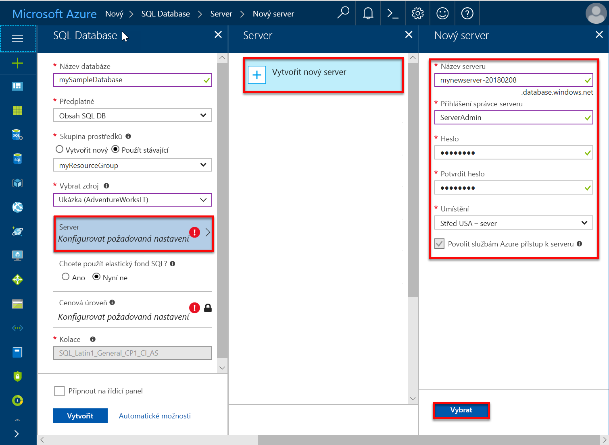
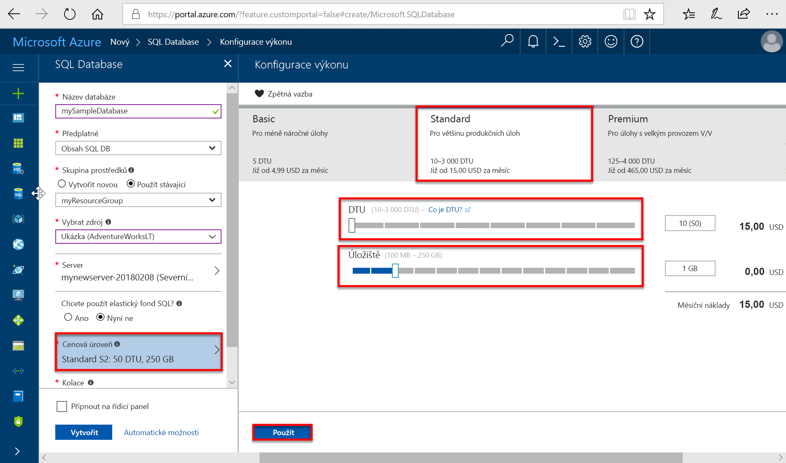
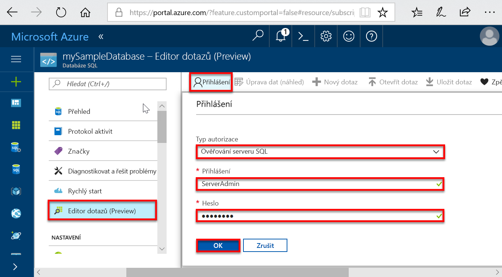

# <a name="create-an-azure-sql-database-in-the-azure-portal"></a>Vytvoření databáze SQL Azure na webu Azure Portal

Tento rychlý start vás provede vytvořením databáze SQL v Azure s využitím [nákupního modelu založeného na DTU](sql-database-service-tiers-dtu.md). Azure SQL Database je nabídka „databáze jako služby“, která umožňuje spouštění a škálování vysoce dostupné databáze SQL Serveru v cloudu. Tento rychlý start ukazuje, jak začít tím, že vytvoříte databázi SQL pomocí webu Azure Portal.

Pokud ještě nemáte předplatné Azure, vytvořte si [bezplatný účet](https://azure.microsoft.com/free/) před tím, než začnete.

  >[!NOTE]
  >Tento kurz používá model nakupování založený na DTU, ale k dispozici je i [model nakupování založený na virtuálních jádrech](sql-database-service-tiers-vcore.md).

## <a name="log-in-to-the-azure-portal"></a>Přihlášení k portálu Azure Portal

Přihlaste se k webu [Azure Portal](https://portal.azure.com/).

## <a name="create-a-sql-database"></a>Vytvoření databáze SQL

Databáze SQL Azure se vytvoří s definovanou sadou [výpočetních prostředků a prostředků úložiště](sql-database-service-tiers-dtu.md). Databáze se vytvoří v rámci [skupiny prostředků Azure](../azure-resource-manager/resource-group-overview.md) a na [logickém serveru Azure SQL Database](sql-database-features.md).

Postupujte podle následujících kroků a vytvořte databázi SQL obsahující ukázková data Adventure Works LT.

1. Klikněte na **Vytvořit prostředek** v levém horním rohu webu Azure Portal.

2. Na stránce **Nový** vyberte **Databáze** a v části **Databáze SQL** na stránce **Nový** vyberte **Vytvořit**.

   

3. Vyplňte formulář databáze SQL pomocí následujících informací, jak je vidět na předchozím obrázku:   

   | Nastavení       | Navrhovaná hodnota | Popis |
   | ------------ | ------------------ | ------------------------------------------------- |
   | **Název databáze** | mySampleDatabase | Platné názvy databází najdete v tématu [Identifikátory databází](https://docs.microsoft.com/sql/relational-databases/databases/database-identifiers). |
   | **Předplatné** | Vaše předplatné  | Podrobnosti o vašich předplatných najdete v tématu [Předplatná](https://account.windowsazure.com/Subscriptions). |
   | **Skupina prostředků**  | myResourceGroup | Platné názvy skupin prostředků najdete v tématu [Pravidla a omezení pojmenování](https://docs.microsoft.com/azure/architecture/best-practices/naming-conventions). |
   | **Výběr zdroje** | Ukázka (AdventureWorksLT) | Načte schéma a data AdventureWorksLT do vaší nové databáze. |

   > [!IMPORTANT]
   > V tomto formuláři je nutné vybrat ukázkovou databázi, protože se používá ve zbývající části tohoto rychlého startu.
   >

4. V části **Server** klikněte na **Konfigurovat požadovaná nastavení** a vyplňte formulář serveru SQL (logický server) pomocí následujících informací, jak je vidět na tomto obrázku:   

   | Nastavení       | Navrhovaná hodnota | Popis |
   | ------------ | ------------------ | ------------------------------------------------- |
   | **Název serveru** | Libovolný globálně jedinečný název | Platné názvy serverů najdete v tématu [Pravidla a omezení pojmenování](https://docs.microsoft.com/azure/architecture/best-practices/naming-conventions). |
   | **Přihlašovací jméno správce serveru** | Libovolné platné jméno | Platná přihlašovací jména najdete v tématu [Identifikátory databází](https://docs.microsoft.com/sql/relational-databases/databases/database-identifiers). |
   | **Heslo** | Libovolné platné heslo | Heslo musí mít alespoň 8 znaků a musí obsahovat znaky ze tří z následujících kategorií: velká písmena, malá písmena, číslice a jiné než alfanumerické znaky. |
   | **Předplatné** | Vaše předplatné | Podrobnosti o vašich předplatných najdete v tématu [Předplatná](https://account.windowsazure.com/Subscriptions). |
   | **Skupina prostředků** | myResourceGroup | Platné názvy skupin prostředků najdete v tématu [Pravidla a omezení pojmenování](https://docs.microsoft.com/azure/architecture/best-practices/naming-conventions). |
   | **Umístění** | Libovolné platné umístění | Informace o oblastech najdete v tématu [Oblasti služeb Azure](https://azure.microsoft.com/regions/). |

   > [!IMPORTANT]
   > Zde zadané přihlašovací jméno a heslo správce serveru se vyžadují pro přihlášení k serveru a jeho databázím dále v tomto rychlém startu. Tyto informace si zapamatujte nebo poznamenejte pro pozdější použití.
   >  

   

5. Pokud jste formulář vyplnili, klikněte na **Vybrat**.

6. Klikněte na **Cenová úroveň** a zadejte úroveň služby, počet DTU a velikost úložiště. Prozkoumejte možnosti pro množství DTU a velikost úložiště, které máte k dispozici na jednotlivých úrovních služby.

   > [!IMPORTANT]
   > Více než 1 TB úložiště na úrovni Premium je aktuálně k dispozici ve všech oblastech s výjimkou následujících: Velká Británie – sever, USA – středozápad, Velká Británie – jih 2, Čína – východ, USDoD – střed, Německo – střed, USDoD – východ, US Gov – jihozápad, US Gov (střed) – jih, Německo – severovýchod, Čína – sever, USGov – východ. V ostatních oblastech je úložiště na úrovni Premium omezeno na 1 TB. Viz [Aktuální omezení pro P11–P15]( sql-database-dtu-resource-limits-single-databases.md#single-database-limitations-of-p11-and-p15-when-the-maximum-size-greater-than-1-tb).  

7. Pro účely tohoto rychlého startu vyberte úroveň služby **Standard** a pak pomocí posuvníku vyberte **10 DTU (S0)** a **1** GB úložiště.

   

8. Přijměte podmínky verze Preview pro použití možnosti **Doplňkové úložiště**.

   > [!IMPORTANT]
   > Více než 1 TB úložiště na úrovni Premium je aktuálně k dispozici ve všech oblastech s výjimkou následujících: USA – středozápad, Čína – východ, USDoD – střed, US Gov – Iowa, Německo – střed, USDoD – východ, US Gov – jihozápad, Německo – severovýchod, Čína – sever. V ostatních oblastech je úložiště na úrovni Premium omezeno na 1 TB. Viz [Aktuální omezení pro P11–P15]( sql-database-dtu-resource-limits-single-databases.md#single-database-limitations-of-p11-and-p15-when-the-maximum-size-greater-than-1-tb).  

9. Po výběru úrovně služby, počtu DTU a velikosti úložiště klikněte na **Použít**.  

10. Po vyplnění formuláře pro SQL Database klikněte na **Vytvořit** a databázi zřiďte. Zřizování trvá několik minut.

11. Na panelu nástrojů klikněte na **Oznámení** a sledujte proces nasazení.

     

## <a name="create-a-server-level-firewall-rule"></a>Vytvoření pravidla brány firewall na úrovni serveru

Služba SQL Database vytvoří bránu firewall na úrovni serveru, aby zabránila externím aplikacím a nástrojům v připojení k serveru nebo ke kterékoli databázi na serveru, pokud není vytvořené pravidlo brány firewall k otevření brány firewall pro konkrétní IP adresy. Postupujte podle těchto kroků a vytvořte [pravidlo brány firewall na úrovni serveru služby SQL Database](sql-database-firewall-configure.md) pro vaši IP adresu klienta a umožněte externí připojení přes bránu firewall služby SQL Database pouze pro vaši IP adresu.

> [!NOTE]
> SQL Database komunikuje přes port 1433. Pokud se pokoušíte připojit z podnikové sítě, nemusí být odchozí provoz přes port 1433 bránou firewall vaší sítě povolený. Pokud je to tak, nebudete se moct připojit k serveru Azure SQL Database, dokud vaše IT oddělení neotevře port 1433.
>

1. Po dokončení nasazení klikněte na **Databáze SQL** z nabídky na levé straně a klikněte na **mySampleDatabase** na stránce **Databáze SQL**. Otevře se stránka s přehledem pro vaši databázi, na které se zobrazí plně kvalifikovaný název serveru (například **mynewserver-20170824.database.windows.net**) a možnosti pro další konfiguraci.

2. Zkopírujte tento plně kvalifikovaný název serveru, abyste ho mohli použít pro připojení k serveru a jeho databázím v následujících rychlých startech.

   

3. Klikněte na **Nastavit bránu firewall serveru** na panelu nástrojů, jak je vidět na předchozím obrázku. Otevře se stránka **Nastavení brány firewall** pro server služby SQL Database.

   

4. Klikněte na **Přidat IP adresu klienta** na panelu nástrojů a přidejte svoji aktuální IP adresu do nového pravidla brány firewall. Pravidlo brány firewall může otevřít port 1433 pro jednu IP adresu nebo rozsah IP adres.

5. Klikněte na **Uložit**. Vytvoří se pravidlo brány firewall na úrovni serveru pro vaši aktuální IP adresu, které otevře port 1433 na logickém serveru.

6. Klikněte na **OK** a pak zavřete stránku **Nastavení brány firewall**.

Nyní se můžete z této IP adresy připojit k serveru SQL Database a jeho databázím pomocí aplikace SQL Server Management Studio nebo jiného nástroje podle vašeho výběru použitím účtu správce serveru vytvořeného dříve.

> [!IMPORTANT]
> Standardně je přístup přes bránu firewall služby SQL Database povolený pro všechny služby Azure. Kliknutím na **OFF** na této stránce provedete zákaz pro všechny služby Azure.
>

## <a name="query-the-sql-database"></a>Dotazování databáze SQL

Teď, když jste vytvořili ukázkovou databázi v Azure, můžete použít integrovaný dotazovací nástroj na webu Azure Portal k potvrzení, že se můžete připojit k databázi a zadávat dotazy na data.

1. Na stránce služby SQL Database pro vaši databázi klikněte v nabídce vlevo na **Editor dotazů (Preview)** a pak klikněte na **Přihlášení**.

   

2. Vyberte Ověřování přes server SQL, zadejte požadované přihlašovací údaje a pak se přihlaste kliknutím na tlačítko **OK**.

3. Jakmile budete ověřeni jako **Správce serveru**, do podokna editoru dotazů zadejte následující dotaz.

   ```sql
   SELECT TOP 20 pc.Name as CategoryName, p.name as ProductName
   FROM SalesLT.ProductCategory pc
   JOIN SalesLT.Product p
   ON pc.productcategoryid = p.productcategoryid;
   ```

4. Klikněte na **Spustit** a pak zkontrolujte výsledky dotazu v podokně **Výsledky**.

   

5. Zavřete stránku **Editor dotazů** a kliknutím na **OK** zahoďte neuložené změny.

## <a name="clean-up-resources"></a>Vyčištění prostředků

Uložte tyto prostředky, pokud chcete přejít na [Další kroky](#next-steps) a seznámit se s několika způsoby, jak se připojit k databázi a dotazovat ji. Pokud však chcete prostředky vytvořené v rámci tohoto rychlého startu odstranit, použijte následující postup.


1. Na webu Azure Portal v nabídce vlevo klikněte na **Skupiny prostředků** a pak na **myResourceGroup**.
2. Na stránce skupiny prostředků klikněte na **Odstranit**, do textového pole zadejte **myResourceGroup** a pak klikněte na **Odstranit**.

## <a name="next-steps"></a>Další kroky

- Teď, když máte databázi, můžete se k ní [připojit a provádět dotazování](sql-database-connect-query.md) pomocí některého z vašich oblíbených nástrojů nebo jazyků. 
- Informace o návrhu první databáze, vytváření tabulek a vkládání dat najdete v následujících kurzech:
 - [Návrh první databáze SQL Azure pomocí SSMS](sql-database-design-first-database.md)
  - [Návrh databáze SQL Azure SQL database a její připojení pomocí C# a ADO.NET](sql-database-design-first-database-csharp.md)
